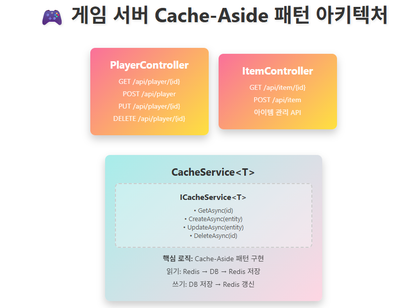
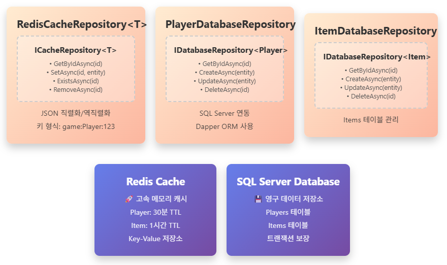
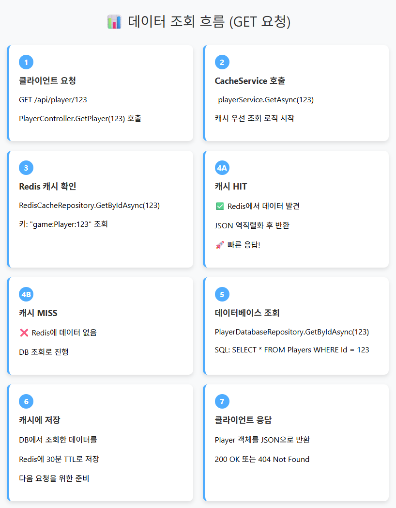
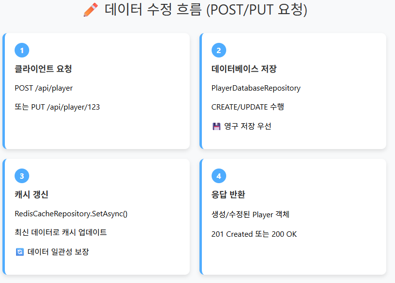
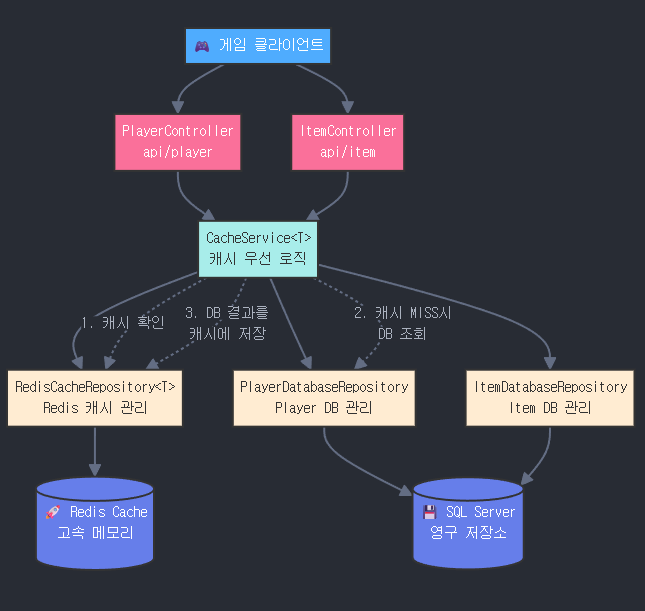

# 게임 서버에서 Redis를 이용한 Cache-Aside 패턴
- 클라이언트 요청이 오면 RDB가 아닌 Redis에서 먼저 데이터를 읽고, 없으면 RDB에서 가져온다.
- 유저의 데이트를 저장할 때는 Redis에 먼저 저장하고, DB에도 저장한다.  
  
-----   
## Cache-Aside 패턴의 동작 방식
읽기: Redis 캐시 확인 → 없으면 DB 조회 → Redis에 저장  
쓰기: DB에 먼저 저장 → Redis 캐시 갱신  

### 제네릭 구조의 장점
CacheService<T> 하나로 Player, Item 등 모든 엔티티 처리  
새로운 엔티티 추가 시 DatabaseRepository만 구현하면 됨  
  

### 성능 최적화
Player 데이터: 30분 캐시 (자주 조회)  
Item 데이터: 1시간 캐시 (상대적으로 변경 적음)  
  
이런 구조로 게임 서버의 응답 속도를 크게 개선하면서도 데이터 정합성을 보장할 수 있다  
  
  
  
  
  
  
  
  

## ASP.NET Core Redis Cache 구조코드   

```
// Models/Player.cs
public class Player
{
    public int Id { get; set; }
    public string Username { get; set; } = string.Empty;
    public int Level { get; set; }
    public long Experience { get; set; }
    public DateTime LastLoginTime { get; set; }
    public DateTime CreatedAt { get; set; }
    public DateTime UpdatedAt { get; set; }
}

// Repositories/Interfaces/IRepository.cs
public interface IRepository<T> where T : class
{
    Task<T?> GetByIdAsync(int id);
    Task<T> CreateAsync(T entity);
    Task<T> UpdateAsync(T entity);
    Task<bool> DeleteAsync(int id);
}

// Repositories/Interfaces/ICacheRepository.cs
public interface ICacheRepository<T> : IRepository<T> where T : class
{
    Task<bool> ExistsAsync(int id);
    Task SetAsync(int id, T entity, TimeSpan? expiry = null);
    Task RemoveAsync(int id);
}

// Repositories/Interfaces/IDatabaseRepository.cs
public interface IDatabaseRepository<T> : IRepository<T> where T : class
{
}

// Repositories/RedisCacheRepository.cs
public class RedisCacheRepository<T> : ICacheRepository<T> where T : class
{
    private readonly IDatabase _database;
    private readonly string _keyPrefix;
    private readonly TimeSpan _defaultExpiry;

    public RedisCacheRepository(IConnectionMultiplexer redis, string keyPrefix = "", TimeSpan? defaultExpiry = null)
    {
        _database = redis.GetDatabase();
        _keyPrefix = keyPrefix;
        _defaultExpiry = defaultExpiry ?? TimeSpan.FromMinutes(30);
    }

    private string GetKey(int id) => $"{_keyPrefix}:{typeof(T).Name}:{id}";

    public async Task<T?> GetByIdAsync(int id)
    {
        var json = await _database.StringGetAsync(GetKey(id));
        return json.HasValue ? JsonSerializer.Deserialize<T>(json!) : null;
    }

    public async Task<bool> ExistsAsync(int id)
    {
        return await _database.KeyExistsAsync(GetKey(id));
    }

    public async Task SetAsync(int id, T entity, TimeSpan? expiry = null)
    {
        var json = JsonSerializer.Serialize(entity);
        await _database.StringSetAsync(GetKey(id), json, expiry ?? _defaultExpiry);
    }

    public async Task<T> CreateAsync(T entity)
    {
        throw new NotSupportedException("Cache repository는 Create 작업을 지원하지 않는다");
    }

    public async Task<T> UpdateAsync(T entity)
    {
        throw new NotSupportedException("Cache repository는 Update 작업을 지원하지 않는다");
    }

    public async Task<bool> DeleteAsync(int id)
    {
        return await _database.KeyDeleteAsync(GetKey(id));
    }

    public async Task RemoveAsync(int id)
    {
        await _database.KeyDeleteAsync(GetKey(id));
    }
}

// Repositories/PlayerDatabaseRepository.cs
public class PlayerDatabaseRepository : IDatabaseRepository<Player>
{
    private readonly string _connectionString;

    public PlayerDatabaseRepository(IConfiguration configuration)
    {
        _connectionString = configuration.GetConnectionString("DefaultConnection") 
            ?? throw new ArgumentNullException("Connection string이 설정되지 않았다");
    }

    public async Task<Player?> GetByIdAsync(int id)
    {
        using var connection = new SqlConnection(_connectionString);
        const string sql = @"
            SELECT Id, Username, Level, Experience, LastLoginTime, CreatedAt, UpdatedAt 
            FROM Players 
            WHERE Id = @Id";
        
        return await connection.QueryFirstOrDefaultAsync<Player>(sql, new { Id = id });
    }

    public async Task<Player> CreateAsync(Player player)
    {
        using var connection = new SqlConnection(_connectionString);
        const string sql = @"
            INSERT INTO Players (Username, Level, Experience, LastLoginTime, CreatedAt, UpdatedAt)
            OUTPUT INSERTED.*
            VALUES (@Username, @Level, @Experience, @LastLoginTime, @CreatedAt, @UpdatedAt)";

        player.CreatedAt = DateTime.UtcNow;
        player.UpdatedAt = DateTime.UtcNow;
        
        return await connection.QuerySingleAsync<Player>(sql, player);
    }

    public async Task<Player> UpdateAsync(Player player)
    {
        using var connection = new SqlConnection(_connectionString);
        const string sql = @"
            UPDATE Players 
            SET Username = @Username, Level = @Level, Experience = @Experience, 
                LastLoginTime = @LastLoginTime, UpdatedAt = @UpdatedAt
            OUTPUT INSERTED.*
            WHERE Id = @Id";

        player.UpdatedAt = DateTime.UtcNow;
        
        return await connection.QuerySingleAsync<Player>(sql, player);
    }

    public async Task<bool> DeleteAsync(int id)
    {
        using var connection = new SqlConnection(_connectionString);
        const string sql = "DELETE FROM Players WHERE Id = @Id";
        
        var affectedRows = await connection.ExecuteAsync(sql, new { Id = id });
        return affectedRows > 0;
    }
}

// Services/Interfaces/ICacheService.cs
public interface ICacheService<T> where T : class
{
    Task<T?> GetAsync(int id);
    Task<T> CreateAsync(T entity);
    Task<T> UpdateAsync(T entity);
    Task<bool> DeleteAsync(int id);
}

// Services/CacheService.cs
public class CacheService<T> : ICacheService<T> where T : class
{
    private readonly ICacheRepository<T> _cacheRepository;
    private readonly IDatabaseRepository<T> _databaseRepository;
    private readonly ILogger<CacheService<T>> _logger;

    public CacheService(
        ICacheRepository<T> cacheRepository, 
        IDatabaseRepository<T> databaseRepository,
        ILogger<CacheService<T>> logger)
    {
        _cacheRepository = cacheRepository;
        _databaseRepository = databaseRepository;
        _logger = logger;
    }

    public async Task<T?> GetAsync(int id)
    {
        try
        {
            // 1. Redis에서 먼저 확인
            var cachedEntity = await _cacheRepository.GetByIdAsync(id);
            if (cachedEntity != null)
            {
                _logger.LogDebug("캐시에서 {EntityType} ID {Id}를 찾았다", typeof(T).Name, id);
                return cachedEntity;
            }

            // 2. DB에서 조회
            var dbEntity = await _databaseRepository.GetByIdAsync(id);
            if (dbEntity != null)
            {
                // 3. Redis에 저장
                await _cacheRepository.SetAsync(id, dbEntity);
                _logger.LogDebug("DB에서 {EntityType} ID {Id}를 찾아 캐시에 저장했다", typeof(T).Name, id);
            }

            return dbEntity;
        }
        catch (Exception ex)
        {
            _logger.LogError(ex, "데이터 조회 중 오류가 발생했다. ID: {Id}", id);
            throw;
        }
    }

    public async Task<T> CreateAsync(T entity)
    {
        try
        {
            // 1. DB에 저장
            var createdEntity = await _databaseRepository.CreateAsync(entity);
            
            // 2. Redis에 저장 (ID가 있다고 가정)
            var idProperty = typeof(T).GetProperty("Id");
            if (idProperty != null)
            {
                var id = (int)idProperty.GetValue(createdEntity)!;
                await _cacheRepository.SetAsync(id, createdEntity);
                _logger.LogDebug("새로운 {EntityType} ID {Id}를 생성하고 캐시에 저장했다", typeof(T).Name, id);
            }

            return createdEntity;
        }
        catch (Exception ex)
        {
            _logger.LogError(ex, "데이터 생성 중 오류가 발생했다");
            throw;
        }
    }

    public async Task<T> UpdateAsync(T entity)
    {
        try
        {
            // 1. DB 업데이트
            var updatedEntity = await _databaseRepository.UpdateAsync(entity);
            
            // 2. Redis 업데이트
            var idProperty = typeof(T).GetProperty("Id");
            if (idProperty != null)
            {
                var id = (int)idProperty.GetValue(updatedEntity)!;
                await _cacheRepository.SetAsync(id, updatedEntity);
                _logger.LogDebug("{EntityType} ID {Id}를 업데이트하고 캐시를 갱신했다", typeof(T).Name, id);
            }

            return updatedEntity;
        }
        catch (Exception ex)
        {
            _logger.LogError(ex, "데이터 업데이트 중 오류가 발생했다");
            throw;
        }
    }

    public async Task<bool> DeleteAsync(int id)
    {
        try
        {
            // 1. DB에서 삭제
            var deleted = await _databaseRepository.DeleteAsync(id);
            
            if (deleted)
            {
                // 2. Redis에서 삭제
                await _cacheRepository.RemoveAsync(id);
                _logger.LogDebug("{EntityType} ID {Id}를 삭제하고 캐시에서 제거했다", typeof(T).Name, id);
            }

            return deleted;
        }
        catch (Exception ex)
        {
            _logger.LogError(ex, "데이터 삭제 중 오류가 발생했다. ID: {Id}", id);
            throw;
        }
    }
}

// Controllers/PlayerController.cs
[ApiController]
[Route("api/[controller]")]
public class PlayerController : ControllerBase
{
    private readonly ICacheService<Player> _playerService;

    public PlayerController(ICacheService<Player> playerService)
    {
        _playerService = playerService;
    }

    [HttpGet("{id:int}")]
    public async Task<ActionResult<Player>> GetPlayer(int id)
    {
        var player = await _playerService.GetAsync(id);
        return player == null ? NotFound() : Ok(player);
    }

    [HttpPost]
    public async Task<ActionResult<Player>> CreatePlayer([FromBody] CreatePlayerRequest request)
    {
        var player = new Player
        {
            Username = request.Username,
            Level = 1,
            Experience = 0,
            LastLoginTime = DateTime.UtcNow
        };

        var createdPlayer = await _playerService.CreateAsync(player);
        return CreatedAtAction(nameof(GetPlayer), new { id = createdPlayer.Id }, createdPlayer);
    }

    [HttpPut("{id:int}")]
    public async Task<ActionResult<Player>> UpdatePlayer(int id, [FromBody] UpdatePlayerRequest request)
    {
        var existingPlayer = await _playerService.GetAsync(id);
        if (existingPlayer == null)
            return NotFound();

        existingPlayer.Username = request.Username ?? existingPlayer.Username;
        existingPlayer.Level = request.Level ?? existingPlayer.Level;
        existingPlayer.Experience = request.Experience ?? existingPlayer.Experience;
        existingPlayer.LastLoginTime = DateTime.UtcNow;

        var updatedPlayer = await _playerService.UpdateAsync(existingPlayer);
        return Ok(updatedPlayer);
    }

    [HttpDelete("{id:int}")]
    public async Task<IActionResult> DeletePlayer(int id)
    {
        var deleted = await _playerService.DeleteAsync(id);
        return deleted ? NoContent() : NotFound();
    }
}

// DTOs/PlayerRequests.cs
public class CreatePlayerRequest
{
    public string Username { get; set; } = string.Empty;
}

public class UpdatePlayerRequest
{
    public string? Username { get; set; }
    public int? Level { get; set; }
    public long? Experience { get; set; }
}

// Program.cs에서 DI 설정
public class Program
{
    public static void Main(string[] args)
    {
        var builder = WebApplication.CreateBuilder(args);

        // Redis 설정
        builder.Services.AddSingleton<IConnectionMultiplexer>(provider =>
        {
            var configuration = provider.GetService<IConfiguration>();
            var connectionString = configuration!.GetConnectionString("Redis");
            return ConnectionMultiplexer.Connect(connectionString!);
        });

        // Repository 등록
        builder.Services.AddScoped<ICacheRepository<Player>>(provider =>
        {
            var redis = provider.GetService<IConnectionMultiplexer>();
            return new RedisCacheRepository<Player>(redis!, "game", TimeSpan.FromMinutes(30));
        });
        
        builder.Services.AddScoped<IDatabaseRepository<Player>, PlayerDatabaseRepository>();
        
        // Service 등록
        builder.Services.AddScoped<ICacheService<Player>, CacheService<Player>>();

        builder.Services.AddControllers();

        var app = builder.Build();

        app.UseRouting();
        app.MapControllers();

        app.Run();
    }
}
```  
  

## 구조 설명

**1. Repository 계층 분리**
- `ICacheRepository<T>`: Redis 캐시 전용 인터페이스
- `IDatabaseRepository<T>`: DB 전용 인터페이스
- 제네릭을 사용해서 다른 엔티티(아이템, 길드 등)에도 쉽게 적용 가능하다

**2. CacheService 핵심 로직**
- **읽기**: Redis → DB → Redis 저장 순서로 처리
- **쓰기**: DB 저장 → Redis 저장 순서로 처리
- 에러 발생 시에도 데이터 정합성을 보장한다

**3. 사용하기 쉬운 구조**
- Controller에서는 Service만 호출하면 된다
- 캐시 로직은 Service에서 자동으로 처리된다
  

다음은 설정 파일이다:  
```
{
  "ConnectionStrings": {
    "DefaultConnection": "Server=localhost;Database=GameDB;Trusted_Connection=true;TrustServerCertificate=true;",
    "Redis": "localhost:6379"
  },
  "Logging": {
    "LogLevel": {
      "Default": "Information",
      "Microsoft.AspNetCore": "Warning",
      "CacheService": "Debug"
    }
  },
  "AllowedHosts": "*"
}
```


## 다른 엔티티 추가하는 방법
아이템 시스템을 추가하고 싶다면 이렇게 하면 된다:

```
// Models/Item.cs
public class Item
{
    public int Id { get; set; }
    public string Name { get; set; } = string.Empty;
    public int Type { get; set; }
    public int Rarity { get; set; }
    public long Price { get; set; }
    public DateTime CreatedAt { get; set; }
}

// Repositories/ItemDatabaseRepository.cs
public class ItemDatabaseRepository : IDatabaseRepository<Item>
{
    private readonly string _connectionString;

    public ItemDatabaseRepository(IConfiguration configuration)
    {
        _connectionString = configuration.GetConnectionString("DefaultConnection")!;
    }

    public async Task<Item?> GetByIdAsync(int id)
    {
        using var connection = new SqlConnection(_connectionString);
        const string sql = "SELECT * FROM Items WHERE Id = @Id";
        return await connection.QueryFirstOrDefaultAsync<Item>(sql, new { Id = id });
    }

    public async Task<Item> CreateAsync(Item item)
    {
        using var connection = new SqlConnection(_connectionString);
        const string sql = @"
            INSERT INTO Items (Name, Type, Rarity, Price, CreatedAt)
            OUTPUT INSERTED.*
            VALUES (@Name, @Type, @Rarity, @Price, @CreatedAt)";

        item.CreatedAt = DateTime.UtcNow;
        return await connection.QuerySingleAsync<Item>(sql, item);
    }

    public async Task<Item> UpdateAsync(Item item)
    {
        using var connection = new SqlConnection(_connectionString);
        const string sql = @"
            UPDATE Items 
            SET Name = @Name, Type = @Type, Rarity = @Rarity, Price = @Price
            OUTPUT INSERTED.*
            WHERE Id = @Id";

        return await connection.QuerySingleAsync<Item>(sql, item);
    }

    public async Task<bool> DeleteAsync(int id)
    {
        using var connection = new SqlConnection(_connectionString);
        const string sql = "DELETE FROM Items WHERE Id = @Id";
        var affectedRows = await connection.ExecuteAsync(sql, new { Id = id });
        return affectedRows > 0;
    }
}

// Controllers/ItemController.cs
[ApiController]
[Route("api/[controller]")]
public class ItemController : ControllerBase
{
    private readonly ICacheService<Item> _itemService;

    public ItemController(ICacheService<Item> itemService)
    {
        _itemService = itemService;
    }

    [HttpGet("{id:int}")]
    public async Task<ActionResult<Item>> GetItem(int id)
    {
        var item = await _itemService.GetAsync(id);
        return item == null ? NotFound() : Ok(item);
    }

    [HttpPost]
    public async Task<ActionResult<Item>> CreateItem([FromBody] CreateItemRequest request)
    {
        var item = new Item
        {
            Name = request.Name,
            Type = request.Type,
            Rarity = request.Rarity,
            Price = request.Price
        };

        var createdItem = await _itemService.CreateAsync(item);
        return CreatedAtAction(nameof(GetItem), new { id = createdItem.Id }, createdItem);
    }
}

// Program.cs에 추가할 DI 설정
// Repository 등록
builder.Services.AddScoped<ICacheRepository<Item>>(provider =>
{
    var redis = provider.GetService<IConnectionMultiplexer>();
    return new RedisCacheRepository<Item>(redis!, "game", TimeSpan.FromHours(1)); // 아이템은 1시간 캐시
});

builder.Services.AddScoped<IDatabaseRepository<Item>, ItemDatabaseRepository>();

// Service 등록
builder.Services.AddScoped<ICacheService<Item>, CacheService<Item>>();
```  


## 이 구조의 장점

**1. 중복 코드 제거**
- 제네릭 CacheService 하나로 모든 엔티티 처리 가능
- Repository 패턴으로 데이터 액세스 로직 분리

**2. 사용하기 쉬움**
- Controller에서 `_service.GetAsync(id)` 호출만 하면 캐시 로직 자동 처리
- 새로운 엔티티 추가도 DatabaseRepository만 구현하면 됨

**3. 성능 최적화**
- Redis 먼저 확인하여 DB 부하 감소
- 캐시 만료 시간을 엔티티별로 다르게 설정 가능

**4. 데이터 정합성**
- 쓰기 작업 시 DB와 Redis 모두 업데이트
- 트랜잭션 실패 시에도 일관성 유지

이 구조를 사용하면 게임 서버의 플레이어 데이터, 아이템, 길드 정보 등을 효율적으로 캐시할 수 있다. Redis의 빠른 응답성과 DB의 안정성을 모두 활용하는 구조다.
