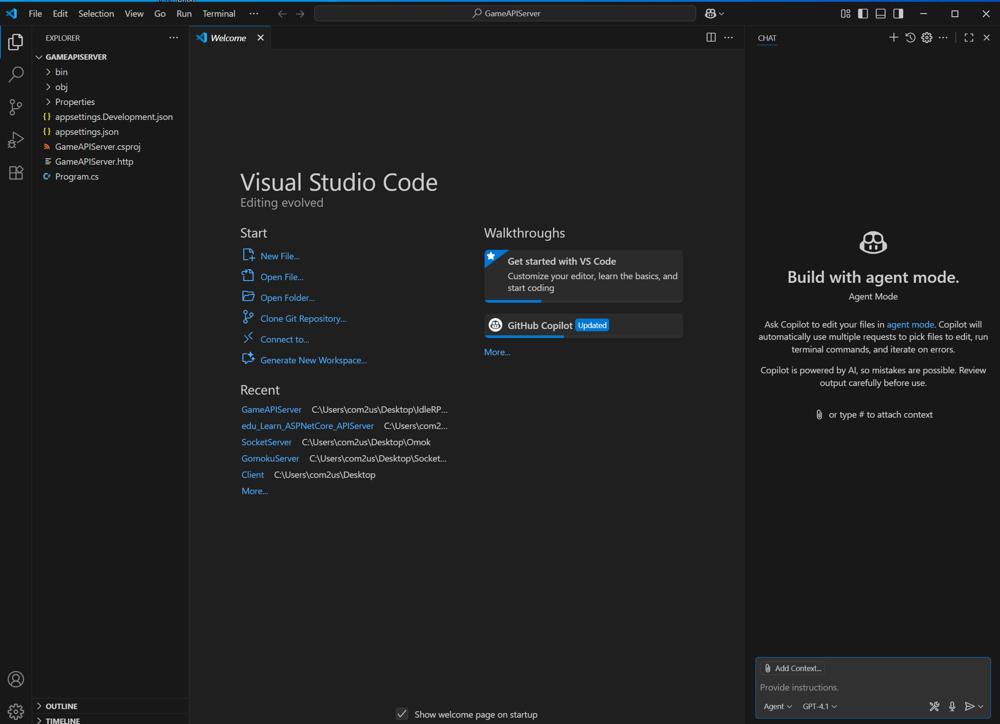
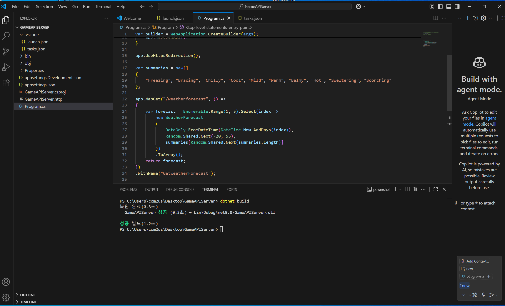
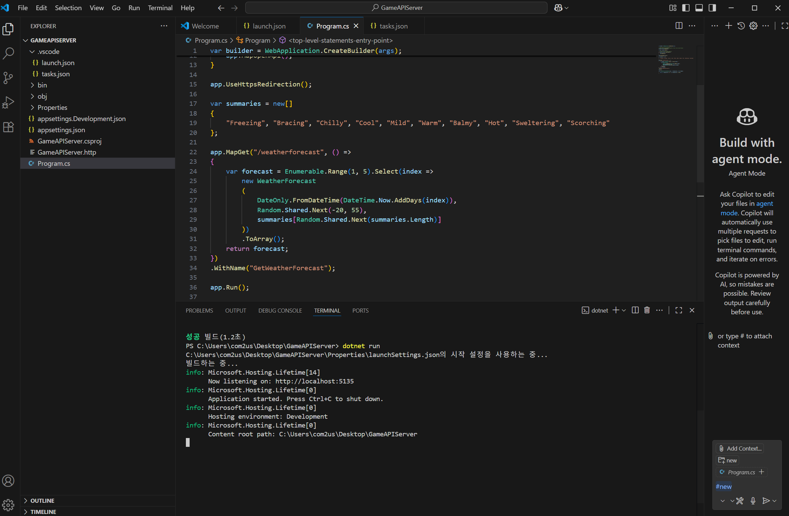
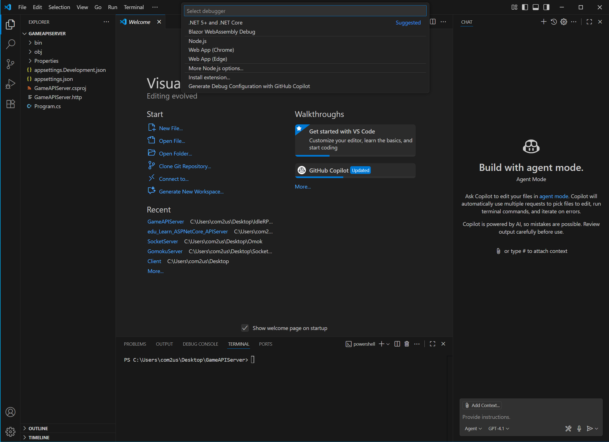
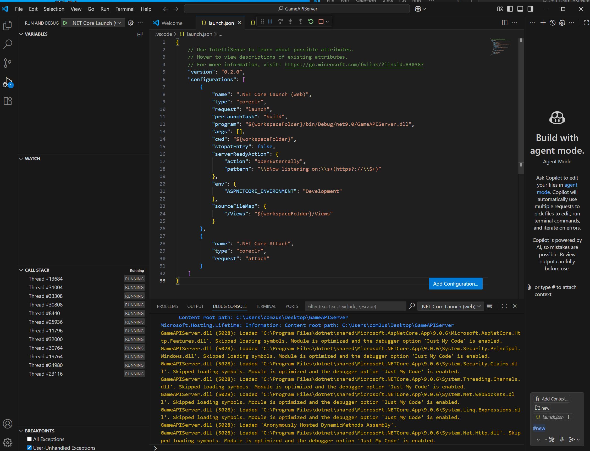
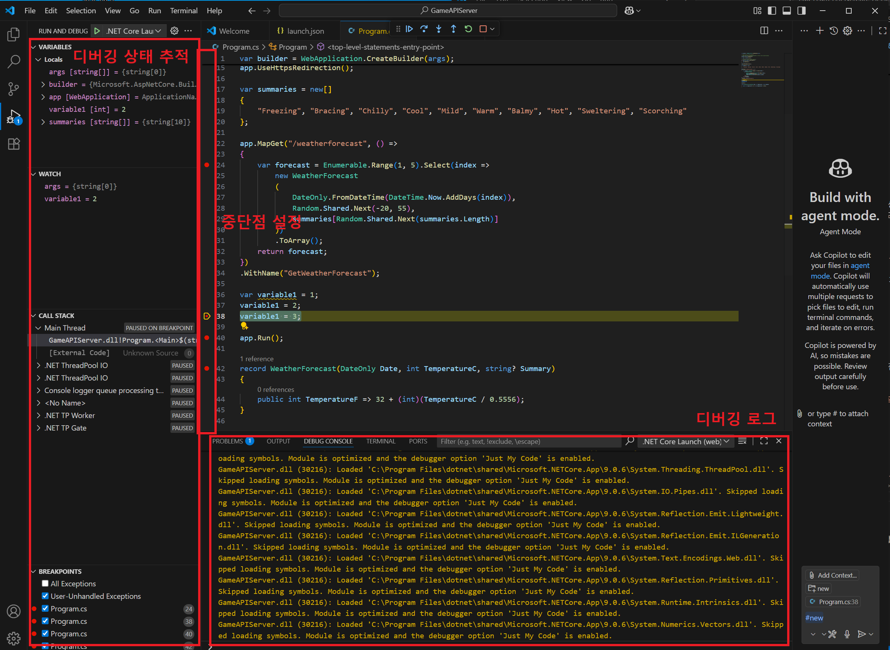
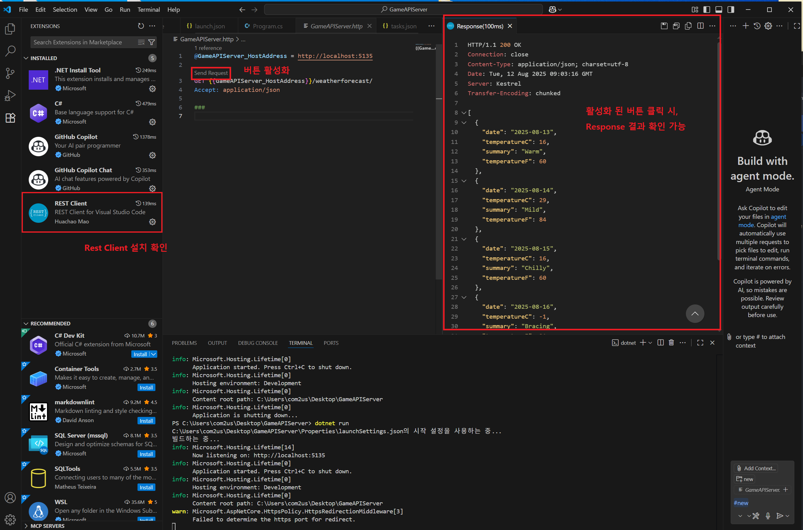

# VS Code에서 C# Dev Kit 없이 ASP.NET Core 개발 환경 구성하기

이 문서는 VS Code에서 C# Dev Kit 없이 ASP.NET Core 개발을 위한 환경 구성 방법을 안내합니다.

## 목차

1. [필요 사항](#필요-사항)
2. [기본 설정](#기본-설정)
   - [.NET SDK 설치](#net-sdk-설치)
   - [VS Code 설치](#vs-code-설치)
   - [필수 확장 프로그램 설치](#필수-확장-프로그램-설치)
3. [프로젝트 설정](#프로젝트-설정)
   - [프로젝트 생성](#프로젝트-생성)
   - [디버깅 설정](#디버깅-설정)
4. [동작 테스트](#동작-테스트)
5. [문제 해결 및 팁](#문제-해결-및-팁)

  
## 필요 사항

- Windows, macOS 또는 Linux 운영 체제
- .NET 9 SDK (또는 필요한 버전)
- Visual Studio Code
- 인터넷 연결 (확장 프로그램 및 패키지 설치용)

## 기본 설정

### .NET SDK 설치

1. [.NET 다운로드 페이지](https://dotnet.microsoft.com/download)에서 .NET SDK를 다운로드하고 설치합니다.
2. 설치 후, 다음 명령어로 설치가 제대로 되었는지 확인합니다:

```powershell 
dotnet --version
```

### VS Code 설치

1. [Visual Studio Code 웹사이트](https://code.visualstudio.com/)에서 VS Code를 다운로드하고 설치합니다.

### 확장 프로그램 설치 (필수)

* C# Dev Kit은 사용하지 않습니다.

1. **C# (Micrososft)** - 기본적인 C# 지원 
   - 설치: VS Code 확장 마켓플레이스에서 "C#"을 검색하여 Microsoft에서 제공하는 확장 프로그램 설치
   - 기능: 구문 강조, 기본 IntelliSense, 디버깅 지원


3. **REST Client** - API 테스트를 위한 도구 (Http 파일)
   - 설치: VS Code 확장 마켓플레이스에서 "REST Client" 검색
   - 기능: VS Code 내에서 직접 HTTP 요청을 작성하고 테스트
   - 사용법: [사용법](#rest-client를-사용한-테스트)


### 확장 프로그램 설치 (선택)

1. **Resharper (Jetbrains)** - C# 코드 분석기 (아직 데모 버전)
   - 설치: VS Code 확장 마켓플레이스에서 "Resharper"를 검색하여 설치. 이후 **C# 확장프로그램 제거**
   - 기능: C# 디버깅 및 코드 리팩토링을 편하게 하는 툴
   - **한계점** : 아직 테스트 중인 툴
        - 엉뚱한 디버깅
        - C# 확장과 호환이 안됨


## 프로젝트 설정

### 프로젝트 생성

터미널에서 다음 명령을 사용하여 새 ASP.NET Core 웹 API 프로젝트를 생성합니다:

```powershell
# 새 디렉토리 생성 및 이동
mkdir GameAPIServer
cd GameAPIServer

# 웹 API 프로젝트 생성
dotnet new webapi

# VS Code로 현재 디렉토리 열기
code .
```

<div align="center">
  
  <p><em>그림 1: VS Code에서 웹 API 프로젝트가 생성된 결과 화면</em></p>
</div>

## 동작 테스트

프로젝트가 제대로 설정되었는지 확인하려면 간단한 테스트를 수행합니다:

### 빌드 및 실행

1. 터미널에서 다음 명령어로 프로젝트를 빌드합니다:

```powershell
dotnet build
```

<div align="center">
  
  <p><em>dotnet build 명령으로 프로젝트를 빌드하는 화면</em></p>
</div>

혹은 VS Code Terminal -> Run Build Task로 빌드합니다.

<div align="center">
  
  <p><em>VS Code에서 메뉴를 통한 빌드 장면 시연</em></p>
</div>

2. 빌드가 성공하면 다음 명령어로 실행합니다:

```powershell
dotnet run
```

<div align="center">
  
  <p><em>dotnet run 명령으로 애플리케이션을 실행한 결과 화면</em></p>
</div>

혹은 VS Code Run -> Run Without Debugging으로 실행합니다.

<div align="center">
  
  <p><em>VS Code에서 메뉴를 통한 run장면 시연</em></p>
</div>


3. 애플리케이션이 시작되면 표시되는 URL을 브라우저에서 열거나 다음 명령어를 사용하여 기본 API 엔드포인트에 요청을 보낼 수 있습니다:

```powershell
curl http://localhost:5000/weatherforecast
```

### 디버깅 설정

VS Code에서 디버깅을 설정하려면:

1. VS Code에서 프로젝트를 연 후, `F5` 키를 누르고 .Net Core 디버거를 선택합니다. 이후, 디버그 탭을 눌러 디버깅을 진행합니다.
   
   <div align="center">
     
     <p><em>VS Code에서 F5을 누르고, Suggested된 .NET Core 디버거 선택</em></p>
   </div>
      - .NET Code 디버거를 선택합니다.

   <div align="center">
     
     <p><em>VS Code에서 디버그 탭 누르고, 초록 화살표 누름</em></p>
   </div>
      - 이후 디버거 탭을 누르고, 초록 화살표를 누르면 디버깅이 진행됩니다.
---
2. 중단점을 설정해서 디버깅을 진행할 수 있고,  
디버거 탭을 통해, 변수를 추적하거나, Callstack, BreakPoints확인, 현재 Local 변수를 확인할 수 있다.

   <div align="center">
     
     <p><em>VS Code에서 디버깅 화면</em></p>
   </div>

   <div align="center">
     
     <p><em>VS Code에서 중단점 설정 및 변수 추적 설정</em></p>
   </div>

   <div align="center">
     
     <p><em>VS Code에서 디버깅</em></p>
   </div>


---
3. 디버거를 설정했다면, `.vscode` 폴더에 `launch.json` 파일이 자동으로 생성됩니다. 이 폴더는 VS Code의 프로젝트별 설정을 저장하는 곳입니다. 없다면 수동으로 생성할 수 있습니다:

### 파일설명 
`.vscode/launch.json` 파일: (디버깅 구성을 정의하는 파일로, 디버깅 시작 시 어떻게 실행할지 설정합니다)

```json
{
    "version": "0.2.0",
    "configurations": [
        {
            "name": ".NET Core Launch (web)",
            "type": "coreclr",
            "request": "launch",
            "preLaunchTask": "build",
            "program": "${workspaceFolder}/bin/Debug/net9.0/GameAPIServer.dll",
            "args": [],
            "cwd": "${workspaceFolder}",
            "stopAtEntry": false,
            "serverReadyAction": {
                "action": "openExternally",
                "pattern": "\\bNow listening on:\\s+(https?://\\S+)"
            },
            "env": {
                "ASPNETCORE_ENVIRONMENT": "Development"
            },
            "sourceFileMap": {
                "/Views": "${workspaceFolder}/Views"
            }
        },
        {
            "name": ".NET Core Attach",
            "type": "coreclr",
            "request": "attach"
        }
    ]
}
```

launch.json 주요 설정 항목:
- version: 구성 파일의 버전을 지정 (현재 버전은 0.2.0)
- **configurations**: 디버깅 구성 목록을 정의하는 배열
  - **name**: 디버그 구성의 이름 (VS Code UI에 표시됨)
  - **type**: 사용할 디버거 타입 (coreclr은 .NET Core용 디버거)
  - **request**: 디버깅 요청 유형 (`launch`는 새로 시작, `attach`는 실행 중인 프로세스에 연결)
  - **preLaunchTask**: 디버깅 전에 실행할 작업 (tasks.json에 정의된 작업명, 보통 build) 
  - **program**: 실행할 프로그램의 경로 (빌드된 DLL 파일 위치)
  - **args**: 프로그램 실행 시 전달할 명령줄 인수 배열
  - cwd: 프로그램 실행의 작업 디렉토리 경로
  - stopAtEntry: 프로그램 시작 지점에서 즉시 중단점 설정 여부 (true/false)
  - **serverReadyAction**: 서버가 준비되었을 때 취할 동작
    - action: 수행할 동작 (예: openExternally는 외부 브라우저 열기)
    - pattern: 서버 준비 상태를 감지할 정규식 패턴
  - **env**: 디버깅 세션에 적용할 환경 변수 (키-값 쌍) 
  - sourceFileMap: 소스 파일 경로 매핑 (원격 디버깅 시 유용)

---

`.vscode/tasks.json` 파일: (VS Code가 실행할 작업들을 정의하는 파일로, 빌드, 게시 등의 명령을 설정합니다)

```json
{
    "version": "2.0.0",
    "tasks": [
        {
            "label": "build",
            "command": "dotnet",
            "type": "process",
            "args": [
                "build",
                "${workspaceFolder}/GameAPIServer.csproj",
                "/property:GenerateFullPaths=true",
                "/consoleloggerparameters:NoSummary;ForceNoAlign"
            ],
            "problemMatcher": "$msCompile"
        },
        {
            "label": "publish",
            "command": "dotnet",
            "type": "process",
            "args": [
                "publish",
                "${workspaceFolder}/GameAPIServer.csproj",
                "/property:GenerateFullPaths=true",
                "/consoleloggerparameters:NoSummary;ForceNoAlign"
            ],
            "problemMatcher": "$msCompile"
        },
        {
            "label": "watch",
            "command": "dotnet",
            "type": "process",
            "args": [
                "watch",
                "run",
                "--project",
                "${workspaceFolder}/GameAPIServer.csproj"
            ],
            "problemMatcher": "$msCompile"
        }
    ]
}
```

tasks.json 주요 설정 항목:
- version: 작업 정의 파일의 버전 (현재 버전은 2.0.0)
- **tasks**: 정의된 작업 목록을 포함하는 배열 
  - **label**: 작업의 이름 (VS Code UI에 표시되고 launch.json에서 참조됨) 
  - **command**: 실행할 명령어 (예: dotnet) 
  - type: 작업 실행 방식 (process는 새 프로세스로 실행)
  - **args**: 명령에 전달할 인수 배열 
    - **build**: 빌드 명령어
    - **${workspaceFolder}/GameAPIServer.csproj**: 대상 프로젝트 파일 


주요 작업 설명:
- **build**: dotnet build 명령을 실행하여 프로젝트를 컴파일 (주로 사용) 


### REST Client를 사용한 테스트

REST Client 확장을 설치했다면, `.http` 파일을 생성하여 API 엔드포인트를 테스트할 수 있습니다:

1. 프로젝트 폴더에 `GameAPIServer.http` 파일을 생성하고 다음 내용을 추가합니다:

```
@host = http://localhost:5000

### 기본 API 테스트
GET {{host}}/weatherforecast
```

2. REST Client확장을 설치했다면, `Send Request`버튼이 활성화 됩니다.  
버튼을 클릭하여 요청을 실행합니다.

   <div align="center">
     
     <p><em>REST Client를 이용한 http 테스트</em></p>
   </div>


