# Tany Farm
- **Web API 서버 실습 용도**이다.
      
 

## 필수 구현 조건
- `Web API Server`는 **스케일아웃이 가능**해야 한다. (*로드밸런스를 사용하고 있다고 가정한다.*)
- 계정 생성은 `FakeHiveServer`를 사용하여 여기에서 인증하는 계정만 사용 가능하다.
    - 계정 생성 기능은 구현할 필요가 없다
- 인증 관련해서 **`Redis`를 사용해야 한다**. (**`JWT` 사용 불가**)
- 인증 후(*로그인 이후*)의 모든 클라이언트의 요청은 아래 항목 확인 후 진행한다.
    1. 인증 유저인가?
    2. 클라이언트 앱 버전 확인
    3. 클라이언트 마스터 데이터(기획 데이터) 버전 확인
- 데이터베이스는 **`MySQL`과 `Redis`만 사용**한다.
    - `MySQL`은 샤딩 하지 않는다. 
    - `Redis`는 **in-memory 용도로만 사용**한다
    
 

## 기획데이터 ERD

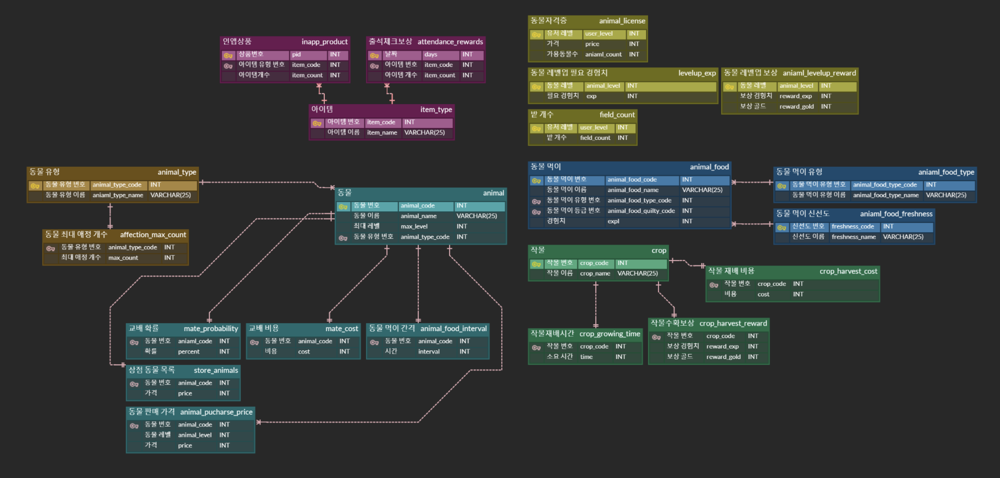

 

## 구현 기능 목록

### **필수 참고 사항**
   
1. 게임 기획 데이터는 `마스터데이터.xlsx` 파일을 참고하여 생성한다. (`.csv`, `.json` 등)
2. 서버 실행 후 **마스터데이터는 변경되지 않는다**. 
3. 데이터베이스의 `Transaction` 기능을 사용하지 않으므로 컨트롤러 로직 실패 시 직접 **롤백**해야한다.
4. 해당 게임은 **캐릭터가 존재하지 않는다.**
5. 해당 게임은 클라이언트의 `Email`을 아이디로 사용한다.
6. 해당 문서의 이미지와 텍스트를 읽는 순서는 **[이미지]** > **[텍스트]** 순이다.
7. 해당 문서의 각 기능별 **동작 플로우** 항목은 **참고 사항**이다.
8. 각 기능 별 메시지 프로토콜(`Request`, `Response`)은 직접 설계한다.
9. 각 기능 구현을 위한 `데이터베이스`와 `스키마`는 직접 설계한다.
---

### 기능 1. 유저의 새 게임 데이터 생성

#### 기능 설명
- 로그인 전으로 FakeHiveServer를 통해서 검증해야 한다
- 게임 플레이를 위한 기본 데이터가 데이터베이스에 추가된다.

#### 동작 플로우
1. 클라이언트는 서버에게 `새 게임 데이터 생성`을 요청한다.
2. 서버는 해당 클라이언트에 대한 다음 항목의 기본 데이터를 데이터베이스에 추가한다.
    1. 게임 플레이 데이터(*ex:레벨, 경험치, 소지금 등*)
    2. 인벤토리 데이터
    3. 출석부 데이터
    4. 농장 데이터
    5. 기본 지급 아이템 (*`마스터데이터.xlsx`의 `계정 아이템 유형` 시트에서 자유 선정*)
3. 결과 응답
    
---
      
### 기능 2. 로그인 

#### 기능 설명

- FakeHiveServer에 클라이언트의 인증 정보를 확인한다
- 클라이언트는 로그인 완료 시 서버로부터 다음 항목들을 수신받는다.
    1. 인증 토큰
        - 이후의 모든 요청은 해당 인증 토큰을 포함하여 진행된다.
  
#### 동작 플로우
1. 클라이언트는 서버에게 `로그인`을 요청한다.
2. 서버는 다음 항목을 확인한다.
    1. 앱 버전 확인
    2. 마스터데이터 버전 확인
    3. FakeHiveServer 에 인증 정보를 확인한다
3. 문제없다면 다음 절차를 진행한다.
    1. 인증 토큰 생성
    2. 인증 정보와 간단한 클라이언트 정보를 `Redis`에 저장
    3. 결과 응답
    
---
   
        
### 기능 3. 유저 게임 데이터
  
#### 기능 설명

- 클라이언트는 유저의 게임 데이터를 요청한다.
- 클라이언트는 성공 시 서버로부터 다음 항목들을 수신받는다.
    1. 게임 플레이 데이터
    2. 인벤토리 데이터
    3. 농장 데이터
    4. 먹이를 줄 수 있는 동물 목록 데이터
    5. 재배 완료된 농작물 목록 데이터
  
#### 동작 플로우
1. 클라이언트는 서버에게 `유저 게임 데이터`을 요청한다.
    1. 클라이언트의 데이터 로딩
        1. 게임 플레이 데이터
        2. 인벤토리 데이터
        3. 농장 데이터
        4. 먹이를 줄 수 있는 동물 목록 데이터
        5. 재배 완료된 농작물 목록 데이터
    4. 결과 응답
    
---
    
	
### 기능 3. 우편 목록

#### 기능 설명
  
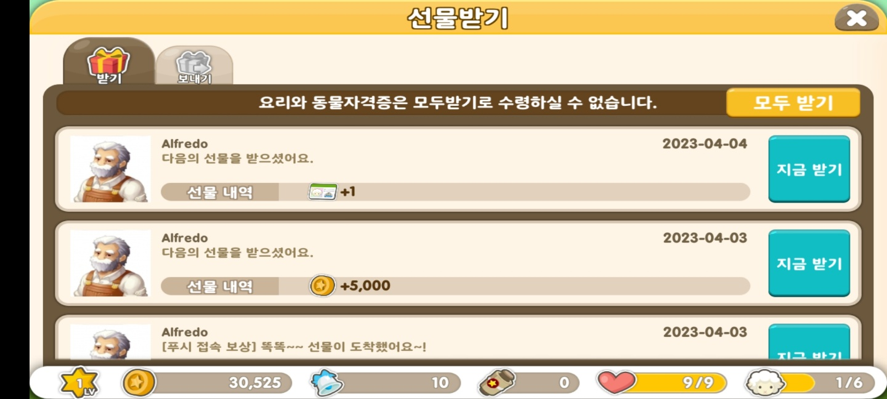  

- 유저 별 우편 개수는 **제한이 없다.**
- 우편은 유효 기간이 존재(**생성일로부터 30일**)한다.
    - 유효 기간 초과 시 **우편은 삭제**된다. 
    - 삭제는 외부 프로그램에서 정기적으로 진행된다고 가정한다. (*시간 여유가 있다면 구현*)
- 클라이언트의 우편함은 페이지와 페이지 별 우편 항목으로 표현된다.
    - **1개 페이지는 20개의 우편을 표시**한다. (*전체 페이지 개수는 서버로부터 수신받는다.*)
    - 클라이언트는 우편함 탭을 클릭한 경우에만 서버에 우편 목록을 요청한다.
        - 서버로부터 페이지 개수와 전체 우편물을 수신 받은 클라이언트는 우편 데이터를 캐싱한다고 가정한다. (*즉, 우편함을 닫고 다시 여는 경우가 아니면 서버에게 우편 목록을 요청하지 않는다.*)
- 서버에서 클라이언트가 우편함 탭을 클릭했다는 판단은 **페이지 번호 1**로 판단한다.

#### 동작 플로우 
1. 클라이언트는 서버에게 `우편 목록`을 요청한다.
2. 해당 클라이언트의 전체 우편물 로딩
3. 전체 우편 개수를 기반으로 총 페이지 개수 계산.
4. 결과 응답.
    
---

### 기능 4. 우편물 수신

#### 기능 설명
  
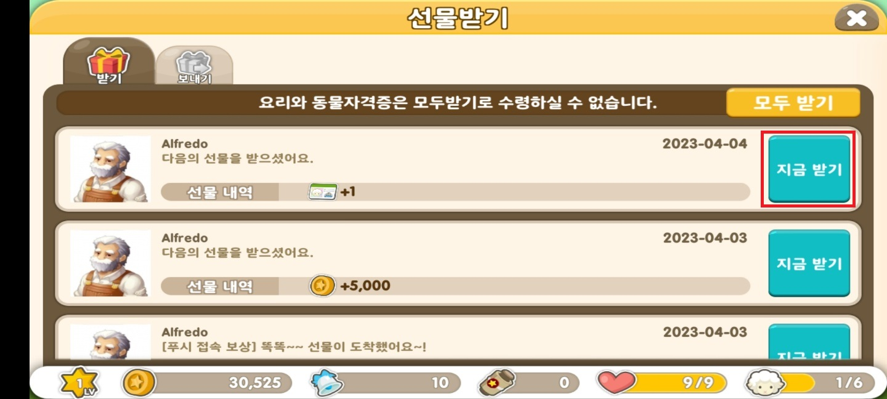  

- 우편함에서 우편을 수신할 수 있다.
- 우편 내용물은 클라이언트의 인벤토리에 추가된다.

#### 동작 플로우 
1. 클라이언트는 서버에게 `우편물 수신`을 요청한다.
2. 서버는 다음 항목을 확인한다.
    1. 존재하는 우편물인가?
3. 문제 없다면 다음 항목을 진행한다.
    1. 우편 상태 변경 (`None` -> `Received`)
    2. 인벤토리에 우편 내용물 추가
    3. 결과 응답.
    
---
  
### 기능 5. 출석체크

#### 기능 설명
  
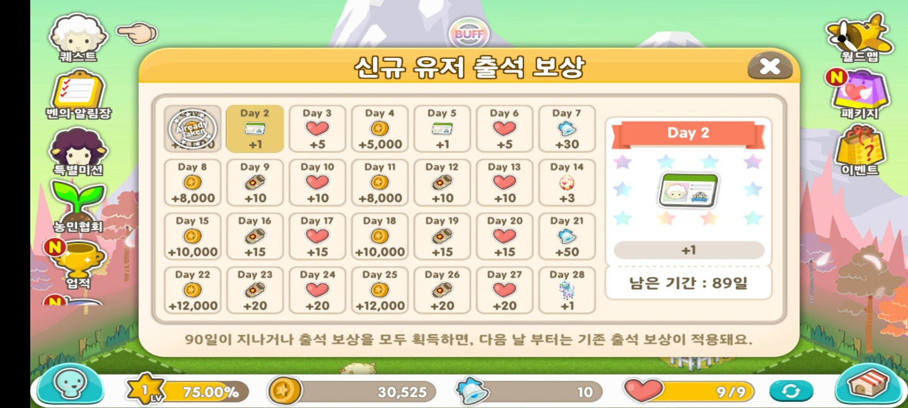

- **출석 시작일을 기준으로 30일이 넘으면 1일부터 다시 시작한다**된다.
- **연속으로 출석하지 않으면 1일부터 다시 시작**한다.
- 출석 보상은 **우편함에 지급**된다.

#### 동작 플로우 
1. 클라이언트는 서버에게 `출석체크`를 요청한다.
2. 서버는 다음 항목을 확인한다.
    1. 정확한 날짜인가?
    2. 오늘 이미 출석 체크를 했는가?
3. 문제 없다면 다음 항목을 진행한다.
    1. 마지막 출석 체크 날짜 변경
    2. 우편함에 출석 보상 추가(*`마스터데이터.xlsx`의 `출석 체크 보상` 시트 참고*)
    3. 결과 응답.
    
---
  
### 기능 6. 인앱 결제 아이템 지급

#### 기능 설명
  
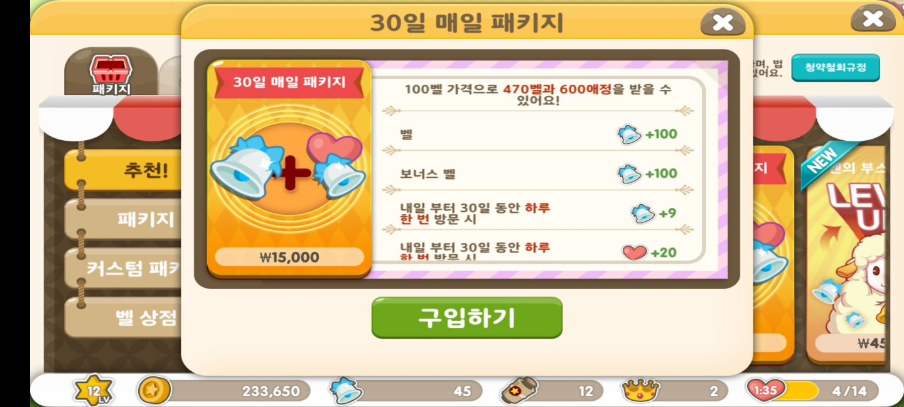

- 클라이언트가 구글 혹은 애플 스토어에서 인앱을 샀다고 가정한다.
- 클라이언트는 서버에 인앱 상품 지급 요청을 한다. (인앱 영수증은 임의로 생성)
- 서버는 영수증 검증은 하지않는다. (클라이언트에서 올바른 영수증을 보냈다고 가정)
    - 단, **중복 영수증 여부**는 확인한다.
- 상품 아이템은 **우편함으로 지급**받는다. (*유효 기간은 **무제한**이다.*)
#### 동작 플로우 
1. 클라이언트는 서버에게 `인앱 결제 아이템 지급`를 요청한다.
2. 서버는 다음 항목을 확인한다.
    1. 이미 지급 완료된 영수증인가?
3. 문제 없다면 다음 항목을 진행한다.
    1. 지급 완료된 영수증 목록에 영수증 추가
    2. 우편함에 인앱 상품 내용물 추가  (*`마스터데이터.xlsx`의 `인앱 상품` 시트 참고*)
    3. 결과 응답.
    
---

### 기능 7. 상점 동물 목록 불러오기

#### 기능 설명
  
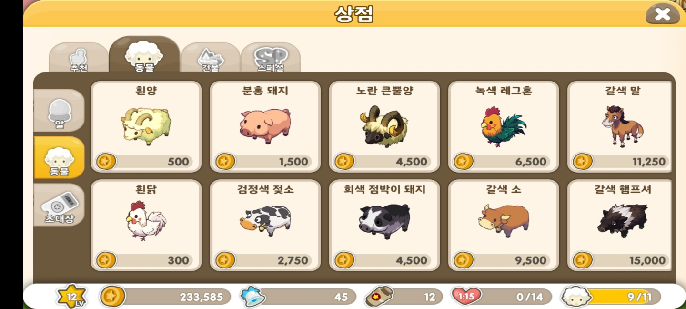

- 클라이언트는 상점에서 판매중인 동물들을 확인할 수 있다.
    - 클라이언트는 UI에 표시하기 위한 데이터는 이미 가지고 있다고 가정한다.  

#### 동작 플로우
1. 클라이언트에서 상점 탭 클릭 시 서버에게 `상점 동물 목록`을 요청한다.
2. 서버는 상점 동물 목록을 클라이언트에게 응답한다. (*`마스터데이터.xlsx`의 `상점 동물 목록` 시트 참고*)
    
---

### 기능 8. 동물자격증 구매

#### 기능 설명

- 농장에 놓을 수 있는 최대 동물 수는 **동물자격증**에 기반한다.

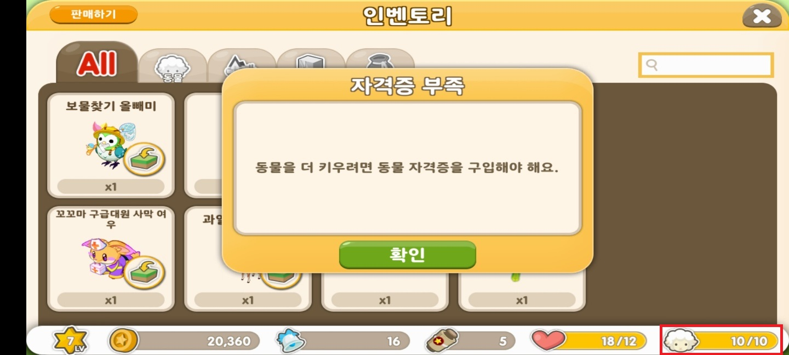

- 따라서 위와 같이 농장이 꽉 찼다면 상점에서 **동물 자격증**을 구매 해야한다.

- 동물 자격증은 현재 레벨별로 한 번씩 구매할 수 있다. 
    - 예) 현재 레벨이 5이고, 아직 한번도 구매한 적이 없으면 1~

#### 동작 플로우
1. 클라이언트는 서버에게 `동물자격증 구매`를 요청한다.
2. 서버는 다음 항목을 확인한다.
    1. 구매하고자 하는 동물자격증 정보 불러오기 (*`마스터데이터.xlsx`의 `동물자격증` 시트 참고*)
    2. 현재 클라이언트 레벨에서 구매할 수 있는가?
3. 문제없다면 다음 절차를 진행한다.
    1. 클라이언트의 소지 금액 차감
    2. 클라이언트가 농장에 놓을 수 있는 최대 동물 수 갱신
    3. 결과 응답
    
---

### 기능 9. 동물 구매

#### 기능 설명

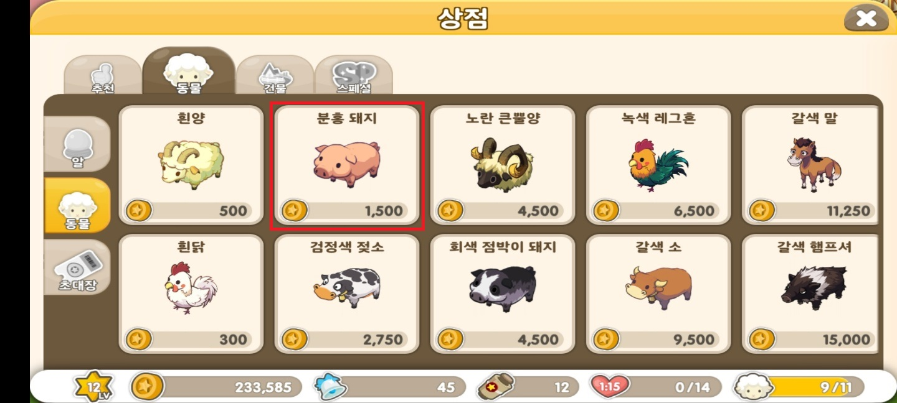

- 클라이언트는 상점에서 원하는 동물을 구매할 수 있다.
- 구매한 동물은 **클라이언트의 인벤토리에 추가**된다.

#### 동작 플로우
1. 클라이언트는 서버에게 `동물 구매`를 요청한다.
2. 서버는 다음 항목을 확인한다.
    1. 구매하고자 하는 동물 정보 불러오기 (*`마스터데이터.xlsx`의 `상점 동물 목록` 시트 참고*)
    2. 클라이언트의 소지 금액이 충분한가?
4. 문제없다면 다음 절차를 진행한다.
    1. 클라이언트의 소지 금액 차감
    2. 클라이언트의 인벤토리에 구매한 동물 추가
    3. 결과 응답
    
---

### 기능 10. 농장에 동물 놓기

#### 기능 설명

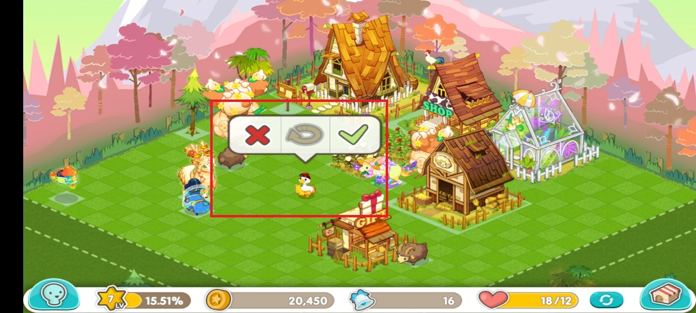

- 클라이언트는 인벤토리의 동물을 농장에 놓을 수 있다.
- **한 번 인벤토리에서 농장으로 이동한 동물은 다시 인벤토리로 이동할 수 없다.**
- 농장에 놓인 동물은 먹이를 줄 수 있다.
- 농장에 놓인 동물은 애정을 줄 수 있다.
- 농장에 놓인 동물은 교배시킬 수 있다.
- 농장에 놓인 동물은 즉시 성장시킬 수 있다.
    
#### 동작 플로우
> **서버에서 위치 판정은 하지 않는다.**

1. 클라이언트는 서버에게 `농장에 동물 놓기`를 요청한다.
2. 서버는 다음 항목을 확인한다.
    1. 클라이언트의 인벤토리에 해당 동물이 존재하는가?
    2. 클라이언트의 농장이 꽉 차지 않았는가?
3. 문제없다면 다음 절차를 진행한다.
    1. 클라이언트의 인벤토리에서 동물 삭제 
        - *만약 해당 동물을 여러 마리 소지하고 있는 경우, 인벤토리 상의 동물 수만 차감한다.*
    2. 클라이언트의 농장에 동물 추가
    3. 해당 동물에게 먹이를 줄 수 있는 시간 계산 후 저장. (*`마스터데이터.xlsx`의 `동물 먹이 간격` 시트 참고*)
    4. 결과 응답
    
---

### 기능 11. 동물 먹이주기

#### 기능 설명

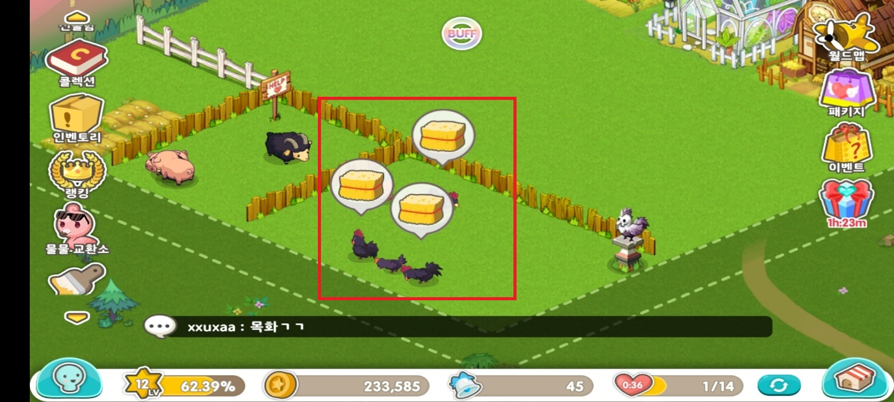

- 농장에 있는 동물에게 먹이를 줄 수 있다.

- 한 번 먹이를 먹인 동물은 **주기(Cycle)** 가 갱신되며, 다시 먹이를 먹이기 위해서는 위 그림과 같이 시간이 지나야한다.

- 먹이를 먹은 동물은 먹이에 따른 경험치가 상승한다.

- 동물이 레벨업하면 클라이언트는 동물 레벨업 보상을 받는다.

#### 동작 플로우 
1. 클라이언트는 서버에게 `동물 먹이주기`를 요청한다.
2. 서버는 다음 항목을 확인한다.
    1. 클라이언트의 농장에 해당 동물이 존재하는가?
    2. 클라이언트의 인벤토리에 해당 먹이가 존재하는가?
    3. 해당 동물이 최대 레벨에 도달했는가?
    4. 해당 동물이 먹이를 먹을 수 있는가? (*ex. 현재 시간이 먹이를 줄 수 있는 시간 이상인가?*)
3. 문제없다면 다음 절차를 진행한다.
    1. 먹이를 줄 수 있는 다음 시간 계산 후 저장 (*`마스터데이터.xlsx`의 `동물 먹이 간격` 시트 참고*)
    2. 먹이에 따른 동물 경험치 상승  (*`마스터데이터.xlsx`의 `동물 먹이` 시트 참고*)
        1. 동물 레벨업 확인 (*`마스터데이터.xlsx`의 `동물 레벨업 필요 경험치` 시트 참고*)
            1. 레벨업했다면 보상 적용 (*`마스터데이터.xlsx`의 `동물 레벨업 보상` 시트 참고*)
    3. 결과 응답
    
---

### 기능 12. 애정주기

#### 기능 설명

- 농장에 있는 동물에게 애정주기 버튼을 클릭하면 애정을 줄 수 있다.

#### 동작 플로우 

1. 클라이언트는 서버에게 `애정주기`을 요청한다.
2. 서버는 다음 항목을 확인한다.
    1. 클라이언트의 농장에 해당 동물이 존재하는가?
    2. 해당 동물의 애정 수치가 최대인가? (*`마스터데이터.xlsx`의 `동물 최대 애정 개수` 시트 참고*)
    3. 클라이언트의 애정 개수가 충분한가?
3. 문제없다면 다음 절차를 진행한다.
    1. 클라이언트의 애정 개수 차감
    2. 동물 애정 수치 증가
    3. 결과 응답
    
---

### 기능 13. 교배하기

#### 기능 설명

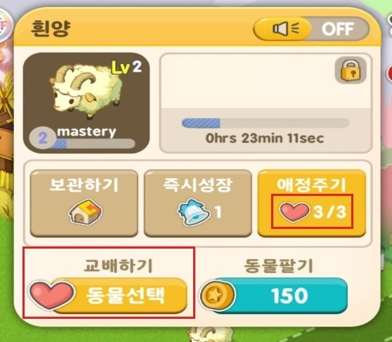

- **애정 수치가 최대치**인 **동일한 종류의 동물 두 마리**를 교배시킬 수 있다.
- 교배를 하기 위해서는 농장에 동물을 놓을 수 있어야한다.
- 교배 시 **같은 종**의 레벨 1 동물이 농장에 추가된다.
- 교배 성공률은 100%이며, 일정 확률로 **같은 종**의 다음 단계 동물이 태어날 수 있다. ( *ex: 흰양 + 흰양 > 갈색양* )
- 교배 종료 시 교배를 한 동물들의 애정 수치는 0으로 초기화된다.

#### 동작 플로우 

1. 클라이언트는 서버에게 `교배하기`을 요청한다.
2. 서버는 다음 항목을 확인한다.
    1. 클라이언트의 농장에 동물을 놓을 수 있는가?
    2. 클라이언트의 농장에 교배 대상 동물들이 존재하는가?
    3. 교배 대상 동물들의 애정 수치가 최대인가? (*`마스터데이터.xlsx`의 `동물 최대 애정 개수` 시트 참고*)
    4. 클라이언트에게 교배에 필요한 금액이 존재하는가?  (*`마스터데이터.xlsx`의 `교배 비용` 시트 참고*)
3. 문제없다면 다음 절차를 진행한다.
    1. 교배 대상 동물들의 애정 수치 0으로 초기화
    2. 클라이언트의 소지 금액 차감
    3. 교배 진행 (*`마스터데이터.xlsx`의 `교배 확률` 시트 참고*)
    4. 교배로 태어난 새로운 동물을 클라이언트 농장에 추가
    5. 결과 응답
    
---

### 기능 14. 동물판매

#### 기능 설명

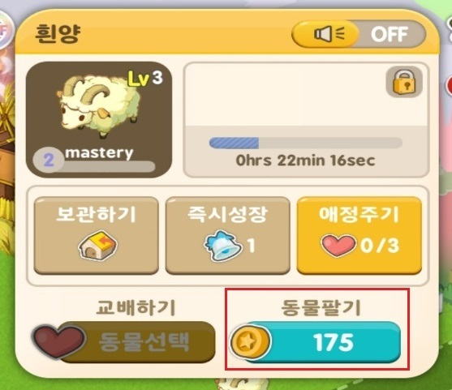

- 인벤토리와 농장에서 동물을 판매할 수 있다.
- **한 번 판매한 동물은 되돌릴 수 없다.**
- **동물의 종류와 레벨에 따라 가격**이 다르다.
- 판매 개수를 정할 수 있다.

#### 동작 플로우 

1. 클라이언트는 서버에게 `동물판매`을 요청한다.
2. 서버는 다음 항목을 확인한다.
    1. 농장Or인벤토리에 동물이 존재하는가?
3. 문제없다면 다음 절차를 진행한다.
    1. 가격 산정 (*`마스터데이터.xlsx`의 `동물 판매 가격` 시트 참고*)
    2. 농장Or인벤토리에서 동물 삭제
    3. 클라이언트 소지 금액 증가
    4. 결과 응답
    
---

### 기능 15. 밭구매

#### 기능 설명

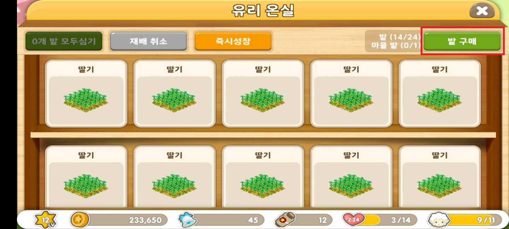

- 클라이언트는 밭을 구매할 수 있다.
- 밭 최대 구매 개수는 클라이언트의 레벨에 기반한다.

#### 동작 플로우 

1. 클라이언트는 서버에게 `밭구매`를 요청한다.
2. 서버는 다음 항목을 확인한다.
    1. 클라이언트의 밭 구매 최대 개수를 초과하는가? (*`마스터데이터.xlsx`의 `밭개수` 시트 참고*)
    2. 클라이언트의 소지 금액이 충분한가?
3. 문제없다면 다음 절차를 진행한다.
    1. 클라이언트 소지 금액 차감
    2. 클라이언트가 소유하고 있는 밭 개수 증가
    3. 결과 응답
    
---

### 기능 16. 작물재배

#### 기능 설명

- 밭에 원하는 작물을 재배할 수 있다.
- 작물마다 **재배 비용**, **재배 완료 시간**, **수확 보상**이 다르다.

#### 동작 플로우 

1. 클라이언트는 서버에게 `작물재배`를 요청한다.
2. 서버는 다음 항목을 확인한다.
    1. 재배할 수 있는 작물인가? (*`마스터데이터.xlsx`의 `작물` 시트 참고*)
    2. 클라이언트에게 존재하는 밭인가?
    3. 클라이언트의 소지 금액이 충분한가?  (*`마스터데이터.xlsx`의 `작물 재배 비용` 시트 참고*)
3. 문제없다면 다음 절차를 진행한다.
    1. 클라이언트의 소지 금액 차감
    2. 클라이언트의 밭 상태 변경 (*ex. `Empty` > `InProgress`*)
    3. 작물 수확 가능 시간 계산 및 저장 (*`마스터데이터.xlsx`의 `작물 재배 시간` 시트 참고*)
    4. 결과 응답
    
---

### 기능 17. 작물수확

#### 기능 설명

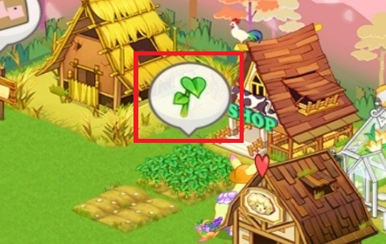

- **작물 수확 시간에 도달했다면** 작물을 수확할 수 있다.
- 작물 수확 시 **보상을 얻는다.**
- 작물 종류 별로 수확 보상이 다르다.

#### 동작 플로우 

1. 클라이언트는 서버에게 `작물수확`를 요청한다.
2. 서버는 다음 항목을 확인한다.
    1. 클라이언트가 수확 요청한 작물 정보 불러오기
    2. 클라이언트에게 존재하는 밭인가?
    3. 클라이언트에게 존재하는 작물인가?
    4. 현재 시간이 작물 수확 가능 시간인가?
3. 문제없다면 다음 절차를 진행한다.
    1. 밭 상태 변경 (*ex. `InProgress` > `Empty`*)
    2. 수확 보상 적용 (*`마스터데이터.xlsx`의 `작물 수확 보상` 시트 참고*)
    3. 결과 응답
    
---

### 기능 18. 애정 자동 충전

#### 기능 설명

- 클라이언트의 애정 개수가 **일정 개수 미만 (*ex: 15개*)** 이면, 일정 주기 마다 애정이 자동 충전된다.

#### 동작 플로우 

1. 클라이언트는 서버에게 `애정충전`를 요청한다.
2. 서버는 다음 항목을 확인한다.
    1. 애정 자동 충전 주기에 도달했는가?
    2. 애정 개수가 일정 개수 미만(*알아서 설정*) 인가? 
3. 문제없다면 다음 절차를 진행한다.
    1. 다음 자동 충전 주기 갱신
    2. 클라이언트의 애정 개수 증가
    3. 결과 응답
    
---

### 기능 19. 채팅

#### 기능 설명

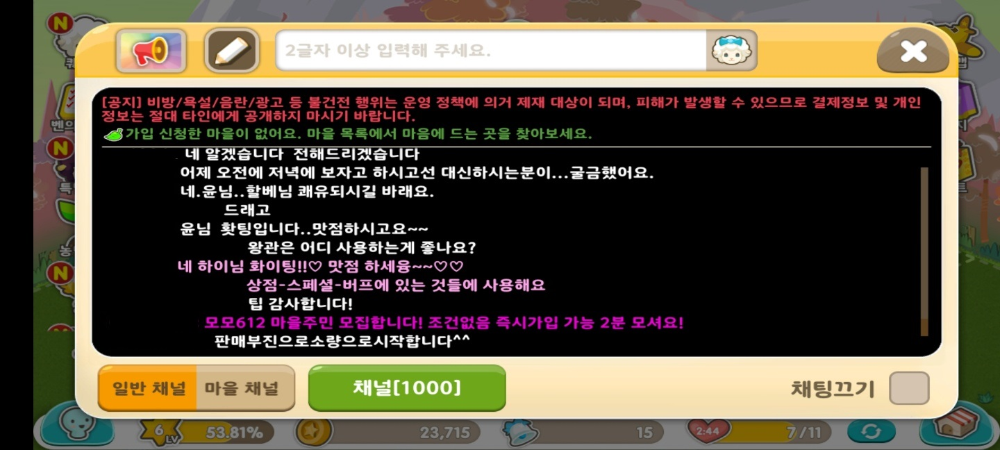

- 웹서버만으로 채팅을 구현한다. (*클라이언트에서 주기적으로 서버에 최신 채팅 메시지를 요청한다고 가정한다.*)
- 서버로부터 최신 메시지는 최대 3개까지만 응답 받는다.
- 클라이언트는 로그인 시 자동으로 임의의 채널에 입장된다.
- 채팅은 채널 단위로 구분된다.
- 채널 번호는 `1` ~ `100`까지만 존재한다.
- 채널 하나에 입장 가능 유저는 **100명**이다.
- 채팅 창을 통해서 이전 채팅 히스토리를 볼 수 있다.(단 현재 채팅에서 10개까지만 가능하다.)
    
---

### 기능 20. 채널 변경

#### 기능 설명

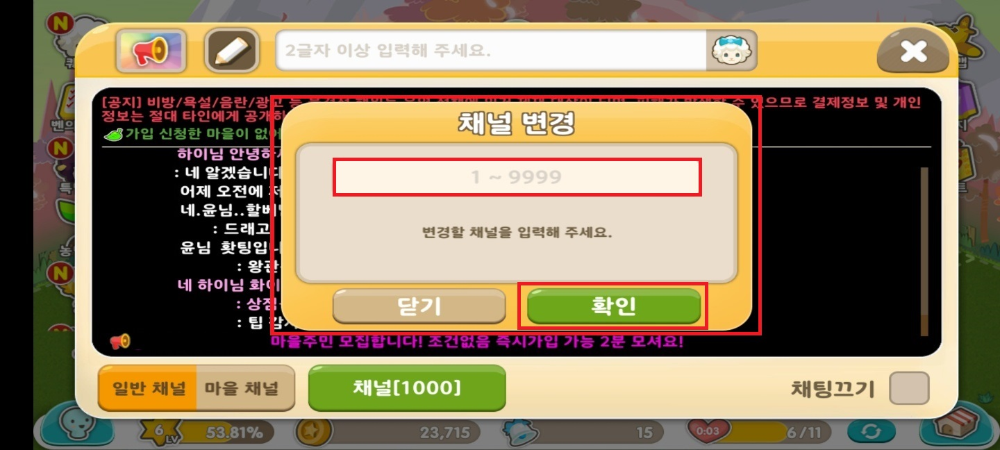

- 클라이언트는 채널을 변경할 수 있다.
    
---

### 기능 21. 랭킹 확인

#### 기능 설명

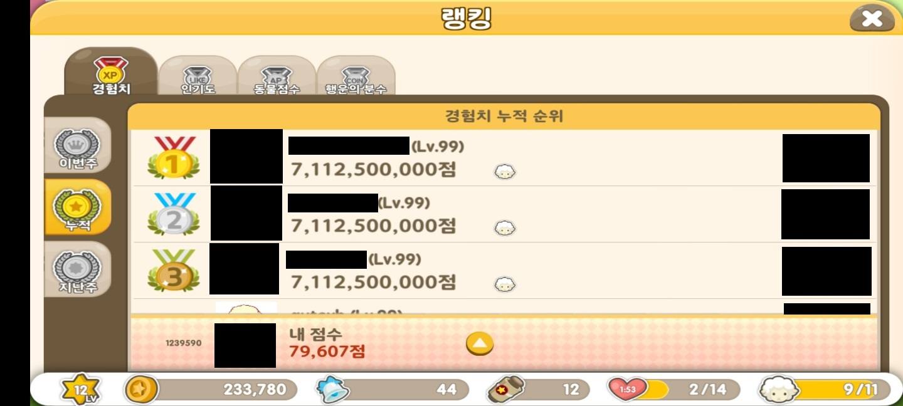

- 랭킹 탭을 통해 전체 유저의 **이번 주** 경험치 누적 순위를 확인할 수 있다.
- 출력 데이터는 **유저 닉네임, 레벨, 획득 경험치 수치**다.
- **1 ~ 100위**까지만 출력한다.
- `Reids`를 사용하여 구현한다.

## More...
- 여기까지 구현을 다했다면 다음 항목을 진행한다.
    1. 유닛테스트 개발.
    2. 신규 콘텐츠 기획 및 개발.