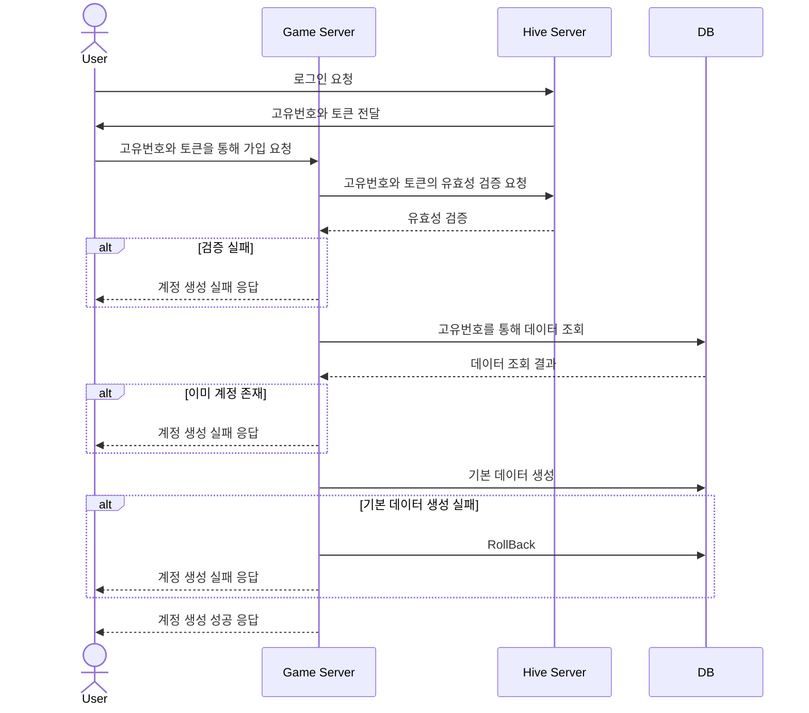
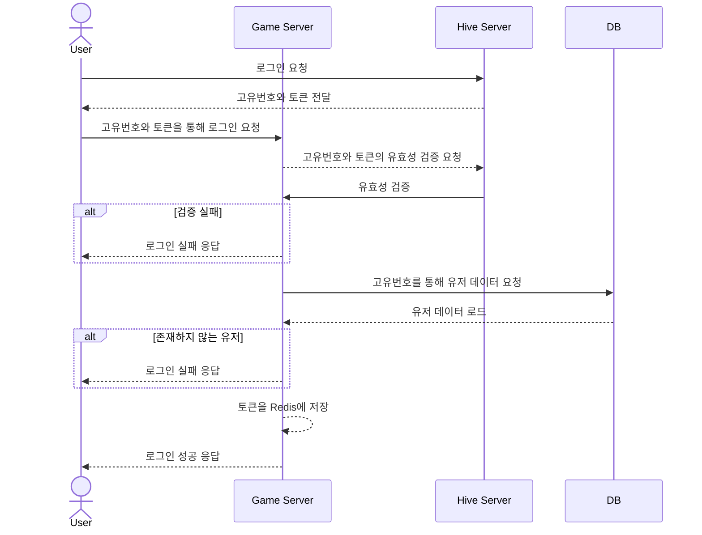

# API 서버 템플릿
이것을 기반으로 원하는 API 서버를 개발하면 빠르게 개발할 수 있다.  
단 필요 없는 코드와 파일은 싹 지워야 한다.  
   
    	 
# TODO-LIST
개발할 것을 계획하고, 해야할 것을 세분화 하여 TODO 리스트를 만든다.   
개발이 진행되면 완료한 항목은 체크한다. 또 필요하면 새롭게 추가한다.  
아래는 사용 예이다.     

  
완료한 작업 : ✅

- **하이브 서버 기능**
 
| 기능                                         | 완료 여부 |
| -------------------------------------------- | --------- |
| 하이브 계정생성   						| ✅        |
| [하이브 로그인]							| ✅        |
| [하이브 토큰 검증]								 | ✅        |

- **계정 기능**

| 기능                                         | 완료 여부 |
| -------------------------------------------- | --------- |
| [로그인]						              | ✅        |
| [로그아웃]								       | ✅        |

- **데이터 로드**

| 기능                                         | 완료 여부 |
| -------------------------------------------- | --------- |
| [유저 데이터 로드]	                		 | ✅        |
| [게임 데이터 로드]	                		 | ✅        |
| [소셜 데이터 로드]	                		 | ✅        |

- **친구 기능**

| 기능                                            | 완료 여부 |
| ----------------------------------------------- | --------- |
| [친구 목록 조회]								  | ✅        |
| [친구 요청]								  | ✅        |
| [친구 요청 수락]								  | ✅        |
| [친구 삭제]								  | ✅        |
| [친구 요청 취소]								  | ✅        |


<br>  
  
---  
아래는 구현할 기능에 대한 설명이다.    
  
## 가챠
- 가챠는 포함된 아이템들중 하나만을 뽑아내는 것이다.
- 아이템의 종류에 따라 그 확률을 정할 수 있다. (캐릭터 5%, 스킨 1%,...)
- 확률을 통해 타입을 정하고, 그 타입의 아이템들 중 하나를 뽑는 방식으로 구현.
  
  
---
## 하이브 로그인

**컨텐츠 설명**
- 하이브에 로그인 하여 고유번호와 토큰을 받습니다.

**로직**
1. 클라이언트가 이메일과 비밀번호를 하이브 서버에 전달한다.
1. 클라이언트의 고유번호와 생성된 토큰을 응답한다. 


클라이언트 → 서버 전송 데이터

| 종류                  | 설명                             |
| --------------------- | -------------------------------- |
| 이메일               | 로그인 이메일 |
| 비밀번호             | 로그인 비밀번호 |


### 요청 및 응답 예시

- 요청 예시

```
POST http://localhost:11502/LoginHive
Content-Type: application/json

{
    "Email" : "example@test.com",
    "Password" : "Aslj3kldiu!",
}
```

- 응답 예시

```
{
    "result": 0,
    "playerId": 7,
    "hiveToken": "efaee4517404318a8d14f6053767ff74dcf9aw30910b9116dafd3fa4ce408a45"
}
```    
  
---  
# 시퀸스 다이얼그램
   
## 새로운 유저의 계정 생성


  
  
# 유저의 로그인


