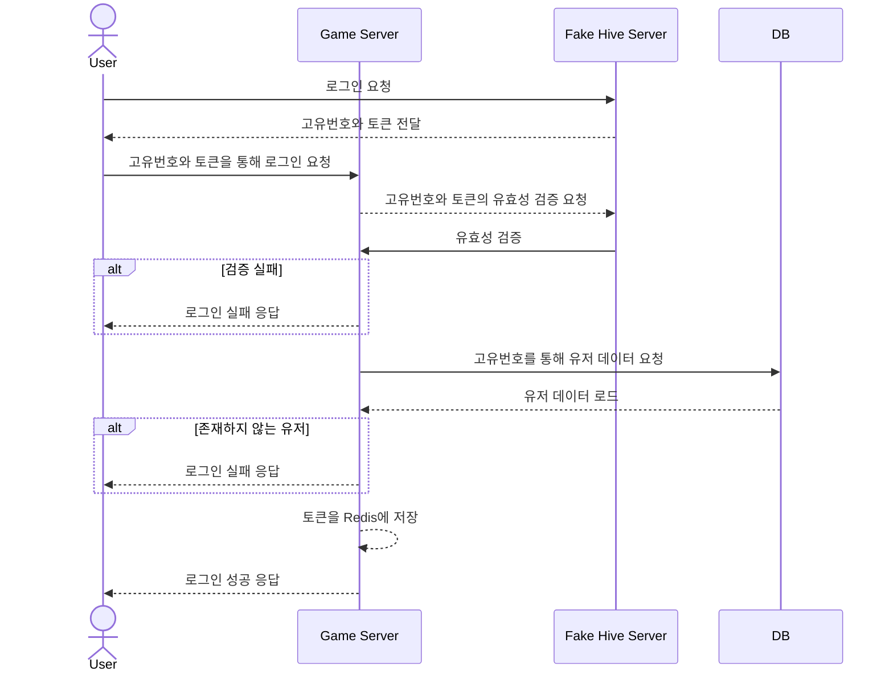
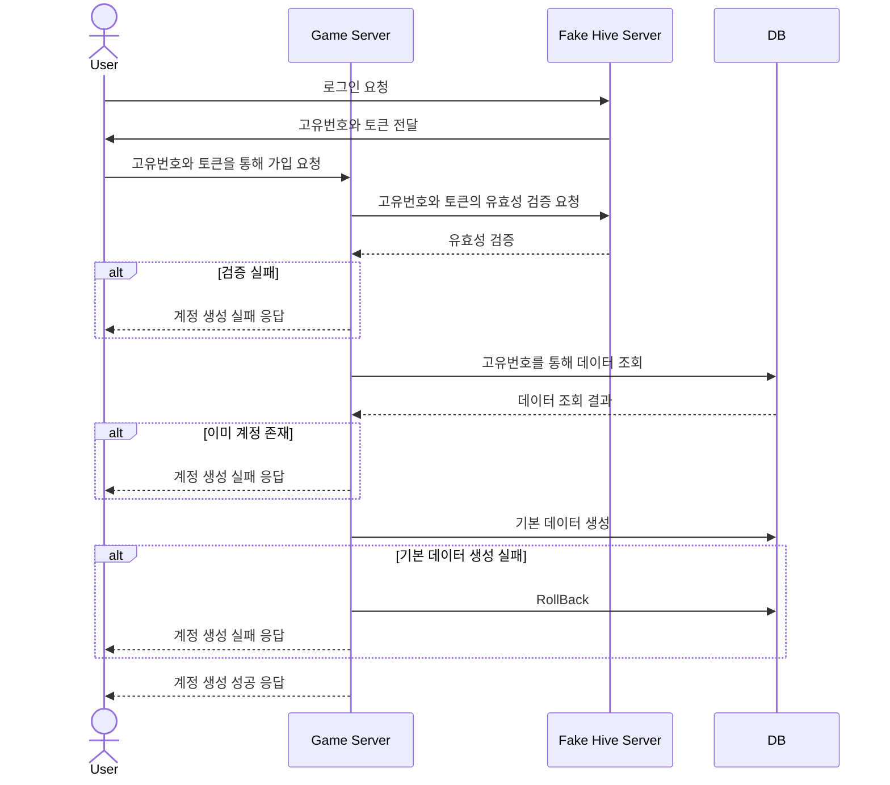

아래 사용 예를 참고하여 만드는 게임에 맞게 시퀸스다이얼그램을 만들도록 한다.  
사용하지 않는 것은 삭제한다.  
  
# 유저의 로그인

```mermaid
sequenceDiagram
	actor User
	participant Game Server
	participant Fake Hive Server
	participant DB

	User->> Fake Hive Server: 로그인 요청
	Fake Hive Server -->> User : 고유번호와 토큰 전달

	User ->> Game Server : 고유번호와 토큰을 통해 로그인 요청
	Game Server -->> Fake Hive Server : 고유번호와 토큰의 유효성 검증 요청
	Fake Hive Server ->> Game Server : 유효성 검증
	alt 검증 실패
	Game Server -->> User : 로그인 실패 응답
	end
	
	Game Server ->> DB : 고유번호를 통해 유저 데이터 요청
	DB -->> Game Server : 유저 데이터 로드
	alt 존재하지 않는 유저
	Game Server -->> User : 로그인 실패 응답
	end
	Game Server -->> Game Server : 토큰을 Redis에 저장
	Game Server -->> User : 로그인 성공 응답
```

# 새로운 유저의 계정 생성

```mermaid
sequenceDiagram
	actor User
	participant Game Server
	participant Fake Hive Server
	participant DB

	User->> Fake Hive Server: 로그인 요청
	Fake Hive Server ->> User : 고유번호와 토큰 전달

	User ->> Game Server : 고유번호와 토큰을 통해 가입 요청
	Game Server ->> Fake Hive Server : 고유번호와 토큰의 유효성 검증 요청
	Fake Hive Server -->> Game Server : 유효성 검증
	alt 검증 실패
	Game Server -->> User : 계정 생성 실패 응답
	end
	
	Game Server ->> DB : 고유번호를 통해 데이터 조회
	DB -->> Game Server : 데이터 조회 결과
	alt 이미 계정 존재
	Game Server -->> User : 계정 생성 실패 응답
	end

	Game Server ->> DB : 기본 데이터 생성
	alt 기본 데이터 생성 실패
	Game Server ->> DB : RollBack
	Game Server -->> User : 계정 생성 실패 응답
	end

	Game Server -->> User : 계정 생성 성공 응답

```
