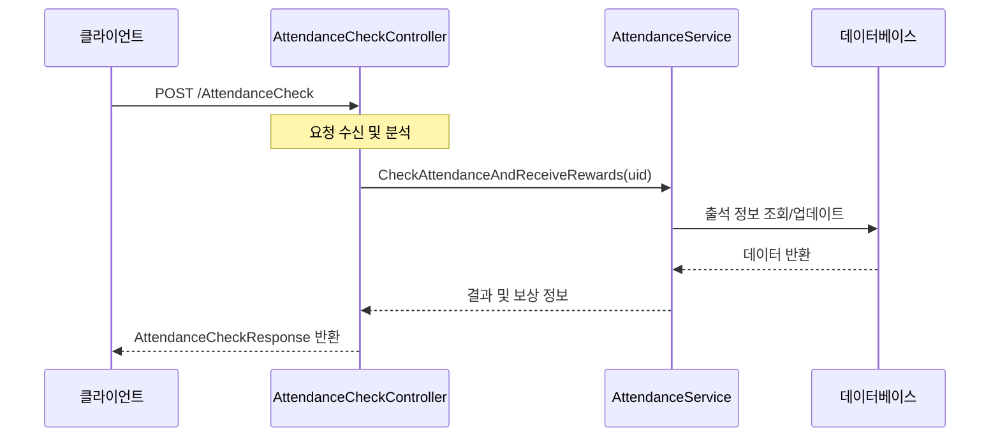

# Chapter 1: 컨트롤러 패턴

## 소개

게임 서버를 개발할 때 가장 먼저 마주치게 되는 것은 "클라이언트의 요청을 어떻게 처리할까?"라는 문제입니다. 클라이언트(게임)에서 서버로 데이터를 요청하면, 누군가는 그 요청을 받아 처리하고 응답을 보내야 합니다. 이 역할을 담당하는 것이 바로 **컨트롤러(Controller)**입니다.

컨트롤러는 마치 호텔의 프론트 데스크와 같습니다. 손님(클라이언트)이 요청하면 적절한 부서(서비스)에 전달하고, 그 결과를 다시 손님에게 전달하는 역할을 합니다.

## 컨트롤러의 기본 구조

컨트롤러는 다음과 같은 기본 구조를 가지고 있습니다:

```csharp
[ApiController]
[Route("[controller]")]
public class 기능이름Controller : ControllerBase
{
    // 의존성 주입
    // API 메서드 구현
}
```

여기서 중요한 부분:
- `[ApiController]`: 이 클래스가 API 컨트롤러임을 나타냅니다
- `[Route("[controller]")]`: API의 주소 경로를 설정합니다
- `ControllerBase`: ASP.NET Core의 기본 컨트롤러 클래스입니다

## 간단한 컨트롤러 예제

출석 체크 기능을 처리하는 컨트롤러를 살펴보겠습니다:

```csharp
[ApiController]
[Route("[controller]")]
public class AttendanceCheckController : ControllerBase
{
    readonly ILogger<AttendanceCheckController> _logger;
    readonly IAttendanceService _attendanceService;

    public AttendanceCheckController(ILogger<AttendanceCheckController> logger, 
                                     IAttendanceService attendanceService)
    {
        _logger = logger;
        _attendanceService = attendanceService;
    }
}
```

이 코드는 출석 체크 컨트롤러의 기본 구조를 보여줍니다. 로거와 출석 체크 서비스를 생성자를 통해 주입받고 있습니다. 이것을 **의존성 주입(Dependency Injection)** 패턴이라고 하며, 나중에 [종속성 주입 패턴](10_종속성_주입_패턴_.md) 장에서 자세히 배우게 됩니다.

## API 엔드포인트 구현하기

이제 실제로 클라이언트의 요청을 처리하는 메서드를 추가해 봅시다:

```csharp
/// <summary>
/// 출석 체크 API
/// 출석 체크를 하고 받은 보상을 반환합니다.
/// </summary>
[HttpPost]
public async Task<AttendanceCheckResponse> CheckAttendance([FromHeader] Header header)
{
    AttendanceCheckResponse response = new();
                          
    (response.Result, response.Rewards) = 
        await _attendanceService.CheckAttendanceAndReceiveRewards(header.Uid);

    _logger.ZLogInformation($"[AttendanceCheck] Uid : {header.Uid}");
    return response;
}
```

이 메서드는 다음과 같은 작업을 수행합니다:
1. `[HttpPost]` 속성은 이 메서드가 HTTP POST 요청을 처리함을 나타냅니다
2. 요청 헤더에서 사용자 ID(Uid)를 추출합니다
3. 서비스 계층에 요청을 위임하여 실제 비즈니스 로직을 처리합니다
4. 로그를 남깁니다
5. 결과를 클라이언트에 반환합니다

## 컨트롤러의 역할과 책임

컨트롤러는 다음과 같은 역할과 책임을 가집니다:

1. **요청 수신**: 클라이언트로부터 오는 HTTP 요청을 받습니다
2. **요청 유효성 검사**: 요청 데이터가 올바른지 확인합니다
3. **서비스 호출**: 적절한 서비스 계층으로 요청을 전달합니다
4. **응답 반환**: 서비스 계층의 결과를 클라이언트에게 반환합니다
5. **로깅**: 요청/응답에 대한 로그를 남깁니다

중요한 점은 컨트롤러는 "어떻게 처리할지"가 아니라 "누구에게 처리를 맡길지"에 집중합니다. 실제 비즈니스 로직은 [서비스 계층 패턴](03_서비스_계층_패턴_.md)에서 처리합니다.

## 컨트롤러 흐름 이해하기

아래 시퀀스 다이어그램은 출석 체크 요청이 처리되는 과정을 보여줍니다:



## 다양한 컨트롤러 예제

### 친구 목록 조회 컨트롤러

```csharp
[HttpPost]
public async Task<FriendListResponse> GetFriendList([FromHeader] Header header)
{
    FriendListResponse response = new();

    (response.Result, response.FriendList) = await _friendService.GetFriendList(header.Uid);

    _logger.ZLogInformation($"[FriendList] Uid : {header.Uid}");
    return response;
}
```

### 메일 목록 조회 컨트롤러

```csharp
[HttpPost]
public async Task<MailboxInfoResponse> GetMailList([FromHeader] Header header)
{
    MailboxInfoResponse response = new();

    (response.Result, response.MailList) = await _mailService.GetMailList(header.Uid);
    
    _logger.ZLogInformation($"[MailList] Uid : {header.Uid}");
    return response;
}
```

이 두 컨트롤러 역시 비슷한 패턴을 따릅니다. 요청을 받고, 서비스 계층에 처리를 위임하고, 결과를 반환합니다.

## 컨트롤러와 응답 객체

컨트롤러는 항상 특정 형태의 응답 객체를 반환합니다. 이 객체를 **데이터 전송 객체(DTO, Data Transfer Object)**라고 부릅니다. 다음은 출석 체크 응답의 예입니다:

```csharp
public class AttendanceCheckResponse
{
    public ErrorCode Result { get; set; }
    public List<ItemReward> Rewards { get; set; }
}
```

DTO에 대해서는 다음 장인 [데이터 전송 객체(DTO)](02_데이터_전송_객체_dto__.md)에서 더 자세히 알아볼 것입니다.

## 특별한 경우: 저장소 직접 사용

일부 간단한 작업은 서비스 계층을 거치지 않고 직접 저장소(Repository)에 접근하기도 합니다. 랭킹 정보 조회가 그 예입니다:

```csharp
[HttpPost]
public async Task<RankingResponse> GetTopRanking()
{
    RankingResponse response = new();
    
    (response.Result, response.RankingData) = await _memoryDb.GetTopRanking();

    _logger.ZLogInformation($"[TopRanking] GetTopRanking");
    return response;
}
```

이 컨트롤러는 서비스 대신 직접 메모리 데이터베이스를 사용합니다. 이는 간단한 읽기 작업에서 종종 사용되는 방식입니다.

## 컨트롤러 설계 시 고려사항

컨트롤러를 설계할 때 다음 사항을 고려해야 합니다:

1. **단일 책임 원칙**: 각 컨트롤러는 하나의 기능 영역만 담당해야 합니다
2. **비즈니스 로직 배제**: 컨트롤러는 요청 처리와 응답 생성에만 집중하고, 복잡한 로직은 서비스 계층으로 위임합니다
3. **예외 처리**: 적절한 오류 응답을 반환할 수 있도록 예외 처리가 필요합니다
4. **응답 일관성**: 모든 API가 일관된 형식의 응답을 반환하도록 해야 합니다

## 컨트롤러 구현 가이드라인

좋은 컨트롤러를 구현하기 위한 팁입니다:

1. 컨트롤러 이름은 기능을 명확히 나타내야 합니다 (예: `AttendanceCheckController`)
2. HTTP 메서드([HttpPost], [HttpGet] 등)를 명확히 지정합니다
3. 각 API 메서드에 XML 주석으로 기능을 문서화합니다
4. 복잡한 비즈니스 로직은 항상 서비스 계층으로 위임합니다
5. 로그를 적절히 남겨 디버깅을 용이하게 합니다

## 요약 및 다음 단계

이 장에서는 컨트롤러 패턴의 기본 개념과 사용법을 배웠습니다. 컨트롤러는 클라이언트의 HTTP 요청을 받아 적절한 서비스로 전달하고, 그 결과를 응답으로 변환하는 역할을 합니다. 마치 호텔 프론트 데스크처럼 요청을 받아 적절한 부서로 전달하고 결과를 다시 전달하는 중개자 역할을 합니다.

컨트롤러는 API 서버의 첫 번째 진입점이지만, 실제 작업은 주로 다른 계층에서 수행됩니다. 컨트롤러가 받는 요청과 반환하는 응답의 형식에 대해 더 자세히 알아보려면 다음 장인 [데이터 전송 객체(DTO)](02_데이터_전송_객체_dto__.md)를 참조하세요.

---

Generated by [AI Codebase Knowledge Builder](https://github.com/The-Pocket/Tutorial-Codebase-Knowledge)