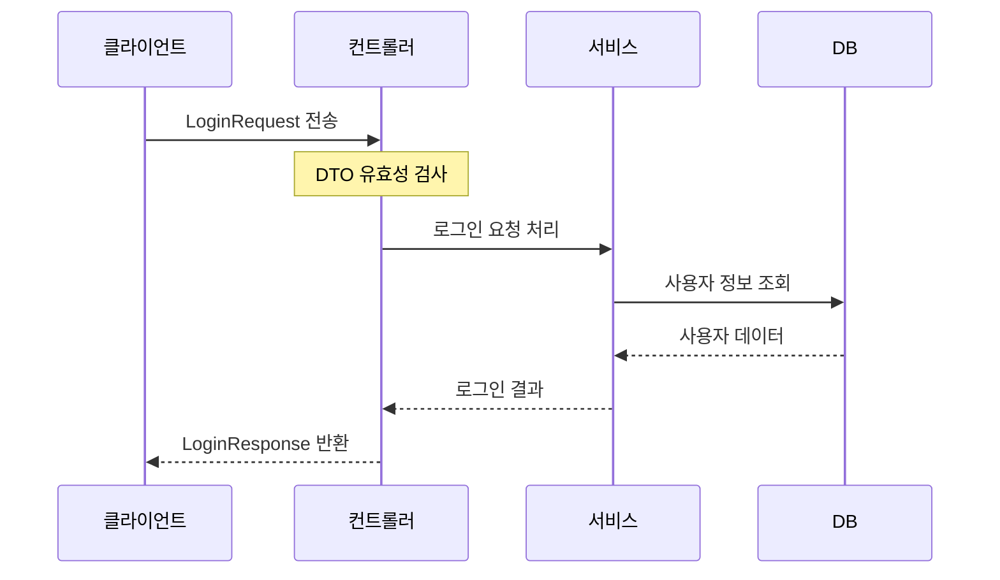

# Chapter 2: 데이터 전송 객체(DTO)

[이전 장](01_컨트롤러_패턴_.md)에서 우리는 컨트롤러가 클라이언트의 요청을 받아 처리하는 방법에 대해 배웠습니다. 그런데 이 요청과 응답은 어떤 형태로 주고받을까요? 이번 장에서는 그 답인 **데이터 전송 객체(DTO, Data Transfer Object)**에 대해 알아보겠습니다.

## DTO란 무엇인가요?

데이터 전송 객체(DTO)는 클라이언트와 서버 간에 데이터를 교환하기 위해 사용되는 객체입니다. 간단히 말해, 네트워크를 통해 데이터를 주고받을 때 사용하는 '택배 상자'와 같습니다.

예를 들어, 게임에서 사용자가 로그인할 때 생각해 봅시다:
1. 사용자는 ID와 비밀번호를 서버에 보냅니다
2. 서버는 인증 후 사용자 정보를 응답으로 보냅니다

이때 요청과 응답에 사용되는 객체가 바로 DTO입니다.

## DTO의 종류

DTO는 크게 두 가지 유형으로 나눌 수 있습니다:

1. **요청(Request) DTO**: 클라이언트가 서버에 보내는 데이터
2. **응답(Response) DTO**: 서버가 클라이언트에 보내는 데이터


## 간단한 DTO 예제

로그인 기능의 DTO를 먼저 살펴보겠습니다:

```csharp
// 로그인 요청 DTO
public class LoginRequest
{
    [Required]
    public string UserID { get; set; }
    
    [Required]
    public string Password { get; set; }
}
```

이 코드는 로그인 요청에 필요한 정보를 담는 DTO입니다. 사용자 ID와 비밀번호 두 가지 속성이 있으며, 둘 다 필수 항목으로 표시되어 있습니다(`[Required]` 속성).

이제 서버의 응답을 위한 DTO를 봅시다:

```csharp
// 로그인 응답 DTO
public class LoginResponse
{
    public ErrorCode Result { get; set; } = ErrorCode.None;
    public string AuthToken { get; set; } = "";
    public long Uid { get; set; } = 0;
    public DataLoadUserInfo userData { get; set; }
}
```

이 응답 DTO는 로그인 결과(성공/실패), 인증 토큰, 사용자 ID, 그리고 사용자 데이터를 포함합니다. 로그인이 성공했을 때 클라이언트가 필요로 하는 모든 정보를 담고 있습니다.

## DTO와 유효성 검사

DTO의 중요한 기능 중 하나는 클라이언트로부터 받은 데이터의 유효성을 검사하는 것입니다. .NET에서는 특성(Attributes)을 사용하여 이를 쉽게 구현할 수 있습니다.

계정 생성 요청 DTO를 살펴봅시다:

```csharp
public class CreateHiveAccountRequest
{
    [Required]
    [MinLength(1, ErrorMessage = "이메일은 비워둘 수 없습니다")]
    [StringLength(50, ErrorMessage = "이메일이 너무 깁니다")]
    [RegularExpression("^[a-zA-Z0-9_\\.-]+@([a-zA-Z0-9-]+\\.)+[a-zA-Z]{2,6}$", 
                      ErrorMessage = "유효한 이메일 형식이 아닙니다")]
    public string UserID { get; set; }

    [Required]
    [MinLength(1, ErrorMessage = "비밀번호는 비워둘 수 없습니다")]
    [StringLength(30, ErrorMessage = "비밀번호가 너무 깁니다")]
    [DataType(DataType.Password)]
    public string Password { get; set; }
}
```

이 코드에서는 다양한 유효성 검사 특성을 사용하고 있습니다:
- `[Required]`: 필수 입력 항목
- `[MinLength]`: 최소 길이 제한
- `[StringLength]`: 최대 길이 제한
- `[RegularExpression]`: 정규식 패턴 검사
- `[DataType]`: 데이터 유형 지정

이러한 특성들은 컨트롤러에서 별도의 코드 없이도 자동으로 유효성 검사를 수행합니다. 만약 검증에 실패하면, API는 클라이언트에 오류 메시지를 반환합니다.

## 왜 DTO를 사용해야 할까요?

DTO를 사용하는 주요 이유는 다음과 같습니다:

1. **데이터 캡슐화**: 필요한 데이터만 주고받아 네트워크 트래픽을 줄입니다
2. **보안 강화**: 내부 데이터 구조를 외부에 노출하지 않습니다
3. **유효성 검사**: 클라이언트 입력의 유효성을 쉽게 검사할 수 있습니다
4. **API 문서화**: API의 입력과 출력을 명확하게 정의합니다
5. **버전 관리**: API 변경 시 하위 호환성을 유지하기 쉽습니다

## 실제 DTO 작동 방식

DTO가 실제로 어떻게 작동하는지 살펴보겠습니다:



1. 클라이언트가 `LoginRequest` DTO를 JSON 형태로 서버에 전송합니다
2. ASP.NET Core는 자동으로 JSON을 `LoginRequest` 객체로 변환합니다(역직렬화)
3. 컨트롤러는 DTO의 유효성을 검사합니다
4. 유효성 검사가 통과하면 컨트롤러는 서비스 계층에 로직 처리를 위임합니다
5. 서비스는 필요한 작업을 수행하고 결과를 반환합니다
6. 컨트롤러는 `LoginResponse` DTO를 생성하여 클라이언트에 반환합니다
7. ASP.NET Core는 자동으로 DTO를 JSON으로 변환합니다(직렬화)

## 더 복잡한 DTO 예제

이메일 시스템의 DTO를 살펴보겠습니다:

```csharp
// 메일 수신 요청 DTO
public class MailReceiveRequest
{
    [Required]
    public int MailSeq { get; set; }
}

// 메일 수신 응답 DTO
public class MailReceiveResponse : ErrorCode
{
    public List<ReceivedReward> Rewards { get; set; }
}
```

이 예제에서는:
1. 요청 DTO는 받을 메일의 시퀀스 번호만 포함하고 있습니다
2. 응답 DTO는 결과 코드와 보상 목록을 포함합니다
3. `ErrorCode`를 상속받아 모든 응답이 결과 코드를 포함하도록 했습니다

## 중첩 DTO

복잡한 데이터 구조는 중첩된 DTO로 표현할 수 있습니다:

```csharp
public class UserDataLoadResponse : ErrorCode
{
    public DataLoadUserInfo UserData { get; set; }
}

public class DataLoadUserInfo
{
    public DAO.GdbUserInfo UserInfo { get; set; }
    public DAO.GdbUserMoneyInfo MoneyInfo { get; set; }
    public DAO.GdbAttendanceInfo AttendanceInfo { get; set; }
}
```

이 예제에서는 `UserDataLoadResponse`가 내부에 `DataLoadUserInfo` 객체를 포함하고 있습니다. 이렇게 계층적으로 데이터를 구성하면 복잡한 정보도 체계적으로 전달할 수 있습니다.

## 컬렉션을 포함하는 DTO

여러 항목을 반환해야 할 때는 컬렉션을 포함하는 DTO를 사용합니다:

```csharp
public class RankingResponse : ErrorCode
{
    public List<RankData> RankingData { get; set; }
}

public class RankData
{
    public long rank { get; set; }
    public int uid { get; set; }
    public int score { get; set; }
}
```

이 예제는 랭킹 목록을 반환하는 DTO입니다. `List<RankData>`를 사용하여 여러 랭킹 데이터를 포함할 수 있습니다.

## DTO 설계 시 고려사항

좋은 DTO를 설계하려면 다음 사항을 고려해야 합니다:

1. **필요한 정보만 포함하기**: 꼭 필요한 데이터만 주고받아 네트워크 트래픽을 최소화합니다
2. **명확한 이름 사용하기**: `UserLoginRequest`와 같이 목적이 분명한 이름을 사용합니다
3. **적절한 유효성 검사 추가하기**: 데이터 안전성을 위해 적절한 검증 규칙을 설정합니다
4. **버전 관리 고려하기**: API가 발전함에 따라 하위 호환성을 유지할 방법을 계획합니다
5. **문서화하기**: 주석을 통해 각 속성의 목적과 제약사항을 설명합니다

## DTO와 컨트롤러의 관계

[컨트롤러 패턴](01_컨트롤러_패턴_.md)에서 배운 내용과 DTO는 밀접하게 연결되어 있습니다. 컨트롤러의 메서드는 일반적으로 다음과 같은 형태를 가집니다:

```csharp
[HttpPost]
public async Task<LoginResponse> Login([FromBody] LoginRequest request)
{
    LoginResponse response = new();
    
    // 서비스 계층에 로직 처리 위임
    (response.Result, response.AuthToken, response.Uid, response.userData) = 
        await _accountService.LoginAsync(request.UserID, request.Password);
    
    return response;
}
```

이 코드에서 컨트롤러는:
1. `LoginRequest` DTO를 입력으로 받습니다(`[FromBody]` 속성을 통해 요청 본문에서 추출)
2. `LoginResponse` DTO를 생성하고 서비스 계층의 결과로 채웁니다
3. 완성된 응답 DTO를 반환합니다

## 실무에서의 DTO 패턴

실제 게임 서버에서는 종종 다음과 같은 패턴으로 DTO를 구성합니다:

1. **공통 응답 기반 클래스**: 모든 응답이 상속받는 기본 클래스 (에러 코드 포함)
2. **서비스별 DTO 네임스페이스**: 기능별로 DTO를 분리하여 관리
3. **확장 메서드**: DTO 간 변환을 위한 유틸리티 메서드 제공

예시 디렉토리 구조:
```
Models/
  DTO/
    Account/
      LoginRequest.cs
      LoginResponse.cs
      CreateAccountRequest.cs
      CreateAccountResponse.cs
    Mail/
      MailListRequest.cs
      MailListResponse.cs
      MailReceiveRequest.cs
      MailReceiveResponse.cs
    Common/
      ErrorResponse.cs
      BaseResponse.cs
```

## DTO와 데이터베이스 모델의 차이

DTO는 데이터베이스 모델(엔티티)과 다른 목적을 가집니다:

1. **DTO**: 클라이언트-서버 간 통신용 객체
2. **엔티티**: 데이터베이스 테이블과 매핑되는 객체

두 객체를 분리하는 것은 다음과 같은 이점이 있습니다:

1. **보안 강화**: 내부 데이터 구조가 외부에 노출되지 않음
2. **변경 유연성**: 데이터베이스 구조 변경이 API에 영향을 주지 않음
3. **관심사 분리**: 각 계층이 자신의 책임에만 집중할 수 있음

이러한 분리는 [서비스 계층 패턴](03_서비스_계층_패턴_.md)에서 더 자세히 다룰 예정입니다.

## 요약 및 다음 단계

이 장에서는 데이터 전송 객체(DTO)의 개념과 사용법에 대해 배웠습니다. DTO는 클라이언트와 서버 간의 데이터 교환을 위한 택배 상자와 같은 역할을 하며, 요청과 응답 두 가지 유형으로 나뉩니다.

DTO의 주요 이점은:
- 필요한 데이터만 주고받아 효율성 증가
- 데이터 유효성 검사를 통한 안전성 확보
- 내부 구조를 숨겨 보안 강화
- API 문서화 및 버전 관리 용이성

DTO는 컨트롤러가 클라이언트와 통신하는 방법의 핵심이지만, 실제 비즈니스 로직은 서비스 계층에서 처리됩니다. 다음 장인 [서비스 계층 패턴](03_서비스_계층_패턴_.md)에서는 DTO를 사용하여 실제 비즈니스 로직을 어떻게 구현하는지 알아보겠습니다.

---

Generated by [AI Codebase Knowledge Builder](https://github.com/The-Pocket/Tutorial-Codebase-Knowledge)