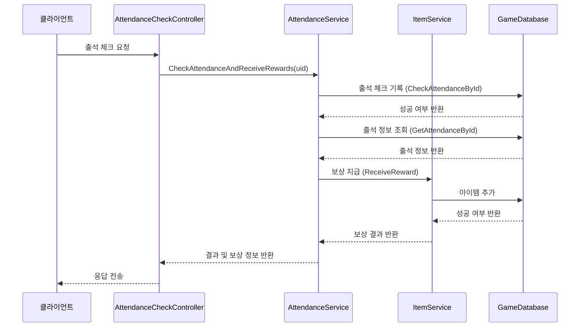
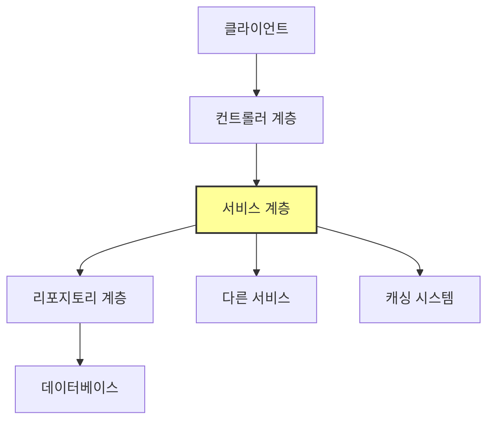

# Chapter 3: 서비스 계층 패턴

[이전 장](02_데이터_전송_객체_dto__.md)에서는 클라이언트와 서버 간의 데이터 교환에 사용되는 데이터 전송 객체(DTO)에 대해 배웠습니다. 이번 장에서는 게임 API 서버의 핵심 비즈니스 로직을 담당하는 **서비스 계층 패턴**에 대해 알아보겠습니다.

## 서비스 계층이란 무엇인가요?

서비스 계층은 게임 API 서버에서 실제 비즈니스 로직을 처리하는 핵심 부분입니다. 컨트롤러가 클라이언트의 요청을 받아들이면, 이 요청을 처리하기 위한 실제 작업은 서비스 계층에서 수행됩니다.

쉽게 비유하자면, 레스토랑을 생각해보세요:
- **손님(클라이언트)**: 음식을 주문합니다.
- **웨이터(컨트롤러)**: 주문을 받아 주방에 전달합니다.
- **주방장(서비스 계층)**: 재료를 준비하고 요리를 만듭니다.
- **창고 관리자(리포지토리)**: 필요한 재료를 제공합니다.

서비스 계층(주방장)은 컨트롤러(웨이터)와 리포지토리(창고 관리자) 사이에서 중개자 역할을 하며, 실제 비즈니스 로직(요리)을 담당합니다.

## 서비스 계층의 역할과 책임

서비스 계층은 다음과 같은 역할과 책임을 가집니다:

1. **비즈니스 로직 처리**: 게임의 핵심 규칙과 로직을 구현합니다.
2. **데이터 조작**: 리포지토리를 통해 데이터를 읽고 쓰는 작업을 조율합니다.
3. **트랜잭션 관리**: 여러 데이터 작업이 한 단위로 처리되도록 관리합니다.
4. **유효성 검증**: 비즈니스 규칙에 맞는 데이터인지 검증합니다.
5. **오류 처리**: 비즈니스 로직 실행 중 발생하는 오류를 적절히 처리합니다.

## 간단한 서비스 구현 예제

출석 체크 기능을 처리하는 서비스 계층 코드를 살펴보겠습니다:

```csharp
public class AttendanceService : IAttendanceService
{
    readonly ILogger<AttendanceService> _logger;
    readonly IGameDb _gameDb;
    readonly IMasterDb _masterDb;
    readonly IItemService _itemService;
    
    // 생성자 (의존성 주입)
    public AttendanceService(ILogger<AttendanceService> logger, 
                           IGameDb gameDb, 
                           IMasterDb masterDb, 
                           IItemService itemService)
    {
        _logger = logger;
        _gameDb = gameDb;
        _masterDb = masterDb;
        _itemService = itemService;
    }
}
```

이 코드는 `AttendanceService` 클래스의 기본 구조를 보여줍니다. 서비스에 필요한 여러 의존성(로거, 게임 데이터베이스, 마스터 데이터베이스, 아이템 서비스)을 생성자를 통해 주입받고 있습니다. 이는 [종속성 주입 패턴](10_종속성_주입_패턴_.md)의 예로, 코드를 유연하고 테스트하기 쉽게 만들어 줍니다.

## 서비스 메서드 구현하기

이제 출석 체크 기능을 구현하는 실제 메서드를 살펴보겠습니다:

```csharp
public async Task<(ErrorCode, List<ReceivedReward>)> CheckAttendanceAndReceiveRewards(int uid)
{
    try
    {
        // 출석 체크
        var rowCount = await _gameDb.CheckAttendanceById(uid);
        if (rowCount != 1)
        {
            return (ErrorCode.AttendanceCheckFailAlreadyChecked, null);
        }
        
        // 출석 정보 가져오기
        var attendanceInfo = await _gameDb.GetAttendanceById(uid);
        var attendanceCnt = attendanceInfo.attendance_cnt;
        
        // 보상 처리 코드...
        return (ErrorCode.None, totalRewards);
    }
    catch (Exception e)
    {
        _logger.ZLogError(e, $"[Attendance.CheckAttendance] 오류: {uid}");
        return (ErrorCode.AttendanceCheckFailException, null);
    }
}
```

이 메서드는 사용자의 출석을 체크하고 보상을 제공하는 로직을 구현합니다:

1. 데이터베이스에 출석 체크 기록을 저장합니다.
2. 이미 출석했는지 확인합니다 (rowCount가 1이 아니면 이미 출석한 것).
3. 현재 출석 정보(몇 일째 출석인지)를 가져옵니다.
4. 해당 일차에 맞는 보상을 계산하고 지급합니다.
5. 오류가 발생하면 적절한 오류 코드를 반환합니다.

이처럼 서비스 계층은 컨트롤러에서 전달받은 요청을 실제로 처리하는 비즈니스 로직을 포함합니다.

## 보상 지급 로직 구현

출석 체크 후 보상을 지급하는 더 자세한 코드를 살펴보겠습니다:

```csharp
// 출석 보상 수령
var reward = _masterDb._attendanceRewardList.Find(r => r.day_seq == attendanceCnt);

// 가챠 보상일 경우
if(reward.reward_type == "gacha")
{
    for (int i = 0; i < reward.reward_qty; i++)
    {
        var (errorCode, rewards) = await _itemService.ReceiveOneGacha(uid, reward.reward_key);
        totalRewards.Add(new ReceivedReward(reward.reward_key, rewards));
    }
}
```

이 코드는 출석 체크 보상 처리의 일부입니다:
1. 마스터 데이터에서 현재 출석 일수에 해당하는 보상 정보를 찾습니다.
2. 보상 유형이 가챠(뽑기)인 경우, 아이템 서비스를 통해 가챠 보상을 지급합니다.
3. 받은 보상을 목록에 추가합니다.

여기서 중요한 점은 서비스 계층이 다른 서비스(`_itemService`)를 호출하여 작업을 위임할 수 있다는 것입니다. 이는 서비스 간의 협력을 통해 복잡한 비즈니스 로직을 처리할 수 있게 해줍니다.

## 서비스 계층의 인터페이스

좋은 설계 관행은 서비스를 인터페이스와 구현체로 분리하는 것입니다:

```csharp
public interface IAttendanceService
{
    public Task<(ErrorCode, GdbAttendanceInfo)> GetAttendanceInfo(int uid);
    public Task<(ErrorCode, List<ReceivedReward>)> CheckAttendanceAndReceiveRewards(int uid);
}
```

이 인터페이스는 출석 체크 서비스가 제공해야 할 기능을 정의합니다:
1. 출석 정보 조회 (`GetAttendanceInfo`)
2. 출석 체크 및 보상 수령 (`CheckAttendanceAndReceiveRewards`)

인터페이스를 사용하면 다음과 같은 이점이 있습니다:
- 코드 의존성을 낮출 수 있습니다.
- 테스트가 용이해집니다 (모의 객체(mock) 사용 가능).
- 코드가 변경되어도 인터페이스만 유지하면 다른 코드에 영향을 주지 않습니다.

## 서비스 계층 흐름 이해하기

다음 시퀀스 다이어그램은 출석 체크 요청이 처리되는 과정을 보여줍니다:



이 다이어그램에서 볼 수 있듯이, 서비스 계층은:
1. 컨트롤러로부터 요청을 받습니다.
2. 데이터베이스에 접근하여 데이터를 조회하거나 변경합니다.
3. 필요에 따라 다른 서비스를 호출합니다.
4. 결과를 컨트롤러에 반환합니다.

## 다양한 서비스 예제

이제 다른 기능을 구현하는 서비스 예제를 살펴보겠습니다.

### 친구 서비스

친구 요청을 처리하는 메서드의 예입니다:

```csharp
public async Task<ErrorCode> SendFriendReq(int uid, int friendUid)
{
    try
    {
        // 자기 자신에게 친구 요청 불가
        if (uid == friendUid)
        {
            return ErrorCode.FriendAcceptFailSameUid;
        }

        // 상대방 유저 존재 여부 확인
        GdbUserInfo userInfo = await _gameDb.GetUserByUid(friendUid);
        if (userInfo is null)
        {
            return ErrorCode.FriendSendReqFailUserNotExist;
        }
        
        // 친구 요청 처리...
        return ErrorCode.None;
    }
    catch (Exception e)
    {
        _logger.ZLogError(e, $"[Friend.SendFriendReq] 오류: {uid}, {friendUid}");
        return ErrorCode.FriendSendReqFailException;
    }
}
```

이 서비스 메서드는:
1. 자기 자신에게 친구 요청을 보내는지 확인합니다.
2. 친구 요청을 받을 사용자가 존재하는지 확인합니다.
3. 이미 친구 요청을 보냈는지, 이미 친구인지 등 다양한 상태를 체크합니다(코드 일부 생략).
4. 모든 검증을 통과하면 친구 요청을 데이터베이스에 저장합니다.

### 메일 서비스

메일 수신 처리를 하는 메서드의 예입니다:

```csharp
public async Task<(ErrorCode,List<ReceivedReward>)> ReceiveMail(int uid, int mailSeq)
{
    try
    {
        // 메일 존재, 수령 여부, 소유권 확인
        var mailInfo = await _gameDb.GetMailInfo(mailSeq);
        if(mailInfo == null)
        {
            return (ErrorCode.MailReceiveFailMailNotExist, null);
        }
        if (mailInfo.receive_yn == true)
        {
            return (ErrorCode.MailReceiveFailAlreadyReceived, null);
        }
        
        // 메일 보상 수령 처리...
        return (ErrorCode.None, totalRewards);
    }
    catch (Exception e)
    {
        // 오류 처리...
        return (ErrorCode.MailReceiveFailException, null);
    }
}
```

이 서비스 메서드는:
1. 메일이 존재하는지 확인합니다.
2. 이미 수령한 메일인지 확인합니다.
3. 메일의 소유자가 맞는지 확인합니다.
4. 모든 검증을 통과하면 메일 보상을 지급하고 메일 상태를 업데이트합니다.

## 트랜잭션 처리의 중요성

서비스 계층에서는 데이터 일관성을 유지하기 위해 트랜잭션 처리가 중요합니다. 친구 수락 로직을 예로 살펴보겠습니다:

```csharp
async Task<ErrorCode> AcceptRequest(int uid, int friendUid)
{
    var transaction = _gameDb.GDbConnection().BeginTransaction();
    try
    {
        // 친구 관계 생성 (A->B)
        var rowCount = await _gameDb.InsertFriendReq(uid, friendUid, transaction, true);
        if (rowCount != 1)
        {
            transaction.Rollback();
            return ErrorCode.FriendSendReqFailInsert;
        }

        // 친구 관계 업데이트 (B->A)
        rowCount = await _gameDb.UpdateFriendReqAccept(uid, friendUid, transaction, true);
        if (rowCount != 1)
        {
            transaction.Rollback();
            return ErrorCode.FriendSendReqFailInsert;
        }

        transaction.Commit();
        return ErrorCode.None;
    }
    catch(Exception e)
    {
        // 오류 처리...
        return ErrorCode.FriendAcceptFailException;
    }
}
```

이 코드는 트랜잭션을 사용하여 친구 관계를 설정합니다:
1. 트랜잭션을 시작합니다.
2. 첫 번째 작업을 수행합니다 (A가 B의 친구가 됨).
3. 두 번째 작업을 수행합니다 (B가 A의 친구가 됨).
4. 모든 작업이 성공하면 트랜잭션을 커밋합니다.
5. 중간에 실패하면 트랜잭션을 롤백하여 변경사항을 취소합니다.

트랜잭션을 사용하면 여러 데이터베이스 작업이 하나의 단위로 처리되어, 부분적인 성공/실패가 발생하지 않도록 보장합니다.

## 서비스 계층 설계 시 고려사항

서비스 계층을 설계할 때 다음 사항을 고려해야 합니다:

1. **단일 책임 원칙**: 각 서비스는 하나의 비즈니스 도메인만 담당해야 합니다.
2. **인터페이스 사용**: 구현체와 인터페이스를 분리하여 유연성을 높입니다.
3. **예외 처리**: 모든 예외를 적절히 처리하고 의미 있는 오류 코드를 반환합니다.
4. **의존성 관리**: 필요한 의존성만 주입받고, 순환 의존성을 피합니다.
5. **트랜잭션 관리**: 데이터 일관성이 필요한 작업은 트랜잭션으로 처리합니다.
6. **로깅**: 중요한 작업과 오류는 반드시 로그를 남깁니다.

## 서비스 계층과 다른 계층의 관계

서비스 계층은 게임 API 서버의 핵심이며, 다른 계층과 다음과 같이 상호작용합니다:



- **컨트롤러 계층**([컨트롤러 패턴](01_컨트롤러_패턴_.md)): 클라이언트 요청을 받아 서비스 계층에 전달합니다.
- **서비스 계층**: 비즈니스 로직을 처리합니다.
- **리포지토리 계층**([리포지토리 패턴](05_리포지토리_패턴_.md)): 데이터 접근을 담당합니다.
- **다른 서비스**: 복잡한 기능은 여러 서비스가 협력하여 처리합니다.
- **캐싱 시스템**([데이터 캐싱 시스템](06_데이터_캐싱_시스템_.md)): 빠른 데이터 접근을 위해 사용됩니다.

## 서비스 구현 가이드라인

좋은 서비스 계층을 구현하기 위한 팁입니다:

1. 서비스 이름은 기능을 명확히 나타내야 합니다 (예: `AttendanceService`).
2. 모든 서비스는 인터페이스와 구현체로 분리합니다.
3. 생성자를 통해 필요한 의존성만 주입받습니다.
4. 복잡한 로직은 더 작은 메서드로 분리합니다.
5. 메서드 이름은 수행하는 작업을 명확히 표현해야 합니다.
6. 중요한 비즈니스 로직과 오류는 로그를 남깁니다.
7. 성공/실패 여부와 결과 데이터를 함께 반환합니다(예: tuple 사용).

## 요약 및 다음 단계

이 장에서는 서비스 계층 패턴의 개념과 구현 방법을 배웠습니다. 서비스 계층은 게임 API 서버의 비즈니스 로직을 처리하는 핵심 부분으로, 컨트롤러와 리포지토리 사이에서 중개자 역할을 합니다. 마치 레스토랑에서 주방장이 웨이터(컨트롤러)에게 주문을 받아 요리사(리포지토리)에게 지시하고, 완성된 요리를 서빙하는 것과 같습니다.

서비스 계층은 단순히 데이터를 주고받는 것이 아니라, 게임의 규칙과 로직을 구현하는 중요한 계층입니다. 올바른 서비스 계층 설계는 코드의 유지보수성, 확장성, 테스트 용이성을 크게 향상시킵니다.

다음 장인 [게임 기능 서비스](04_게임_기능_서비스_.md)에서는 실제 게임 기능을 구현하는 구체적인 서비스들에 대해 더 자세히 알아보겠습니다.

---

Generated by [AI Codebase Knowledge Builder](https://github.com/The-Pocket/Tutorial-Codebase-Knowledge)