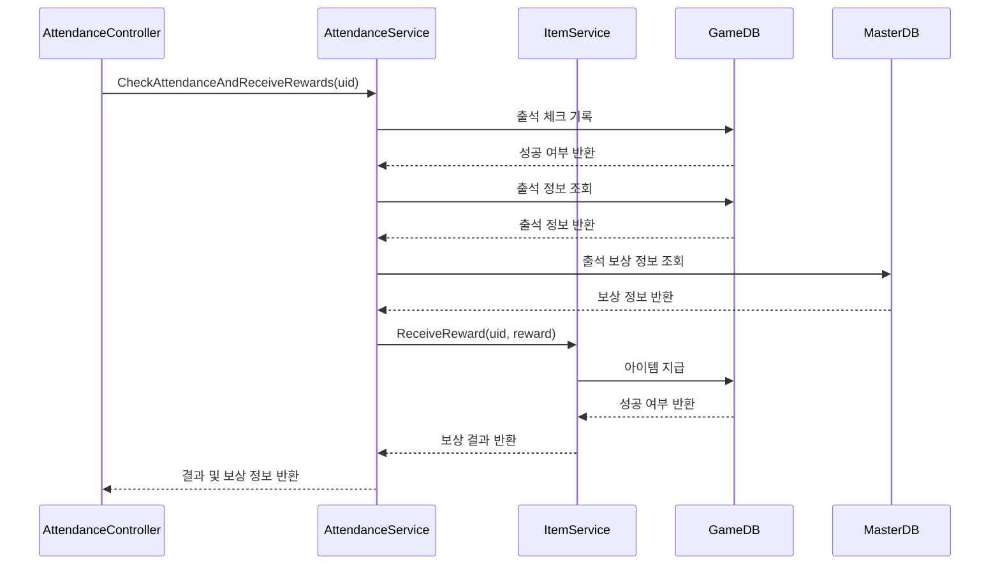
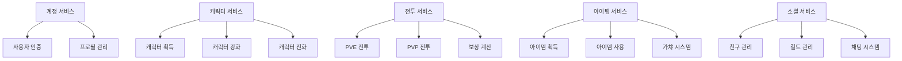

# Chapter 4: 게임 기능 서비스

[이전 장](03_서비스_계층_패턴_.md)에서는 서비스 계층 패턴의 기본 개념과 구현 방법에 대해 배웠습니다. 서비스 계층이 게임 서버의 핵심 비즈니스 로직을 담당한다는 것을 알게 되었습니다. 이번 장에서는 구체적인 **게임 기능 서비스**들에 대해 자세히 알아보겠습니다.

## 게임 기능 서비스란 무엇인가요?

게임 기능 서비스는 게임에서 사용자가 직접 경험하는 다양한 기능을 구현하는 서비스입니다. 예를 들어, 친구 추가하기, 메일 확인하기, 출석 체크하기, 아이템 사용하기 등의 기능을 담당합니다.

쉽게 이해하기 위해 백화점을 생각해보세요:
- **백화점**: 전체 게임 서버
- **각 부서(화장품, 의류, 가전제품 등)**: 각 게임 기능 서비스
- **부서별 전문 직원**: 각 서비스의 기능을 처리하는 메서드
- **부서 간 협력**: 서비스 간 상호작용

백화점에서 각 부서가 자신의 전문 영역을 담당하듯, 게임 서버에서도 각 서비스가 특정 기능을 전문적으로 처리합니다.

## 주요 게임 기능 서비스 종류

일반적인 게임에서 볼 수 있는 주요 서비스들을 살펴보겠습니다:

1. **계정 서비스(Account Service)**: 사용자 등록, 로그인, 인증 관리
2. **출석 서비스(Attendance Service)**: 일일 출석 체크 및 보상 관리
3. **친구 서비스(Friend Service)**: 친구 추가, 삭제, 목록 조회
4. **메일 서비스(Mail Service)**: 메일 발송, 수신, 보상 수령
5. **아이템 서비스(Item Service)**: 아이템 획득, 사용, 관리
6. **인벤토리 서비스(Inventory Service)**: 소지 아이템 관리
7. **상점 서비스(Shop Service)**: 아이템 구매, 판매
8. **랭킹 서비스(Ranking Service)**: 사용자 랭킹 정보 관리

## 출석 서비스(Attendance Service) 살펴보기

가장 먼저 출석 서비스(AttendanceService)를 살펴보겠습니다. 이 서비스는 사용자의 일일 출석을 체크하고 보상을 제공하는 기능을 담당합니다.

### 출석 서비스 인터페이스

```csharp
public interface IAttendanceService
{
    // 출석 정보 조회
    Task<(ErrorCode, GdbAttendanceInfo)> GetAttendanceInfo(int uid);
    
    // 출석 체크 및 보상 수령
    Task<(ErrorCode, List<ReceivedReward>)> CheckAttendanceAndReceiveRewards(int uid);
}
```

이 인터페이스는 출석 서비스가 제공하는, 출석 정보 조회와 출석 체크 두 가지 주요 기능을 정의합니다. 인터페이스를 통해 서비스의 책임이 무엇인지 명확히 알 수 있습니다.

### 출석 정보 조회 구현

```csharp
public async Task<(ErrorCode, GdbAttendanceInfo)> GetAttendanceInfo(int uid)
{
    try
    {
        return (ErrorCode.None, await _gameDb.GetAttendanceById(uid));
    }
    catch (Exception e)
    {
        _logger.ZLogError(e, $"[Attendance.GetAttendance] 오류: {uid}");
        return (ErrorCode.AttendanceInfoFailException, null);
    }
}
```

이 메서드는 사용자의 출석 정보를 데이터베이스에서 조회합니다. 정상적으로 처리되면 출석 정보와 함께 `ErrorCode.None`을 반환하고, 오류가 발생하면 예외를 로깅하고 적절한 오류 코드를 반환합니다.

### 출석 체크 및 보상 수령 구현

출석 체크 기능의 핵심 부분을 살펴보겠습니다:

```csharp
// 출석 체크 기록 저장
var rowCount = await _gameDb.CheckAttendanceById(uid);
if (rowCount != 1)
{
    return (ErrorCode.AttendanceCheckFailAlreadyChecked, null);
}

// 출석 정보 가져오기
var attendanceInfo = await _gameDb.GetAttendanceById(uid);
var attendanceCnt = attendanceInfo.attendance_cnt;
```

이 코드는 사용자의 출석을 기록하고, 성공적으로 저장되었는지 확인합니다. 이미 오늘 출석했다면 적절한 오류 코드를 반환합니다. 그 후 현재 출석 횟수를 가져옵니다.

```csharp
// 출석 보상 찾기
var reward = _masterDb._attendanceRewardList.Find(r => r.day_seq == attendanceCnt);

// 보상 지급
await _itemService.ReceiveReward(uid, reward);
totalRewards.Add(new ReceivedReward(reward.reward_key, [reward]));
```

여기서는 마스터 데이터에서 해당 출석 일수에 맞는 보상을 찾아 지급합니다. 아이템 서비스(`_itemService`)를 호출하여 실제 보상 지급 로직을 위임하는 것을 볼 수 있습니다.

## 친구 서비스(Friend Service) 살펴보기

친구 서비스는 사용자 간의 친구 관계를 관리하는 기능을 담당합니다.

### 친구 요청 보내기

```csharp
public async Task<ErrorCode> SendFriendReq(int uid, int friendUid)
{
    try
    {
        // 자기 자신에게 친구 요청 불가
        if (uid == friendUid)
        {
            return ErrorCode.FriendAcceptFailSameUid;
        }

        // 상대방 유저 존재 여부 확인
        GdbUserInfo userInfo = await _gameDb.GetUserByUid(friendUid);
        if (userInfo is null)
        {
            return ErrorCode.FriendSendReqFailUserNotExist;
        }
```

이 코드는 친구 요청 기능의 시작 부분으로, 자기 자신에게 요청을 보내는지, 상대방이 존재하는 사용자인지 확인합니다. 이러한 검증은 서비스 계층에서 처리해야 할 중요한 비즈니스 로직입니다.

### 친구 요청 수락 구현

친구 요청을 수락하는 로직은 트랜잭션을 사용해 데이터 일관성을 유지합니다:

```csharp
async Task<ErrorCode> AcceptRequest(int uid, int friendUid)
{
    var transaction = _gameDb.GDbConnection().BeginTransaction();
    try
    {
        // 친구 관계 생성 (A->B)
        var rowCount = await _gameDb.InsertFriendReq(uid, friendUid, transaction, true);
        
        // 친구 관계 업데이트 (B->A)
        rowCount = await _gameDb.UpdateFriendReqAccept(uid, friendUid, transaction, true);
        
        transaction.Commit();
        return ErrorCode.None;
    }
```

이 메서드는 트랜잭션을 사용하여 양방향 친구 관계를 설정합니다. 한 쪽이 실패하면 모든 변경사항이 롤백되어 데이터 일관성이 유지됩니다. 게임에서는 이처럼 여러 작업이 하나의 단위로 처리되어야 하는 경우가 많습니다.

## 메일 서비스(Mail Service) 살펴보기

메일 서비스는 게임 내 메일 시스템을 관리하는 기능을 담당합니다. 메일은 보통 공지사항이나 보상 전달에 사용됩니다.

### 메일 목록 조회

```csharp
public async Task<(ErrorCode,List<UserMailInfo>)> GetMailList(int uid)
{
    try
    {
        List<UserMailInfo> userMailInfoList = new();
        
        // 메일 목록 조회
        var mailList = await _gameDb.GetMailList(uid);
        foreach (var mail in mailList)
        {
            UserMailInfo userMailInfo = new();
            userMailInfo.MailInfo = mail;
            userMailInfo.MailItems = await _gameDb.GetMailRewardList(mail.mail_seq);
            userMailInfoList.Add(userMailInfo);
        }
```

이 코드는 특정 사용자의 메일 목록과 각 메일에 포함된 보상 정보를 함께 조회합니다. 메일마다 보상 정보를 추가로 조회하여 클라이언트에 필요한 모든 정보를 제공합니다.

### 메일 보상 수령

```csharp
// 메일 보상 수령
foreach (var reward in mailRewards)
{
    // 보상 유형에 따른 처리
    if (reward.reward_type == "gacha")
    {
        // 가챠 보상 처리
        var (errorCode, rewards) = await _itemService.ReceiveOneGacha(uid, reward.reward_key);
        totalRewards.Add(new ReceivedReward(reward.reward_key, rewards));
    }
    else
    {
        // 일반 보상 처리
        await _itemService.ReceiveReward(uid, reward);
        totalRewards.Add(new ReceivedReward(reward.reward_key, [reward]));
    }
}
```

메일 보상 수령 시 보상 유형에 따라 다르게 처리합니다. 일반 아이템은 바로 지급하고, 가챠 보상은 아이템 서비스의 가챠 기능을 호출합니다. 서비스 간의 협력을 통해 복잡한 기능을 구현하는 좋은 예시입니다.

## 아이템 서비스(Item Service) 살펴보기

아이템 서비스는 게임 내 다양한 아이템의 획득, 사용, 관리를 담당합니다.

### 가챠(뽑기) 기능 구현

```csharp
public async Task<(ErrorCode,List<RewardData>)> ReceiveOneGacha(int uid, int gachaKey)
{
    try
    {
        List<RewardData> rewardDatas = [];

        // 가챠 정보 가져오기
        var gacha = _masterDb._gachaRewardList.Find(item => 
                   item.gachaRewardInfo.gacha_reward_key == gachaKey);
        
        // 가챠 확률을 위한 총합 계산
        var totalPercent = gacha.gachaRewardInfo.char_prob_percent
                         + gacha.gachaRewardInfo.skin_prob_percent 
                         + gacha.gachaRewardInfo.costume_prob_percent;
```

이 코드는 가챠(뽑기) 기능의 시작 부분입니다. 마스터 데이터에서 해당 가챠의 정보를 가져오고, 각 아이템 유형별 확률의 총합을 계산합니다.

```csharp
// 랜덤 뽑기
var randomPoint = new Random().Next(1, totalPercent + 1);
for (int j = 0; j < probs.Length; j++)
{
    if (randomPoint <= probs[j])
    {
        // 해당 유형의 아이템 중 하나 선택
        var rewards = gacha.gachaRewardList.FindAll(item => item.reward_type == types[j]);
        var randomIndex = new Random().Next(0, rewards.Count);
        var reward = rewards[randomIndex];
        
        // 보상 지급
        await _itemService.ReceiveReward(uid, reward);
        rewardDatas.Add(reward);
        break;
    }
    randomPoint -= probs[j];
}
```

이 부분은 실제 가챠 아이템을 랜덤으로 뽑는 로직입니다. 먼저 전체 확률 범위 내에서 랜덤 값을 생성하고, 각 아이템 유형의 확률에 따라 어떤 유형의 아이템을 뽑을지 결정합니다. 그 후 선택된 유형 내에서 다시 랜덤으로 특정 아이템을 선택합니다.

## 서비스 간 협력 이해하기

게임 기능 서비스들은 독립적으로 작동하지만, 복잡한 기능 구현을 위해 서로 협력하기도 합니다. 다음 시퀀스 다이어그램은 출석 체크 보상 수령 과정에서의 서비스 간 협력을 보여줍니다:



이 다이어그램에서 볼 수 있듯이, 출석 체크 기능은 여러 서비스와 데이터베이스 간의 상호작용으로 구현됩니다:

1. 컨트롤러가 출석 서비스를 호출합니다.
2. 출석 서비스는 데이터베이스에 출석 기록을 저장하고 정보를 조회합니다.
3. 마스터 데이터에서 보상 정보를 확인합니다.
4. 아이템 서비스를 호출하여 보상을 지급합니다.
5. 결과를 컨트롤러에 반환합니다.

## 서비스 구현 시 고려사항

게임 기능 서비스를 구현할 때 다음 사항들을 고려해야 합니다:

1. **단일 책임 원칙**: 각 서비스는 하나의 기능 영역만 담당해야 합니다.
2. **명확한 인터페이스**: 서비스가 제공하는 기능을 명확하게 정의합니다.
3. **예외 처리**: 모든 예외 상황을 고려하고 적절한 오류 코드를 반환합니다.
4. **서비스 간 협력**: 복잡한 기능은 여러 서비스의 협력으로 구현합니다.
5. **재사용성**: 자주 사용되는 로직은 공통 서비스로 분리합니다.
6. **확장성**: 향후 기능 확장을 고려한 설계가 필요합니다.

## 실제 게임에서의 서비스 구성 예시

실제 모바일 RPG 게임에서는 다음과 같이 서비스를 구성할 수 있습니다:



이처럼 게임의 각 영역을 담당하는 서비스들이 세부 기능을 구현하고, 이들이 모여 전체 게임 시스템을 구성합니다.

## 게임 서비스 의존성 관리

게임 서비스 간의 의존성을 관리하는 것은 매우 중요합니다. 다음은 의존성 주입을 통해 서비스를 등록하는 예시입니다:

```csharp
// Startup.cs의 ConfigureServices 메서드
public void ConfigureServices(IServiceCollection services)
{
    // 서비스 등록
    services.AddSingleton<IMasterDb, MasterDb>();
    services.AddScoped<IGameDb, GameDb>();
    services.AddScoped<IMemoryDb, MemoryDb>();
    
    // 기능 서비스 등록
    services.AddScoped<IAccountService, AccountService>();
    services.AddScoped<IAttendanceService, AttendanceService>();
    services.AddScoped<IFriendService, FriendService>();
    services.AddScoped<IMailService, MailService>();
    services.AddScoped<IItemService, ItemService>();
}
```

이 코드는 [종속성 주입 패턴](10_종속성_주입_패턴_.md)을 사용하여 게임의 각 서비스를 등록합니다. `AddScoped`는 각 HTTP 요청마다 새 인스턴스가 생성됨을 의미하며, 게임 API 서버에서는 대부분의 서비스가 이 방식으로 등록됩니다.

## 실제 코드에서의 서비스 사용 예시

컨트롤러에서 서비스를 어떻게 사용하는지 살펴보겠습니다:

```csharp
// AttendanceCheckController.cs
[ApiController]
[Route("[controller]")]
public class AttendanceCheckController : ControllerBase
{
    readonly IAttendanceService _attendanceService;
    
    public AttendanceCheckController(IAttendanceService attendanceService)
    {
        _attendanceService = attendanceService;
    }
    
    [HttpPost]
    public async Task<AttendanceCheckResponse> CheckAttendance([FromHeader] Header header)
    {
        AttendanceCheckResponse response = new();
        
        (response.Result, response.Rewards) = 
            await _attendanceService.CheckAttendanceAndReceiveRewards(header.Uid);
            
        return response;
    }
}
```

이 코드는 [컨트롤러 패턴](01_컨트롤러_패턴_.md)에 따라 구현된 출석 체크 컨트롤러입니다. 컨트롤러는 생성자를 통해 출석 서비스를 주입받고, API 요청이 들어오면 서비스의 메서드를 호출하여 실제 비즈니스 로직을 처리합니다.

## 요약 및 다음 단계

이 장에서는 게임 기능 서비스의 개념과 구현 방법에 대해 배웠습니다. 게임 기능 서비스는 게임의 주요 기능을 구현하는 서비스들로, 백화점의 각 부서처럼 특정 영역을 전문적으로 담당합니다. 출석, 친구, 메일, 아이템 등 다양한 서비스들이 서로 협력하여 전체 게임 시스템을 구성하게 됩니다.

게임 기능 서비스를 올바르게 설계하고 구현하면 코드의 유지보수성, 확장성, 재사용성이 크게 향상됩니다. 각 서비스는 단일 책임 원칙에 따라 하나의 기능 영역만 담당하며, 필요에 따라 다른 서비스와 협력하여 복잡한 기능을 구현합니다.

이러한 서비스들이 데이터에 접근하기 위해서는 [리포지토리 패턴](05_리포지토리_패턴_.md)을 사용합니다. 다음 장에서는 서비스가 데이터베이스와 어떻게 상호작용하는지 자세히 알아보겠습니다.

---

Generated by [AI Codebase Knowledge Builder](https://github.com/The-Pocket/Tutorial-Codebase-Knowledge)