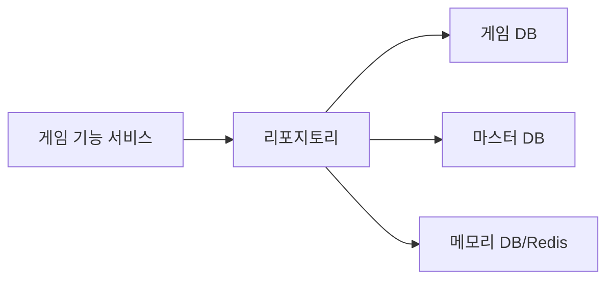
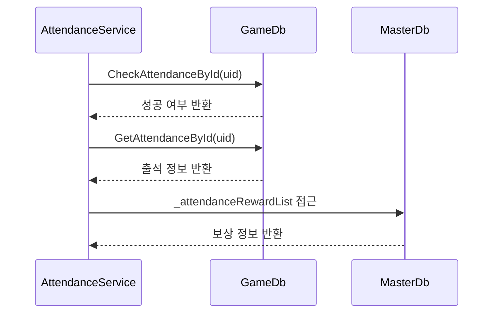
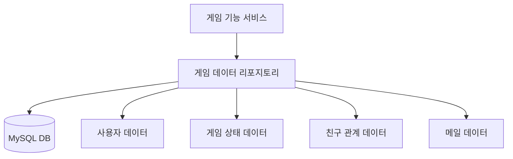
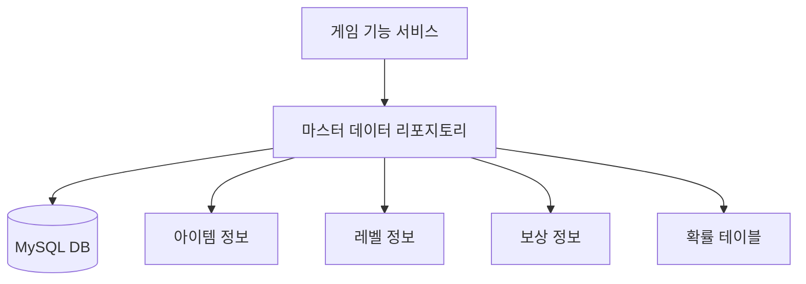
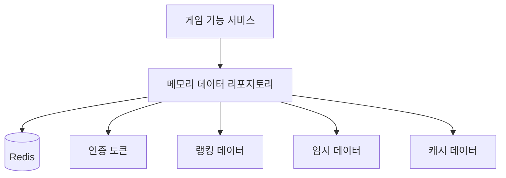

# Chapter 5: 리포지토리 패턴

[이전 장](04_게임_기능_서비스_.md)에서는 게임 기능 서비스에 대해 배웠습니다. 이러한 서비스들이 실제로 데이터를 어디서 가져오고 어떻게 저장할까요? 이번 장에서는 **리포지토리 패턴**에 대해 알아보겠습니다.

## 리포지토리 패턴이란 무엇인가요?

리포지토리 패턴은 데이터 접근 로직을 추상화하는 디자인 패턴입니다. 쉽게 말해, 데이터가 어디에 어떻게 저장되어 있는지 숨기고 애플리케이션에 일관된 인터페이스를 제공하는 것입니다.

도서관을 예로 들어볼까요? 당신이 특정 책을 찾고 싶다면, 직접 모든 책장을 돌아다니며 찾지 않습니다. 대신 사서(리포지토리)에게 책 제목을 알려주면, 사서가 책이 어디 있는지 찾아서 가져다 줍니다. 당신은 책이 어디에 있는지, 어떻게 분류되어 있는지 알 필요가 없습니다.



## 리포지토리 패턴의 이점

리포지토리 패턴을 사용하면 다음과 같은 이점이 있습니다:

1. **데이터 접근 추상화**: 데이터가 어디에 저장되어 있는지 숨깁니다.
2. **코드 재사용**: 동일한 데이터 접근 코드를 여러 곳에서 반복하지 않아도 됩니다.
3. **유지보수성 향상**: 데이터베이스 구조가 변경되어도 리포지토리만 수정하면 됩니다.
4. **테스트 용이성**: 실제 데이터베이스 없이도 테스트할 수 있습니다.

## GameAPIServer_Template의 리포지토리 구조

우리 프로젝트에서는 세 가지 주요 리포지토리를 사용합니다:

1. **게임 데이터 리포지토리(`IGameDb`)**: 사용자, 친구, 메일 등 게임 내 데이터를 저장
2. **마스터 데이터 리포지토리(`IMasterDb`)**: 아이템, 보상, 설정 등 게임의 기준 데이터를 저장
3. **메모리 데이터 리포지토리(`IMemoryDb`)**: 자주 접근하는 데이터를 빠르게 조회하기 위한 캐시 저장소

각 리포지토리는 인터페이스로 정의되어 있어, 실제 구현체를 교체하기 쉽습니다.

## 리포지토리 인터페이스 살펴보기

먼저 게임 데이터 리포지토리 인터페이스를 살펴보겠습니다:

```csharp
public interface IGameDb
{
    // 사용자 관련 메서드
    public Task<GdbUserInfo> GetUserByUid(int uid);
    public Task<int> UpdateRecentLogin(int uid);
    
    // 친구 관련 메서드
    public Task<GdbFriendInfo> GetFriendReqInfo(int uid, int friendUid);
    
    // 메일 관련 메서드
    public Task<IEnumerable<GdbMailboxInfo>> GetMailList(int uid);
}
```

위 코드는 `IGameDb` 인터페이스의 일부 메서드를 보여줍니다. 인터페이스는 데이터에 접근하는 방법을 정의하지만, 실제로 어떻게 구현할지는 구체적인 클래스에 맡깁니다.

마스터 데이터 리포지토리 인터페이스도 살펴볼까요?

```csharp
public interface IMasterDb
{
    // 마스터 데이터 속성들
    public VersionDAO _version { get; }
    public List<AttendanceRewardData> _attendanceRewardList { get; }    
    public List<GachaRewardData> _gachaRewardList { get; }
    
    // 데이터 로드 메서드
    public Task<bool> Load();
}
```

마스터 데이터는 주로 게임의 설정 값이나 상수 데이터를 포함합니다. 예를 들어, 출석 보상 정보나 가챠 확률 등이 여기에 해당합니다.

마지막으로 메모리 데이터 리포지토리 인터페이스를 살펴보겠습니다:

```csharp
public interface IMemoryDb
{
    // 인증 관련 메서드
    public Task<ErrorCode> RegistUserAsync(string token, Int64 uid);
    public Task<ErrorCode> CheckUserAuthAsync(string id, string authToken);
    
    // 랭킹 관련 메서드
    public Task<ErrorCode> SetUserScore(Int64 uid, int score);
    public Task<(ErrorCode, List<RankData>)> GetTopRanking();
}
```

메모리 데이터 리포지토리는 Redis와 같은 고속 캐시를 사용하여 자주 접근하는 데이터(예: 인증 정보, 랭킹)를 빠르게 조회할 수 있게 합니다.

## 리포지토리 구현체 살펴보기

이제 게임 데이터 리포지토리의 실제 구현을 살펴보겠습니다:

```csharp
public partial class GameDb : IGameDb
{
    readonly ILogger<GameDb> _logger;
    readonly IOptions<DbConfig> _dbConfig;
    IDbConnection _dbConn;
    QueryFactory _queryFactory;
    
    // 생성자
    public GameDb(ILogger<GameDb> logger, IOptions<DbConfig> dbConfig)
    {
        _dbConfig = dbConfig;
        _logger = logger;
        Open();
        _compiler = new SqlKata.Compilers.MySqlCompiler();
        _queryFactory = new SqlKata.Execution.QueryFactory(_dbConn, _compiler);
    }
}
```

위 코드는 `GameDb` 클래스의 생성자 부분입니다. 여기서는 데이터베이스 연결을 설정하고 SQL 쿼리를 실행하기 위한 `QueryFactory`를 초기화합니다.

실제 사용자 정보를 가져오는 메서드를 살펴보겠습니다:

```csharp
public async Task<GdbUserInfo> GetUserByUid(int uid)
{
    return await _queryFactory.Query("user")
                            .Where("uid", uid)
                            .FirstOrDefaultAsync<GdbUserInfo>();
}
```

이 메서드는 사용자 ID(`uid`)를 받아 해당 사용자의 정보를 데이터베이스에서 조회합니다. SQL 쿼리를 직접 작성하는 대신, `QueryFactory`를 사용하여 객체 지향적으로 쿼리를 구성합니다.

메모리 데이터 리포지토리의 구현도 살펴보겠습니다:

```csharp
public async Task<(ErrorCode, List<RankData>)> GetTopRanking()
{
    try
    {
        List<RankData> ranking = new();
        var set = new RedisSortedSet<int>(_redisConn, "user-ranking", null);
        var rankDatas = await set.RangeByRankWithScoresAsync(0, 100, 
                          order: StackExchange.Redis.Order.Descending);
        
        // 랭킹 데이터 처리...
        return (ErrorCode.None, ranking);
    }
    catch (Exception e)
    {
        _logger.ZLogError(e, $"[GetUserRanking] 오류 발생");
        return (ErrorCode.GetRankingFailException, null);
    }
}
```

이 메서드는 Redis에 저장된 사용자 점수를 기반으로 상위 랭킹을 조회합니다. Redis의 Sorted Set 기능을 활용하여 효율적으로 랭킹 데이터를 관리합니다.

## 리포지토리 사용 예시

이제 서비스 계층에서 리포지토리를 어떻게 사용하는지 살펴보겠습니다:

```csharp
public class AttendanceService : IAttendanceService
{
    readonly IGameDb _gameDb;
    readonly IMasterDb _masterDb;
    
    public AttendanceService(IGameDb gameDb, IMasterDb masterDb)
    {
        _gameDb = gameDb;
        _masterDb = masterDb;
    }
    
    public async Task<(ErrorCode, List<ReceivedReward>)> CheckAttendanceAndReceiveRewards(int uid)
    {
        // 출석 체크
        var rowCount = await _gameDb.CheckAttendanceById(uid);
        
        // 출석 정보 가져오기
        var attendanceInfo = await _gameDb.GetAttendanceById(uid);
        
        // 보상 찾기
        var reward = _masterDb._attendanceRewardList.Find(r => 
                    r.day_seq == attendanceInfo.attendance_cnt);
        
        // 나머지 로직...
    }
}
```

위 코드에서 `AttendanceService`는 두 개의 리포지토리(`_gameDb`와 `_masterDb`)를 사용합니다. 생성자를 통해 의존성을 주입받고, 메서드 내에서 리포지토리의 메서드를 호출하여 데이터에 접근합니다.

이처럼 서비스 계층은 리포지토리 인터페이스를 통해 데이터에 접근하며, 실제 데이터가 어디에 어떻게 저장되어 있는지는 알 필요가 없습니다.

## 리포지토리 호출 흐름

출석 체크 기능을 예로 들어, 리포지토리 호출 흐름을 시퀀스 다이어그램으로 표현해보겠습니다:



위 다이어그램은 출석 체크와 보상 조회 과정을 보여줍니다. 서비스는 필요한 데이터를 여러 리포지토리에서 조회하고 처리합니다.

## 리포지토리와 트랜잭션 처리

여러 데이터 작업을 하나의 단위로 처리해야 할 때는 트랜잭션을 사용합니다. 예를 들어, 친구 추가 기능에서는 양방향 친구 관계를 설정해야 합니다:

```csharp
public async Task<ErrorCode> AcceptFriendRequest(int uid, int friendUid)
{
    var transaction = _gameDb.GDbConnection().BeginTransaction();
    try
    {
        // A->B 친구 관계 생성
        await _gameDb.InsertFriendReq(uid, friendUid, transaction, true);
        
        // B->A 친구 관계 업데이트
        await _gameDb.UpdateFriendReqAccept(uid, friendUid, transaction, true);
        
        transaction.Commit();
        return ErrorCode.None;
    }
    catch
    {
        transaction.Rollback();
        return ErrorCode.FriendAcceptFailException;
    }
}
```

위 코드에서는 트랜잭션을 시작하고, 친구 관계를 양방향으로 설정한 후, 모든 작업이 성공하면 트랜잭션을 커밋합니다. 실패하면 `Rollback`을 호출하여 변경사항을 취소합니다.

## 각 리포지토리의 역할

세 가지 리포지토리는 각각 다른 역할과 특징을 가지고 있습니다:

### 1. 게임 데이터 리포지토리 (GameDb)



- **역할**: 게임 내 모든 동적 데이터(사용자 정보, 친구 관계, 메일 등)를 저장하고 관리
- **저장소**: 주로 MySQL과 같은 관계형 데이터베이스
- **특징**: 데이터 변경이 빈번하며, 트랜잭션 처리가 중요함

### 2. 마스터 데이터 리포지토리 (MasterDb)



- **역할**: 게임의 기준 데이터(아이템 정보, 레벨업 필요 경험치, 보상 정보 등)를 저장
- **저장소**: 관계형 데이터베이스에 저장하되, 서버 시작 시 메모리에 로드하여 사용
- **특징**: 읽기 전용이며, 변경이 드물고, 서버가 실행 중일 때는 메모리에 캐싱됨

### 3. 메모리 데이터 리포지토리 (MemoryDb)



- **역할**: 자주 접근하는 데이터나 임시 데이터를 고속으로 저장하고 조회
- **저장소**: Redis와 같은 인메모리 데이터베이스
- **특징**: 빠른 접근 속도, 만료 시간 설정 가능, 서버 재시작 시 데이터 손실 가능성

## 리포지토리 패턴 구현 가이드라인

효과적인 리포지토리 패턴 구현을 위한 몇 가지 가이드라인을 소개합니다:

1. **인터페이스와 구현체 분리**: 모든 리포지토리는 인터페이스로 정의하고, 구현체는 별도 클래스로 작성합니다.
2. **단일 책임 원칙**: 각 리포지토리는 하나의 데이터 저장소에 대한 책임만 가집니다.
3. **의존성 주입**: 리포지토리는 서비스에 의존성 주입을 통해 제공합니다.
4. **예외 처리**: 데이터 접근 과정에서 발생하는 예외를 적절히 처리하고 로깅합니다.
5. **트랜잭션 관리**: 원자성이 필요한 작업은 트랜잭션 내에서 처리합니다.
6. **응답 타입 통일**: 모든 메서드는 일관된 형식으로 결과를 반환합니다(예: 튜플 또는 객체).

## 리포지토리 패턴의 실제 활용

출석 체크 기능을 예로 들어, 리포지토리 패턴이 실제로 어떻게 활용되는지 살펴보겠습니다:

```csharp
// AttendanceService.cs
public async Task<(ErrorCode, List<ReceivedReward>)> CheckAttendanceAndReceiveRewards(int uid)
{
    try
    {
        // 게임 DB에서 출석 체크
        var rowCount = await _gameDb.CheckAttendanceById(uid);
        if (rowCount != 1)
        {
            return (ErrorCode.AttendanceCheckFailAlreadyChecked, null);
        }
        
        // 게임 DB에서 출석 정보 조회
        var attendanceInfo = await _gameDb.GetAttendanceById(uid);
        
        // 마스터 DB에서 보상 정보 조회
        var reward = _masterDb._attendanceRewardList.Find(r => 
                    r.day_seq == attendanceInfo.attendance_cnt);
                    
        // 보상 지급 로직...
        return (ErrorCode.None, totalRewards);
    }
    catch (Exception e)
    {
        _logger.ZLogError(e, $"[Attendance.CheckAttendance] 오류: {uid}");
        return (ErrorCode.AttendanceCheckFailException, null);
    }
}
```

이 메서드는 다음과 같이 리포지토리를 활용합니다:

1. `_gameDb.CheckAttendanceById(uid)`: 게임 데이터 리포지토리를 사용하여 출석 체크를 기록합니다.
2. `_gameDb.GetAttendanceById(uid)`: 게임 데이터 리포지토리에서 사용자의 출석 정보를 조회합니다.
3. `_masterDb._attendanceRewardList`: 마스터 데이터 리포지토리에서 출석 보상 정보를 조회합니다.

각 리포지토리는 자신의 책임 영역에 맞는 데이터 접근 기능을 제공하고, 서비스는 이들을 조합하여 비즈니스 로직을 구현합니다.

## 리포지토리 패턴과 캐싱 전략

[데이터 캐싱 시스템](06_데이터_캐싱_시스템_.md)에서 더 자세히 다룰 내용이지만, 리포지토리 패턴은 캐싱 전략과 함께 사용되어 성능을 최적화할 수 있습니다:

```csharp
public async Task<GdbUserInfo> GetUserByUid(int uid)
{
    // 캐시에서 먼저 조회 시도
    var cachedUser = await _memoryDb.GetUserFromCache(uid);
    if (cachedUser != null)
    {
        return cachedUser;
    }
    
    // 캐시에 없으면 데이터베이스에서 조회
    var user = await _queryFactory.Query("user")
                                .Where("uid", uid)
                                .FirstOrDefaultAsync<GdbUserInfo>();
    
    // 조회 결과를 캐시에 저장
    if (user != null)
    {
        await _memoryDb.SetUserToCache(uid, user);
    }
    
    return user;
}
```

이런 방식으로 자주 조회되는 데이터는 캐시에 저장하여 데이터베이스 부하를 줄이고 응답 속도를 높일 수 있습니다.

## 요약 및 다음 단계

이 장에서는 리포지토리 패턴에 대해 배웠습니다. 리포지토리 패턴은 데이터 접근 로직을 추상화하여, 데이터가 어디에 어떻게 저장되어 있는지 숨기고 일관된 인터페이스를 제공합니다. 마치 도서관의 사서가 책의 위치를 알려주듯이, 리포지토리는 필요한 데이터를 어디서 가져와야 하는지 알고 있습니다.

우리의 게임 서버 템플릿에서는 세 가지 주요 리포지토리(게임 데이터, 마스터 데이터, 메모리 데이터)를 사용하여 각기 다른 유형의 데이터를 관리합니다. 이러한 분리는 코드의 유지보수성과 확장성을 크게 향상시킵니다.

리포지토리 패턴은 [서비스 계층 패턴](03_서비스_계층_패턴_.md)과 밀접하게 연관되어 있습니다. 서비스 계층은 리포지토리를 통해 데이터에 접근하고, 비즈니스 로직을 수행합니다. 또한, [데이터 캐싱 시스템](06_데이터_캐싱_시스템_.md)과도 연계되어 성능을 최적화할 수 있습니다.

리포지토리 패턴을 잘 활용하면, 데이터 접근 코드의 중복을 줄이고, 데이터베이스 구조 변경 시의 영향을 최소화할 수 있습니다. 또한, 테스트 용이성도 크게 향상됩니다.

다음 장인 [데이터 캐싱 시스템](06_데이터_캐싱_시스템_.md)에서는 게임 서버의 성능을 향상시키기 위한 캐싱 전략에 대해 자세히 알아보겠습니다.

---

Generated by [AI Codebase Knowledge Builder](https://github.com/The-Pocket/Tutorial-Codebase-Knowledge)