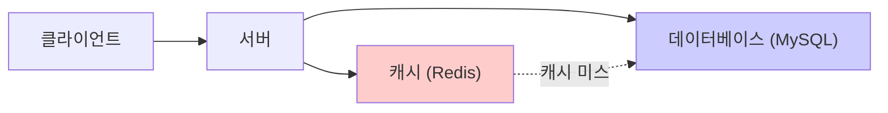
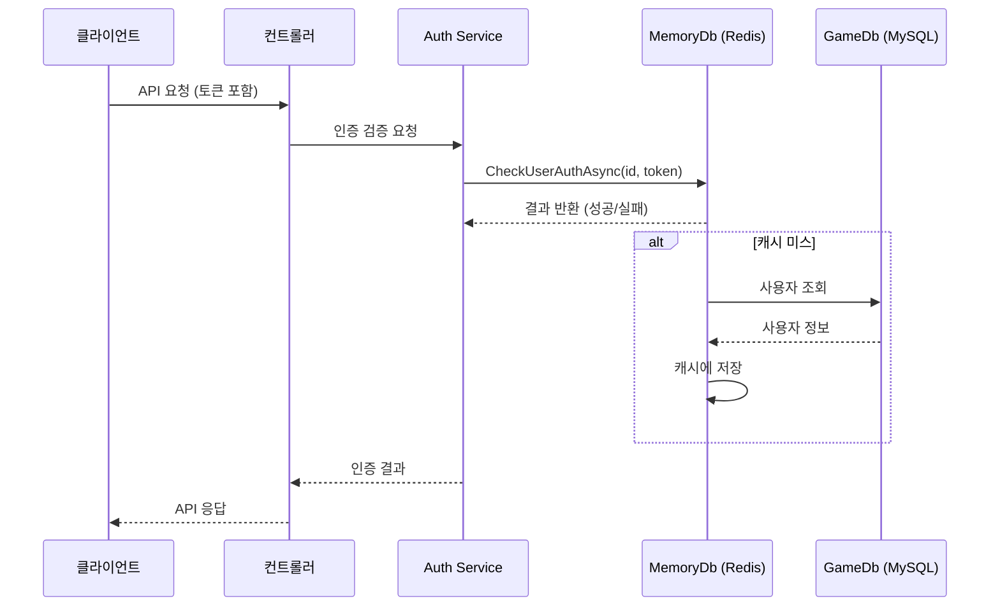
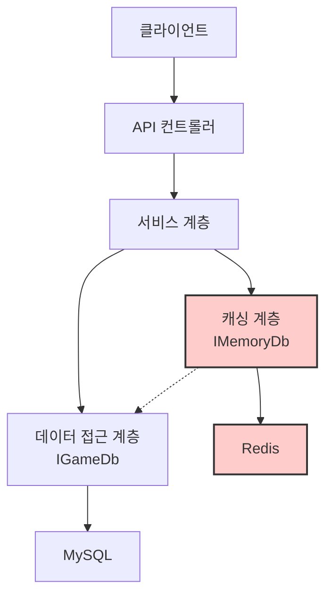

# Chapter 6: 데이터 캐싱 시스템

[이전 장](05_리포지토리_패턴_.md)에서는 게임 서버에서 데이터에 접근하기 위한 리포지토리 패턴에 대해 배웠습니다. 그런데 데이터베이스 접근이 너무 빈번하면 서버 성능이 저하될 수 있습니다. 이번 장에서는 이 문제를 해결하기 위한 **데이터 캐싱 시스템**에 대해 알아보겠습니다.

## 데이터 캐싱이란 무엇인가요?

데이터 캐싱은 자주 사용하는 데이터를 메모리에 임시로 저장하여, 필요할 때 데이터베이스가 아닌 메모리에서 빠르게 가져오는 기술입니다.

일상생활에서 비유하자면, 요리를 할 때 냉장고(데이터베이스)에서 재료를 매번 꺼내는 대신, 자주 쓰는 소금이나 후추 같은 양념은 작업대(메모리) 위에 올려두는 것과 같습니다. 멀리 있는 냉장고에 가서 양념을 꺼낼 필요 없이, 바로 손이 닿는 곳에서 재료를 사용할 수 있어 요리 속도가 빨라집니다.



## 왜 데이터 캐싱이 필요한가요?

게임 서버에서 데이터 캐싱이 필요한 이유는 다음과 같습니다:

1. **응답 속도 향상**: 메모리 접근은 디스크 접근보다 훨씬 빠릅니다.
2. **데이터베이스 부하 감소**: 반복적인 쿼리를 줄여 데이터베이스 서버의 부담을 덜어줍니다.
3. **동시 접속자 처리 능력 향상**: 더 많은 사용자 요청을 빠르게 처리할 수 있습니다.
4. **비용 효율성**: 데이터베이스 서버 증설 없이도 성능을 개선할 수 있습니다.

## Redis란 무엇인가요?

우리 프로젝트에서는 **Redis**라는 인메모리 데이터 저장소를 캐싱 솔루션으로 사용합니다. Redis는 다음과 같은 특징을 가지고 있습니다:

1. **빠른 속도**: 모든 데이터를 메모리에 저장하여 매우 빠른 읽기/쓰기 속도를 제공합니다.
2. **다양한 데이터 구조**: 문자열, 해시, 리스트, 세트, 정렬된 세트 등 다양한 데이터 타입을 지원합니다.
3. **만료 시간 설정**: 데이터에 자동 만료 시간을 설정할 수 있습니다.
4. **원자적 연산**: 복잡한 작업을 단일 명령으로 처리할 수 있습니다.
5. **영속성**: 필요에 따라 데이터를 디스크에 저장할 수도 있습니다.

## 게임 서버에서의 캐싱 활용 사례

### 1. 사용자 인증 정보 캐싱

게임에서 사용자가 로그인하면, 인증 토큰을 Redis에 저장합니다. 이후 API 요청마다 데이터베이스 대신 Redis에서 빠르게 인증 정보를 확인할 수 있습니다.

```csharp
// 사용자 인증 정보를 Redis에 저장
public async Task<ErrorCode> RegistUserAsync(string token, Int64 uid)
{
    var key = MemoryDbKeyMaker.MakeUIDKey(uid.ToString());
    
    RdbAuthUserData user = new()
    {
        Uid = uid,
        Token = token
    };
    
    RedisString<RdbAuthUserData> redis = new(_redisConn, key, LoginTimeSpan());
    if (await redis.SetAsync(user, LoginTimeSpan()) == false)
    {
        return ErrorCode.LoginFailAddRedis;
    }
    
    return ErrorCode.None;
}
```

위 코드는 사용자 ID와 토큰을 Redis에 저장하는 메서드입니다. `MakeUIDKey`로 고유 키를 생성하고, `LoginTimeSpan()`으로 데이터 만료 시간을 설정합니다. 이렇게 하면 일정 시간이 지나면 자동으로 토큰이 만료됩니다.

### 2. 랭킹 데이터 캐싱

게임의 랭킹 시스템은 매우 자주 조회되지만, 변경은 상대적으로 적은 데이터입니다. 이런 데이터는 Redis의 Sorted Set을 활용해 효율적으로 관리할 수 있습니다.

```csharp
// 사용자 점수 저장
public async Task<ErrorCode> SetUserScore(Int64 uid, int score)
{
    var set = new RedisSortedSet<Int64>(_redisConn, "user-ranking", null);
    await set.AddAsync(uid, score);
    return ErrorCode.None;
}

// 상위 랭킹 조회
public async Task<(ErrorCode, List<RankData>)> GetTopRanking()
{
    List<RankData> ranking = new();
    var set = new RedisSortedSet<int>(_redisConn, "user-ranking", null);
    var rankDatas = await set.RangeByRankWithScoresAsync(0, 100, 
                     order: StackExchange.Redis.Order.Descending);
    
    // 랭킹 데이터 처리 로직...
    
    return (ErrorCode.None, ranking);
}
```

위 코드는 Redis의 Sorted Set을 활용해 사용자 점수를 저장하고, 상위 100명의 랭킹을 조회하는 메서드입니다. Sorted Set은 점수(score)를 기준으로 자동 정렬되어, 랭킹 시스템 구현에 최적화되어 있습니다.

## Redis 연결 설정하기

Redis를 사용하기 위해서는 먼저 연결을 설정해야 합니다. 우리 프로젝트에서는 `CloudStructures` 라이브러리를 사용하여 Redis와 통신합니다.

```csharp
public MemoryDb(ILogger<MemoryDb> logger, IOptions<DbConfig> dbConfig)
{
    _logger = logger;
    _dbConfig = dbConfig;
    
    // Redis 연결 설정
    RedisConfig config = new ("default", _dbConfig.Value.Redis);
    _redisConn = new RedisConnection(config);
}
```

이 코드는 `MemoryDb` 클래스의 생성자로, 설정 파일에서 Redis 연결 정보를 읽어 연결을 초기화합니다. 의존성 주입을 통해 로거와 설정을 주입받고 있습니다.

## 캐시 키 관리와 만료 시간

Redis에서는 키(key)를 사용하여 데이터를 식별합니다. 키 설계는 캐싱 시스템의 효율성에 큰 영향을 미치므로 중요합니다.

```csharp
public class MemoryDbKeyMaker
{
    const string loginUID = "UID_";
    const string userLockKey = "ULock_";

    public static string MakeUIDKey(string id)
    {
        return loginUID + id;
    }

    public static string MakeUserLockKey(string id)
    {
        return userLockKey + id;
    }
}
```

이 코드는 Redis 키를 생성하는 유틸리티 클래스입니다. 접두사를 사용하여 키의 용도를 명확히 구분하고, 충돌을 방지합니다.

캐시 데이터의 만료 시간도 중요한 설정입니다:

```csharp
public class RediskeyExpireTime
{
    public const ushort NxKeyExpireSecond = 3;
    public const ushort LoginKeyExpireMin = 60;
    public const ushort TicketKeyExpireSecond = 6000;
}

public TimeSpan LoginTimeSpan()
{
    return TimeSpan.FromMinutes(RediskeyExpireTime.LoginKeyExpireMin);
}
```

위 코드는 다양한 유형의 캐시 데이터에 대한 만료 시간을 정의합니다. 로그인 토큰은 60분, 임시 잠금 키는 3초 등으로 설정되어 있습니다.

## 인증 정보 검증 과정

사용자 인증 정보 검증이 캐싱 시스템을 통해 어떻게 처리되는지 살펴보겠습니다:



위 다이어그램은 인증 정보 검증 과정을 보여줍니다. 클라이언트가 API 요청을 보내면 컨트롤러는 인증 서비스를 통해 사용자 토큰을 검증합니다. 이때 MemoryDb(Redis)에서 먼저 토큰을 확인하고, 없는 경우에만 게임 데이터베이스에 접근합니다.

```csharp
public async Task<ErrorCode> CheckUserAuthAsync(string id, string token)
{
    var key = MemoryDbKeyMaker.MakeUIDKey(id);
    
    try
    {
        RedisString<RdbAuthUserData> redis = new(_redisConn, key, null);
        RedisResult<RdbAuthUserData> user = await redis.GetAsync();

        if (!user.HasValue)
        {
            return ErrorCode.CheckAuthFailNotExist;
        }

        if (user.Value.Uid.ToString() != id || user.Value.Token != token)
        {
            return ErrorCode.CheckAuthFailNotMatch;
        }
        
        return ErrorCode.None;
    }
    catch
    {
        return ErrorCode.CheckAuthFailException;
    }
}
```

이 메서드는 Redis에서 사용자 ID로 인증 정보를 조회하고, 토큰이 일치하는지 확인합니다. 캐시에 정보가 없거나 토큰이 일치하지 않으면 오류 코드를 반환합니다.

## 동시성 제어를 위한 잠금(Lock) 기능

게임 서버에서는 동일한 사용자의 중복 요청을 방지하기 위해 Redis를 이용한 잠금 기능도 활용합니다:

```csharp
public async Task<bool> LockUserReqAsync(string key)
{
    try
    {
        RedisString<RdbAuthUserData> redis = new(_redisConn, key, NxKeyTimeSpan());
        if (await redis.SetAsync(new RdbAuthUserData { }, 
            NxKeyTimeSpan(), StackExchange.Redis.When.NotExists) == false)
        {
            return false;
        }
        return true;
    }
    catch
    {
        return false;
    }
}
```

이 코드는 Redis의 `When.NotExists` 옵션을 사용하여 키가 존재하지 않을 때만 값을 설정합니다. 이미 키가 있으면 false를 반환하여, 동일 사용자의 중복 요청을 방지할 수 있습니다.

## 캐싱 시스템의 실제 활용

이제 게임 서버의 실제 기능에서 캐싱 시스템이 어떻게 활용되는지 두 가지 예를 살펴보겠습니다.

### 1. 랭킹 시스템

```csharp
[HttpPost]
public async Task<RankingResponse> GetTopRanking()
{
    RankingResponse response = new();
    
    // MemoryDb에서 바로 랭킹 정보 조회
    (response.Result, response.RankingData) = await _memoryDb.GetTopRanking();

    _logger.ZLogInformation($"[TopRanking] GetTopRanking");
    return response;
}
```

이 컨트롤러 메서드는 데이터베이스를 거치지 않고 Redis에서 직접 랭킹 정보를 가져옵니다. 사용자가 점수를 갱신할 때마다 Redis의 Sorted Set이 자동으로 정렬되므로, 최신 랭킹을 항상 빠르게 조회할 수 있습니다.

### 2. 사용자 인증

```csharp
[ApiController]
[Route("[controller]")]
public class LoginController : ControllerBase
{
    readonly IMemoryDb _memoryDb;
    readonly IAccountService _accountService;
    
    [HttpPost]
    public async Task<LoginResponse> Login([FromBody] LoginRequest request)
    {
        // 계정 서비스를 통해 로그인 처리
        var (errorCode, authToken, uid, userData) = 
            await _accountService.LoginAsync(request.UserID, request.Password);
        
        if (errorCode == ErrorCode.None)
        {
            // 로그인 성공 시 Redis에 인증 정보 저장
            await _memoryDb.RegistUserAsync(authToken, uid);
        }
        
        // 응답 반환
        return new LoginResponse 
        { 
            Result = errorCode,
            AuthToken = authToken,
            Uid = uid,
            userData = userData 
        };
    }
}
```

이 코드는 사용자 로그인 처리 후, 성공하면 Redis에 인증 정보를 저장합니다. 이후 API 요청마다 이 정보를 빠르게 확인할 수 있어, 데이터베이스 접근 없이도 인증이 가능합니다.

## 캐싱 전략과 패턴

효과적인 캐싱을 위해 몇 가지 전략과 패턴을 알아보겠습니다:

### 1. 캐시 적재 전략

데이터를 캐시에 언제, 어떻게 저장할지 결정하는 전략입니다:

- **지연 로딩(Lazy Loading)**: 데이터가 요청될 때 캐시에 저장합니다.
- **사전 로딩(Preloading)**: 서버 시작 시 또는 정기적으로 자주 사용되는 데이터를 미리 캐시에 저장합니다.
- **하이브리드 방식**: 핵심 데이터는 사전 로딩하고, 나머지는 지연 로딩을 사용합니다.

### 2. 캐시 무효화 전략

캐시 데이터가 오래되었을 때 처리하는 전략입니다:

- **시간 기반(TTL)**: 데이터에 만료 시간을 설정하여 자동으로 삭제됩니다.
- **이벤트 기반**: 데이터가 변경되면 관련 캐시를 즉시 삭제하거나 갱신합니다.

```csharp
// 만료 시간 설정 예시
RedisString<RdbAuthUserData> redis = new(_redisConn, key, LoginTimeSpan());
await redis.SetAsync(user, LoginTimeSpan());

// 수동 캐시 삭제 예시
public async Task<ErrorCode> DelUserAuthAsync(Int64 uid)
{
    RedisString<RdbAuthUserData> redis = new(_redisConn, 
        MemoryDbKeyMaker.MakeUIDKey(uid.ToString()), null);
    await redis.DeleteAsync();
    return ErrorCode.None;
}
```

첫 번째 예시는 시간 기반 전략으로, 로그인 토큰에 만료 시간을 설정합니다. 두 번째 예시는 이벤트 기반 전략으로, 로그아웃 시 캐시에서 인증 정보를 즉시 삭제합니다.

## 캐싱 시스템 구현 시 고려사항

효과적인 캐싱 시스템을 구현할 때 고려해야 할 사항들입니다:

1. **데이터 일관성**: 캐시와 데이터베이스의 데이터가 일치하도록 관리해야 합니다.
2. **메모리 사용량**: 메모리는 유한하므로, 캐시할 데이터를 신중하게 선택해야 합니다.
3. **만료 시간**: 적절한 TTL(Time-To-Live)을 설정하여 오래된 데이터를 제거합니다.
4. **에러 처리**: Redis 연결 오류 등에 대비한 예외 처리가 필요합니다.
5. **모니터링**: 캐시 적중률(hit rate)과 사용량을 모니터링하여 성능을 최적화합니다.

## 캐싱 시스템의 구조

전체 캐싱 시스템의 구조를 다이어그램으로 표현하면 다음과 같습니다:



이 구조에서 서비스 계층은 먼저 캐싱 계층(IMemoryDb)에 데이터를 요청하고, 캐시 미스가 발생하면 데이터 접근 계층(IGameDb)에서 데이터를 가져옵니다.

## 캐싱과 리포지토리 패턴의 통합

[리포지토리 패턴](05_리포지토리_패턴_.md)과 캐싱 시스템은 함께 사용될 때 더 효과적입니다. 다음 예시는 두 패턴을 통합한 코드입니다:

```csharp
public async Task<UserData> GetUserData(int uid)
{
    // 1. 캐시에서 먼저 조회
    var cachedData = await _memoryDb.GetUserDataFromCache(uid);
    if (cachedData != null)
    {
        return cachedData;
    }
    
    // 2. 캐시에 없으면 데이터베이스에서 조회
    var userData = await _gameDb.GetUserByUid(uid);
    
    // 3. 데이터베이스에서 가져온 데이터를 캐시에 저장
    if (userData != null)
    {
        await _memoryDb.SetUserDataToCache(uid, userData);
    }
    
    return userData;
}
```

이 패턴은 "읽기 전략"에서 자주 사용됩니다. 먼저 캐시를 확인하고, 없으면 데이터베이스에서 조회한 후 캐시에 저장합니다. 이를 통해 자주 접근하는 데이터는 점차 캐시에 적재되어 성능이 향상됩니다.

## 요약 및 다음 단계

이 장에서는 데이터 캐싱 시스템에 대해 배웠습니다. Redis를 활용하여 자주 사용되는 데이터를 메모리에 저장함으로써, 데이터베이스 부하를 줄이고 응답 속도를 향상시키는 방법을 알아보았습니다. 마치 주방에서 자주 쓰는 양념을 작업대 위에 올려두는 것처럼, 빈번하게 접근하는 데이터를 가까운 곳에 두어 시스템의 효율성을 높이는 것입니다.

주요 내용을 정리하면:
1. Redis는 인메모리 데이터 저장소로, 빠른 데이터 접근을 제공합니다.
2. 사용자 인증, 랭킹 시스템 등에 캐싱을 적용하면 성능이 크게 향상됩니다.
3. 적절한 캐시 키 설계와 만료 시간 설정이 중요합니다.
4. 캐시 적재 전략과 무효화 전략을 잘 선택해야 합니다.
5. 데이터 일관성, 메모리 사용량, 에러 처리 등에 주의해야 합니다.

게임 API 서버에서 데이터 캐싱 시스템은 대규모 사용자를 처리하고 빠른 응답 시간을 유지하는 데 필수적인 요소입니다. 이러한 캐싱 시스템과 함께 [미들웨어 시스템](07_미들웨어_시스템_.md)을 활용하면 더욱 강력하고 유연한 서버를 구축할 수 있습니다. 다음 장에서는 요청 처리 파이프라인을 관리하는 미들웨어 시스템에 대해 알아보겠습니다.

---

Generated by [AI Codebase Knowledge Builder](https://github.com/The-Pocket/Tutorial-Codebase-Knowledge)