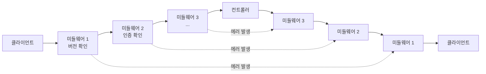
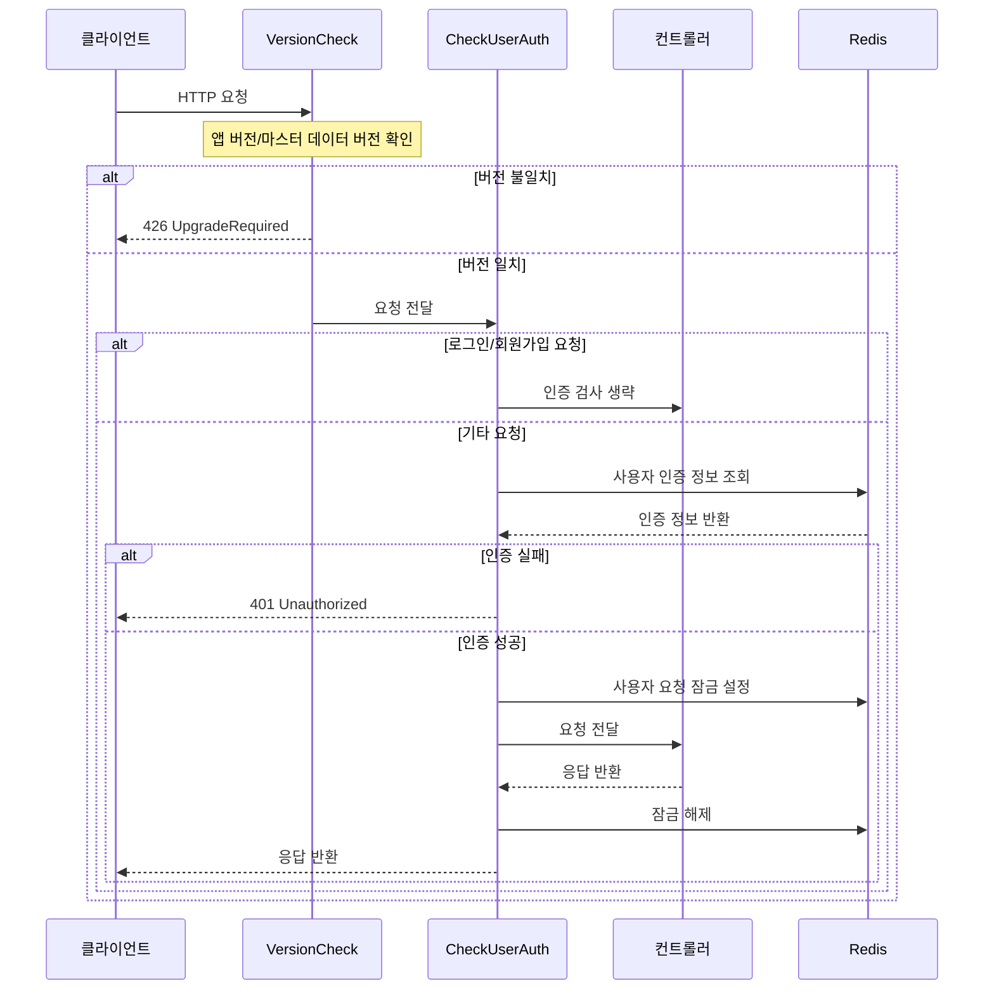
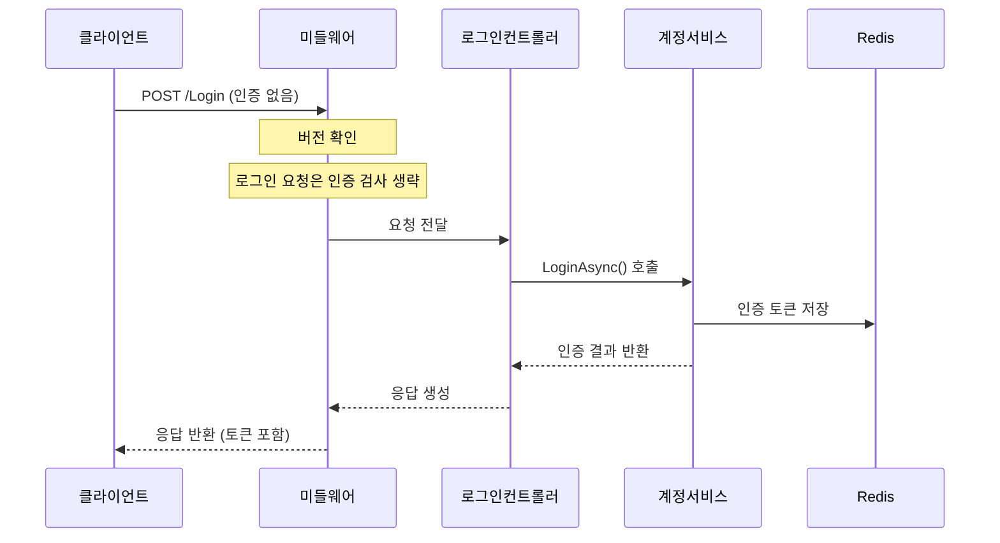
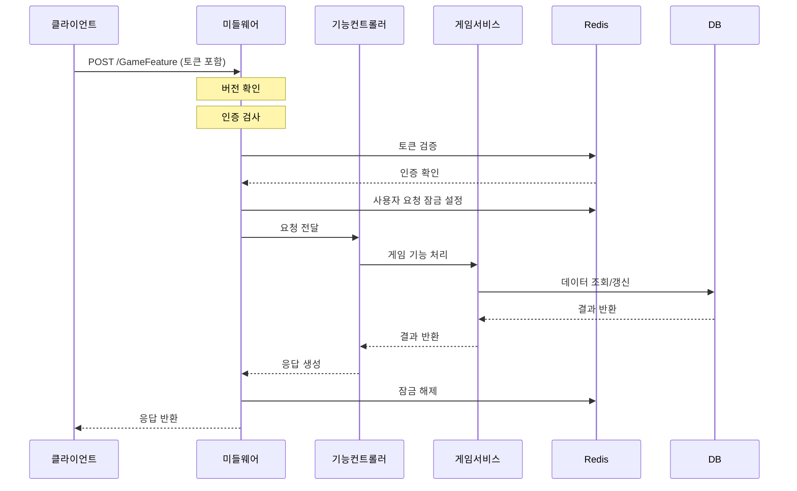

# Chapter 7: 미들웨어 시스템

[이전 장](06_데이터_캐싱_시스템_.md)에서는 게임 서버의 성능을 향상시키기 위한 데이터 캐싱 시스템에 대해 배웠습니다. 이번 장에서는 HTTP 요청 처리 과정에서 중요한 역할을 하는 **미들웨어 시스템**에 대해 알아보겠습니다.

## 미들웨어란 무엇인가요?

미들웨어는 HTTP 요청이 컨트롤러에 도달하기 전과 응답이 클라이언트에게 전송되기 전에 요청과 응답을 검사하고 수정할 수 있는 소프트웨어 구성 요소입니다. 쉽게 말해, 요청과 응답의 중간(middle)에서 다양한 작업을 수행하는 소프트웨어입니다.

공장의 검수 라인을 생각해보세요. 원재료(HTTP 요청)가 들어오면, 제품(응답)이 완성되어 나가기 전에 여러 검사 지점을 통과해야 합니다. 각 검사 지점은 다른 측면을 확인하고, 필요하다면 작업을 수행하거나 불량품을 걸러냅니다. 미들웨어는 이러한 검사 지점과 같은 역할을 합니다.

## 미들웨어의 주요 역할

게임 API 서버에서 미들웨어가 수행하는 주요 역할은 다음과 같습니다:

1. **인증 및 권한 검사**: 사용자가 적절한 권한을 가지고 있는지 확인
2. **버전 확인**: 클라이언트 버전이 서버와 호환되는지 확인
3. **로깅**: 요청 및 응답 정보를 기록
4. **예외 처리**: 오류가 발생할 경우 적절한 응답 생성
5. **요청 변환**: 요청 데이터를 변형하거나 보강
6. **응답 변환**: 응답 데이터를 수정하거나 추가 정보 첨부

## 미들웨어 실행 흐름

미들웨어는 파이프라인 형태로 연결되어 순차적으로 실행됩니다. 다음 다이어그램은 미들웨어의 기본 실행 흐름을 보여줍니다:



이 다이어그램에서 볼 수 있듯이:
1. 요청은 클라이언트에서 시작하여 미들웨어 체인을 통과합니다.
2. 각 미들웨어는 요청을 검사하고 필요한 작업을 수행합니다.
3. 미들웨어에서 오류가 발생하면, 요청은 컨트롤러에 도달하지 않고 응답 체인으로 바로 넘어갑니다.
4. 요청이 모든 미들웨어를 통과하면 컨트롤러가 처리합니다.
5. 응답은 다시 미들웨어 체인을 역순으로 통과한 후 클라이언트에게 반환됩니다.

## ASP.NET Core에서의 미들웨어 설정

ASP.NET Core에서는 `Program.cs` 파일에서 미들웨어를 등록합니다. 우리 프로젝트에서 사용하는 미들웨어 설정을 살펴보겠습니다:

```csharp
// Program.cs
app.UseMiddleware<GameAPIServer.Middleware.VersionCheck>();
app.UseMiddleware<GameAPIServer.Middleware.CheckUserAuthAndLoadUserData>();

app.UseRouting();

app.MapDefaultControllerRoute();
```

이 코드는 두 개의 미들웨어를 등록합니다:
1. **VersionCheck**: 클라이언트 버전과 마스터 데이터 버전을 확인합니다.
2. **CheckUserAuthAndLoadUserData**: 사용자 인증 정보를 확인하고 사용자 데이터를 로드합니다.

미들웨어가 등록된 순서가 실행 순서입니다. 따라서 버전 확인이 먼저 실행되고, 그 다음에 사용자 인증 확인이 실행됩니다.

## 버전 확인 미들웨어

첫 번째로 살펴볼 미들웨어는 **VersionCheck**입니다. 이 미들웨어는 클라이언트 앱 버전과 마스터 데이터 버전이 서버와 일치하는지 확인합니다.

### 버전 확인 미들웨어 구현

```csharp
public class VersionCheck
{
    readonly RequestDelegate _next;
    readonly ILogger<VersionCheck> _logger;
    readonly IMasterDb _masterDb;

    public VersionCheck(RequestDelegate next, ILogger<VersionCheck> logger, IMasterDb masterDb)
    {
        _next = next;
        _logger = logger;
        _masterDb = masterDb;
    }
```

위 코드는 `VersionCheck` 미들웨어의 생성자 부분입니다. 세 가지 의존성을 주입받습니다:
1. **_next**: 다음 미들웨어를 가리키는 대리자(delegate)
2. **_logger**: 로깅을 위한 로거
3. **_masterDb**: 버전 정보를 담고 있는 마스터 데이터베이스

이제 실제로 요청을 처리하는 `Invoke` 메서드를 살펴보겠습니다:

```csharp
public async Task Invoke(HttpContext context)
{
    var appVersion = context.Request.Headers["AppVersion"].ToString();
    var masterDataVersion = context.Request.Headers["MasterDataVersion"].ToString();

    if (!(await VersionCompare(appVersion, masterDataVersion, context)))
    {
        return;
    }

    await _next(context);
}
```

이 메서드는 다음과 같은 작업을 수행합니다:
1. 요청 헤더에서 앱 버전과 마스터 데이터 버전을 추출합니다.
2. `VersionCompare` 메서드를 호출하여 버전을 비교합니다.
3. 버전 비교가 실패하면 요청 처리를 종료합니다.
4. 버전 비교가 성공하면 `_next(context)`를 호출하여 다음 미들웨어로 요청을 전달합니다.

버전 비교 방법을 자세히 살펴보겠습니다:

```csharp
async Task<bool> VersionCompare(string appVersion, string masterDataVersion, HttpContext context)
{
    if (!appVersion.Equals(_masterDb._version!.app_version))
    {
        context.Response.StatusCode = StatusCodes.Status426UpgradeRequired;
        var errorJsonResponse = JsonSerializer.Serialize(new MiddlewareResponse
        {
            result = ErrorCode.InValidAppVersion
        });
        await context.Response.WriteAsync(errorJsonResponse);
        return false;
    }
```

이 코드에서는:
1. 클라이언트 앱 버전이 서버의 앱 버전과 일치하는지 확인합니다.
2. 일치하지 않으면 "업그레이드 필요(426)" 상태 코드와 오류 메시지를 응답으로 반환합니다.
3. 이 경우 `false`를 반환하여 요청 처리를 중단합니다.

## 인증 확인 미들웨어

두 번째로 살펴볼 미들웨어는 **CheckUserAuthAndLoadUserData**입니다. 이 미들웨어는 사용자 인증 정보를 확인하고, 유효한 경우 사용자 데이터를 로드합니다.

### 인증 확인 미들웨어 구현

```csharp
public class CheckUserAuthAndLoadUserData
{
    readonly IMemoryDb _memoryDb;
    readonly RequestDelegate _next;

    public CheckUserAuthAndLoadUserData(RequestDelegate next, IMemoryDb memoryDb)
    {
        _memoryDb = memoryDb;
        _next = next;
    }
```

이 미들웨어는 `_next`(다음 미들웨어 대리자)와 `_memoryDb`(메모리 데이터베이스, [데이터 캐싱 시스템](06_데이터_캐싱_시스템_.md)에서 다룬 Redis)를 의존성으로 주입받습니다.

이제 `Invoke` 메서드를 살펴보겠습니다:

```csharp
public async Task Invoke(HttpContext context)
{
    //로그인, 회원가입 api는 토큰 검사를 하지 않는다.
    var formString = context.Request.Path.Value;
    if (string.Compare(formString, "/Login", StringComparison.OrdinalIgnoreCase) == 0 ||
        string.Compare(formString, "/CreateAccount", StringComparison.OrdinalIgnoreCase) == 0)
    {
        await _next(context);
        return;
    }
```

이 코드는 먼저 요청 경로를 확인합니다. 만약 로그인("/Login")이나 회원가입("/CreateAccount") 요청이라면, 인증 검사를 건너뛰고 바로 다음 미들웨어로 넘어갑니다. 이 두 API는 인증 전에 호출되어야 하기 때문입니다.

다음으로 헤더에서 토큰과 UID를 추출합니다:

```csharp
// token이 있는지 검사하고 있다면 저장
var (isTokenNotExist, token) = await IsTokenNotExistOrReturnToken(context);
if(isTokenNotExist)
{
    return;
}

//uid가 있는지 검사하고 있다면 저장
var (isUidNotExist, uid) = await IsUidNotExistOrReturnUid(context);
if (isUidNotExist)
{
    return;
}
```

이 코드는 두 개의 헬퍼 메서드를 호출하여 토큰과 UID가 존재하는지 확인합니다. 만약 어느 하나라도 없다면, 오류 응답을 반환하고 요청 처리를 중단합니다.

그 다음, Redis에서 사용자 인증 정보를 조회합니다:

```csharp
//uid를 키로 하는 데이터 없을 때
(bool isOk, RdbAuthUserData userInfo) = await _memoryDb.GetUserAsync(uid);
if (await IsInvalidUserAuthTokenNotFound(context, isOk))
{
    return;
}

//토큰이 일치하지 않을 때
if (await IsInvalidUserAuthTokenThenSendError(context, userInfo, token))
{
    return;
}
```

이 코드는:
1. UID를 키로 사용하여 Redis에서 사용자 정보를 조회합니다.
2. 사용자 정보가 없으면 오류를 반환합니다.
3. 사용자 정보가 있지만 토큰이 일치하지 않으면 오류를 반환합니다.

마지막으로, 동일 사용자의 중복 요청을 방지하기 위해 잠금을 설정합니다:

```csharp
//이번 api 호출 끝날 때까지 redis키 잠금 만약 이미 잠겨있다면 에러
var userLockKey = MemoryDbKeyMaker.MakeUserLockKey(userInfo.Uid.ToString());
if (await SetLockAndIsFailThenSendError(context, userLockKey))
{
    return;
}

context.Items[nameof(RdbAuthUserData)] = userInfo;

// Call the next delegate/middleware in the pipeline
await _next(context);

// 트랜잭션 해제(Redis 동기화 해제)
await _memoryDb.UnLockUserReqAsync(userLockKey);
```

이 코드는:
1. 사용자별 잠금 키를 생성합니다.
2. Redis에 잠금을 설정합니다. 이미 잠겨있으면(동일 사용자의 다른 요청이 처리 중) 오류를 반환합니다.
3. 사용자 정보를 `context.Items`에 저장하여 나중에 컨트롤러에서 접근할 수 있게 합니다.
4. 다음 미들웨어를 호출합니다.
5. 모든 처리가 완료되면(응답이 생성된 후) 잠금을 해제합니다.

## 미들웨어의 내부 동작 방식

이제 미들웨어가 어떻게 동작하는지 심층적으로 알아보겠습니다. 다음 다이어그램은 요청이 미들웨어 체인을 통과하는 과정을 보여줍니다:



이 다이어그램은 버전 확인과 인증 확인 미들웨어를 통과하는 요청의 흐름을 보여줍니다. 각 단계에서 조건에 따라 요청이 다음 단계로 진행되거나 오류 응답과 함께 클라이언트로 반환됩니다.

## 사용자 정의 미들웨어 구현하기

이제 간단한 사용자 정의 미들웨어를 만드는 방법을 알아보겠습니다. 예를 들어, 요청 처리 시간을 측정하는 미들웨어를 구현해 보겠습니다:

```csharp
public class RequestTimingMiddleware
{
    private readonly RequestDelegate _next;
    private readonly ILogger<RequestTimingMiddleware> _logger;

    public RequestTimingMiddleware(RequestDelegate next, ILogger<RequestTimingMiddleware> logger)
    {
        _next = next;
        _logger = logger;
    }

    public async Task Invoke(HttpContext context)
    {
        var watch = System.Diagnostics.Stopwatch.StartNew();
        
        // 다음 미들웨어 호출
        await _next(context);
        
        watch.Stop();
        _logger.LogInformation($"요청 {context.Request.Path} 처리 시간: {watch.ElapsedMilliseconds}ms");
    }
}
```

이 미들웨어는:
1. `System.Diagnostics.Stopwatch`를 시작하여 시간 측정을 시작합니다.
2. `_next(context)`를 호출하여 다음 미들웨어와 컨트롤러가 요청을 처리하도록 합니다.
3. 응답이 생성된 후 스톱워치를 정지하고 경과 시간을 로깅합니다.

이 미들웨어를 사용하려면 `Program.cs`에 다음과 같이 등록하면 됩니다:

```csharp
app.UseMiddleware<RequestTimingMiddleware>();
```

## 미들웨어와 다른 패턴의 관계

미들웨어는 다른 패턴들과 밀접하게 연관되어 있습니다:

1. **[컨트롤러 패턴](01_컨트롤러_패턴_.md)**: 미들웨어는 컨트롤러 실행 전후에 공통 작업을 처리합니다.
2. **[인증 및 권한 관리](08_인증_및_권한_관리_.md)**: 미들웨어는 사용자 인증 및 권한을 검사하는 역할을 합니다.
3. **[오류 코드 시스템](09_오류_코드_시스템_.md)**: 미들웨어는 오류 발생 시 표준화된 오류 응답을 생성합니다.
4. **[데이터 캐싱 시스템](06_데이터_캐싱_시스템_.md)**: 미들웨어는 캐시된 데이터를 활용하여 인증 정보를 검증합니다.

## 더 복잡한 미들웨어 시나리오

실제 게임 서버에서는 더 복잡한 미들웨어가 필요할 수 있습니다. 예를 들어, 요청 속도 제한, 로깅, 압축, CORS 등을 처리하는 미들웨어가 있습니다.

여러 미들웨어를 조합하여 복잡한 요청 처리 파이프라인을 구축할 수 있습니다:

```csharp
// Program.cs (복잡한 미들웨어 구성 예시)
app.UseHttpsRedirection();
app.UseRequestLocalization();
app.UseCors();
app.UseMiddleware<RequestTimingMiddleware>();
app.UseMiddleware<GameAPIServer.Middleware.VersionCheck>();
app.UseMiddleware<GameAPIServer.Middleware.CheckUserAuthAndLoadUserData>();
app.UseResponseCompression();
app.UseRouting();
app.UseAuthorization();
app.MapControllers();
```

이러한 구성에서는 여러 미들웨어가 순차적으로 요청을 처리합니다. 각 미들웨어는 특정 역할을 담당하며, 함께 작동하여 완전한 요청 처리 파이프라인을 형성합니다.

## 미들웨어 디버깅 전략

미들웨어에서 문제가 발생했을 때 디버깅하는 방법을 알아보겠습니다:

1. **로깅 추가**: 각 미들웨어에 로깅을 추가하여 실행 흐름을 추적합니다.
   ```csharp
   _logger.LogInformation($"미들웨어 시작: {context.Request.Path}");
   await _next(context);
   _logger.LogInformation($"미들웨어 종료: {context.Request.Path}");
   ```

2. **Try-Catch 사용**: 미들웨어 내에서 예외를 잡아 로깅합니다.
   ```csharp
   try
   {
       await _next(context);
   }
   catch (Exception ex)
   {
       _logger.LogError(ex, "미들웨어에서 예외 발생");
       throw; // 예외를 다시 던져 글로벌 예외 처리기가 처리하도록 함
   }
   ```

3. **요청/응답 덤프**: 디버깅을 위해 요청과 응답의 내용을 로깅합니다.
   ```csharp
   _logger.LogInformation($"요청 헤더: {string.Join(", ", context.Request.Headers)}");
   ```

## 미들웨어 설계 시 고려사항

효과적인 미들웨어를 설계할 때 고려해야 할 사항들입니다:

1. **성능**: 미들웨어는 모든 요청에 적용되므로 성능에 민감합니다. 무거운 작업은 피해야 합니다.
2. **순서**: 미들웨어의 실행 순서는 중요합니다. 예를 들어, 인증 미들웨어는 권한 확인 미들웨어보다 먼저 실행되어야 합니다.
3. **책임 분리**: 각 미들웨어는 단일 책임을 가져야 합니다. 너무 많은 작업을 하는 미들웨어는 분리하는 것이 좋습니다.
4. **예외 처리**: 미들웨어에서 발생하는 예외를 적절히 처리해야 합니다.
5. **조건부 실행**: 모든 요청에 미들웨어를 적용할 필요는 없습니다. 특정 경로나 조건에만 미들웨어를 적용할 수 있습니다.

## 실제 사용 사례 분석

실제 게임 API에서 미들웨어가 어떻게 사용되는지 살펴보겠습니다:

### 사용자 로그인 시나리오



### 게임 기능 요청 시나리오



## 미들웨어의 확장성

미들웨어 패턴은 높은 확장성을 제공합니다. 새로운 공통 기능이 필요하면 새 미들웨어를 만들어 파이프라인에 추가하기만 하면 됩니다. 기존 코드를 수정할 필요가 없습니다.

예를 들어, IP 기반 속도 제한을 추가하고 싶다면:

```csharp
public class RateLimitMiddleware
{
    private static Dictionary<string, (int Count, DateTime LastReset)> _requestCounts = 
        new Dictionary<string, (int, DateTime)>();
    private readonly RequestDelegate _next;
    
    public RateLimitMiddleware(RequestDelegate next)
    {
        _next = next;
    }
    
    public async Task Invoke(HttpContext context)
    {
        var ip = context.Connection.RemoteIpAddress.ToString();
        var now = DateTime.UtcNow;
        
        // IP별 요청 수 추적
        if (!_requestCounts.ContainsKey(ip) || 
            (now - _requestCounts[ip].LastReset).TotalMinutes >= 1)
        {
            _requestCounts[ip] = (1, now);
        }
        else
        {
            var count = _requestCounts[ip].Count + 1;
            _requestCounts[ip] = (count, _requestCounts[ip].LastReset);
            
            // 분당 100개 요청 제한
            if (count > 100)
            {
                context.Response.StatusCode = StatusCodes.Status429TooManyRequests;
                await context.Response.WriteAsync("너무 많은 요청이 발생했습니다. 잠시 후 다시 시도해주세요.");
                return;
            }
        }
        
        await _next(context);
    }
}
```

이 코드는 IP 주소별로 분당 요청 수를 제한하는 간단한 속도 제한 미들웨어입니다. 이를 `Program.cs`에 추가하기만 하면 모든 요청에 속도 제한이 적용됩니다.

## 요약 및 다음 단계

이번 장에서는 미들웨어 시스템의 개념과 구현 방법을 배웠습니다. 미들웨어는 HTTP 요청 처리 파이프라인에서 컨트롤러 실행 전후에 공통 작업을 수행하는 구성 요소입니다. 버전 확인, 사용자 인증, 로깅, 예외 처리 등 여러 컨트롤러에 공통으로 적용되는 로직을 중앙화함으로써 코드 재사용성과 관심사 분리를 향상시킵니다.

미들웨어는 마치 공장의 검수 라인처럼 요청이 최종 목적지(컨트롤러)에 도달하기 전에 여러 검사와 처리를 수행합니다. 이를 통해 컨트롤러는 핵심 비즈니스 로직에만 집중할 수 있게 됩니다.

우리는 버전 확인 미들웨어와 사용자 인증 미들웨어를 자세히 살펴보았고, 미들웨어의 내부 동작 방식과 구현 전략에 대해 알아보았습니다. 또한 미들웨어가 서버의 다른 구성 요소와 어떻게 상호작용하는지도 학습했습니다.

미들웨어는 [인증 및 권한 관리](08_인증_및_권한_관리_.md)와 밀접하게 연관되어 있습니다. 다음 장에서는 게임 API 서버에서 사용자 인증과 권한을 관리하는 방법에 대해 더 자세히 알아보겠습니다.

---

Generated by [AI Codebase Knowledge Builder](https://github.com/The-Pocket/Tutorial-Codebase-Knowledge)