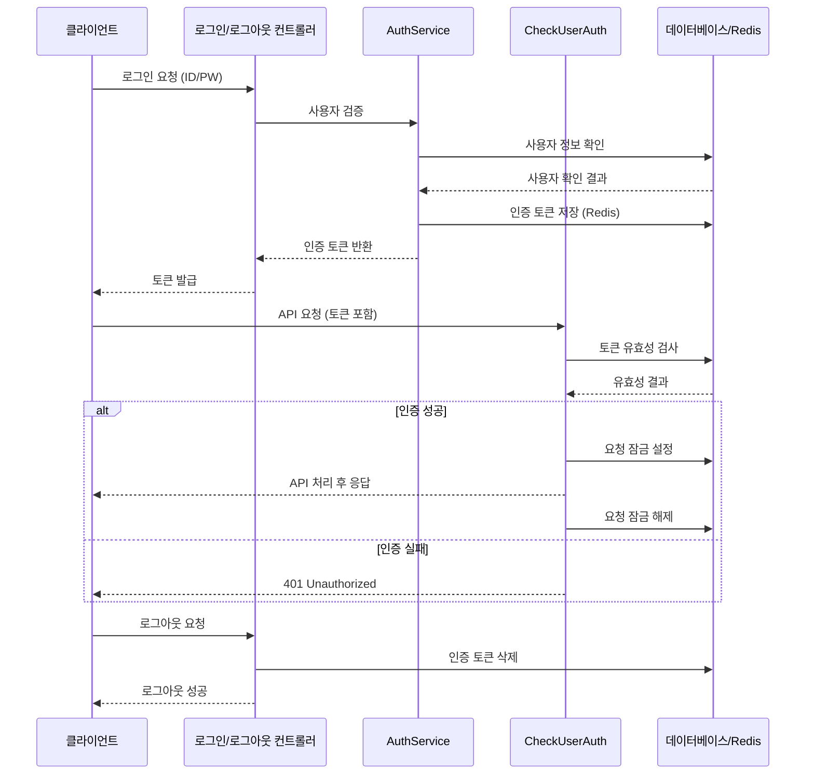

# Chapter 8: 인증 및 권한 관리

[이전 장](07_미들웨어_시스템_.md)에서는 HTTP 요청 처리 과정에서 중요한 역할을 하는 미들웨어 시스템에 대해 배웠습니다. 이번 장에서는 게임 API 서버의 보안을 담당하는 핵심 요소인 **인증 및 권한 관리**에 대해 알아보겠습니다.

## 인증과 권한이란 무엇인가요?

우리 일상 생활의 예를 들어보겠습니다. 백화점에 가면 두 가지 보안 체계가 있습니다:

1. **인증(Authentication)**: 직원증을 통해 "당신이 누구인지" 확인하는 과정
2. **권한(Authorization)**: 그 직원이 금고실에 들어갈 수 있는지, VIP 라운지에 접근할 수 있는지 등 "무엇을 할 수 있는지" 결정하는 과정

게임 서버에서도 마찬가지입니다:
- **인증**: 사용자가 자신이 주장하는 사람이 맞는지 확인합니다 (로그인)
- **권한**: 인증된 사용자가 어떤 기능을 사용할 수 있는지 결정합니다

## 인증 시스템의 전체 구조

게임 API 서버의 인증 시스템은 다음과 같은 흐름으로 작동합니다:



이 다이어그램은 인증 시스템의 세 가지 주요 부분을 보여줍니다:
1. 로그인 과정: 사용자 확인 및 토큰 발급
2. API 요청 인증: 각 API 호출 시 토큰 검증
3. 로그아웃 과정: 인증 토큰 제거

이제 각 부분을 자세히 살펴보겠습니다.

## 비밀번호 보안: 해싱과 솔팅

사용자 비밀번호는 매우 민감한 정보이므로, 절대 원문 그대로 저장하면 안 됩니다. 대신 **해싱(Hashing)**이라는 기술을 사용합니다.

해싱은 원본 데이터를 고정된 길이의 알아볼 수 없는 문자열로 변환하는 일방향 함수입니다. 예를 들어, "password123"은 "ef92b778bafe771e89245b89ecbc08a44a4e166c06659911881f383d4473e94f"와 같은 값으로 변환됩니다.

하지만 해싱만으로는 불충분합니다. 동일한 비밀번호는 항상 동일한 해시 값을 생성하기 때문에, 해커가 미리 계산된 해시 테이블("레인보우 테이블")을 사용해 원래 비밀번호를 알아낼 수 있습니다.

이 문제를 해결하기 위해 **솔팅(Salting)**이라는 기술을 사용합니다. 솔트는 비밀번호에 추가되는 무작위 문자열로, 같은 비밀번호라도 다른 해시 값을 생성하게 만듭니다.

우리 프로젝트에서 비밀번호 해싱과 솔팅을 수행하는 코드를 살펴보겠습니다:

```csharp
// 비밀번호 해싱하기
public static String MakeHashingPassWord(String saltValue, String pw)
{
    var sha = SHA256.Create();
    var hash = sha.ComputeHash(Encoding.ASCII.GetBytes(saltValue + pw));
    var stringBuilder = new StringBuilder();
    foreach (var b in hash)
    {
        stringBuilder.AppendFormat("{0:x2}", b);
    }

    return stringBuilder.ToString();
}
```

이 코드는 사용자의 비밀번호와 솔트 값을 결합한 후, SHA-256 알고리즘을 사용해 해시를 생성합니다. 해시는 바이트 배열로 생성되므로, 이를 16진수 문자열로 변환하여 반환합니다.

솔트를 생성하는 코드도 있습니다:

```csharp
public static String SaltString()
{
    var bytes = new Byte[64];
    using (var random = RandomNumberGenerator.Create())
    {
        random.GetBytes(bytes);
    }

    return new String(bytes.Select(x => 
        AllowableCharacters[x % AllowableCharacters.Length]).ToArray());
}
```

이 메서드는 암호학적으로 안전한 난수 생성기를 사용해 64바이트 길이의 무작위 솔트를 생성합니다. 이렇게 생성된 솔트는 각 사용자마다 고유하며, 데이터베이스에 사용자 정보와 함께 저장됩니다.

## 로그인 과정: 사용자 인증하기

로그인은 사용자 인증의 핵심 과정입니다. 로그인 컨트롤러의 코드를 살펴보겠습니다:

```csharp
[HttpPost]
public async Task<LoginResponse> Login(LoginRequest request)
{
    LoginResponse response = new();
    
    var (errorCode, uid, authToken) = 
        await _authService.LoginAsync(request.UserID, request.Password);
    
    if (errorCode != ErrorCode.None)
    {
        response.Result = errorCode;
        return response;
    }

    response.Result = errorCode;
    response.AuthToken = authToken;
    
    _logger.ZLogInformation($"[Login] Uid : {uid}, Token : {authToken}");
    return response;
}
```

이 코드는 사용자의 로그인 요청을 처리합니다:
1. 컨트롤러는 로그인 요청(ID, 비밀번호)을 받습니다.
2. `_authService.LoginAsync` 메서드를 호출하여 사용자 인증을 수행합니다.
3. 인증이 성공하면 UID(사용자 ID)와 인증 토큰을 받습니다.
4. 응답 객체에 결과와 토큰을 설정하고 클라이언트에 반환합니다.

실제 인증 로직은 `AuthService` 클래스에 구현되어 있습니다:

```csharp
public async Task<(ErrorCode, Int64, string)> Login(string userID, string passWord)
{
    (var result, var uid) = await _gameDb.VerifyUser(userID, passWord);
    if (result != ErrorCode.None)
    {
        return (result, 0, "");
    }

    var token = Security.CreateAuthToken();
    result = await _memoryDb.RegistUserAsync(token, uid);

    return (result, uid, token);
}
```

이 코드는:
1. 데이터베이스를 통해 사용자 ID와 비밀번호를 검증합니다.
2. 검증이 성공하면 새 인증 토큰을 생성합니다.
3. 생성된 토큰을 Redis에 저장합니다 (`_memoryDb.RegistUserAsync`).
4. 오류 코드, UID, 토큰을 포함한 튜플을 반환합니다.

## 인증 토큰 관리

인증 토큰은 로그인 이후 사용자를 식별하는 핵심 요소입니다. 토큰은 무작위로 생성되며, Redis에 저장됩니다.

토큰 생성 코드를 살펴보겠습니다:

```csharp
public static String CreateAuthToken()
{
    var bytes = new Byte[25];
    using (var random = RandomNumberGenerator.Create())
    {
        random.GetBytes(bytes);
    }

    return new String(bytes.Select(x => 
        AllowableCharacters[x % AllowableCharacters.Length]).ToArray());
}
```

이 메서드는 암호학적으로 안전한 난수 생성기를 사용해 25바이트 길이의 무작위 토큰을 생성합니다. 생성된 토큰은 사용자 인증에 사용됩니다.

토큰은 Redis에 저장되며, 키는 사용자 ID, 값은 토큰입니다. 이 토큰은 일정 시간 후 만료됩니다:

```csharp
public async Task<ErrorCode> RegistUserAsync(string token, Int64 uid)
{
    var key = MemoryDbKeyMaker.MakeUIDKey(uid.ToString());
    
    RdbAuthUserData user = new()
    {
        Uid = uid,
        Token = token
    };
    
    // 토큰을 Redis에 저장하고 만료 시간 설정
    RedisString<RdbAuthUserData> redis = new(_redisConn, key, LoginTimeSpan());
    if (await redis.SetAsync(user, LoginTimeSpan()) == false)
    {
        return ErrorCode.LoginFailAddRedis;
    }
    
    return ErrorCode.None;
}
```

이 코드는:
1. 사용자 ID에 기반한 Redis 키를 생성합니다.
2. 사용자 인증 데이터 객체를 생성합니다.
3. 데이터를 Redis에 저장하고 만료 시간을 설정합니다.
4. 성공 여부에 따라 오류 코드를 반환합니다.

토큰의 만료 시간은 보통 정해진 시간(예: 60분)으로 설정됩니다:

```csharp
public TimeSpan LoginTimeSpan()
{
    return TimeSpan.FromMinutes(RediskeyExpireTime.LoginKeyExpireMin);
}
```

만료 시간을 설정하는 것은 보안을 강화하는 중요한 방법입니다. 토큰이 탈취되더라도 제한된 시간 동안만 유효합니다.

## 인증 미들웨어: 요청 보호하기

인증 토큰이 발급되면, 이후 모든 API 요청에 이 토큰을 포함해야 합니다. [미들웨어 시스템](07_미들웨어_시스템_.md)을 사용하여 모든 API 요청에 대한 인증을 처리할 수 있습니다.

우리 프로젝트의 인증 미들웨어 클래스를 살펴보겠습니다:

```csharp
public class CheckUserAuthAndLoadUserData
{
    readonly IMemoryDb _memoryDb;
    readonly RequestDelegate _next;

    public CheckUserAuthAndLoadUserData(RequestDelegate next, IMemoryDb memoryDb)
    {
        _memoryDb = memoryDb;
        _next = next;
    }
```

이 미들웨어는 `_memoryDb`(Redis)를 사용하여 토큰 유효성을 검사하고, `_next` 대리자를 통해 다음 미들웨어로 요청을 전달합니다.

실제 인증 검사는 `Invoke` 메서드에서 수행됩니다:

```csharp
public async Task Invoke(HttpContext context)
{
    // 로그인, 회원가입 API는 토큰 검사 생략
    var path = context.Request.Path.Value;
    if (path.EndsWith("/Login") || path.EndsWith("/CreateAccount"))
    {
        await _next(context);
        return;
    }
    
    // 헤더에서 토큰과 UID 추출
    var (isTokenNotExist, token) = await IsTokenNotExistOrReturnToken(context);
    if (isTokenNotExist) return;
    
    var (isUidNotExist, uid) = await IsUidNotExistOrReturnUid(context);
    if (isUidNotExist) return;
```

이 코드는:
1. 로그인과 회원가입 API는 인증 없이 접근 가능하도록 합니다.
2. 요청 헤더에서 토큰과 UID를 추출합니다.
3. 토큰이나 UID가 없으면 오류 응답을 반환합니다.

다음으로, 토큰의 유효성을 검사합니다:

```csharp
// Redis에서 사용자 인증 정보 조회
(bool isOk, RdbAuthUserData userInfo) = await _memoryDb.GetUserAsync(uid);
if (await IsInvalidUserAuthTokenNotFound(context, isOk)) return;

// 토큰 일치 여부 확인
if (await IsInvalidUserAuthTokenThenSendError(context, userInfo, token))
{
    return;
}
```

이 코드는:
1. UID를 키로 사용하여 Redis에서 인증 정보를 조회합니다.
2. 인증 정보가 없으면 오류를 반환합니다.
3. 토큰이 일치하지 않으면 오류를 반환합니다.

마지막으로, 동시 요청을 방지하기 위해 요청 잠금을 설정합니다:

```csharp
// 사용자 요청 잠금 설정
var userLockKey = MemoryDbKeyMaker.MakeUserLockKey(userInfo.Uid.ToString());
if (await SetLockAndIsFailThenSendError(context, userLockKey))
{
    return;
}

// 사용자 정보를 컨텍스트에 저장
context.Items[nameof(RdbAuthUserData)] = userInfo;

// 다음 미들웨어 호출
await _next(context);

// 요청 완료 후 잠금 해제
await _memoryDb.UnLockUserReqAsync(userLockKey);
```

이 코드는:
1. 사용자별 잠금 키를 생성합니다.
2. Redis에 잠금을 설정합니다(이미 잠겨있으면 오류 반환).
3. 사용자 정보를 `context.Items`에 저장합니다.
4. 다음 미들웨어를 호출합니다.
5. 요청 처리 완료 후 잠금을 해제합니다.

이 미들웨어는 모든 보호된 API 요청에 대해 실행되므로, 컨트롤러에서 인증 로직을 반복해서 구현할 필요가 없습니다.

## 토큰 유효성 검사 상세 과정

토큰 유효성 검사는 여러 단계로 이루어집니다. 주요 메서드 중 하나를 살펴보겠습니다:

```csharp
async Task<bool> IsInvalidUserAuthTokenThenSendError(
    HttpContext context, RdbAuthUserData userInfo, string token)
{
    if (string.CompareOrdinal(userInfo.Token, token) == 0)
    {
        return false;
    }

    context.Response.StatusCode = StatusCodes.Status401Unauthorized;
    var errorJsonResponse = JsonSerializer.Serialize(new MiddlewareResponse
    {
        result = ErrorCode.AuthTokenFailWrongAuthToken
    });
    await context.Response.WriteAsync(errorJsonResponse);

    return true;
}
```

이 메서드는:
1. 요청 헤더의 토큰과 Redis에 저장된 토큰을 비교합니다.
2. 토큰이 일치하면 `false`를 반환하여 요청 처리를 계속합니다.
3. 토큰이 일치하지 않으면 401 Unauthorized 상태 코드와 오류 메시지를 반환합니다.

Redis에서 사용자 데이터 조회하는 과정도 중요합니다:

```csharp
public async Task<(bool, RdbAuthUserData)> GetUserAsync(string uid)
{
    var key = MemoryDbKeyMaker.MakeUIDKey(uid);
    
    try
    {
        RedisString<RdbAuthUserData> redis = new(_redisConn, key, null);
        var user = await redis.GetAsync();
        return (user.HasValue, user.Value);
    }
    catch
    {
        return (false, null);
    }
}
```

이 코드는:
1. 사용자 ID를 기반으로 Redis 키를 생성합니다.
2. Redis에서 해당 키로 사용자 인증 정보를 조회합니다.
3. 조회 결과와 사용자 정보를 튜플로 반환합니다.

## 로그아웃 과정: 토큰 제거하기

사용자가 로그아웃하면 인증 토큰을 제거해야 합니다. 로그아웃 컨트롤러를 살펴보겠습니다:

```csharp
[HttpPost]
public async Task<LogoutResponse> DeleteUserToken([FromHeader] Header request)
{
    LogoutResponse response = new();
    var errorCode = await _memoryDb.DelUserAuthAsync(request.Uid);
    if (errorCode != ErrorCode.None)
    {
        response.Result = errorCode;
        return response;
    }

    _logger.ZLogInformation($"[Logout] Uid : {request.Uid}");
    return response;
}
```

이 코드는:
1. 요청 헤더에서 UID를 추출합니다.
2. `_memoryDb.DelUserAuthAsync` 메서드를 호출하여 Redis에서 인증 토큰을 삭제합니다.
3. 결과를 로깅하고 응답을 반환합니다.

Redis에서 토큰을 삭제하는 코드입니다:

```csharp
public async Task<ErrorCode> DelUserAuthAsync(Int64 uid)
{
    try
    {
        var key = MemoryDbKeyMaker.MakeUIDKey(uid.ToString());
        RedisString<RdbAuthUserData> redis = new(_redisConn, key, null);
        await redis.DeleteAsync();
        return ErrorCode.None;
    }
    catch
    {
        return ErrorCode.LogoutFailException;
    }
}
```

이 코드는:
1. 사용자 ID를 기반으로 Redis 키를 생성합니다.
2. Redis에서 해당 키와 연관된 데이터를 삭제합니다.
3. 성공 여부에 따라 오류 코드를 반환합니다.

토큰이 삭제되면 이후의 API 요청은 인증 미들웨어에서 거부됩니다.

## 권한 관리: 사용자 역할과 접근 제어

지금까지는 인증에 초점을 맞췄지만, 실제 게임에서는 권한 관리도 중요합니다. 권한 관리는 인증된 사용자가 어떤 작업을 수행할 수 있는지 결정합니다.

간단한 권한 관리 방법으로는 사용자에게 역할(Role)을 부여하는 것이 있습니다:

```csharp
public enum UserRole
{
    Regular = 0,    // 일반 사용자
    VIP = 1,        // VIP 사용자
    Admin = 2       // 관리자
}
```

데이터베이스에 사용자 역할을 저장하고, API 요청 시 역할에 따라 접근을 제어할 수 있습니다:

```csharp
if (userInfo.Role < UserRole.Admin)
{
    // 관리자만 접근 가능한 작업
    return Unauthorized("관리자만 접근 가능한 기능입니다.");
}
```

또는 특정 리소스(예: 길드, 아이템 등)에 대한 소유권을 확인할 수도 있습니다:

```csharp
if (item.OwnerUid != userInfo.Uid)
{
    // 아이템 소유자만 접근 가능한 작업
    return Forbidden("본인의 아이템만 수정할 수 있습니다.");
}
```

이러한 권한 검사는 보통 서비스 계층([서비스 계층 패턴](03_서비스_계층_패턴_.md))에서 구현됩니다.

## 인증 및 권한 시스템 보안 강화

인증 및 권한 시스템을 더욱 강화하기 위한 몇 가지 추가 방법을 살펴보겠습니다:

1. **HTTPS 사용**: 모든 API 통신은 HTTPS를 통해 암호화되어야 합니다.
2. **토큰 교체**: 일정 시간마다 새 토큰을 발급하여 보안을 강화할 수 있습니다.
3. **IP 제한**: 의심스러운 IP에서의 요청을 제한할 수 있습니다.
4. **2단계 인증**: 중요한 작업에 추가 인증 단계를 요구할 수 있습니다.
5. **요청 속도 제한**: 과도한 로그인 시도를 방지할 수 있습니다.

예를 들어, 로그인 시도 속도를 제한하는 간단한 미들웨어를 구현할 수 있습니다:

```csharp
public class LoginRateLimitMiddleware
{
    private static Dictionary<string, (int Count, DateTime LastReset)> _attempts 
        = new();
    private readonly RequestDelegate _next;
    
    public async Task Invoke(HttpContext context)
    {
        if (context.Request.Path.Equals("/Login"))
        {
            var ip = context.Connection.RemoteIpAddress.ToString();
            var now = DateTime.UtcNow;
            
            // 15분마다 카운터 리셋
            if (!_attempts.ContainsKey(ip) || 
                (now - _attempts[ip].LastReset).TotalMinutes >= 15)
            {
                _attempts[ip] = (1, now);
            }
            else if (_attempts[ip].Count >= 5)
            {
                // 5회 이상 시도 차단
                context.Response.StatusCode = 429; // Too Many Requests
                await context.Response.WriteAsync("로그인 시도가 너무 많습니다.");
                return;
            }
            else
            {
                _attempts[ip] = (_attempts[ip].Count + 1, _attempts[ip].LastReset);
            }
        }
        
        await _next(context);
    }
}
```

이 코드는 특정 IP에서 15분 내에 5회 이상 로그인을 시도하면 추가 시도를 차단합니다.

## 요약 및 다음 단계

이 장에서는 인증 및 권한 관리 시스템에 대해 배웠습니다. 사용자의 로그인, 로그아웃, 토큰 관리, 그리고 API 요청 인증 과정을 살펴보았습니다. 이 시스템은 마치 놀이공원의 입장권과 신원확인 시스템처럼, 서버에 접근하는 모든 요청이 유효한 사용자인지 확인하고 적절한 권한을 부여합니다.

주요 개념:
- 비밀번호는 해싱과 솔팅을 통해 안전하게 저장합니다.
- 로그인 시 인증 토큰을 발급하고 Redis에 저장합니다.
- 미들웨어를 통해 모든 API 요청의 인증을 처리합니다.
- 로그아웃 시 인증 토큰을 제거합니다.
- 사용자 역할이나 소유권을 통해 권한을 관리합니다.

인증 및 권한 관리는 게임 서버의 보안을 유지하는 데 핵심적인 역할을 합니다. 이 시스템을 통해 사용자의 데이터를 보호하고, 권한이 없는 사용자가 특정 기능에 접근하는 것을 방지할 수 있습니다.

다음 장인 [오류 코드 시스템](09_오류_코드_시스템_.md)에서는 게임 서버에서 발생하는 다양한 오류를 효과적으로 처리하고 클라이언트에 전달하는 방법에 대해 알아보겠습니다. 오류 코드 시스템은 인증 실패와 같은 상황에서 클라이언트에게 명확한 오류 정보를 제공하는 데 중요한 역할을 합니다.

---

Generated by [AI Codebase Knowledge Builder](https://github.com/The-Pocket/Tutorial-Codebase-Knowledge)