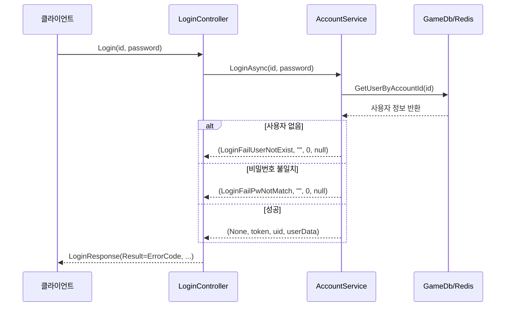
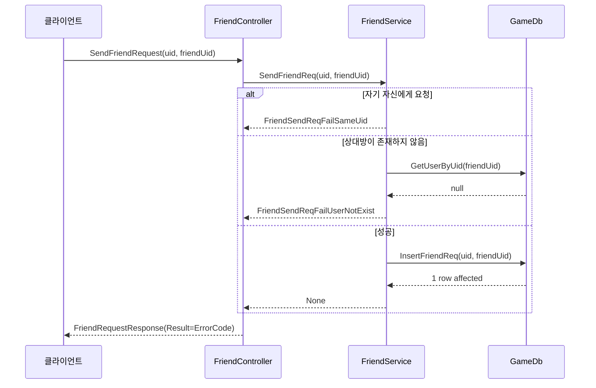

# Chapter 9: 오류 코드 시스템

[이전 장](08_인증_및_권한_관리_.md)에서는 게임 API 서버의 보안을 담당하는 인증 및 권한 관리에 대해 배웠습니다. 이번 장에서는 서버에서 발생하는 다양한 오류 상황을 체계적으로 관리하는 **오류 코드 시스템**에 대해 알아보겠습니다.

## 오류 코드 시스템이란 무엇인가요?

자동차를 운전하다가 갑자기 엔진 경고등이 켜진 경험이 있으신가요? 현대 자동차는 단순히 "엔진에 문제가 있습니다"라고만 알려주지 않고, 정확한 진단 코드(예: P0301, P0420 등)를 제공합니다. 정비사는 이 코드를 통해 정확히 어떤 부품에 어떤 문제가 있는지 빠르게 파악할 수 있습니다.

게임 서버의 오류 코드 시스템도 이와 유사합니다. 서버에서 오류가 발생했을 때, 단순히 "오류가 발생했습니다"라고만 알려주는 것이 아니라, 고유한 오류 코드를 제공하여 개발자와 클라이언트 모두가 정확히 어떤 문제가 발생했는지 파악할 수 있게 해줍니다.

## 오류 코드 시스템의 이점

체계적인 오류 코드 시스템을 사용하면 다음과 같은 이점이 있습니다:

1. **명확한 문제 식별**: 각 오류에 고유 코드를 부여하여 정확히 어떤 문제가 발생했는지 파악할 수 있습니다.
2. **클라이언트 대응 용이성**: 클라이언트는 오류 코드에 따라 적절한 메시지를 표시하거나 대응 로직을 실행할 수 있습니다.
3. **디버깅 효율성**: 오류 코드를 로그에 기록하면 문제 추적과 해결이 더 효율적으로 이루어집니다.
4. **국제화(다국어) 지원**: 오류 코드를 기반으로 클라이언트에서 각 언어에 맞는 오류 메시지를 표시할 수 있습니다.
5. **보안 강화**: 내부 시스템 정보를 노출하지 않고도 오류 상황을 명확히 전달할 수 있습니다.

## GameAPIServer_Template의 오류 코드 구현

우리 프로젝트에서는 `ErrorCode`라는 열거형(Enum)을 통해 오류 코드 시스템을 구현하고 있습니다. 먼저 간단한 예시를 살펴보겠습니다:

```csharp
public enum ErrorCode : UInt16
{
    None = 0,  // 오류 없음 (성공)
    
    // 공통 오류 (1000~1999)
    UnhandleException = 1001,  // 처리되지 않은 예외
    RedisFailException = 1002,  // Redis 연결 실패
    
    // 인증 관련 오류 (2000~2099)
    LoginFailException = 2004,  // 로그인 실패 (일반적 오류)
    LoginFailUserNotExist = 2005,  // 사용자가 존재하지 않음
    LoginFailPwNotMatch = 2006,  // 비밀번호 불일치
}
```

위 코드는 게임 서버에서 발생할 수 있는 다양한 오류 상황에 대해 고유한 코드를 부여하고 있습니다. 각 오류 코드는 특정 범위의 숫자를 사용하여 카테고리별로 구분되어 있습니다.

## 오류 코드 범위 체계

오류 코드는 범위에 따라 다음과 같이 분류됩니다:

```
- 0: 성공 (오류 없음)
- 1000~1999: 공통 오류
- 2000~2099: 인증 관련 오류
- 2100~2199: 친구 관련 오류
- 3000~3999: 아이템 관련 오류
- 4000~4999: 데이터베이스 관련 오류
- 5000~5999: 마스터 데이터 관련 오류
- 등등...
```

이러한 구조는 오류 코드만 보고도 어떤 영역에서 문제가 발생했는지 빠르게 파악할 수 있게 해줍니다.

## 오류 코드 사용 방법

이제 실제로 오류 코드를 어떻게 사용하는지 살펴보겠습니다.

### 컨트롤러에서의 오류 코드 사용

컨트롤러에서는 서비스 계층의 결과를 받아 클라이언트에게 적절한 응답을 반환합니다:

```csharp
[HttpPost]
public async Task<LoginResponse> Login(LoginRequest request)
{
    LoginResponse response = new();
    
    var (errorCode, authToken, uid, userData) = 
        await _accountService.LoginAsync(request.UserID, request.Password);
    
    response.Result = errorCode;  // 응답에 오류 코드 설정
    response.AuthToken = authToken;
    // 나머지 응답 설정...
    
    return response;
}
```

이 코드에서는 `_accountService.LoginAsync` 메서드의 반환 값 중 첫 번째 요소로 `errorCode`를 받아, 이를 응답 객체의 `Result` 속성에 설정하고 있습니다. 성공 시 `ErrorCode.None`이 반환되고, 실패 시 발생한 오류에 해당하는 코드가 반환됩니다.

### 서비스 계층에서의 오류 코드 사용

서비스 계층에서는 비즈니스 로직을 수행하면서 다양한 오류 상황을 처리합니다:

```csharp
public async Task<(ErrorCode, string, long, UserData)> LoginAsync(string userId, string password)
{
    try
    {
        // 사용자 정보 조회
        var user = await _gameDb.GetUserByAccountId(userId);
        if (user == null)
        {
            return (ErrorCode.LoginFailUserNotExist, "", 0, null);
        }
        
        // 비밀번호 검증
        if (!VerifyPassword(password, user.salt, user.password))
        {
            return (ErrorCode.LoginFailPwNotMatch, "", 0, null);
        }
```

이 코드에서는 로그인 과정에서 발생할 수 있는 여러 오류 상황에 대해 각각 다른 오류 코드를 반환하고 있습니다. 사용자가 존재하지 않으면 `LoginFailUserNotExist`, 비밀번호가 일치하지 않으면 `LoginFailPwNotMatch` 오류 코드를 반환합니다.

### 예외 처리와 오류 코드

서비스 메서드에서는 일반적으로 try-catch 블록을 사용하여 예외를 처리하고, 적절한 오류 코드를 반환합니다:

```csharp
public async Task<(ErrorCode, List<ReceivedReward>)> CheckAttendanceAndReceiveRewards(int uid)
{
    try
    {
        // 출석 체크 로직
        var rowCount = await _gameDb.CheckAttendanceById(uid);
        if (rowCount != 1)
        {
            return (ErrorCode.AttendanceCheckFailAlreadyChecked, null);
        }
        
        // 성공 시 결과 반환
        return (ErrorCode.None, totalRewards);
    }
    catch (Exception e)
    {
        _logger.ZLogError(e, $"[Attendance.CheckAttendance] 오류: {uid}");
        return (ErrorCode.AttendanceCheckFailException, null);
    }
}
```

이 코드에서는 출석 체크 과정에서 발생할 수 있는 오류를 처리하고 있습니다. 이미 출석 체크를 했으면 `AttendanceCheckFailAlreadyChecked` 오류 코드를 반환하고, 예외가 발생하면 `AttendanceCheckFailException` 오류 코드를 반환합니다.

## 오류 코드와 응답 객체

모든 API 응답에는 오류 코드가 포함되어야 합니다. 이를 위해 공통 응답 클래스를 정의하여 사용할 수 있습니다:

```csharp
public class ErrorCode
{
    public global::ErrorCode Result { get; set; } = global::ErrorCode.None;
}

// 로그인 응답 예시
public class LoginResponse : ErrorCode
{
    public string AuthToken { get; set; } = "";
    public long Uid { get; set; } = 0;
    public UserData userData { get; set; }
}
```

이 코드에서는 `ErrorCode` 기본 클래스를 정의하고, 모든 응답 객체가 이 클래스를 상속받도록 하고 있습니다. 이렇게 하면 모든 응답에 `Result` 속성이 포함되어 오류 코드를 전달할 수 있습니다.

## 미들웨어에서의 오류 코드 사용

[미들웨어 시스템](07_미들웨어_시스템_.md)에서도 오류 코드를 사용하여 오류 응답을 생성할 수 있습니다:

```csharp
public async Task Invoke(HttpContext context)
{
    var appVersion = context.Request.Headers["AppVersion"].ToString();
    
    if (!appVersion.Equals(_masterDb._version!.app_version))
    {
        context.Response.StatusCode = StatusCodes.Status426UpgradeRequired;
        var errorResponse = new MiddlewareResponse
        {
            result = ErrorCode.InValidAppVersion
        };
        await context.Response.WriteAsync(JsonSerializer.Serialize(errorResponse));
        return;
    }
```

이 코드는 버전 확인 미들웨어에서 클라이언트 앱 버전이 서버 버전과 일치하지 않을 때, HTTP 상태 코드와 함께 오류 코드를 포함한 응답을 반환하는 예시입니다.

## 오류 코드 시스템의 내부 작동 원리

오류 코드 시스템이 내부적으로 어떻게 작동하는지 이해해보겠습니다. 다음 시퀀스 다이어그램은 로그인 과정에서 오류 코드가 어떻게 흘러가는지 보여줍니다:



이 다이어그램은 로그인 과정에서 발생할 수 있는 다양한 오류 상황에 따라 서비스 계층에서 컨트롤러로, 그리고 최종적으로 클라이언트로 어떤 오류 코드가 전달되는지 보여줍니다.

## 오류 코드 활용 사례: 친구 요청 기능

실제 게임 기능에서 오류 코드가 어떻게 활용되는지 친구 요청 기능을 예로 살펴보겠습니다:

```csharp
public async Task<ErrorCode> SendFriendReq(int uid, int friendUid)
{
    try
    {
        // 자기 자신에게 친구 요청 불가
        if (uid == friendUid)
        {
            return ErrorCode.FriendSendReqFailSameUid;
        }

        // 상대방 유저 존재 여부 확인
        var user = await _gameDb.GetUserByUid(friendUid);
        if (user == null)
        {
            return ErrorCode.FriendSendReqFailUserNotExist;
        }
```

이 코드는 친구 요청 과정에서 발생할 수 있는 여러 오류 상황을 검사하고, 각 상황에 맞는 오류 코드를 반환하고 있습니다. 자신에게 친구 요청을 보내면 `FriendSendReqFailSameUid`, 존재하지 않는 사용자에게 요청을 보내면 `FriendSendReqFailUserNotExist` 오류 코드를 반환합니다.

친구 요청 기능의 전체 흐름은 다음과 같습니다:



## 클라이언트에서의 오류 코드 처리

클라이언트(게임)에서는 서버로부터 받은 오류 코드에 따라 적절한 UI를 표시하거나 동작을 수행해야 합니다:

```csharp
// 서버로부터 받은 응답 처리
public void HandleLoginResponse(LoginResponse response)
{
    switch(response.Result)
    {
        case ErrorCode.None:
            // 로그인 성공, 게임 화면으로 이동
            GameManager.Instance.LoadMainScene();
            break;
            
        case ErrorCode.LoginFailUserNotExist:
            // 존재하지 않는 사용자
            UIManager.Instance.ShowErrorPopup("존재하지 않는 계정입니다.");
            break;
            
        case ErrorCode.LoginFailPwNotMatch:
            // 비밀번호 불일치
            UIManager.Instance.ShowErrorPopup("비밀번호가 일치하지 않습니다.");
            break;
            
        default:
            // 기타 오류
            UIManager.Instance.ShowErrorPopup("로그인 중 오류가 발생했습니다.");
            break;
    }
}
```

이 코드는 서버로부터 받은 오류 코드에 따라 다른 오류 메시지를 표시하고 있습니다. 구체적인 오류 코드를 사용함으로써 사용자에게 명확한 정보를 제공할 수 있습니다.

## 오류 코드와 로깅

오류 코드는 로깅 시스템과 함께 사용하면 더욱 강력해집니다. 오류가 발생했을 때 오류 코드와 함께 상세 정보를 로그에 기록하면 디버깅에 큰 도움이 됩니다:

```csharp
try
{
    // 비즈니스 로직 수행
    var result = await _gameDb.CheckAttendanceById(uid);
    if (result != 1)
    {
        _logger.ZLogWarning($"[Attendance] 이미 출석한 사용자: {uid}");
        return (ErrorCode.AttendanceCheckFailAlreadyChecked, null);
    }
}
catch (Exception e)
{
    _logger.ZLogError(e, $"[Attendance] 출석 체크 중 예외 발생: {uid}");
    return (ErrorCode.AttendanceCheckFailException, null);
}
```

이 코드는 오류가 발생했을 때 오류 코드와 함께 상세 정보를 로그에 기록하고 있습니다. 로그에 오류 코드를 포함하면 나중에 로그를 분석할 때 특정 오류 패턴을 쉽게 찾을 수 있습니다.

## 오류 코드 시스템 확장하기

게임 기능이 추가되면 새로운 오류 코드도 필요해집니다. 다음은 오류 코드 시스템을 확장하는 예시입니다:

```csharp
public enum ErrorCode : UInt16
{
    // 기존 오류 코드들...
    
    // 신규 기능: 길드 시스템 오류 코드 (7000~7099)
    GuildCreateFailNameDuplicate = 7001,  // 이미 존재하는 길드 이름
    GuildCreateFailInsufficientCost = 7002,  // 길드 생성 비용 부족
    GuildJoinFailFull = 7003,  // 길드 인원 초과
    // ...
}
```

오류 코드를 추가할 때는 다음 사항을 고려해야 합니다:
1. 적절한 범위에 추가하기
2. 명확한 이름 사용하기
3. 주석으로 설명 추가하기
4. 문서 업데이트하기

## 오류 코드 시스템의 모범 사례

효과적인 오류 코드 시스템을 구축하기 위한 몇 가지 모범 사례를 알아보겠습니다:

1. **명확하고 일관된 명명 규칙 사용하기**: 오류 코드 이름은 발생 위치와 원인을 명확히 알 수 있게 지어야 합니다.
2. **범위 기반 구성하기**: 기능별로 범위를 할당하여 코드를 구분하면 관리가 용이합니다.
3. **코드 재사용 피하기**: 각 오류 상황에는 고유한 코드를 사용해야 합니다.
4. **문서화하기**: 모든 오류 코드에 대한 설명과 대응 방법을 문서화해야 합니다.
5. **오류 코드와 로그 연결하기**: 로그에 오류 코드를 포함하면 추적이 용이합니다.
6. **적절한 세분화**: 너무 세부적이면 관리가 어렵고, 너무 크게 분류하면 유용성이 떨어집니다.

## 요약 및 다음 단계

이 장에서는 게임 API 서버의 오류 코드 시스템에 대해 배웠습니다. 오류 코드 시스템은 서버에서 발생하는 다양한 오류 상황을 체계적으로 관리하고, 클라이언트와 서버 간에 명확한 오류 정보를 주고받을 수 있게 해줍니다. 마치 자동차 진단 시스템이 정확한 문제 코드를 제공하듯이, 오류 코드 시스템은 게임 서버의 문제를 정확히 진단하고 대응할 수 있게 해줍니다.

주요 내용을 정리하면:
1. 오류 코드는 게임 서버의 다양한 오류 상황에 고유한 코드를 부여합니다.
2. 범위별로 오류 코드를 구분하여 관리의 효율성을 높입니다.
3. 컨트롤러, 서비스, 미들웨어 등 다양한 계층에서 오류 코드를 사용합니다.
4. 오류 코드는 로깅 시스템과 함께 사용하여 디버깅을 용이하게 합니다.
5. 클라이언트는 오류 코드를 통해 사용자에게 명확한 오류 메시지를 제공할 수 있습니다.

효과적인 오류 코드 시스템은 게임 서버의 품질과 안정성을 높이고, 문제 해결 시간을 줄여줍니다. 개발 초기부터 체계적인 오류 코드 시스템을 설계하고 구현하는 것이 중요합니다.

다음 장인 [종속성 주입 패턴](10_종속성_주입_패턴_.md)에서는 게임 API 서버의 구성 요소들이 어떻게 상호작용하는지, 그리고 어떻게 유연하고 테스트 가능한 코드를 작성할 수 있는지 알아보겠습니다.

---

Generated by [AI Codebase Knowledge Builder](https://github.com/The-Pocket/Tutorial-Codebase-Knowledge)