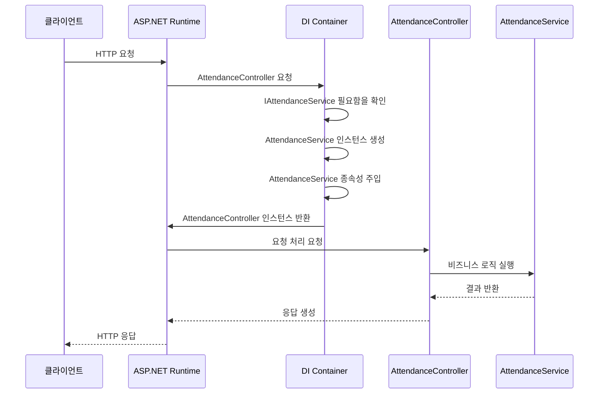
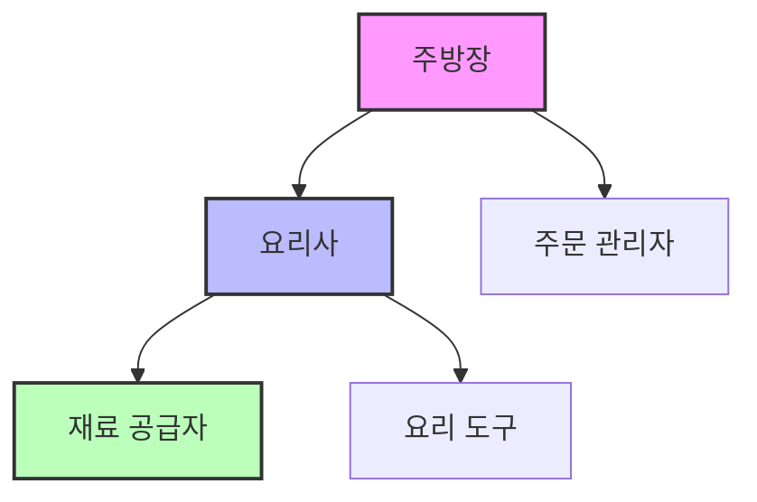

# Chapter 10: 종속성 주입 패턴

[이전 장](09_오류_코드_시스템_.md)에서는 서버에서 발생하는 다양한 오류 상황을 체계적으로 관리하는 오류 코드 시스템에 대해 배웠습니다. 이번 장에서는 객체 간의 의존 관계를 효과적으로 관리하는 **종속성 주입 패턴**(Dependency Injection Pattern)에 대해 알아보겠습니다.

## 종속성 주입이란 무엇인가요?

일상생활에서 "종속성"이란 어떤 것이 다른 것에 의존하는 관계를 말합니다. 예를 들어, 자동차는 엔진에 의존합니다. 엔진 없이는 자동차가 움직일 수 없죠.

프로그래밍에서도 비슷합니다. 어떤 클래스가 다른 클래스의 기능을 사용해야 한다면, 그 클래스는 다른 클래스에 "의존"하게 됩니다. 

종속성 주입은 이런 의존 관계를 외부에서 설정해주는 디자인 패턴입니다. 마치 자동차 공장에서 완성된 자동차를 조립할 때, 필요한 엔진을 외부에서 가져와 장착하는 것과 같습니다.

## 왜 종속성 주입이 필요한가요?

종속성 주입 없이 프로그래밍을 한다면 어떻게 될까요? 다음 코드를 살펴보세요:

```csharp
public class AttendanceService
{
    GameDb _gameDb;
    MasterDb _masterDb;
    
    public AttendanceService()
    {
        _gameDb = new GameDb();
        _masterDb = new MasterDb();
    }
}
```

이 코드에서 `AttendanceService`는 직접 `GameDb`와 `MasterDb` 객체를 생성합니다. 이런 방식에는 몇 가지 문제가 있습니다:

1. **테스트가 어렵습니다**: 실제 데이터베이스에 연결되어야만 테스트할 수 있습니다.
2. **유연성이 떨어집니다**: 다른 종류의 데이터베이스로 쉽게 교체할 수 없습니다.
3. **코드 결합도가 높습니다**: `AttendanceService`가 `GameDb`와 `MasterDb`의 구현 세부사항에 강하게 결합됩니다.

종속성 주입을 사용하면 이러한 문제를 해결할 수 있습니다.

## 종속성 주입 방식

종속성 주입은 주로 세 가지 방식으로 구현됩니다:

1. **생성자 주입**: 가장 일반적인 방식으로, 생성자를 통해 종속성을 주입합니다.
2. **메서드 주입**: 메서드를 호출하여 종속성을 주입합니다.
3. **속성 주입**: 공개 속성을 통해 종속성을 주입합니다.

우리 프로젝트에서는 주로 생성자 주입을 사용합니다. 다음 코드를 살펴보세요:

```csharp
public class AttendanceService : IAttendanceService
{
    readonly IGameDb _gameDb;
    readonly IMasterDb _masterDb;
    
    public AttendanceService(IGameDb gameDb, IMasterDb masterDb)
    {
        _gameDb = gameDb;
        _masterDb = masterDb;
    }
}
```

이 코드에서 `AttendanceService`는 생성자를 통해 필요한 종속성(`IGameDb`, `IMasterDb`)을 외부에서 받습니다. 이제 `AttendanceService`는 구체적인 구현체가 아닌 인터페이스에 의존하게 됩니다.

## 인터페이스와 종속성 주입

종속성 주입을 효과적으로 사용하려면 인터페이스가 필요합니다. 인터페이스는 "계약"과 같아서, 어떤 기능을 제공할지 정의하지만 구체적인 구현 방법은 정의하지 않습니다.

다음은 게임 데이터베이스 인터페이스의 예입니다:

```csharp
public interface IGameDb
{
    Task<GdbUserInfo> GetUserByUid(int uid);
    Task<int> UpdateRecentLogin(int uid);
    Task<IEnumerable<GdbMailboxInfo>> GetMailList(int uid);
}
```

이 인터페이스는 사용자 정보 조회, 최근 로그인 시간 업데이트, 메일 목록 조회 등의 기능을 정의합니다. 하지만 이러한 기능을 어떻게 구현할지는 명시하지 않습니다.

이 인터페이스를 구현하는 실제 클래스는 다음과 같습니다:

```csharp
public class GameDb : IGameDb
{
    // 구현 세부사항...
    
    public async Task<GdbUserInfo> GetUserByUid(int uid)
    {
        return await _queryFactory.Query("user")
                               .Where("uid", uid)
                               .FirstOrDefaultAsync<GdbUserInfo>();
    }
}
```

인터페이스를 사용함으로써, 필요에 따라 다른 구현체로 쉽게 교체할 수 있습니다.

## ASP.NET Core의 종속성 주입 컨테이너

ASP.NET Core는 내장된 종속성 주입 컨테이너를 제공합니다. 이 컨테이너는 응용 프로그램의 시작 시점에 설정하고, 필요한 모든 종속성을 등록합니다.

우리 프로젝트의 `Program.cs` 파일을 살펴보겠습니다:

```csharp
WebApplicationBuilder builder = WebApplication.CreateBuilder(args);

// 서비스 등록
builder.Services.AddTransient<IGameDb, GameDb>();
builder.Services.AddSingleton<IMemoryDb, MemoryDb>();
builder.Services.AddSingleton<IMasterDb, MasterDb>();
builder.Services.AddTransient<IAuthService, AuthService>();
builder.Services.AddTransient<IFriendService, FriendService>();
```

이 코드는 종속성 주입 컨테이너에 다양한 서비스를 등록하고 있습니다. 각 줄은 인터페이스와 그 구현체를 연결합니다. 예를 들어, `IGameDb` 인터페이스가 필요한 곳에 `GameDb` 클래스의 인스턴스를 제공하라고 컨테이너에 지시합니다.

여기서 사용되는, `AddTransient`, `AddSingleton`과 같은 메서드는 서비스의 수명을 정의합니다:

1. **AddTransient**: 서비스가 필요할 때마다 새 인스턴스를 만듭니다.
2. **AddSingleton**: 첫 요청 시 인스턴스를 만들고, 이후로는 같은 인스턴스를 재사용합니다.
3. **AddScoped**: HTTP 요청당 하나의 인스턴스를 사용합니다.

## 컨트롤러에서의 종속성 주입

이제 컨트롤러에서 어떻게 종속성 주입을 사용하는지 살펴보겠습니다:

```csharp
[ApiController]
[Route("[controller]")]
public class AttendanceCheckController : ControllerBase
{
    readonly ILogger<AttendanceCheckController> _logger;
    readonly IAttendanceService _attendanceService;

    public AttendanceCheckController(
        ILogger<AttendanceCheckController> logger, 
        IAttendanceService attendanceService)
    {
        _logger = logger;
        _attendanceService = attendanceService;
    }
```

이 코드에서 `AttendanceCheckController`는 생성자를 통해 `ILogger`와 `IAttendanceService`를 주입받습니다. ASP.NET Core는 요청이 들어올 때 자동으로 이러한 종속성을 주입합니다.

이제 컨트롤러는 실제 `AttendanceService` 구현체에 직접 의존하지 않고, `IAttendanceService` 인터페이스에만 의존합니다. 이로써 나중에 다른 구현체로 교체하기 쉬워집니다.

## 서비스 계층에서의 종속성 주입

서비스 계층([서비스 계층 패턴](03_서비스_계층_패턴_.md))에서도 종속성 주입이 사용됩니다:

```csharp
public class AttendanceService : IAttendanceService
{
    readonly ILogger<AttendanceService> _logger;
    readonly IGameDb _gameDb;
    readonly IMasterDb _masterDb;
    readonly IItemService _itemService;
    
    public AttendanceService(
        ILogger<AttendanceService> logger, 
        IGameDb gameDb, 
        IMasterDb masterDb,
        IItemService itemService)
    {
        _logger = logger;
        _gameDb = gameDb;
        _masterDb = masterDb;
        _itemService = itemService;
    }
```

이 코드에서는 `AttendanceService`가 여러 종속성(`ILogger`, `IGameDb`, `IMasterDb`, `IItemService`)을 주입받습니다. 여기서 특별한 점은 다른 서비스(`IItemService`)도 종속성으로 주입받는다는 것입니다. 이를 통해 서비스 간의 협력이 가능해집니다.

## 종속성 주입의 내부 동작 방식

종속성 주입이 내부적으로 어떻게 작동하는지 살펴보겠습니다. 다음 시퀀스 다이어그램은 요청이 처리되는 과정에서 종속성이 어떻게 주입되는지 보여줍니다:



이 다이어그램은 다음과 같은 과정을 보여줍니다:

1. 클라이언트가 HTTP 요청을 보냅니다.
2. ASP.NET 런타임이 요청을 받고, 적절한 컨트롤러를 찾기 위해 DI 컨테이너에 요청합니다.
3. DI 컨테이너는 컨트롤러를 만들기 위해 필요한 종속성(IAttendanceService 등)을 확인합니다.
4. DI 컨테이너는 AttendanceService 인스턴스를 생성하고, 그에 필요한 종속성도 주입합니다.
5. 준비된 컨트롤러 인스턴스가 ASP.NET 런타임에 반환됩니다.
6. 컨트롤러는 요청을 처리하기 위해 주입받은 서비스를 호출합니다.
7. 서비스가 비즈니스 로직을 실행하고 결과를 반환합니다.
8. 컨트롤러는 응답을 생성하고, 이는 클라이언트에게 전달됩니다.

## 종속성 주입의 장점

종속성 주입 패턴을 사용하면 다음과 같은 장점이 있습니다:

1. **테스트 용이성**: 실제 구현체 대신 테스트용 가짜 객체(Mock)을 주입할 수 있어, 단위 테스트가 쉬워집니다.
2. **유연성**: 인터페이스를 통해 종속성을 주입받으므로, 구현체를 쉽게 교체할 수 있습니다.
3. **관심사 분리**: 각 클래스는 자신의 핵심 기능에만 집중할 수 있습니다.
4. **코드 재사용성**: 공통 기능을 가진 서비스를 여러 곳에서 재사용할 수 있습니다.
5. **유지보수성**: 코드 결합도가 낮아져 유지보수가 쉬워집니다.

## 테스트에서의 종속성 주입 활용

종속성 주입의 큰 장점 중 하나는 테스트 용이성입니다. 다음은 단위 테스트에서 종속성 주입을 활용하는 예시입니다:

```csharp
[Fact]
public async Task CheckAttendance_ShouldReturnRewards_WhenSuccessful()
{
    // 가짜 종속성 설정
    var mockLogger = new Mock<ILogger<AttendanceService>>();
    var mockGameDb = new Mock<IGameDb>();
    var mockMasterDb = new Mock<IMasterDb>();
    var mockItemService = new Mock<IItemService>();
    
    // 가짜 동작 설정
    mockGameDb.Setup(db => db.CheckAttendanceById(1))
              .ReturnsAsync(1); // 성공적인 출석 체크 시뮬레이션
```

이 코드는 `AttendanceService`를 테스트하기 위해 모든 종속성을 가짜 객체(Mock)로 대체합니다. 이를 통해 데이터베이스나 다른 서비스에 실제로 연결하지 않고도 테스트할 수 있습니다.

## 직접 종속성 주입 컨테이너 사용하기

때로는 컨트롤러나 서비스 외부에서 종속성 주입 컨테이너를 직접 사용해야 할 수도 있습니다. 프로그램 시작 시점에서의 예시를 살펴보겠습니다:

```csharp
WebApplication app = builder.Build();

// 마스터 데이터 로드
IMasterDb masterDataDB = app.Services.GetRequiredService<IMasterDb>();
await masterDataDB.Load();
```

이 코드는 응용 프로그램 시작 시 `IMasterDb` 서비스를 직접 요청하여 마스터 데이터를 로드합니다. `GetRequiredService` 메서드는 DI 컨테이너에서 해당 서비스의 인스턴스를 가져옵니다.

## 종속성 주입 시 주의사항

종속성 주입을 사용할 때 주의해야 할 몇 가지 사항이 있습니다:

1. **순환 종속성 피하기**: A가 B에 의존하고, B가 다시 A에 의존하는 상황은 피해야 합니다.
2. **너무 많은 종속성 피하기**: 한 클래스가 너무 많은 종속성을 가지면 설계가 복잡해집니다.
3. **적절한 수명 선택하기**: 서비스의 특성에 맞게 Transient, Singleton, Scoped 중 적절한 수명을 선택해야 합니다.
4. **필요한 종속성만 주입하기**: 실제로 필요한 종속성만 주입받아야 합니다.

## 현실 세계의 예시: 음식점 시스템

종속성 주입을 더 잘 이해하기 위해, 음식점 시스템을 예로 들어보겠습니다:



이 다이어그램에서:
- 주방장(AttendanceController)은 요리사와 주문 관리자가 필요합니다.
- 요리사(AttendanceService)는 재료 공급자(GameDb)와 요리 도구(ItemService)가 필요합니다.
- 재료 공급자, 요리 도구, 주문 관리자는 각각 독립적인 서비스입니다.

이 시스템에서 종속성 주입은 다음과 같이 작동합니다:
- 음식점(DI 컨테이너)은 주방장이 요리사가 필요하다는 것을 알고, 적절한 요리사를 배정합니다.
- 음식점은 또한 요리사가 재료 공급자와 요리 도구가 필요하다는 것을 알고, 이들을 요리사에게 제공합니다.
- 주방장은 자신이 직접 재료를 구하거나 도구를 준비할 필요 없이, 요리사를 통해 요리를 만들 수 있습니다.

이런 방식으로, 각 구성 요소는 자신의 핵심 역할에만 집중할 수 있고, 필요한 의존성은 외부에서 제공받습니다.

## 요약 및 다음 단계

이 장에서는 종속성 주입 패턴에 대해 배웠습니다. 종속성 주입은 객체 간의 의존 관계를 외부에서 설정함으로써, 코드의 결합도를 낮추고 테스트 용이성과 유연성을 높이는 디자인 패턴입니다. 마치 퍼즐 조각들이 서로 맞물려 전체 그림을 완성하듯, 각 구성 요소들이 자동으로 연결되어 작동하게 됩니다.

주요 내용을 정리하면:
1. 종속성 주입은 객체가 필요로 하는 의존성을 외부에서 제공받는 방식입니다.
2. ASP.NET Core는 내장된 종속성 주입 컨테이너를 제공합니다.
3. 인터페이스를 사용하여 구현체와 사용자를 분리하면 유연성이 향상됩니다.
4. 종속성 주입은 테스트 용이성, 코드 유연성, 관심사 분리 등의 장점을 제공합니다.
5. 주의사항으로는 순환 종속성 회피, 적절한 서비스 수명 선택 등이 있습니다.

종속성 주입 패턴은 게임 API 서버의 모든 구성 요소들이 서로 협력하여 작동할 수 있게 하는 핵심 메커니즘입니다. 이 패턴을 잘 이해하고 적용하면, 더 유지보수하기 쉽고 테스트 가능한 코드를 작성할 수 있습니다.

이것으로 게임 API 서버 구축을 위한 주요 패턴과 시스템에 대한 학습을 마칩니다. 이 튜토리얼에서 배운 다양한 개념과 패턴을 조합하여, 확장성 있고 유지보수가 용이한 게임 서버를 개발하는 데 활용하시기 바랍니다.

---

Generated by [AI Codebase Knowledge Builder](https://github.com/The-Pocket/Tutorial-Codebase-Knowledge)