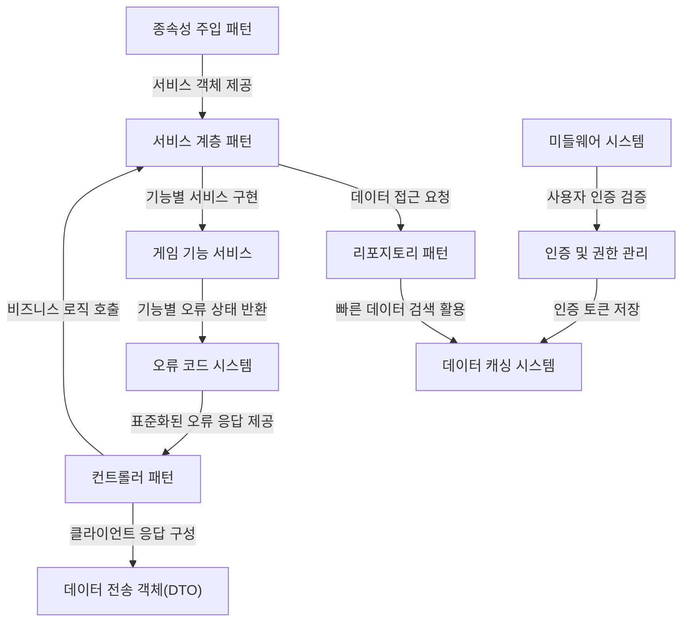

# Tutorial: GameAPIServer_Template

**GameAPIServer_Template**은 게임 서비스를 위한 API 서버 템플릿입니다. 이 프로젝트는 **계층적 아키텍처**를 사용하여 비즈니스 로직과 데이터 접근을 분리하고, 각 기능별로 **모듈화**된 구조를 가집니다.

서버는 *사용자 인증*, *친구 관리*, *메일 시스템*, *출석 체크*, *아이템 관리*와 같은 게임의 핵심 기능들을 구현하며, **컨트롤러**가 클라이언트 요청을 받아 **서비스 계층**에서 처리하고 **리포지토리**를 통해 데이터를 관리하는 흐름으로 동작합니다.

**Redis 기반 캐싱**으로 빠른 응답 속도를 제공하고, **미들웨어**를 통한 인증 및 버전 확인 기능으로 보안성을 강화했습니다. **표준화된 오류 코드**와 **DTO 패턴**을 활용해 클라이언트와의 일관된 통신을 보장합니다.

**Source Repository:** [None](None)

## Chapters

1. [컨트롤러 패턴
](01_컨트롤러_패턴_.md)
2. [데이터 전송 객체(DTO)
](02_데이터_전송_객체_dto__.md)
3. [서비스 계층 패턴
](03_서비스_계층_패턴_.md)
4. [게임 기능 서비스
](04_게임_기능_서비스_.md)
5. [리포지토리 패턴
](05_리포지토리_패턴_.md)
6. [데이터 캐싱 시스템
](06_데이터_캐싱_시스템_.md)
7. [미들웨어 시스템
](07_미들웨어_시스템_.md)
8. [인증 및 권한 관리
](08_인증_및_권한_관리_.md)
9. [오류 코드 시스템
](09_오류_코드_시스템_.md)
10. [종속성 주입 패턴
](10_종속성_주입_패턴_.md)

---

Generated by [AI Codebase Knowledge Builder](https://github.com/The-Pocket/Tutorial-Codebase-Knowledge)