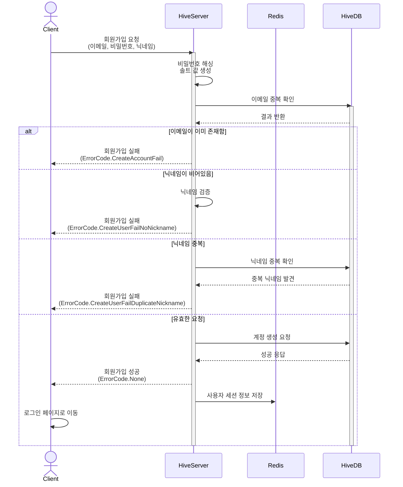

# 회원가입 프로세스 다이어그램

```mermaid
sequenceDiagram
    actor Client
    participant HiveServer
    participant Redis
    participant HiveDB
    
    %% 계정 생성 요청
    Client->>HiveServer: 회원가입 요청<br/>(이메일, 비밀번호, 닉네임)
    activate HiveServer
    
    %% 비밀번호 해싱 및 계정 검증
    HiveServer->>HiveServer: 비밀번호 해싱<br/>솔트 값 생성
    HiveServer->>HiveDB: 이메일 중복 확인
    activate HiveDB
    HiveDB-->>HiveServer: 결과 반환
    
    alt 이메일이 이미 존재함
        HiveServer-->>Client: 회원가입 실패<br/>(ErrorCode.CreateAccountFail)
    else 닉네임이 비어있음
        HiveServer->>HiveServer: 닉네임 검증
        HiveServer-->>Client: 회원가입 실패<br/>(ErrorCode.CreateUserFailNoNickname)
    else 닉네임 중복
        HiveServer->>HiveDB: 닉네임 중복 확인
        HiveDB-->>HiveServer: 중복 닉네임 발견
        HiveServer-->>Client: 회원가입 실패<br/>(ErrorCode.CreateUserFailDuplicateNickname)
    else 유효한 요청
        %% DB에 계정 생성
        HiveServer->>HiveDB: 계정 생성 요청
        HiveDB-->>HiveServer: 성공 응답
        
        %% 결과 반환
        HiveServer-->>Client: 회원가입 성공<br/>(ErrorCode.None)
        HiveServer->>Redis: 사용자 세션 정보 저장
        
        %% 클라이언트 리다이렉션
        Client->>Client: 로그인 페이지로 이동
    end
    deactivate HiveDB
    deactivate HiveServer
```  