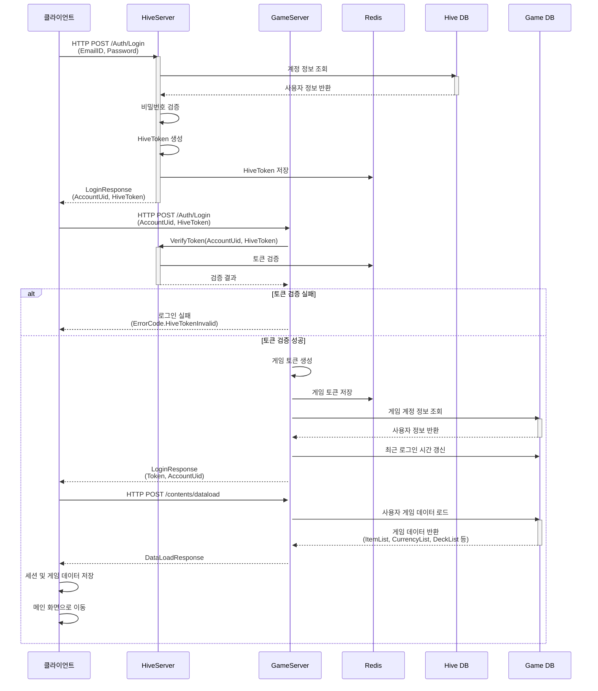

# 하이브 로그인 프로세스 다이어그램

```mermaid
sequenceDiagram
    participant Client as 클라이언트
    participant HiveServer as HiveServer
    participant GameServer as GameServer
    participant Redis as Redis
    participant HiveDB as Hive DB
    participant GameDB as Game DB

    %% 로그인 요청 시작
    Client->>HiveServer: HTTP POST /Auth/Login<br/>(EmailID, Password)
    activate HiveServer
    %% HiveServer에서 로그인 처리
    HiveServer->>HiveDB: 계정 정보 조회
    activate HiveDB
    HiveDB-->>HiveServer: 사용자 정보 반환
    deactivate HiveDB
    %% 비밀번호 검증 및 토큰 생성
    HiveServer->>HiveServer: 비밀번호 검증
    HiveServer->>HiveServer: HiveToken 생성
    HiveServer->>Redis: HiveToken 저장
    HiveServer-->>Client: LoginResponse<br/>(AccountUid, HiveToken)
    deactivate HiveServer

    %% GameServer 인증 과정
    Client->>GameServer: HTTP POST /Auth/Login<br/>(AccountUid, HiveToken)
    activate GameServer
    %% GameServer에서 HiveServer 토큰 검증
    GameServer->>HiveServer: VerifyToken(AccountUid, HiveToken)
    activate HiveServer
    HiveServer->>Redis: 토큰 검증
    HiveServer-->>GameServer: 검증 결과
    deactivate HiveServer

    alt 토큰 검증 실패
        GameServer-->>Client: 로그인 실패<br/>(ErrorCode.HiveTokenInvalid)
    else 토큰 검증 성공
        %% 게임 토큰 생성
        GameServer->>GameServer: 게임 토큰 생성
        GameServer->>Redis: 게임 토큰 저장
        
        %% 사용자 정보 확인
        GameServer->>GameDB: 게임 계정 정보 조회
        activate GameDB
        GameDB-->>GameServer: 사용자 정보 반환
        deactivate GameDB
        
        %% 로그인 시간 갱신
        GameServer->>GameDB: 최근 로그인 시간 갱신
        GameServer-->>Client: LoginResponse<br/>(Token, AccountUid)
        
        %% 게임 데이터 로드
        Client->>GameServer: HTTP POST /contents/dataload
        GameServer->>GameDB: 사용자 게임 데이터 로드
        activate GameDB
        GameDB-->>GameServer: 게임 데이터 반환<br/>(ItemList, CurrencyList, DeckList 등)
        deactivate GameDB
        GameServer-->>Client: DataLoadResponse
        
        %% 클라이언트 데이터 저장 및 메인 화면 이동
        Client->>Client: 세션 및 게임 데이터 저장
        Client->>Client: 메인 화면으로 이동
    end
```  