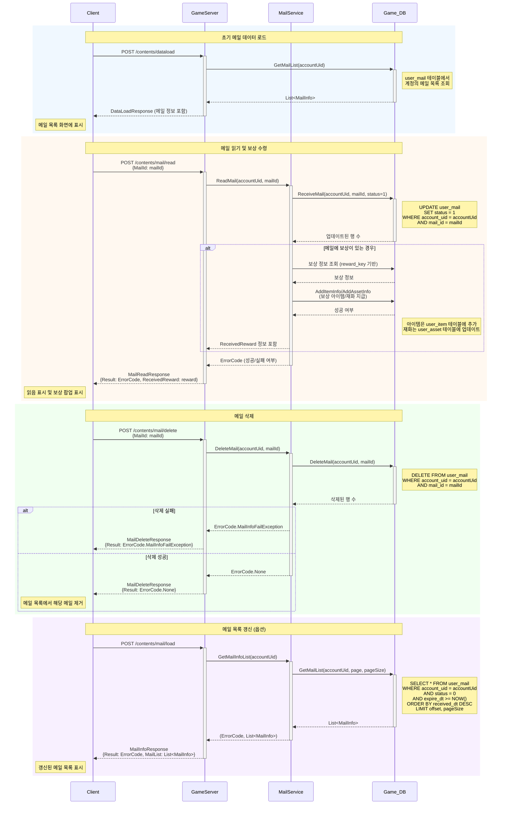

# 메일 프로세스 다이어그램

```mermaid
sequenceDiagram
    participant Client as Client
    participant GameServer as GameServer
    participant MailService as MailService
    participant GameDB as Game_DB

    %% 데이터 로드 프로세스
    rect rgb(240, 248, 255)
        Note over Client, GameDB: 초기 메일 데이터 로드
        
        Client->>+GameServer: POST /contents/dataload
        
        GameServer->>+GameDB: GetMailList(accountUid)
        Note right of GameDB: user_mail 테이블에서<br>계정의 메일 목록 조회
        GameDB-->>-GameServer: List<MailInfo>
        
        GameServer-->>-Client: DataLoadResponse (메일 정보 포함)
        Note left of Client: 메일 목록 화면에 표시
    end

    %% 메일 읽기 프로세스
    rect rgb(255, 248, 240)
        Note over Client, GameDB: 메일 읽기 및 보상 수령
        
        Client->>+GameServer: POST /contents/mail/read<br>{MailId: mailId}
        
        GameServer->>+MailService: ReadMail(accountUid, mailId)
        
        MailService->>+GameDB: ReceiveMail(accountUid, mailId, status=1)
        Note right of GameDB: UPDATE user_mail<br>SET status = 1<br>WHERE account_uid = accountUid<br>AND mail_id = mailId
        GameDB-->>-MailService: 업데이트된 행 수
        
        alt 메일에 보상이 있는 경우
            MailService->>GameDB: 보상 정보 조회 (reward_key 기반)
            GameDB-->>MailService: 보상 정보
            
            MailService->>GameDB: AddItemInfo/AddAssetInfo<br>(보상 아이템/재화 지급)
            GameDB-->>MailService: 성공 여부
            Note right of GameDB: 아이템은 user_item 테이블에 추가<br>재화는 user_asset 테이블에 업데이트
            
            MailService-->>GameServer: ReceivedReward 정보 포함
        end
        
        MailService-->>-GameServer: ErrorCode (성공/실패 여부)
        
        GameServer-->>-Client: MailReadResponse<br>{Result: ErrorCode, ReceivedReward: reward}
        Note left of Client: 읽음 표시 및 보상 팝업 표시
    end

    %% 메일 삭제 프로세스
    rect rgb(240, 255, 240)
        Note over Client, GameDB: 메일 삭제
        
        Client->>+GameServer: POST /contents/mail/delete<br>{MailId: mailId}
        
        GameServer->>+MailService: DeleteMail(accountUid, mailId)
        
        MailService->>+GameDB: DeleteMail(accountUid, mailId)
        Note right of GameDB: DELETE FROM user_mail<br>WHERE account_uid = accountUid<br>AND mail_id = mailId
        GameDB-->>-MailService: 삭제된 행 수
        
        alt 삭제 실패
            MailService-->>GameServer: ErrorCode.MailInfoFailException
            GameServer-->>Client: MailDeleteResponse<br>{Result: ErrorCode.MailInfoFailException}
        else 삭제 성공
            MailService-->>-GameServer: ErrorCode.None
            GameServer-->>-Client: MailDeleteResponse<br>{Result: ErrorCode.None}
            Note left of Client: 메일 목록에서 해당 메일 제거
        end
    end

    %% 메일 목록 갱신 프로세스 (추가)
    rect rgb(248, 240, 255)
        Note over Client, GameDB: 메일 목록 갱신 (옵션)
        
        Client->>+GameServer: POST /contents/mail/load
        
        GameServer->>+MailService: GetMailInfoList(accountUid)
        
        MailService->>+GameDB: GetMailList(accountUid, page, pageSize)
        Note right of GameDB: SELECT * FROM user_mail<br>WHERE account_uid = accountUid<br>AND status = 0<br>AND expire_dt >= NOW()<br>ORDER BY received_dt DESC<br>LIMIT offset, pageSize
        GameDB-->>-MailService: List<MailInfo>
        
        MailService-->>-GameServer: (ErrorCode, List<MailInfo>)
        
        GameServer-->>-Client: MailInfoResponse<br>{Result: ErrorCode, MailList: List<MailInfo>}
        Note left of Client: 갱신된 메일 목록 표시
    end
```  
