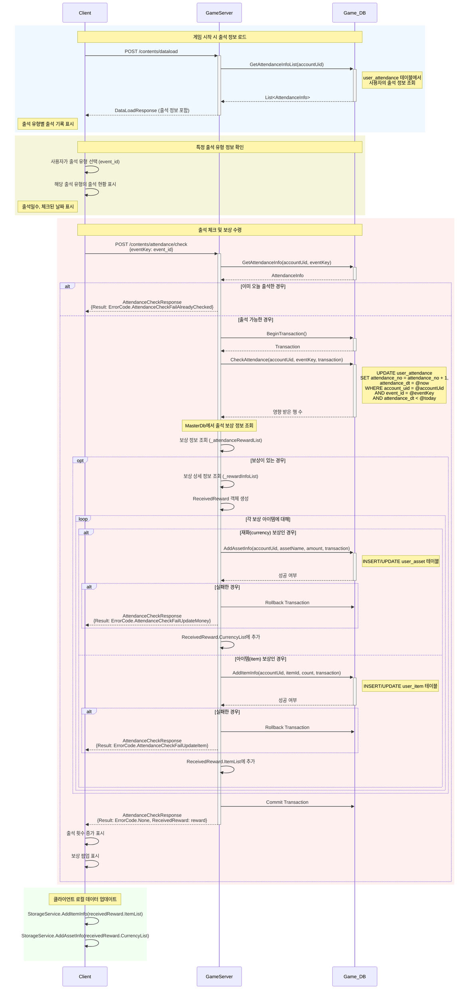

# 출석 프로세스 다이어그램

```mermaid
sequenceDiagram
    participant Client as Client
    participant GameServer as GameServer
    participant Game_DB as Game_DB
    
    %% 초기 데이터 로드 단계
    rect rgb(240, 248, 255)
        Note over Client, Game_DB: 게임 시작 시 출석 정보 로드
        
        Client->>+GameServer: POST /contents/dataload
        
        GameServer->>+Game_DB: GetAttendanceInfoList(accountUid)
        Note right of Game_DB: user_attendance 테이블에서<br>사용자의 출석 정보 조회
        
        Game_DB-->>-GameServer: List<AttendanceInfo>
        GameServer-->>-Client: DataLoadResponse (출석 정보 포함)
        
        Note left of Client: 출석 유형별 출석 기록 표시
    end
    
    %% 출석 정보 조회 단계 (UI에서 특정 출석 유형 선택 시)
    rect rgb(245, 245, 220)
        Note over Client, Game_DB: 특정 출석 유형 정보 확인
        
        Client->>Client: 사용자가 출석 유형 선택 (event_id)
        
        Client->>Client: 해당 출석 유형의 출석 현황 표시
        Note left of Client: 출석일수, 체크된 날짜 표시
    end
    
    %% 출석 체크 단계
    rect rgb(255, 240, 240)
        Note over Client, Game_DB: 출석 체크 및 보상 수령
        
        Client->>+GameServer: POST /contents/attendance/check<br>{eventKey: event_id}
        
        GameServer->>+Game_DB: GetAttendanceInfo(accountUid, eventKey)
        Game_DB-->>-GameServer: AttendanceInfo
        
        alt 이미 오늘 출석한 경우
            GameServer-->>Client: AttendanceCheckResponse<br>{Result: ErrorCode.AttendanceCheckFailAlreadyChecked}
        else 출석 가능한 경우
            GameServer->>+Game_DB: BeginTransaction()
            Game_DB-->>-GameServer: Transaction
            
            GameServer->>+Game_DB: CheckAttendance(accountUid, eventKey, transaction)
            Note right of Game_DB: UPDATE user_attendance<br>SET attendance_no = attendance_no + 1,<br>attendance_dt = @now<br>WHERE account_uid = @accountUid<br>AND event_id = @eventKey<br>AND attendance_dt < @today
            Game_DB-->>-GameServer: 영향 받은 행 수
            
            Note over GameServer: MasterDb에서 출석 보상 정보 조회
            GameServer->>GameServer: 보상 정보 조회 (_attendanceRewardList)
            
            opt 보상이 있는 경우
                GameServer->>GameServer: 보상 상세 정보 조회 (_rewardInfoList)
                
                GameServer->>GameServer: ReceivedReward 객체 생성
                
                loop 각 보상 아이템에 대해
                    alt 재화(currency) 보상인 경우
                        GameServer->>+Game_DB: AddAssetInfo(accountUid, assetName, amount, transaction)
                        Note right of Game_DB: INSERT/UPDATE user_asset 테이블
                        Game_DB-->>-GameServer: 성공 여부
                        
                        alt 실패한 경우
                            GameServer->>Game_DB: Rollback Transaction
                            GameServer-->>Client: AttendanceCheckResponse<br>{Result: ErrorCode.AttendanceCheckFailUpdateMoney}
                        end
                        
                        GameServer->>GameServer: ReceivedReward.CurrencyList에 추가
                    else 아이템(item) 보상인 경우
                        GameServer->>+Game_DB: AddItemInfo(accountUid, itemId, count, transaction)
                        Note right of Game_DB: INSERT/UPDATE user_item 테이블
                        Game_DB-->>-GameServer: 성공 여부
                        
                        alt 실패한 경우
                            GameServer->>Game_DB: Rollback Transaction
                            GameServer-->>Client: AttendanceCheckResponse<br>{Result: ErrorCode.AttendanceCheckFailUpdateItem}
                        end
                        
                        GameServer->>GameServer: ReceivedReward.ItemList에 추가
                    end
                end
            end
            
            GameServer->>Game_DB: Commit Transaction
            
            GameServer-->>-Client: AttendanceCheckResponse<br>{Result: ErrorCode.None, ReceivedReward: reward}
            
            Client->>Client: 출석 횟수 증가 표시
            Client->>Client: 보상 팝업 표시
        end
    end
    
    %% 로컬 스토리지 업데이트
    rect rgb(240, 255, 240)
        Note over Client: 클라이언트 로컬 데이터 업데이트
        
        Client->>Client: StorageService.AddItemInfo(receivedReward.ItemList)
        Client->>Client: StorageService.AddAssetInfo(receivedReward.CurrencyList)
    end
```
