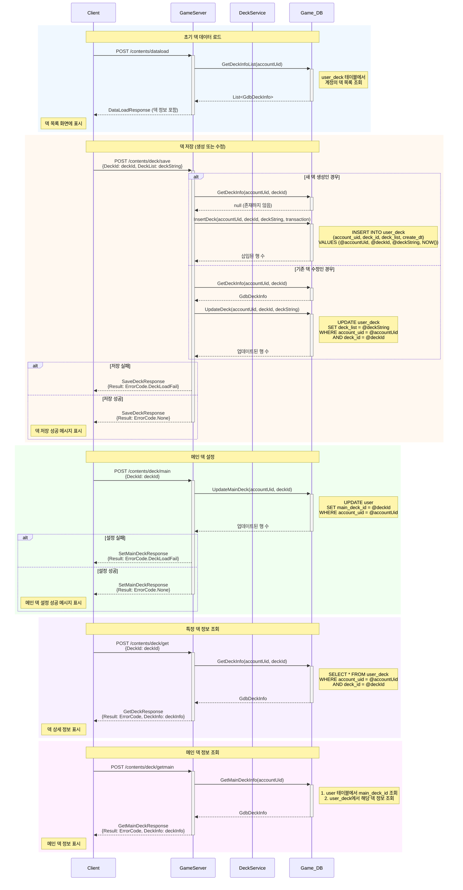

# 덱 프로세스 다이어그램

```mermaid
sequenceDiagram
    participant Client as Client
    participant GameServer as GameServer
    participant DeckService as DeckService
    participant GameDB as Game_DB

    %% 덱 정보 로드 프로세스
    rect rgb(240, 248, 255)
        Note over Client, GameDB: 초기 덱 데이터 로드
        
        Client->>+GameServer: POST /contents/dataload
        
        GameServer->>+GameDB: GetDeckInfoList(accountUid)
        Note right of GameDB: user_deck 테이블에서<br>계정의 덱 목록 조회
        GameDB-->>-GameServer: List<GdbDeckInfo>
        
        GameServer-->>-Client: DataLoadResponse (덱 정보 포함)
        Note left of Client: 덱 목록 화면에 표시
    end

    %% 덱 저장 프로세스
    rect rgb(255, 248, 240)
        Note over Client, GameDB: 덱 저장 (생성 또는 수정)
        
        Client->>+GameServer: POST /contents/deck/save<br>{DeckId: deckId, DeckList: deckString}
        
        alt 새 덱 생성인 경우
            GameServer->>+GameDB: GetDeckInfo(accountUid, deckId)
            GameDB-->>-GameServer: null (존재하지 않음)
            
            GameServer->>+GameDB: InsertDeck(accountUid, deckId, deckString, transaction)
            Note right of GameDB: INSERT INTO user_deck<br>(account_uid, deck_id, deck_list, create_dt)<br>VALUES (@accountUid, @deckId, @deckString, NOW())
            GameDB-->>-GameServer: 삽입된 행 수
        else 기존 덱 수정인 경우
            GameServer->>+GameDB: GetDeckInfo(accountUid, deckId)
            GameDB-->>-GameServer: GdbDeckInfo
            
            GameServer->>+GameDB: UpdateDeck(accountUid, deckId, deckString)
            Note right of GameDB: UPDATE user_deck<br>SET deck_list = @deckString<br>WHERE account_uid = @accountUid<br>AND deck_id = @deckId
            GameDB-->>-GameServer: 업데이트된 행 수
        end
        
        alt 저장 실패
            GameServer-->>Client: SaveDeckResponse<br>{Result: ErrorCode.DeckLoadFail}
        else 저장 성공
            GameServer-->>-Client: SaveDeckResponse<br>{Result: ErrorCode.None}
            Note left of Client: 덱 저장 성공 메시지 표시
        end
    end

    %% 메인 덱 설정 프로세스
    rect rgb(240, 255, 240)
        Note over Client, GameDB: 메인 덱 설정
        
        Client->>+GameServer: POST /contents/deck/main<br>{DeckId: deckId}
        
        GameServer->>+GameDB: UpdateMainDeck(accountUid, deckId)
        Note right of GameDB: UPDATE user<br>SET main_deck_id = @deckId<br>WHERE account_uid = @accountUid
        GameDB-->>-GameServer: 업데이트된 행 수
        
        alt 설정 실패
            GameServer-->>Client: SetMainDeckResponse<br>{Result: ErrorCode.DeckLoadFail}
        else 설정 성공
            GameServer-->>-Client: SetMainDeckResponse<br>{Result: ErrorCode.None}
            Note left of Client: 메인 덱 설정 성공 메시지 표시
        end
    end
    
    %% 덱 조회 프로세스 (특정 덱 정보)
    rect rgb(248, 240, 255)
        Note over Client, GameDB: 특정 덱 정보 조회
        
        Client->>+GameServer: POST /contents/deck/get<br>{DeckId: deckId}
        
        GameServer->>+GameDB: GetDeckInfo(accountUid, deckId)
        Note right of GameDB: SELECT * FROM user_deck<br>WHERE account_uid = @accountUid<br>AND deck_id = @deckId
        GameDB-->>-GameServer: GdbDeckInfo
        
        GameServer-->>-Client: GetDeckResponse<br>{Result: ErrorCode, DeckInfo: deckInfo}
        Note left of Client: 덱 상세 정보 표시
    end
    
    %% 메인 덱 조회 프로세스
    rect rgb(255, 240, 255)
        Note over Client, GameDB: 메인 덱 정보 조회
        
        Client->>+GameServer: POST /contents/deck/getmain
        
        GameServer->>+GameDB: GetMainDeckInfo(accountUid)
        Note right of GameDB: 1. user 테이블에서 main_deck_id 조회<br>2. user_deck에서 해당 덱 정보 조회
        GameDB-->>-GameServer: GdbDeckInfo
        
        GameServer-->>-Client: GetMainDeckResponse<br>{Result: ErrorCode, DeckInfo: deckInfo}
        Note left of Client: 메인 덱 정보 표시
    end
```  
