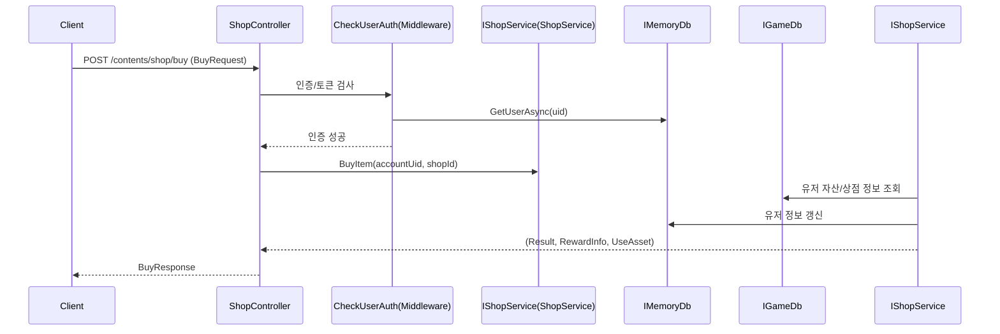

# 상점 프로세스 다이어그램

```mermaid
sequenceDiagram
    participant Client
    participant ShopController
    participant CheckUserAuth(Middleware)
    participant IShopService(ShopService)
    participant IMemoryDb
    participant IGameDb

    Client->>ShopController: POST /contents/shop/buy (BuyRequest)
    ShopController->>CheckUserAuth(Middleware): 인증/토큰 검사
    CheckUserAuth(Middleware)->>IMemoryDb: GetUserAsync(uid)
    CheckUserAuth(Middleware)-->>ShopController: 인증 성공
    ShopController->>IShopService(ShopService): BuyItem(accountUid, shopId)
    IShopService->>IGameDb: 유저 자산/상점 정보 조회
    IShopService->>IMemoryDb: 유저 정보 갱신
    IShopService-->>ShopController: (Result, RewardInfo, UseAsset)
    ShopController-->>Client: BuyResponse
```  