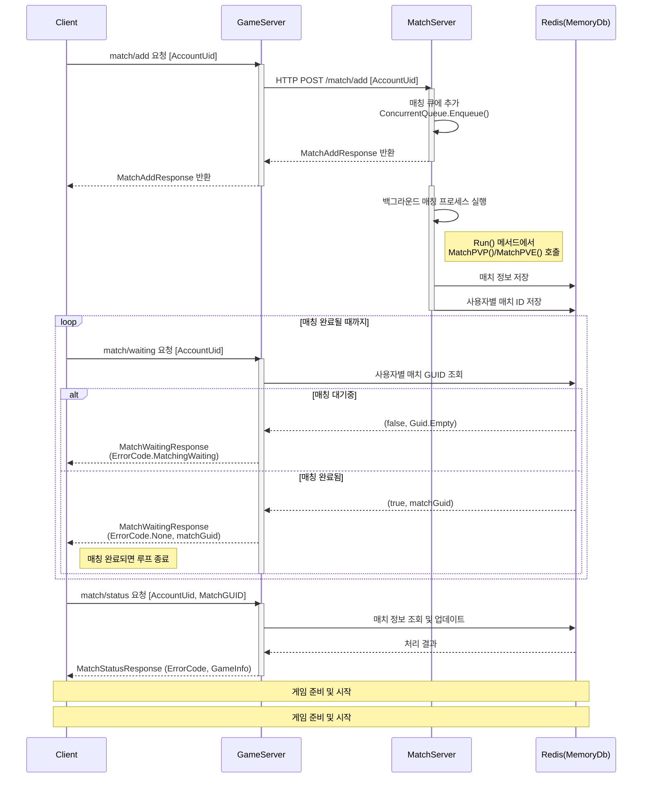

# 매칭 프로세스 다이어그램

```mermaid
sequenceDiagram
    participant Client
    participant GameServer
    participant MatchServer
    participant Redis as Redis(MemoryDb)
    
    %% 매칭 요청 시작
    Client->>GameServer: match/add 요청 [AccountUid]
    activate GameServer
    GameServer->>MatchServer: HTTP POST /match/add [AccountUid]
    activate MatchServer
    MatchServer->>MatchServer: 매칭 큐에 추가<br/>ConcurrentQueue.Enqueue()
    MatchServer-->>GameServer: MatchAddResponse 반환
    deactivate MatchServer
    GameServer-->>Client: MatchAddResponse 반환
    deactivate GameServer
    
    %% 백그라운드 매칭 처리
    activate MatchServer
    MatchServer->>MatchServer: 백그라운드 매칭 프로세스 실행
    note right of MatchServer: Run() 메서드에서<br/>MatchPVP()/MatchPVE() 호출
    MatchServer->>Redis: 매치 정보 저장
    MatchServer->>Redis: 사용자별 매치 ID 저장
    deactivate MatchServer
    
    %% 클라이언트 매칭 대기 폴링
    loop 매칭 완료될 때까지
        Client->>GameServer: match/waiting 요청 [AccountUid]
        activate GameServer
        GameServer->>Redis: 사용자별 매치 GUID 조회
        
        alt 매칭 대기중
            Redis-->>GameServer: (false, Guid.Empty)
            GameServer-->>Client: MatchWaitingResponse<br/>(ErrorCode.MatchingWaiting)
        else 매칭 완료됨
            Redis-->>GameServer: (true, matchGuid)
            GameServer-->>Client: MatchWaitingResponse<br/>(ErrorCode.None, matchGuid)
            note right of Client: 매칭 완료되면 루프 종료
        end
        deactivate GameServer
    end
    
    %% 클라이언트 매칭 상태 확인
    Client->>GameServer: match/status 요청 [AccountUid, MatchGUID]
    activate GameServer
    GameServer->>Redis: 매치 정보 조회 및 업데이트
    Redis-->>GameServer: 처리 결과
    GameServer-->>Client: MatchStatusResponse (ErrorCode, GameInfo)
    deactivate GameServer
    
    %% 최종 게임 시작
    note over Client, Redis: 게임 준비 및 시작
    
    %% 최종 게임 시작
    note over Client, Redis: 게임 준비 및 시작
```