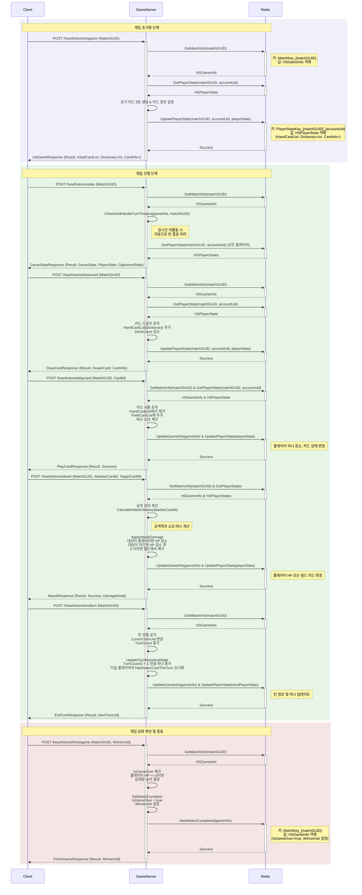

# 하스스톤 게임 프로세스 다이어그램

```mermaid
sequenceDiagram
    participant Client
    participant GameServer
    participant Redis

    %% 1. 게임 초기화 단계
    rect rgb(240, 240, 250)
        Note over Client,Redis: 게임 초기화 단계
        Client->>+GameServer: POST /hearthstone/initgame {MatchGUID}
        GameServer->>+Redis: GetMatchInfo(matchGUID)
        Note right of Redis: 키: MatchKey_[matchGUID]<br>값: HSGameInfo 객체
        Redis-->>-GameServer: HSGameInfo
        
        GameServer->>+Redis: GetPlayerState(matchGUID, accountUid)
        Redis-->>-GameServer: HSPlayerState
        
        GameServer->>GameServer: 초기 카드 3장 생성 & 카드 정보 설정
        
        GameServer->>+Redis: UpdatePlayerState(matchGUID, accountUid, playerState)
        Note right of Redis: 키: PlayerStateKey_[matchGUID]_[accountUid]<br>값: HSPlayerState 객체<br>(HandCardList: Dictionary<int, CardInfo>)
        Redis-->>-GameServer: Success
        
        GameServer-->>-Client: InitGameResponse {Result, InitialCardList: Dictionary<int, CardInfo>}
    end

    %% 2. 카드 교체 단계는 주석 처리되어 제거 또는 선택 표시

    %% 3. 게임 진행 단계
    rect rgb(230, 245, 230)
        Note over Client,Redis: 게임 진행 단계
        
        %% 게임 상태 조회 및 턴 타임아웃 처리
        Client->>+GameServer: POST /hearthstone/state {MatchGUID}
        GameServer->>+Redis: GetMatchInfo(matchGUID)
        Redis-->>-GameServer: HSGameInfo
        
        GameServer->>GameServer: CheckAndHandleTurnTimeout(gameInfo, matchGUID)
        Note right of GameServer: 장시간 미활동 시<br>자동으로 턴 종료 처리
        
        GameServer->>+Redis: GetPlayerState(matchGUID, accountUid) (모든 플레이어)
        Redis-->>-GameServer: HSPlayerStates
        
        GameServer-->>-Client: GameStateResponse {Result, GameState, PlayerState, OpponentState}
        
        %% 턴 시작 - 카드 드로우
        Client->>+GameServer: POST /hearthstone/drawcard {MatchGUID}
        
        GameServer->>+Redis: GetMatchInfo(matchGUID)
        Redis-->>-GameServer: HSGameInfo
        
        GameServer->>+Redis: GetPlayerState(matchGUID, accountUid)
        Redis-->>-GameServer: HSPlayerState
        
        GameServer->>GameServer: 카드 드로우 로직<br>HandCardList(Dictionary) 추가<br>DeckCount 감소
        
        GameServer->>+Redis: UpdatePlayerState(matchGUID, accountUid, playerState)
        Redis-->>-GameServer: Success
        
        GameServer-->>-Client: DrawCardResponse {Result, DrawnCard: CardInfo}

        %% 카드 사용
        Client->>+GameServer: POST /hearthstone/playcard {MatchGUID, CardId}
        
        GameServer->>+Redis: GetMatchInfo(matchGUID) & GetPlayerState(matchGUID, accountUid)
        Redis-->>-GameServer: HSGameInfo & HSPlayerState
        
        GameServer->>GameServer: 카드 사용 로직<br>HandCardList에서 제거<br>FieldCardList에 추가<br>마나 소모 계산
        
        GameServer->>+Redis: UpdateGameInfo(gameInfo) & UpdatePlayerState(playerState)
        Note right of Redis: 플레이어 마나 감소, 카드 상태 변경
        Redis-->>-GameServer: Success
        
        GameServer-->>-Client: PlayCardResponse {Result, Success}

        %% 공격
        Client->>+GameServer: POST /hearthstone/attack {MatchGUID, AttackerCardId, TargetCardId}
        
        GameServer->>+Redis: GetMatchInfo(matchGUID) & GetPlayerStates
        Redis-->>-GameServer: HSGameInfo & HSPlayerStates
        
        GameServer->>GameServer: 공격 로직 계산<br>CalculateAttackValues(attackerCardId)
        Note right of GameServer: 공격력과 소모 마나 계산
        
        GameServer->>GameServer: ApplyAttackDamage<br>대상이 플레이어면 HP 감소<br>대상이 카드면 HP 감소 후<br>0 이하면 필드에서 제거
        
        GameServer->>+Redis: UpdateGameInfo(gameInfo) & UpdatePlayerState(playerState)
        Note right of Redis: 플레이어 HP 또는 필드 카드 변경
        Redis-->>-GameServer: Success
        
        GameServer-->>-Client: AttackResponse {Result, Success, DamageDealt}

        %% 턴 종료
        Client->>+GameServer: POST /hearthstone/endturn {MatchGUID}
        
        GameServer->>+Redis: GetMatchInfo(matchGUID)
        Redis-->>-GameServer: HSGameInfo
        
        GameServer->>GameServer: 턴 전환 로직<br>CurrentTurnUid 변경<br>TurnCount 증가
        
        GameServer->>GameServer: UpdateTurnManaAndState<br>TurnCount/2 + 1 만큼 마나 증가<br>다음 플레이어의 HasDrawnCardThisTurn 초기화
        
        GameServer->>+Redis: UpdateGameInfo(gameInfo) & UpdatePlayerState(nextPlayerState)
        Note right of Redis: 턴 정보 및 마나 업데이트
        Redis-->>-GameServer: Success
        
        GameServer-->>-Client: EndTurnResponse {Result, NextTurnUid}
    end

    %% 4. 게임 상태 확인 및 종료
    rect rgb(245, 230, 230)
        Note over Client,Redis: 게임 상태 확인 및 종료
        
        %% 게임 종료
        Client->>+GameServer: POST /hearthstone/finishgame {MatchGUID, WinnerUid}
        
        GameServer->>+Redis: GetMatchInfo(matchGUID)
        Redis-->>-GameServer: HSGameInfo
        
        GameServer->>GameServer: IsGameOver 체크<br>플레이어 HP <= 0이면<br>상대방 승리 결정
        
        GameServer->>GameServer: SetMatchComplete<br>IsGameOver = true<br>WinnerUid 설정
        
        GameServer->>+Redis: MarkMatchCompleted(gameInfo)
        Note right of Redis: 키: MatchKey_[matchGUID]<br>값: HSGameInfo 객체<br>(IsGameOver=true, WinnerUid 설정)
        Redis-->>-GameServer: Success
        
        GameServer-->>-Client: FinishGameResponse {Result, WinnerUid}
    end
```  