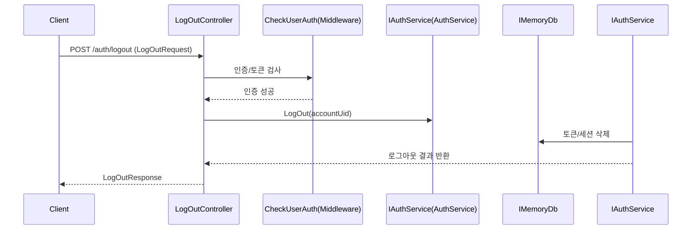

# 로그아웃 프로세스 다이어그램

```mermaid
sequenceDiagram
    participant Client
    participant LogOutController
    participant CheckUserAuth(Middleware)
    participant IAuthService(AuthService)
    participant IMemoryDb

    Client->>LogOutController: POST /auth/logout (LogOutRequest)
    LogOutController->>CheckUserAuth(Middleware): 인증/토큰 검사
    CheckUserAuth(Middleware)-->>LogOutController: 인증 성공
    LogOutController->>IAuthService(AuthService): LogOut(accountUid)
    IAuthService->>IMemoryDb: 토큰/세션 삭제
    IAuthService-->>LogOutController: 로그아웃 결과 반환
    LogOutController-->>Client: LogOutResponse
```