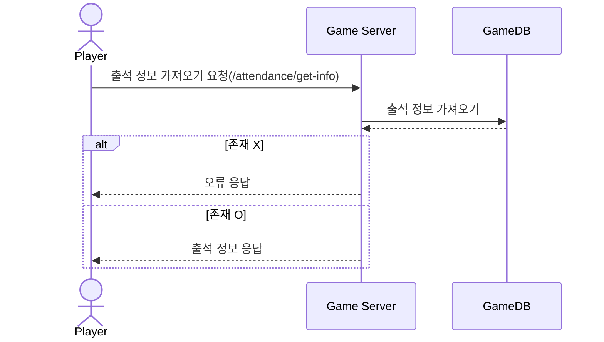
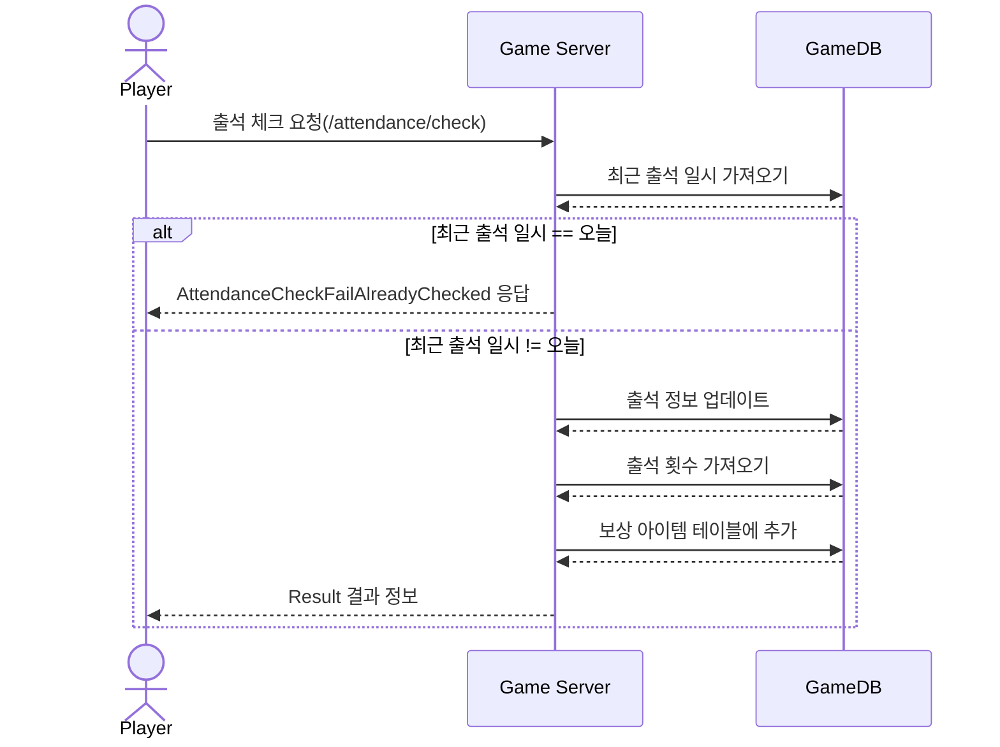

# 시퀀스 다이어그램 (Attendance)
* 출석 정보 가져오는 요청 (Attendance get info)
* 출석 체크 요청 (Attendance Check)
------------------------------

## 출석 정보 가져오는 요청
### 플레이어의 출석 정보 가져오는 요청 

------------------------------

## 출석 체크 요청
### : 플레이어가 출석 체크를 요청

------------------------------
