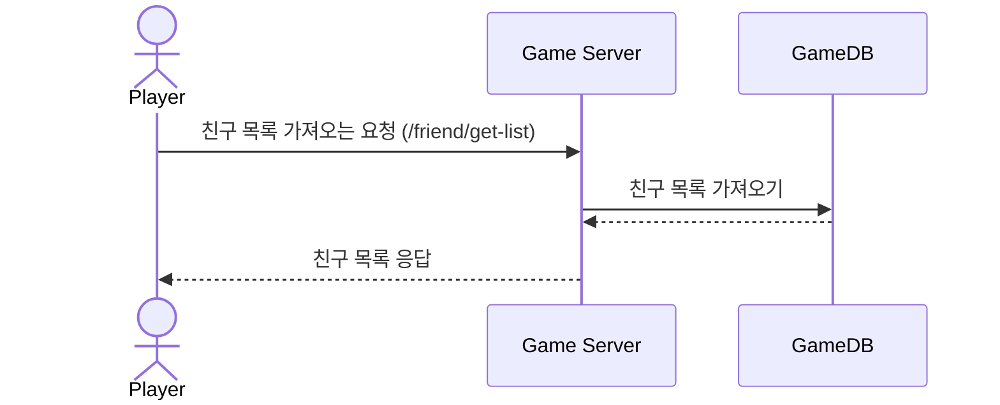
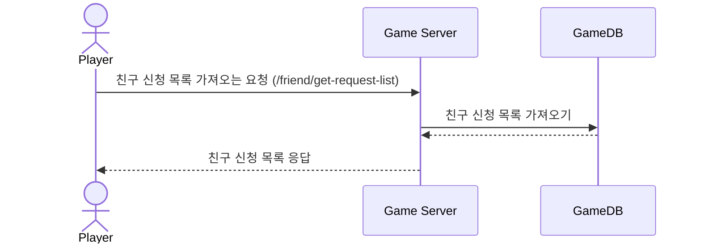
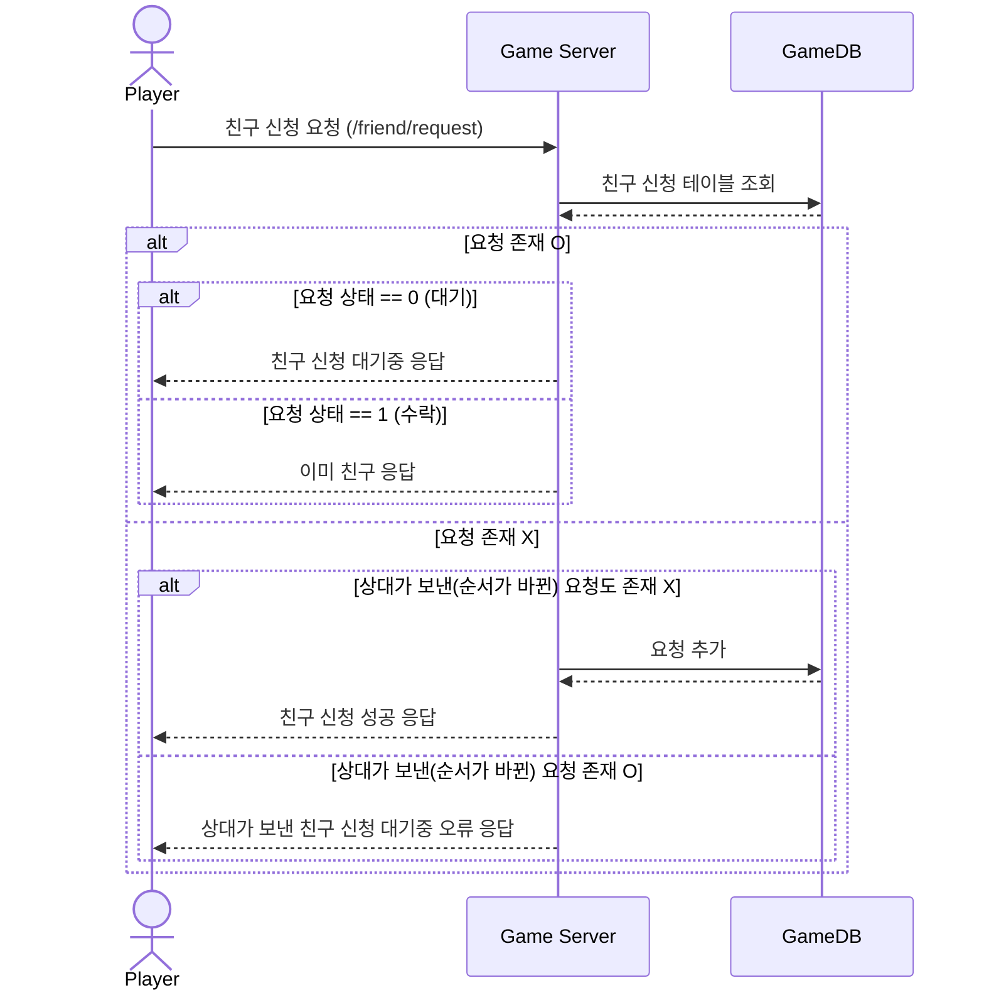
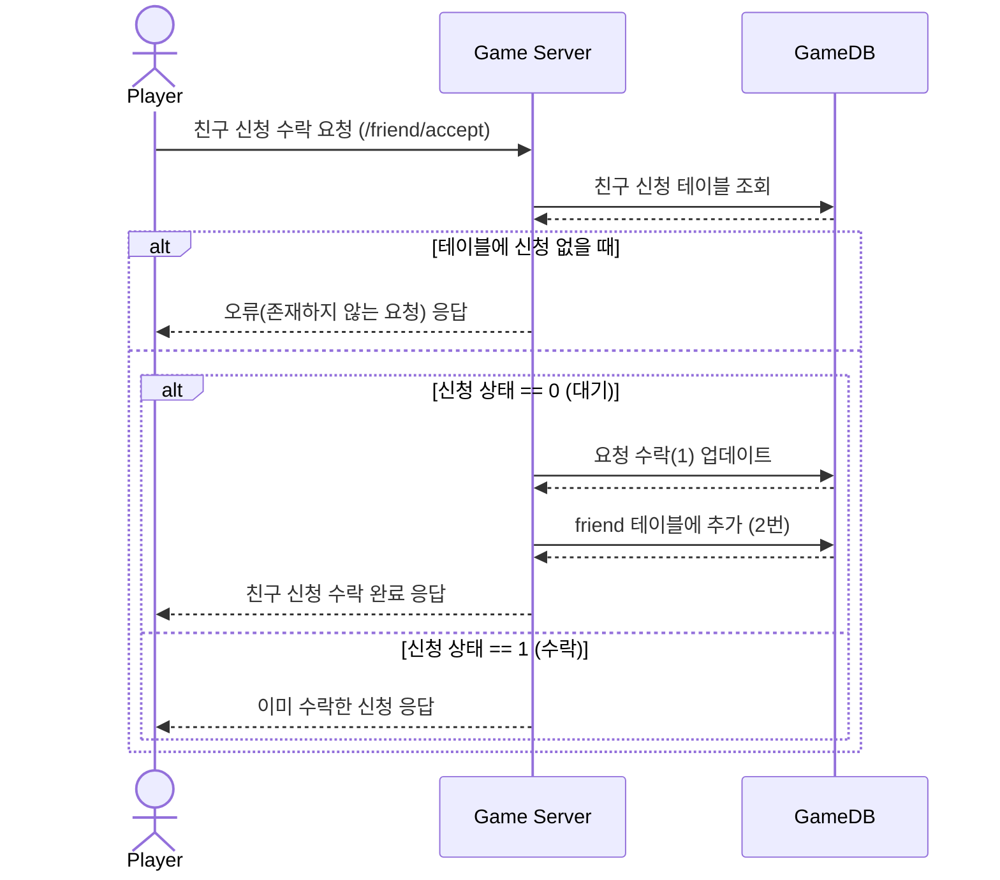

# 시퀀스 다이어그램 (Friend)

* 친구 목록 가져오기 (Get Friend List)
* 친구 신청 목록 가져오기 (Get Friend Request List)
* 친구 신청 (Friend Request)
* 친구 신청 수락하기 (Friend Request Accept)

------------------------------

## 친구 목록 가져오기
### 플레이어의 친구 목록 가져오는 요청 (Get Friend List)

------------------------------

## 친구 신청 목록 가져오기
### 플레이어의 친구 신청 목록 가져오는 요청(받은 신청) (Get Friend Request List)

------------------------------

## 친구 신청
### 플레이어가 친구 신청을 보내는 요청

------------------------------

## 친구 신청 수락하기
### 플레이어가 받은 친구 신청을 수락하는 요청

