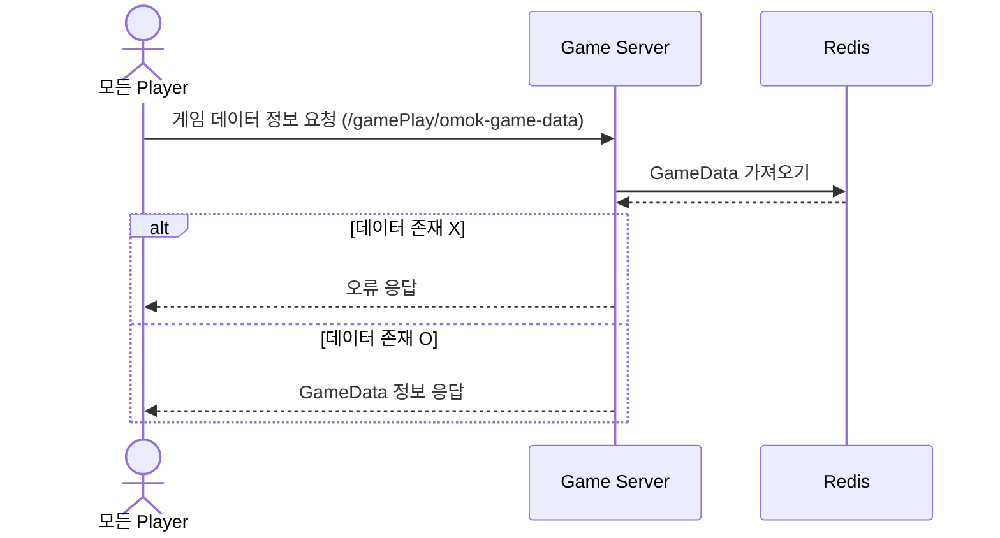
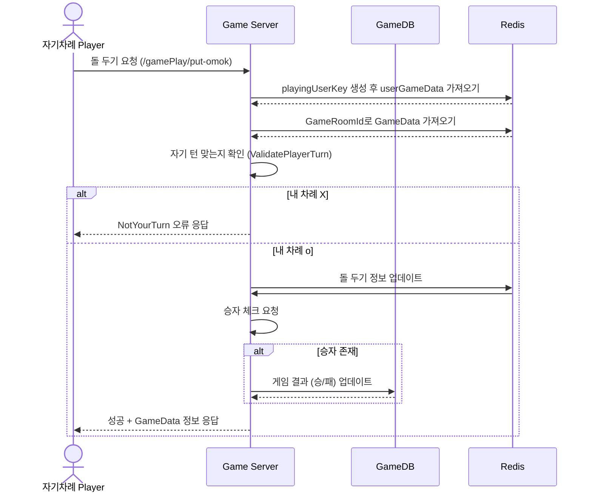
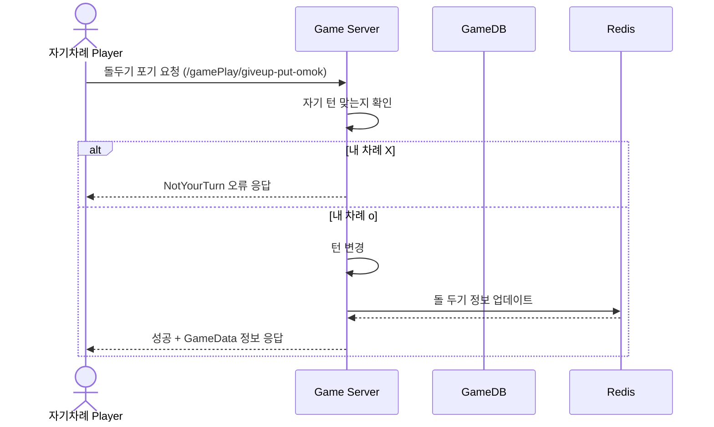
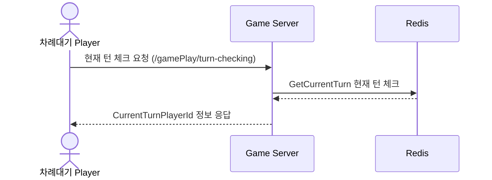

# 시퀀스 다이어그램 (GamePlay)

------------------------------
## 게임 데이터 가져오는 요청 
### : 게임 데이터 가져오는 요청 (모든 플레이어) /gamePlay/omok-game-data
게임 데이터 = 오목 보드 정보 + 참가 플레이어 + 현재 턴 + 승자 등등

#### 요청하는 플레이어의 상태
* 기본적으로 LoadGameStateAsync() 라는 함수에서 게임 오목판을 비롯한 게임 데이터를 로드하고 있다.
  + 게임 첫 시작 시 : OnInitializedAsync()
  + 자기 차례 아닐 때 : 턴 상태 요청하면서 StartTurnPollingAsync()
    + 이때 자기 차례가 되었을 때 로드

------------------------------

## 돌두기
### : 돌두기 (자기 차례 플레이어) 

------------------------------

## 돌두기 포기 요청 (자기 차례 플레이어)
### : 돌두기 포기 요청 (자기 차례 플레이어) 

------------------------------

## 현재 턴 상태 요청 (차례 대기 플레이어) 1초마다 요청
### : 현재 턴 상태 요청 (차례 대기 플레이어) 1초마다 요청 /gamePlay/turn-checking

------------------------------

