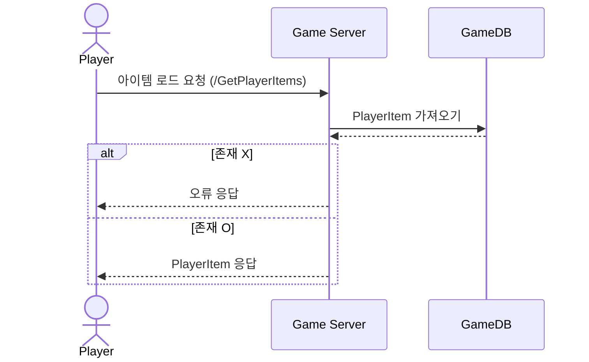

# 시퀀스 다이어그램 (Item)

------------------------------

## 플레이어의 아이템(인벤토리) 목록 가져오는 요청
### : 플레이어의 아이템 데이터 가져오는 요청 /GetPlayerItems

```mermaid
sequenceDiagram
	actor Player
	participant Game Server
  participant GameDB

	Player ->> Game Server : 아이템 로드 요청 (/GetPlayerItems)
	Game Server ->> GameDB : PlayerItem 가져오기
	GameDB -->> Game Server : 
	alt 존재 X
		Game Server -->> Player : 오류 응답
	else 존재 O
		Game Server -->> Player : PlayerItem 응답
	end
```

------------------------------
