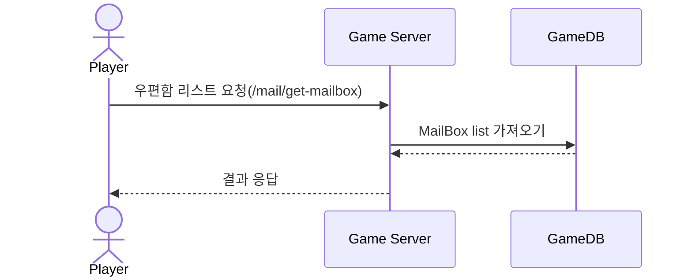
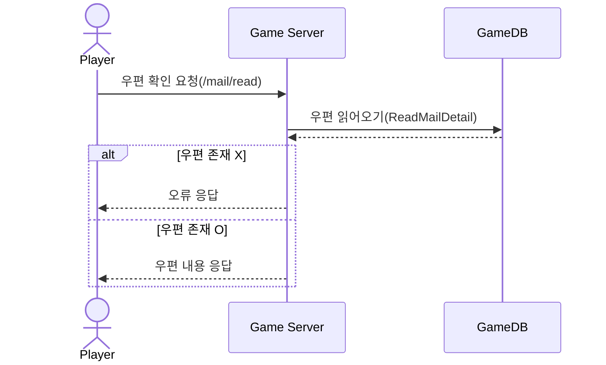
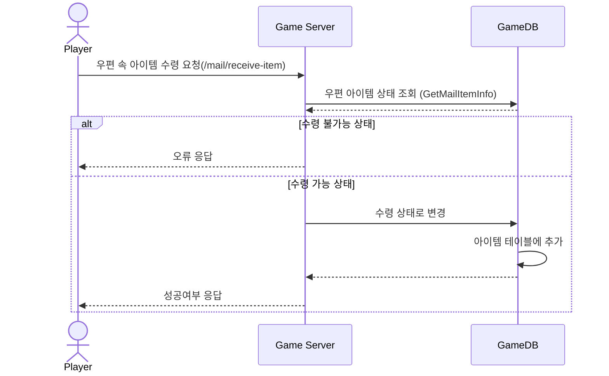
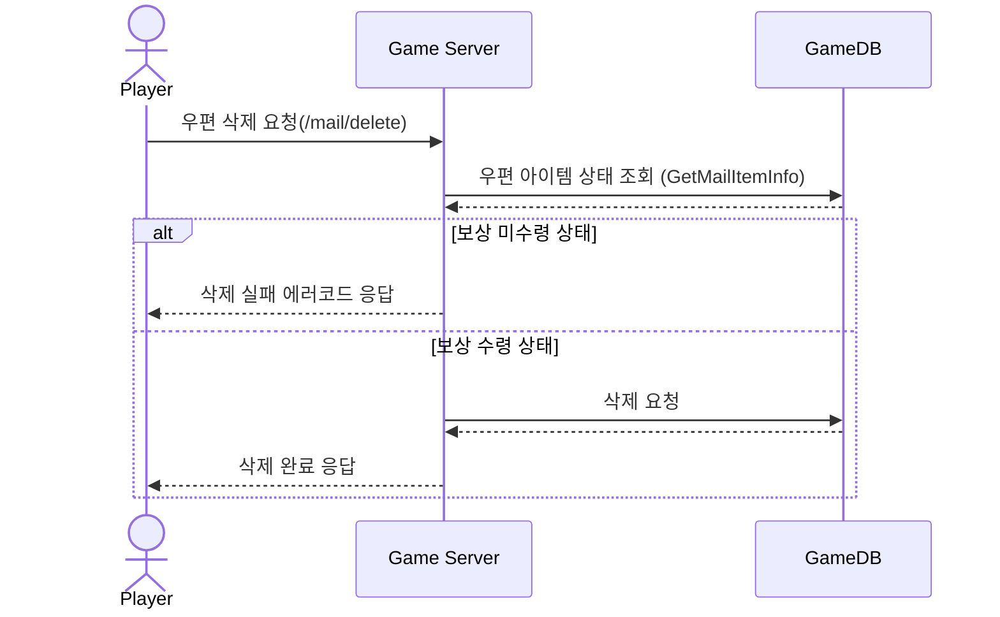

# 시퀀스 다이어그램 (MailBox)

## 플레이어의 우편함 목록을 가져오는 요청
### : 플레이어의 우편함 리스트를 가져오는 요청 /mail/get-mailbox

------------------------------

## 플레이어가 우편함에서 우편을 열어보는 요청 (우편 내용 보기)
### : 플레이어가 자신의 우편함에서 우편을 읽는 요청 /mail/read

------------------------------

## 플레이어가 우편 속 아이템을 수령하는 요청
### : 플레이어가 우편 속 아이템을 수령하는 요청 /mail/receive-item

------------------------------

## 플레이어가 우편을 삭제하는 요청
### : 플레이어가 우편을 삭제하는 요청 /mail/delete

--------------------------------
