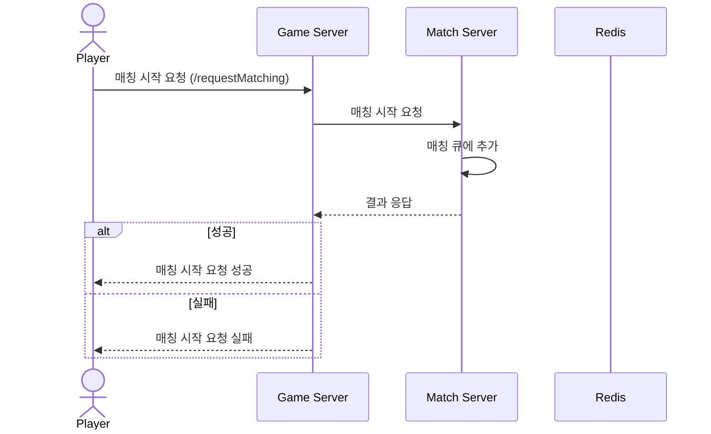
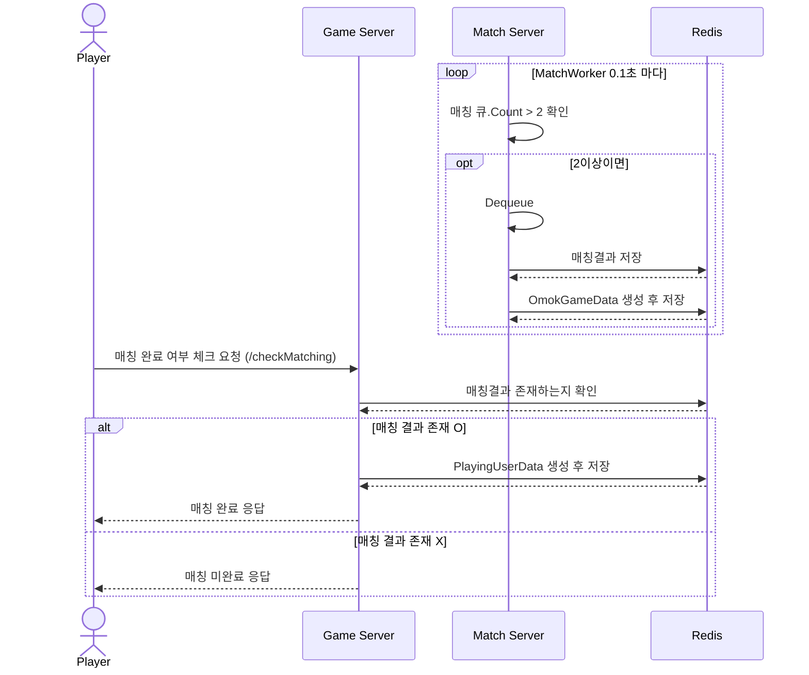

# 시퀀스 다이어그램 (Match)
------------------------------
## 매칭 시작 요청
### : 매칭 시작 요청 /requestMatching

------------------------------

## 매칭 완료 여부 체크 (매칭 될 때까지 1초마다 요청)
### : 매칭 완료 여부 체크 (매칭 될 때까지 1초마다 요청) /checkMatching

------------------------------

