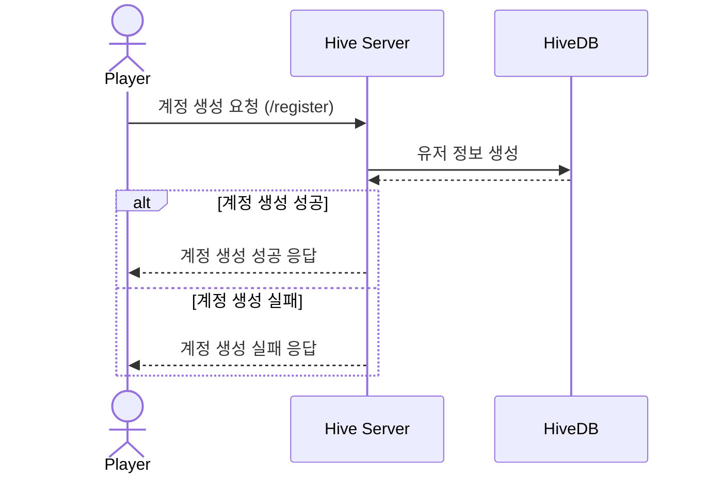
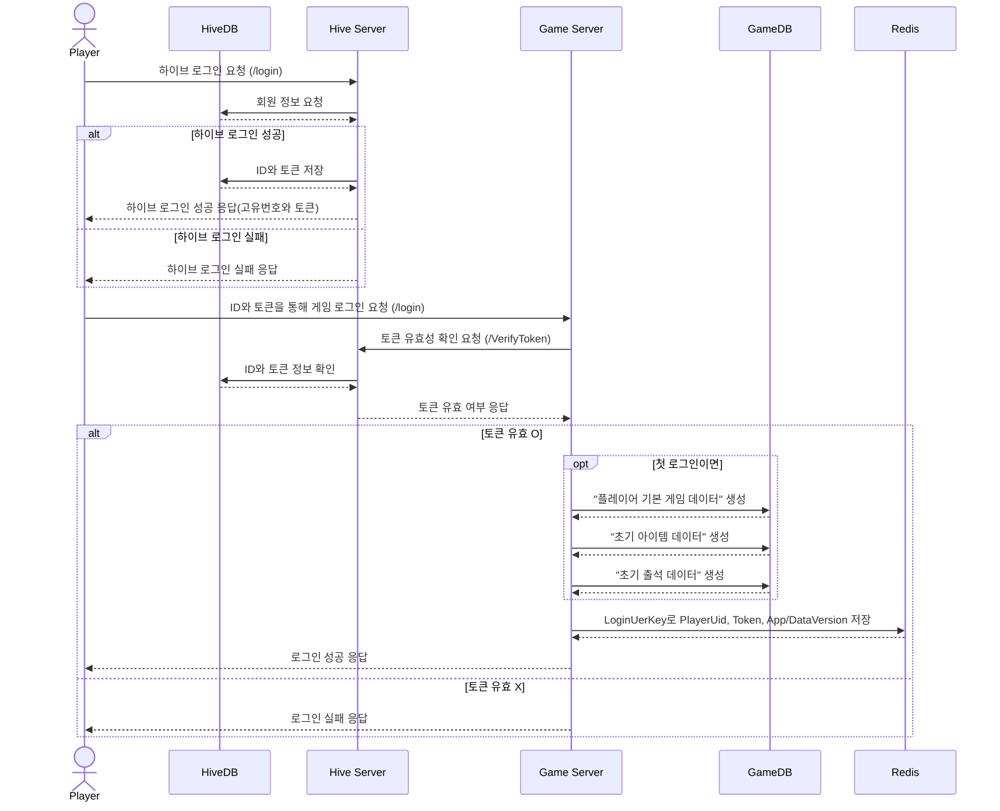

# 시퀀스 다이어그램 (Register-Login)
## 계정 생성 요청
### : 계정 생성 요청 /register

```mermaid
sequenceDiagram
	actor P as Player
	participant H as Hive Server
	participant HD as HiveDB

	P ->> H: 계정 생성 요청 (/register)
	H ->> HD : 유저 정보 생성
	HD -->> H : 
	alt 계정 생성 성공
  		H -->> P: 계정 생성 성공 응답
	else 계정 생성 실패
  		H -->> P: 계정 생성 실패 응답
	end
```

## 로그인 요청
### : 로그인 요청 /login

```mermaid
sequenceDiagram
	actor P as Player
	participant HD as HiveDB
	participant H as Hive Server
	participant G as Game Server
	participant GD as GameDB
	participant R as Redis
	
	P ->> H: 하이브 로그인 요청 (/login)
  	H ->> HD : 회원 정보 요청
  	HD -->> H : 

	alt 하이브 로그인 성공
		H ->> HD : ID와 토큰 저장
		HD -->> H : 
		H -->> P : 하이브 로그인 성공 응답(고유번호와 토큰) 
	else 하이브 로그인 실패
		H -->> P : 하이브 로그인 실패 응답
	end

	P ->> G : ID와 토큰을 통해 게임 로그인 요청 (/login)
	G ->> H : 토큰 유효성 확인 요청 (/VerifyToken)
	H ->> HD : ID와 토큰 정보 확인
	HD -->> H :  
	H -->> G : 토큰 유효 여부 응답

	alt 토큰 유효 O
		opt 첫 로그인이면
			G ->> GD : "플레이어 기본 게임 데이터" 생성
			GD -->> G : 
			G ->> GD : "초기 아이템 데이터" 생성
			GD -->> G : 
			G ->> GD : "초기 출석 데이터" 생성
			GD -->> G :  
		end

		G ->> R : LoginUerKey로 PlayerUid, Token, App/DataVersion 저장
	  	R -->> G :  

		G -->> P : 로그인 성공 응답
	else 토큰 유효 X
		G -->> P : 로그인 실패 응답
	end


```
