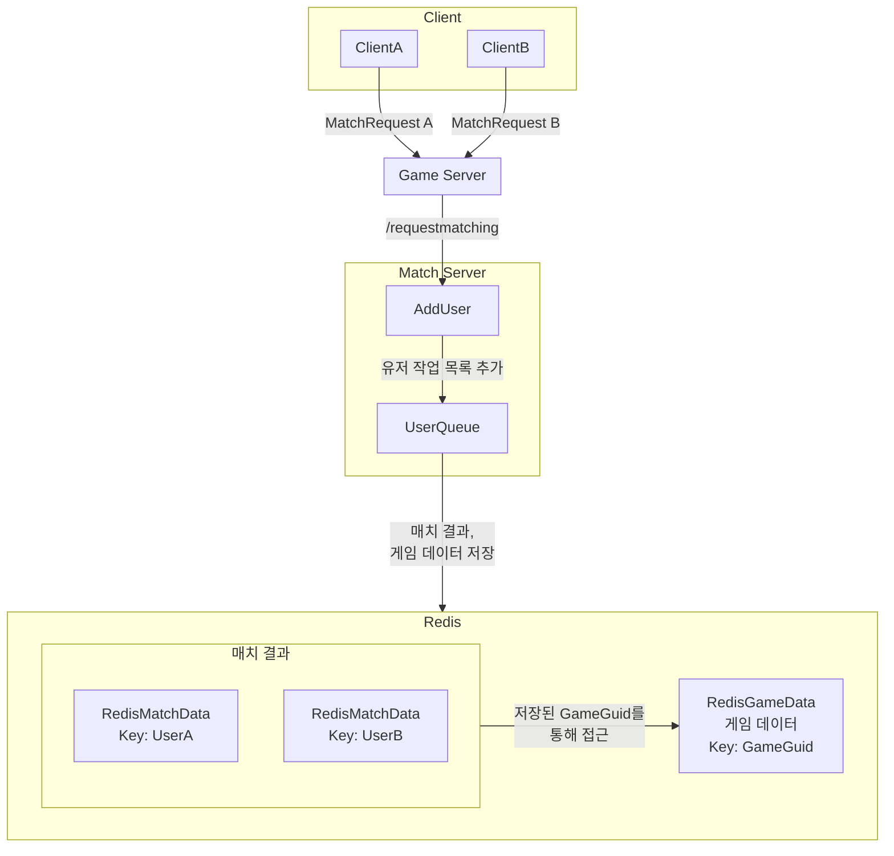

## 매칭 과정

```mermaid
flowchart TD


subgraph CA[ClientA]
end

subgraph CB[ClientB]

end
CA-->|MatchRequest A|G
CB-->|MatchRequest B|G

subgraph C[Client]
CA
CB
end

subgraph G[Game Server]

end

G-->|/requestmatching|AU

subgraph M[Match Server]
AU[AddUser]-->|유저 작업 목록 추가|UserQueue
end

UserQueue--->|매치 결과,<br/> 게임 데이터 저장|R
subgraph R[Redis]
subgraph MR[매치 결과]
RMA[RedisMatchData <br/> Key: UserA]
RMB[RedisMatchData <br/> Key: UserB]
end
MR-->|저장된 GameGuid를 <br/> 통해 접근|RG
RG[RedisGameData <br/> 게임 데이터 <br/> Key: GameGuid]

end

```
