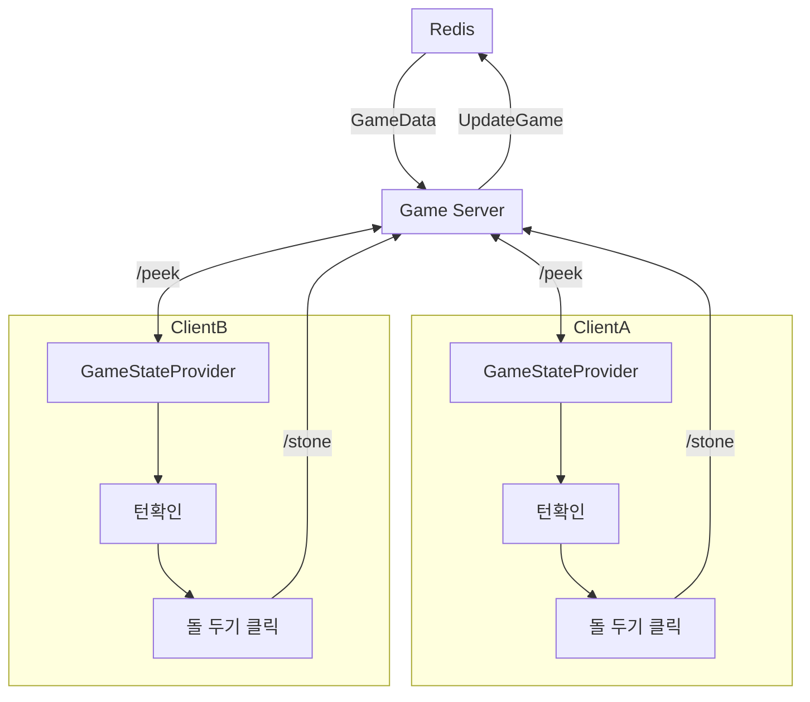
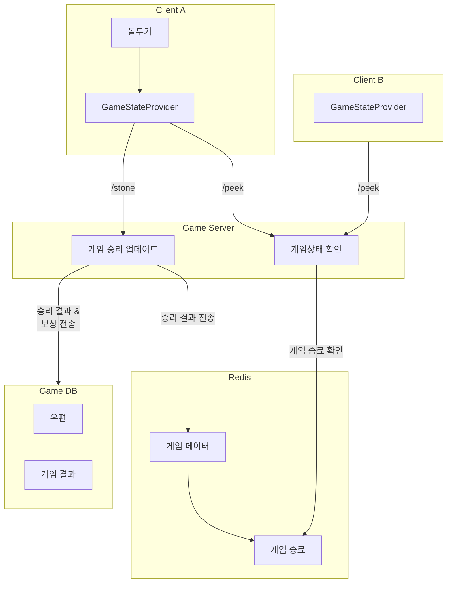

## 게임 상태 업데이트

```mermaid
flowchart TD


subgraph CA[ClientA]
GA[GameStateProvider]
GA-->TurnA
TurnA[턴확인]
TurnA-->ActionA
ActionA[돌 두기 클릭]
end
ActionA--->|/stone|G

subgraph CB[ClientB]
GB[GameStateProvider]
GB-->TurnB
TurnB[턴확인]
TurnB-->ActionB
ActionB[돌 두기 클릭]
end
ActionB--->|/stone|G

subgraph G[Game Server]
end
G-->| UpdateGame|R
R--->|GameData|G
subgraph R[Redis]
end

G<-->|/peek|GB
G<-->|/peek|GA

```

## 게임 승리 시

```mermaid
flowchart TD


subgraph CA[Client A]
GA[GameStateProvider]
ActionA[돌두기]
ActionA-->GA
end

GA--->|/stone|END

subgraph CB[Client B]
GB[GameStateProvider]
end

subgraph G[Game Server]
END[게임 승리 업데이트]
CheckGame[게임상태 확인]

end
END--->|승리 결과 전송|GDA
END--->|승리 결과 & <br/> 보상 전송|GDB

subgraph R[Redis]
GDA[게임 데이터]
GDE[게임 종료]
GDA-->GDE
end

subgraph GDB[Game DB]
Mail[우편]
Result[게임 결과]
end

GA--->|/peek|CheckGame[게임상태 확인]
CheckGame--->|게임 종료 확인|GDE

CB--->|/peek|CheckGame

```
