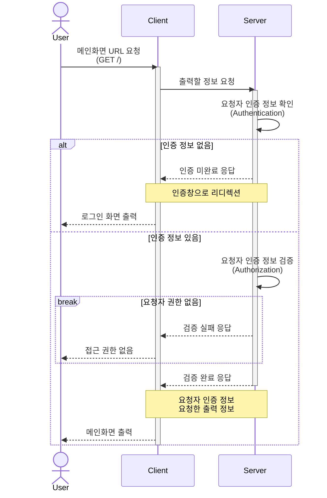
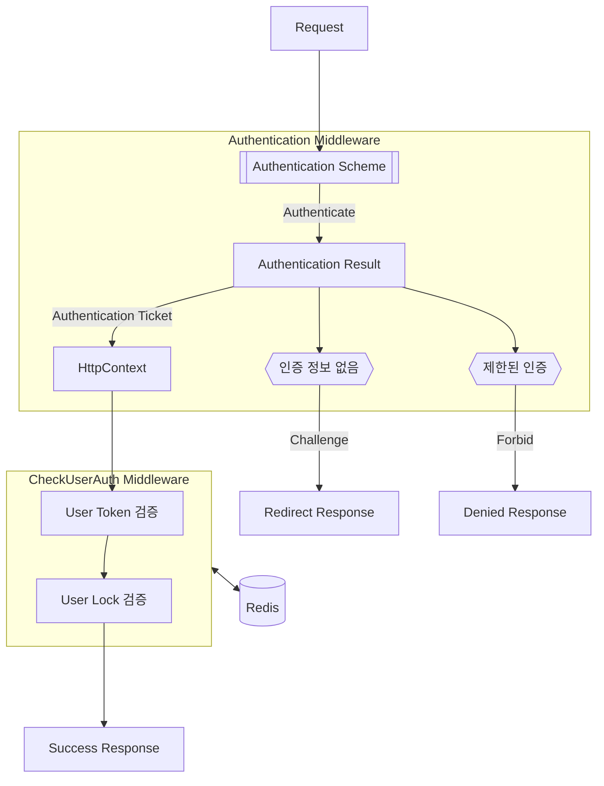
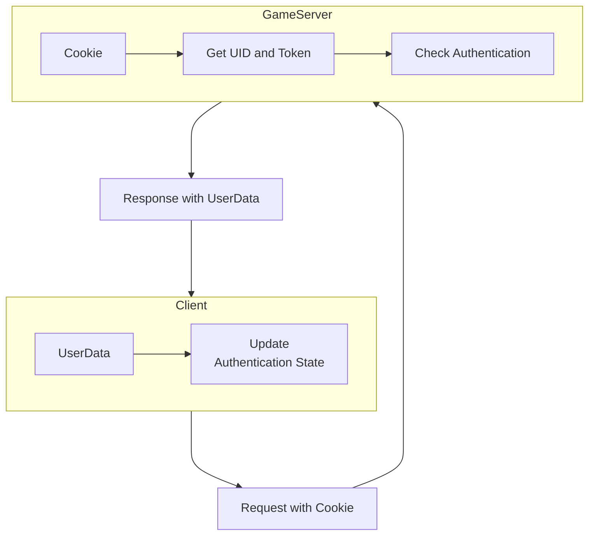
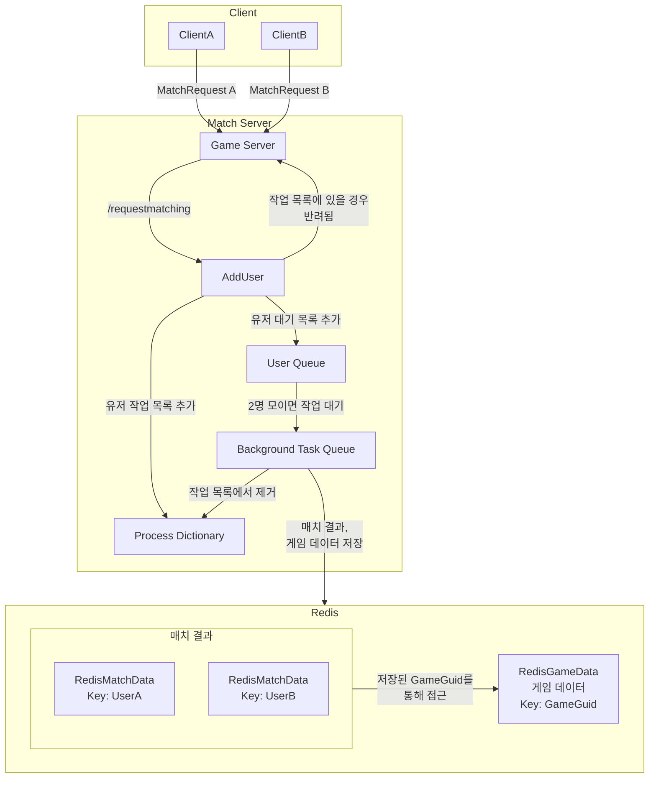
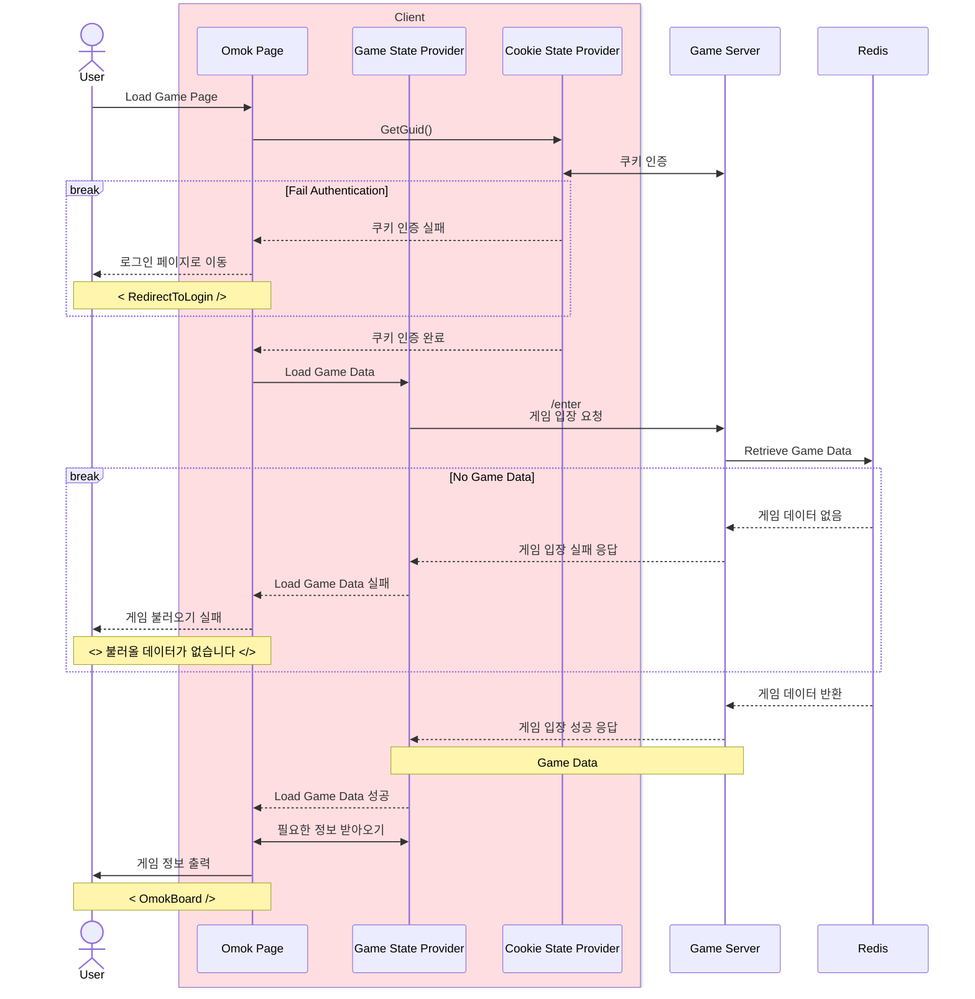
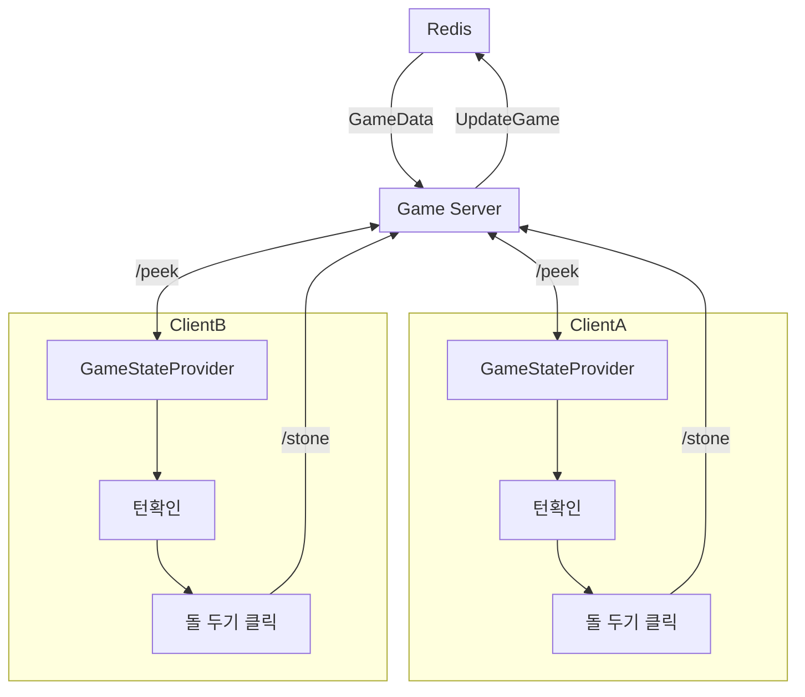
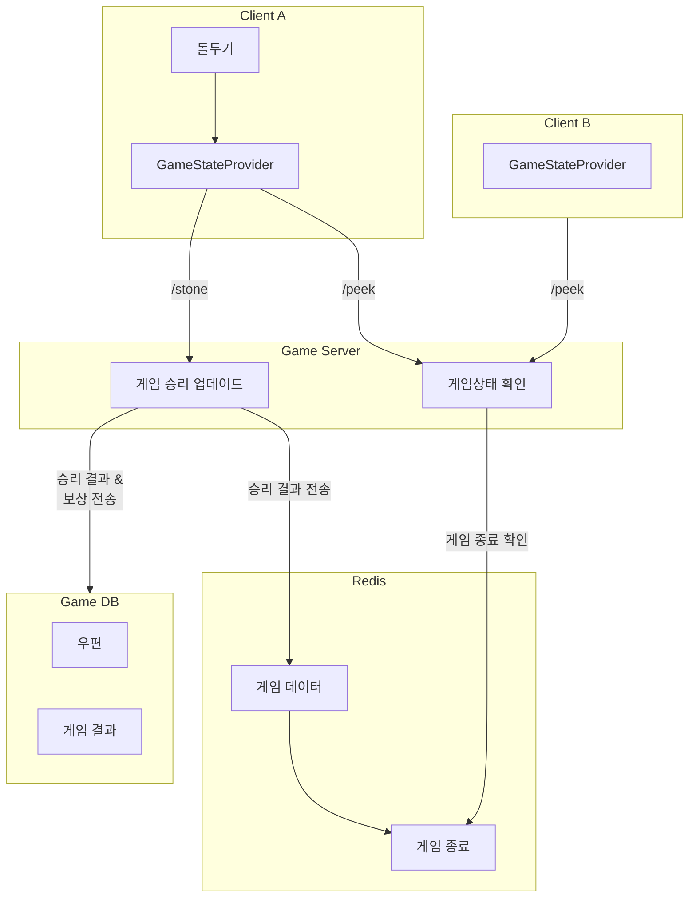

# 

## 📜 Table of Contents

- [About the Project](#about-the-project)
  - [Tech Stack](#tech-stack)
  - [Game Features](#game-features)
- [Implementations](#implementations)
  - [Authentication](#authentication)
  - [Request Match](#request-match)
  - [Complete Match](#complete-match)
  - [Process Game](#process-game)
  - [Complete Game](#complete-game)
  - [User Interface](#user-interface)
  - [GameData](#gamedata)
- [Hive API Documentation](#hive-api-documentation)
  - [Create Hive Account](#create-hive-account)
  - [Login Hive](#login-hive)
  - [Verify Token](#verify-token)
- [Game API Documentation](#game-api-documentation)
- [Getting Started](#getting-started)
  - [Prerequisites](#prerequisites)
  - [Run Locally](#running-locally)
- [Roadmap](#roadmap)
- [Sequence Diagrams](SequenceDiagrams)
  - [Authentication](SequenceDiagrams/Authentication.md)
  - [Match](SequenceDiagrams/Match.md)
- [Schemas](Schemas)

  - [GameDb](Schemas/GameDb.md)
  - [HiveDb](Schemas/HiveDb.md)
  - [MasterDb](Schemas/MasterDb.md)

  <!-- - [Game](SequenceDiagrams/Game.md)
  - [Mail](SequenceDiagrams/Mail.md)
  - [Attendance](SequenceDiagrams/Attendance.md)
  - [Item](SequenceDiagrams/Item.md)
  - [Shop](SequenceDiagrams/Shop.md)
  - [Friend](SequenceDiagrams/Friend.md) -->

<!-- About the Project -->

## About the Project

C# 학습을 위한 게임 프로젝트 입니다.

<!-- TechStack -->

### Tech Stack

<details>
  <summary>Client</summary>
  <ul>
    <li><a href="https://dotnet.microsoft.com/en-us/apps/aspnet/web-apps/blazor/">C# Blazor</a></li>
  </ul>
</details>

<details>
  <summary>Server</summary>
  <ul>
    <li><a href="https://dotnet.microsoft.com/en-us/apps/aspnet">ASP.NET Core 8</a></li>
  </ul>
</details>

<details>
<summary>Database</summary>
  <ul>
    <li><a href="https://www.mysql.com/">MySQL</a></li>
    <li><a href="https://redis.io/">Redis</a></li>
  </ul>
</details>

### Game Features

<details>
  <summary>Implementations</summary>
<!-- Authentication -->

# Implementations

## Authentication

### Concept

인증(Authentication)은 애플리케이션과 상호 작용하려는 사용자 또는 시스템의 신원을 확인하는 핵심 보안 기능입니다. <br/>이를 통해 자원과 서비스를 합법적인 사용자만이 접근할 수 있도록 보장합니다.

### ASP.NET Core Authentication

ASP.NET Core에서 제공하는 Authentication과 Authorization 미들웨어를 통해 다양한 인증 스킴(Authentication Scheme)을 통합하거나 분리하여 관리 할수있습니다. (JWT, 쿠키, OAuth 2.0 등) 본 프로젝트에서는 Cookie-based Authentication(쿠키 기반 인증)을 사용합니다.

쿠키 기반 인증은 서버에서 세션을 유지하며 관리할 수 있기 때문에 세션 상태를 쉽게 변경하거나 무효화할 수 있습니다. 특히 세션을 자주 갱신해야 하거나 세션 만료 후 재로그인이 필요한 경우 유리합니다.

### Server-side Authentication

서버단에서 사용자 확인 프로세스는 크게 인증(Authentication)과 권한 검증(Authorization)이라는 두 가지 단계로 구분할 수 있습니다.

- 인증 (Authentication): 사용자의 신원을 확인하는 과정
- 권한 검증 (Authorization): 사용자의 권한을 확인하는 과정

이 프로세스는 각 미들웨어를 `UseAuthentication()` 및 `UseAuthorization()`을 명시적으로 호출하여 구현됩니다.

```chsarp
  app.UseAuthentication();
  app.UseAuthorization();
```

Authentication 미들웨어에서 사용하는 [IAuthenticationService](https://learn.microsoft.com/en-us/dotnet/api/microsoft.aspnetcore.authentication.iauthenticationservice?view=aspnetcore-8.0)의 핵심 기능은 다음과 같습니다.

- Authenticate: 요청에 대한 인증 데이터를 확인
- Challenge: 인증되지 않은 사용자에게 인증 데이터를 요구
- Forbid: 특정 Authentication Scheme에 대해 접근을 금지
- SignIn: 특정 Authentication Scheme과 ClaimsPrincipal을 연결
- SignOut: 특정 Authentication Scheme에서 연결된 데이터를 제거

각 기능의 세부동작은 사용하는 `Authentication Scheme`에 할당된 `Authentication Handler`(인증 핸들러)에 의해 정해집니다.

`Authentication Scheme` 세팅은 `AddAuthentication()`호출 후 반환되는 [AuthenticationBuilder](https://learn.microsoft.com/en-us/dotnet/api/microsoft.aspnetcore.authentication.authenticationbuilder?view=aspnetcore-8.0)의 확장 메서드를 통해 설정이 가능하며, 아래는 쿠키 기반 `Authentication Scheme` 구성을 위한 `AddCookie()` 확장 메서드 사용 예시입니다.

```csharp
services.AddAuthentication(CookieAuthenticationDefaults.AuthenticationScheme)
    .AddCookie(options =>
    {
        options.SlidingExpiration = true;                       // 쿠키 자동 갱신 여부
        options.ExpireTimeSpan = TimeSpan.FromHours(1);         // 쿠키 만료시간
    })
```

### Authentication Flow

라우팅 미들웨어는 기본적으로 파이프라인의 시작 부분에서 실행되며, 아래의 다이어그램은 UseRouting을 명시적으로 호출하여 구현된 라우팅 미들웨어의 순서를 보여줍니다.


위와 같은 구현을 위하여 UseAuthorization() 및 UseAuthentication()은 엔드포인트 매핑 전에, 라우팅 활성화 후에 호출되어야 합니다.

```csharp
app.UseRouting();
app.UseAuthentication();  // Must come between Routing and Endpoints
app.UseAuthorization();   // Must come after authentication
app.MapDefaultControllerRoute();
```

Authentication 프로세스의 주요 목적은 요청된 엔드포인트에 알맞은 요청자 정보(Claims Principal)를 식별하여 요청자 정보 인증 여부 확인 및 요청자에 대한 권한 검증을 하는것입니다. 아래는 사용자가 브라우저에서 웹앱으로 접근할때 Authentication 미들웨어에서 발생하는 인증 관련 상호작용에 대한 요약입니다.



본 프로젝트에서는 요청자 인증 정보 검증 단계에서 Authorization 미들웨어를 사용하는 대신, 사용자 지정 미들웨어 [CheckUserAuth](/GameAPIServer/Middlewares/CheckUserAuth.cs)를 통하여 Authentication 에서 제공받은 정보를 검증합니다. 위 과정을 포함한 전체적인 사용자 검증은 다음과 같은 순서로 진행됩니다



</br>
</br>
- 요청 엔드포인트에 따라서, 적절한 Authentication Scheme을 구분

- 지정된 Authentication Sceme의 Claims Principal가 존재 하는지 확인

- AuthenticateResult에 정보 식별 성공/실패 여부를 반환.

  - 성공시 해당 Claims Principal가 들어있는 AuthenticationTicket을 함께 반환.

  - 실패시 Challenge(인증 챌린지)를 호출. 어떠한 인증이 필요한지 클라이언트에 다시 반환<br/> (예: 쿠키의 경우 사용자를 로그인 페이지로 리디렉션. JWT Bearer의 경우 www-authenticate:bearer 헤더를 포함한 오류를 반환)

### 인증 정보 만들기

ASP.NET Core에서 사용자 정보를 보유하는 인증 정보를 만들려면, 먼저 Claims Principal을 구성해야 합니다. ClaimsPrincipal 구성을 위해서 필요한 모든 Claim을 생성하고 ClaimsIdentity에 추가한 후, 해당 정보를 Redis 저장소에 저장하여 유효 시간을 관리합니다. 본 프로젝트는 쿠키 기반 인증을 사용하기 때문에, 생성된 사용자 정보는 직렬화되어 암호화된 쿠키에 저정 후 관리하여 인증 상태를 유지합니다.

아래는 인증 쿠키 등록을 위한 Claims 구성 및 생성 예시입니다.

```csharp

    // 사용자 인증 정보를 기반으로 Claim(사용자 속성)을 설정합니다.
    // 'UID'는 사용자 고유 식별자, 'Token'은 사용자 인증 토큰, 역할(Role)은 'User'로 설정합니다.
    var claims = new List<Claim>
    {
        new Claim("UID", userAuth.UID.ToString()),   // 사용자 고유 식별자 (UID)
        new Claim("Token", userAuth.Token),          // 사용자 인증 토큰
        new Claim(ClaimTypes.Role, "User")           // 사용자의 역할 (일반 사용자로 설정)
    };

    // Claim을 사용하여 Identity와 Principal을 생성합니다.
    // ClaimsIdentity는 인증된 사용자의 신원을 나타내고,
    // ClaimsPrincipal은 이 Identity를 포함한 사용자를 나타냅니다.
    var claimsIdentity = new ClaimsIdentity(claims, CookieAuthenticationDefaults.AuthenticationScheme);

    // 인증 속성(AuthenticationProperties)을 설정합니다.
    // 본 서버는 Redis를 활용하여 세션 만료여부를 관리 하기때문에
    // 이 예시에서는 속성값을 설정하지 않았지만, 필요에 따라 세션 유지 또는 만료 시간 등 추가 설정이 가능합니다.
    var authProperties = new AuthenticationProperties
    {
        // IsPersistent = true, ExpiresUtc = DateTime.UtcNow.AddHours(1) 등을 설정 가능
    };

    // ClaimsPrincipal(사용자)와 AuthenticationProperties(인증 속성)를 반환합니다.
    return (new ClaimsPrincipal(claimsIdentity), authProperties);

```

생성된 정보는 아래와 같이 `SignInAsync`를 호출하여 알맞은 Authentication Scheme에 연결이 가능하며, 이후 각 요청마다 실행되는 미들웨어를 통해 안증 및 검증 되게 됩니다.

```csharp
  var (claimsPrincipal, authProperties) = _authService.RegisterUserClaims(result);
  await HttpContext.SignInAsync(CookieAuthenticationDefaults.AuthenticationScheme claimsPrincipal, authProperties);
```

#### Blazor에서의 인증 시스템 활용

클라이언트인 Blazor WebAssembly는 주로 외부 아이덴티티 제공자 또는 API에 의존하여 인증을 관리합니다. <br/>WebAssembly 앱 자체에서는 사용자 데이터를 안전하게 저장할 수 없기 때문에, 많은 경우 토큰 기반 인증이 선호됩니다.



본 프로젝트의 Authentication을 사용하여 <br/>AuthenticationStateProvider에서 인증 상태를 가져와 전 컴포넌트에 아래와 같이 전파합니다.

```xml
<CascadingAuthenticationState>
	<Router AppAssembly="@typeof(App).Assembly">
		<Found Context="routeData">
			<AuthorizeRouteView RouteData="@routeData" DefaultLayout="@typeof(MainLayout)">
				<NotAuthorized>
					   @{
							Navigation.NavigateTo("/login", true);
					   }
				</NotAuthorized>
				<Authorizing>
					<p>Authorizing...</p>
				</Authorizing>
			</AuthorizeRouteView>
			<FocusOnNavigate RouteData="@routeData" Selector="h1" />
		</Found>
		<NotFound>
			<PageTitle>Not found</PageTitle>
			<LayoutView Layout="@typeof(PublicLayout)">
				<p role="alert">Sorry, there's nothing at this address.</p>
			</LayoutView>
		</NotFound>
	</Router>
</CascadingAuthenticationState>
```

#### AuthorizeRouteView 원리

- AuthorizeRouteView는 특정 경로가 인증된 사용자에게만 허용되도록 설정된 컴포넌트입니다. <br/>이 컴포넌트는 ASP.NET Core 쿠키 인증을 기반으로 사용자 인증 상태를 확인하여, <br/> 사용자가 인증된 경우에만 페이지를 렌더링합니다.

- 사용자가 인증되지 않은 상태에서 인증이 필요한 페이지에 접근하려고 하면, <br/>사용자를 로그인 페이지로 리다이렉트합니다.

- 사용자의 인증 상태를 확인하는 중에는 Authorizing 블록이 실행되어, <br/> 인증 진행중이라는 메시지를 표시합니다. <br/>이 부분은 ASP.NET Core 쿠키 인증 시스템이 사용자의 상태를 확인하는 동안 잠시 나타납니다.

<!-- 매칭 진행 로직-->

### Request Match

클라이언트에서 매치 페이지 진입시에 게임서버는 아래의 사전확인 과정을 거칩니다.

매치서버에 `requestmatching/check`를 통해 매치 요청이 진행 중이면 해당 화면을 띄웁니다.


<br/>
진행중인 요청이 없을 경우 Start Match 버튼을 클릭하여 `/requestmatching` 요청을 전송할 수 있습니다. <br/>

### Complete Match

매칭 진행시 아래와 같은 작업이 진행됩니다.




매치 완료시 아래와 같은 알림이 뜨고, 게임 서버에서는 `RedisMatchData`를 삭제하면서 가져옵니다. <br/> Confirm 시에 게임 페이지로 이동합니다

<!-- 게임 진행 로직 -->

### Process Game


<br/>

매치 결과 수락시에 게임 페이지로 이동되면 출력되는 화면입니다. 해당 화면에서는 로딩시에 게임 시작 여부를 판별 후, 전 인원이 입장 하지 않았을 경우 위 팝업을 띄웁니다.

아래는 게임 첫 입장시 게임 상태 식별 과정을 그린 시퀀스 다이어그램입니다.



본 페이지 [Omok.razor](GameClient/Pages/Omok.razor) (/omok) 에서는 게임 로딩 완료 후 [GameStateProvider](/GameClient/Providers/GameStateProvider.cs)를 통해 게임 상태 요청 `/omok/peek` 를 1초에 한번 게임 서버로 보냅니다.

`GameStateProvider`는 게임 상태 변경 사항에 따라 아래의 콜백중 알맞은 콜백을 Omok 페이지로 전달합니다.

- 게임이 종료 되었을 경우 `NotifyGameCompleted`
- 게임이 시작 되었을 경우 `NotifyGameStarted`
- 게임 턴이 바뀌었을 경우 `NotifyTurnChange`


게임이 시작되면 턴에 따라서 바로 시작이 가능하거나 위와 같이 턴 로딩 화면으로 전환 됩니다.

### Complete Game


오목의 승리 조건 달성시 승자 구분과 함께 게임결과가 저장되고 승자에게 보상이 전달됩니다. 더이상 게임이 업데이트 되지 않습니다.

### User Interface

중복 요청들 방지를 위해 FluentUI에서 제공하는 SplashScreen을 활용하여 요청시에 유저 입력을 막습니다.

또한, 로딩 알림을 위해 Overlay 컴포넌트를 사용하여 로그인, 페이지 로딩등의 API 요청이 포함된 프로세스 시작시에는 해당 화면으로 유저에게 로딩이 진행중임을 알립니다.

### GameData

게임 상태 요청에서는 `흑돌`/`백돌` 유저의 정보 `RedisUserCurrentGame`와 함께 </br>
아래의 게임정보를 담은 byte[]로 구성된 데이터를 RedisDB에서 불러옵니다.

#### 게임 전체 정보

진행중인 게임 데이터는 Byte 배열로 저장 및 관리됩니다. <br/>
아래는 해당 배열 구성과 인덱스 정보입니다.

| Name           | GameIndex       | Data Type | Size     | Description                                |
| :------------- | :-------------- | :-------- | :------- | :----------------------------------------- |
| 게임 보드 정보 | 0               | byte[]    | 57 bytes | 15x15 보드에 한칸당 2비트를 차지합니다     |
| 게임 상태 관리 | `GameFlag`      | byte      | 1 byte   | 게임 상태를 불러오거나 변경하는데 쓰입니다 |
| 게임 상태 관리 | `BlackPlayer`   | Int64     | 8 bytes  | 흑돌 플레이어의 UID                        |
| 게임 상태 관리 | `WhitePlayer`   | Int64     | 8 bytes  | 백돌 플레이어의 UID                        |
| 게임 상태 관리 | `GameStartTime` | Int64     | 8 bytes  | 게임 시작 시간                             |
| 게임 상태 관리 | `LastTurnTime`  | Int64     | 8 bytes  | 마지막 돌 두기 시간                        |
| 게임 상태 관리 | `TurnCount`     | Int64     | 8 bytes  | 총 진행된 턴수                             |

#### 게임 상태 플래그

`GameFlag`에 해당하는 각 플래그 정보입니다

| Name           | Bit Number | Description                    |
| :------------- | :--------- | :----------------------------- |
| GameState      | 0          | 게임 상태 식별                 |
| GameEnterBlack | 1          | 흑돌 입장 여부                 |
| GameEnterWhite | 2          | 백돌 입장 여부                 |
| GameWinner     | 3          | 게임 완료시에 게임 승리자 식별 |
| GameWinner     | 4          | 게임 종료 여부                 |

#### 게임 정보 관리

게임 데이터 생성 후 게임정보는 Redis 저장소를 통해서 불러오거나 갱신할 수 있습니다.

게임 정보 전체 배열을 불러오는 경우는 다음과 같습니다

- 게임 입장 (EnterGame)
- 게임 돌 두기 (SetOmokStone)
- 게임 턴 체크 (GetTurnInfo)

#### 공통 확인 정보

게임을 진행할떄는 `RedisUserCurrentGame` 을 통해 현재 진행중인 유저의 게임 정보를 확인합니다.

유저정보는 게임 정보 `RedisGameData`(byte[]) 와 함께 생성 되며,

저장되어있는 GameGuid (게임 인스턴스 고유 식별 번호) 를 통해서 올바른 `RedisGameData`에 접근합니다.

`RedisUserCurrentGame`과 `RedisGameData` 게임서버에서 접근되며,

정보를 불러올때마다 저장 시간이 갱신됩니다.

#### 게임 업데이트 프로세스



#### 게임 승리 프로세스



</details>


<details>
  <summary> API Documentation</summary>	
 <!-- API Documentation -->

## Hive API Documentation

Hive Server에 요청 가능한 API 목록

### Create Hive Account

#### Request

```http
POST /CreateHiveAccount

{
"Email": "foo@bar.com",
"Password": "1234foobar!"
}
```

| Body Param | Type     | Description                                 |
| :--------- | :------- | :------------------------------------------ |
| Email      | `string` | **Required**. 계정 로그인시 사용할 이메일   |
| Password   | `string` | **Required**. 계정 로그인시 사용할 비밀번호 |

### Login Hive

#### Request

```http
POST /Login

{
"Email": "foo@bar.com",
"Password": "1234foobar!"
}
```

| Body Param | Type     | Description                      |
| :--------- | :------- | :------------------------------- |
| Email      | `string` | **Required**. 가입한 계정 이메일 |
| Password   | `string` | **Required**. 계정 비밀번호      |

#### Response

| Body      | Type        | Description                  |
| :-------- | :---------- | :--------------------------- |
| Result    | `ErrorCode` | 로그인 실패시 오류 코드 반환 |
| PlayerID  | `long`      | Hive 계정 고유 번호          |
| HiveToken | `string`    | 발급된 계정 토큰             |

### Verify Token

#### Request

```http
POST /VerifyToken

{
"PlayerID": "<PlayerID from Login Hive Response>",
"HiveToken": "<HiveToken from Login Hive Response>"
}
```

| Body Param | Type     | Description                     |
| :--------- | :------- | :------------------------------ |
| PlayerID   | `long`   | **Required**. 전달 받은 계정 ID |
| HiveToken  | `string` | **Required**. 발급받은 인증토큰 |

#### Response

| Body   | Type        | Description                |
| :----- | :---------- | :------------------------- |
| Result | `ErrorCode` | 검증 실패시 오류 코드 반환 |

## Game API Documentation

Game Server에 요청 가능한 API 목록

### Login Game

#### Request

```http
POST /Login

{
"PlayerID": "<PlayerID from Login Hive Response>",
"HiveToken": "<HiveToken from Login Hive Response>"
}
```

| Body Param | Type     | Description                                     |
| :--------- | :------- | :---------------------------------------------- |
| PlayerID   | `long`   | **Required**. 하이브 로그인시 전달 받은 계정 ID |
| HiveToken  | `string` | **Required**. 하이브 로그인시 발급받은 인증토큰 |

#### Response

| Body   | Type        | Description                  |
| :----- | :---------- | :--------------------------- |
| Result | `ErrorCode` | 로그인 실패시 오류 코드 반환 |

- 서버에 세션 정보가 저장됩니다.
- 인증 쿠키가 등록됩니다.

### Logout Game

#### Request

```http
GET /Logout
```

#### Response

| Body   | Type        | Description                    |
| :----- | :---------- | :----------------------------- |
| Result | `ErrorCode` | 로그아웃 실패시 오류 코드 반환 |

- 서버에 세션 정보가 삭제됩니다.
- 인증 쿠키가 삭제됩니다.

### Match Game

사용자가 게임을 시작하기 위해 매치서버로 매칭 시작 요청을 합니다.

#### Request

```http
POST /matchstart
```

- 다른유저와 매칭 시작을 요청합니다
- 인증 쿠키에서 UID 를 가져오기 떄문에 별도의 정보를 요구 하지 않습니다.

#### Response

| Body   | Type        | Description                     |
| :----- | :---------- | :------------------------------ |
| Result | `ErrorCode` | 매치 등록 실패시 오류 코드 반환 |

- 매칭이 진행됩니다.

### Check Match

사용자의 매칭 진행 상태를 확인합니다

#### Request

```http
POST /matchcheck
```

#### Response

| Body   | Type        | Description                       |
| :----- | :---------- | :-------------------------------- |
| RoomId | `string`      | 매치 완료시 등록된 게임룸 ID 반환 |
| Result | `ErrorCode` | 완료된 매치 없을시 오류 코드 반환 |

- 현 매칭 상태를 수신합니다.
- 매칭 완료 시에 게임룸 ID를 제공 받습니다.

### Enter Game

매칭 완료된 게임에 입장합니다

#### Request

```http
POST /omok/enter
```

- 인증 쿠키에 포함된 UID 로 입장 가능한 게임을 식별합니다.

#### Response

| Body     | Type        | Description                     |
| :------- | :---------- | :------------------------------ |
| GameData | `byte[] `     | 입장된 게임의 데이터            |
| Result   | `ErrorCode` | 게임 입장 실패시 오류 코드 반환 |

- 입장 완료 시에 게임 데이터를 제공 받습니다.
- 최초 입장시 필요한 플레이어 수가 채워지면 입장과 함께 게임이 시작됩니다.

### Peek Game

진행중인 게임 상태를 1초마다 확인합니다.

#### Request

```http
POST /omok/peek
```

#### Response

| Body     | Type        | Description                     |
| :------- | :---------- | :------------------------------ |
| GameData | `byte[]`      | 진행중인 게임의 데이터            |
| Result   | `ErrorCode` | 게임 입장 실패시 오류 코드 반환 |


### Put Stone
진행중인 게임에서 돌을 둡니다

#### Request
```http
POST /omok/stone
```

| Body Param | Type     | Description                     |
| :--------- | :------- | :------------------------------ |
|   PosX   | `int`  | **Required**. 돌두기 가로축 위치 |
| PosY  | `int` | **Required**. 돌두기 세로축 위치 |

#### Response

| Body     | Type        | Description                     |
| :------- | :---------- | :------------------------------ |
| Result   | `ErrorCode` | 게임 입장 실패시 오류 코드 반환 |


### Get User Data

인증된 사용자의 정보를 불러옵니다.

#### Request

```http
GET /userdata
```

#### Response

| Body   | Type        | Description                    |
| :----- | :---------- | :----------------------------- |
| LoadUserData | `LoadedUserData` | 사용자 데이터 |

| Result | `ErrorCode` |  실패시 오류 코드 반환 |

LoadedUserData 는 사용자 기본 정보인 `UserInfo`, 사용자 출석 정보인 `UserAttendances` 가 포함 되어있습니다.

### Update User Nickname

사용자의 게임 닉네임을 변경합니다.

#### Request

```http
POST /userdata/update/nickname
```

#### Response

| Body   | Type        | Description                    |
| :----- | :---------- | :----------------------------- |
| Result | `ErrorCode` | 로그아웃 실패시 오류 코드 반환 |

### Check Mail

요청한 플레이어가 받은 메일 목록을 불러옵니다

#### Request

```http
POST /mail/check
```

#### Response

| Body     | Type        | Description                     |
| :------- | :---------- | :------------------------------ |
| MailData   | `IEnumerable<MailInfo>` | 받은 메일 목록 |
| Result   | `ErrorCode` | 조회 실패시 오류 코드 반환 |


### Read Mail

메일을 읽습니다. 메일 상태가 읽음으로 갱신됩니다.

#### Request

```http
POST /mail/read
```

| Body Param | Type     | Description                     |
| :--------- | :------- | :------------------------------ |
|   MailUid   | `Int64`  | **Required**. 읽으려는 메일 고유 식별 번호 |

#### Response

| Body     | Type        | Description                     |
| :------- | :---------- | :------------------------------ |
| Result   | `ErrorCode` | 실패시 오류 코드 반환 |

###  Receive Mail Reward

메일에 첨부된 보상을 획득합니다. 메일 상태가 보상받음 으로 갱신됩니다.

획득한 보상은 플레이어의 인벤토리로 옮겨집니다.

#### Request

```http
POST /mail/receive
```

| Body Param | Type     | Description                     |
| :--------- | :------- | :------------------------------ |
|   MailUid   | `Int64`  | **Required**. 수령하려는 메일 고유 식별 번호 |

#### Response

| Body     | Type        | Description                     |
| :------- | :---------- | :------------------------------ |
| Result   | `ErrorCode` | 실패시 오류 코드 반환 |

### Delete Mail 

메일을 삭제합니다.

#### Request

```http
POST /mail/delete
```

| Body Param | Type     | Description                     |
| :--------- | :------- | :------------------------------ |
|   MailUid   | `Int64`  | **Required**. 삭제하려는 메일 고유 식별 번호 |

#### Response

| Body     | Type        | Description                     |
| :------- | :---------- | :------------------------------ |
| Result   | `ErrorCode` | 실패시 오류 코드 반환 |

</details>

<!-- Prerequisites -->
# Getting Started

## Prerequisites

이 서버는 MySql과 Redis 서버가 로컬호스트에서 사전 실행되어야 정상적으로 작동됩니다. 

- [.NET 8 SDK](https://dotnet.microsoft.com/download)
- [MySQL](https://dev.mysql.com/downloads/installer/)
- [Redis](https://redis.io/)
  
### MySQL

#### 설치 방법 Windows

먼저 [MySQL 다운로드 페이지](https://dev.mysql.com/downloads/installer/)에서 MySQL Installer를 다운로드 한후 실행합니다.

연결 유형에서 기본적으로 `TCP/IP`를 사용하고, 포트 번호를 확인한 후 `Root Password`를 설정한 후 기본 구성으로 MySQL 서버 설치를 마칩니다.

설정이 완료되면 MySQL 서버를 시작하고, MySQL Workbench를 사용하여 데이터베이스에 연결합니다. <br/>
MySQL 서버가 자동으로 시작되지 않은 경우, 아래 명령어로 수동으로 시작할 수 있습니다.


```powershell
 net start MySQL
```

서버 이름은 `MySQL` 이후에 버전 suffix 붙는 경우가 있습니다. 설치 시 등록되는 이름을 확인 하여야 합니다

#### 덤프 파일을 활용하여 데이터베이스 셋업

MySQL Workbench에 실행된 MySQL 서버에 연결하고,  상단의 Server 메뉴에서 Data Import를 선택합니다. 입력 필드 옆의 ... 버튼을 클릭하고 [dump.sql 파일이 있는 위치](Database/dump.sql)로 이동하여 파일을 선택합니다.

아래로 스크롤하여 Start Import 버튼을 클릭합니다. 

MySQL Workbench가 이제 dump.sql 파일의 SQL 명령을 실행하여 테이블을 생성하고 데이터를 삽입하며 데이터베이스를 설정합니다.

### Redis

Redis는 기본적으로 Windows에서 직접 지원되지 않지만, Windows용 Redis 포트 또는 WSL(Windows Subsystem for Linux), Docker 등을 통해 설치 및 실행할 수 있습니다.

#### WSL을 통한 설치 방법 

Windows PowerShell을 관리자 권한으로 실행한 후 아래 명령어를 실행하여 WSL을 활성화합니다:
```powershell
wsl --install
```

이후 아래를 실행하여 Redis 설치를 완료합니다

```powershell
curl -fsSL https://packages.redis.io/gpg | sudo gpg --dearmor -o /usr/share/keyrings/redis-archive-keyring.gpg

echo "deb [signed-by=/usr/share/keyrings/redis-archive-keyring.gpg] https://packages.redis.io/deb $(lsb_release -cs) main" | sudo tee /etc/apt/sources.list.d/redis.list

sudo apt-get update
sudo apt-get install redis
```

#### Redis 실행하기

아래의 명령어로 Ubuntu를 통해 설치된 Redis를 실행 합니다

```bash
sudo service redis-server start
```

## Running Locally

솔루션을 빌드 후 실행하거나 
각 프로젝트 디렉터리에서 다음 명령어를 실행하여 API 서버를 로컬에서 실행합니다

```bash
dotnet run
```

각 서버의 주소는 아래와 같이 설정되어있으며, 각 프로젝트에 appsettings.json에서 변경할 수 있습니다.

Game Server: http://localhost:8000
Hive Server: http://localhost:8080
Match Server: http://localhost:9000

## Roadmap

### Data Models

- [x] HiveDb Models
- [x] MasterDb Models
- [x] GameDb Models

### Security

- [x] Custom Authentication Middleware
- [x] User Request Lock Middleware
- [x] App Version Control Middleware

### Server Infrastructrue

- [x] Logger using ZLogger
- [x] Redis
- [x] MySQL

### Content

- [x] Create Account/Login
- [x] Match
- [x] Play Game
- [x] Game Completion (Save Result and Reward)
- [x] Mail
- [x] Attendence
- [ ] Shop
- [ ] Replay Game
- [ ] Friend
