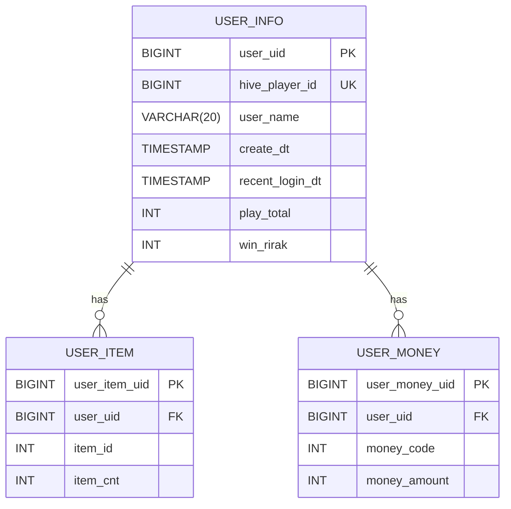

## Game Database

### Entity-Relationship Diagram



Foreign key applications are considered but may lack in practicality.

### USER_INFO Table

```sql
CREATE TABLE user_info (
    user_uid BIGINT AUTO_INCREMENT PRIMARY KEY,
    hive_player_id BIGINT NOT NULL UNIQUE,
    user_name VARCHAR(20) NOT NULL UNIQUE,
    create_dt TIMESTAMP NOT NULL DEFAULT CURRENT_TIMESTAMP,
    attendance_update_dt TIMESTAMP NOT NULL DEFAULT CURRENT_TIMESTAMP,
    recent_login_dt TIMESTAMP NOT NULL,
    play_total INT DEFAULT 0,
    win_total INT DEFAULT 0
);
```

### USER_ITEM Table

```sql
CREATE TABLE user_item (
    user_item_uid BIGINT AUTO_INCREMENT PRIMARY KEY,
    user_uid BIGINT NOT NULL,
    item_id INT NOT NULL,
    item_cnt INT DEFAULT 0,
    -- CONSTRAINT fk_user_item_user FOREIGN KEY (user_uid)
    -- REFERENCES user_info(user_uid),
    INDEX idx_user_uid_item (user_uid),
    UNIQUE KEY unique_user_item (user_uid, item_id)
);
```

### USER_MONEY Table

```sql
CREATE TABLE user_money (
    user_money_uid BIGINT AUTO_INCREMENT PRIMARY KEY,
    user_uid BIGINT NOT NULL,
    money_code INT NOT NULL,
    money_amount INT DEFAULT 0,
    -- CONSTRAINT fk_user_money_user FOREIGN KEY (user_uid)
    -- REFERENCES user_info(user_uid),
    INDEX idx_user_uid_money (user_uid),
    UNIQUE KEY unique_user_money (user_uid, money_code)
);

```

### GAME_RESULT Table

```sql
CREATE TABLE game_result (
    game_result_uid BIGINT AUTO_INCREMENT PRIMARY KEY,
    black_user_uid BIGINT NOT NULL,
    white_user_uid BIGINT NOT NULL,
    result_code INT NOT NULL,
    start_dt TIMESTAMP NOT NULL,
    end_dt TIMESTAMP NOT NULL DEFAULT CURRENT_TIMESTAMP,
    INDEX idx_user_black (black_user_uid),
    INDEX idx_user_white (white_user_uid)
);
```

### MAIL Table

```sql
CREATE TABLE mail (
    mail_uid BIGINT AUTO_INCREMENT PRIMARY KEY,
    mail_title VARCHAR(100) NOT NULL,
    mail_content VARCHAR(300),
    mail_status_code INT DEFAULT 0,
    send_user_uid BIGINT,
    receive_user_uid BIGINT NOT NULL,
    reward_code INT DEFAULT 0,
    create_dt TIMESTAMP NOT NULL DEFAULT CURRENT_TIMESTAMP,
    update_dt TIMESTAMP,
    expire_dt TIMESTAMP NOT NULL,
    INDEX idx_user_receive (receive_user_uid)
);
```

### ATTENDANCE Table

```sql
CREATE TABLE attendance (
    attendance_uid BIGINT AUTO_INCREMENT PRIMARY KEY,
    attendance_code INT NOT NULL,
    user_uid BIGINT NOT NULL,
    attendance_seq INT NOT NULL DEFAULT 0,
    create_dt TIMESTAMP NOT NULL DEFAULT CURRENT_TIMESTAMP,

    UNIQUE INDEX uq_user_attendance (user_uid, attendance_code)
);
```
