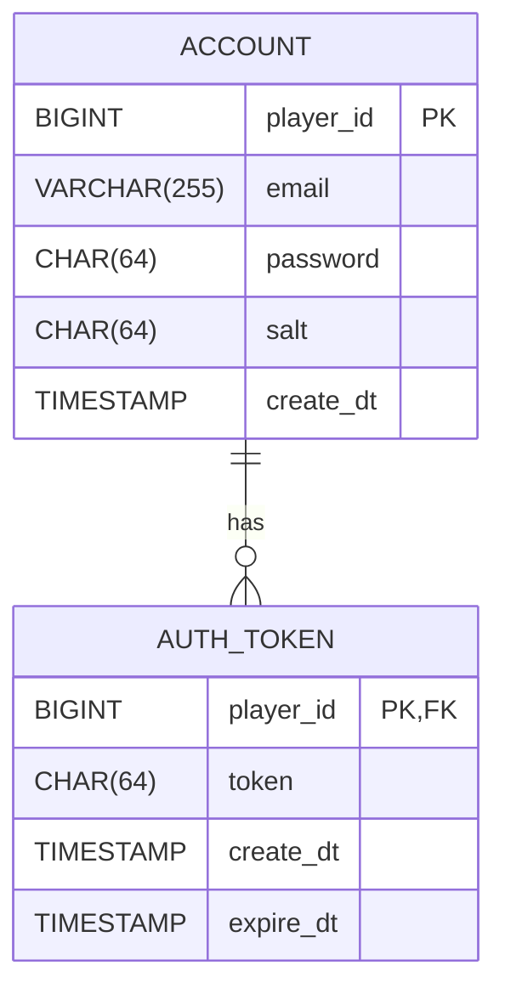

## Hive Database

### Entity-Relationship Diagram



### ACCOUNT Table

```sql
CREATE TABLE `account` (
  player_id BIGINT NOT NULL AUTO_INCREMENT PRIMARY KEY,
  email VARCHAR(255) NOT NULL,
  pw CHAR(64) NOT NULL,
  salt CHAR(64) NOT NULL,
  create_dt TIMESTAMP NOT NULL DEFAULT CURRENT_TIMESTAMP,
  UNIQUE KEY email (email)
);
```

### AUTH_TOKEN Table

```sql
CREATE TABLE `auth_token` (
    player_id BIGINT NOT NULL PRIMARY KEY,
    token CHAR(64) NOT NULL,
    create_dt TIMESTAMP NOT NULL DEFAULT CURRENT_TIMESTAMP,
    expire_dt TIMESTAMP NOT NULL,
    CONSTRAINT fk_player FOREIGN KEY (player_id) REFERENCES account(player_id)
);
```
