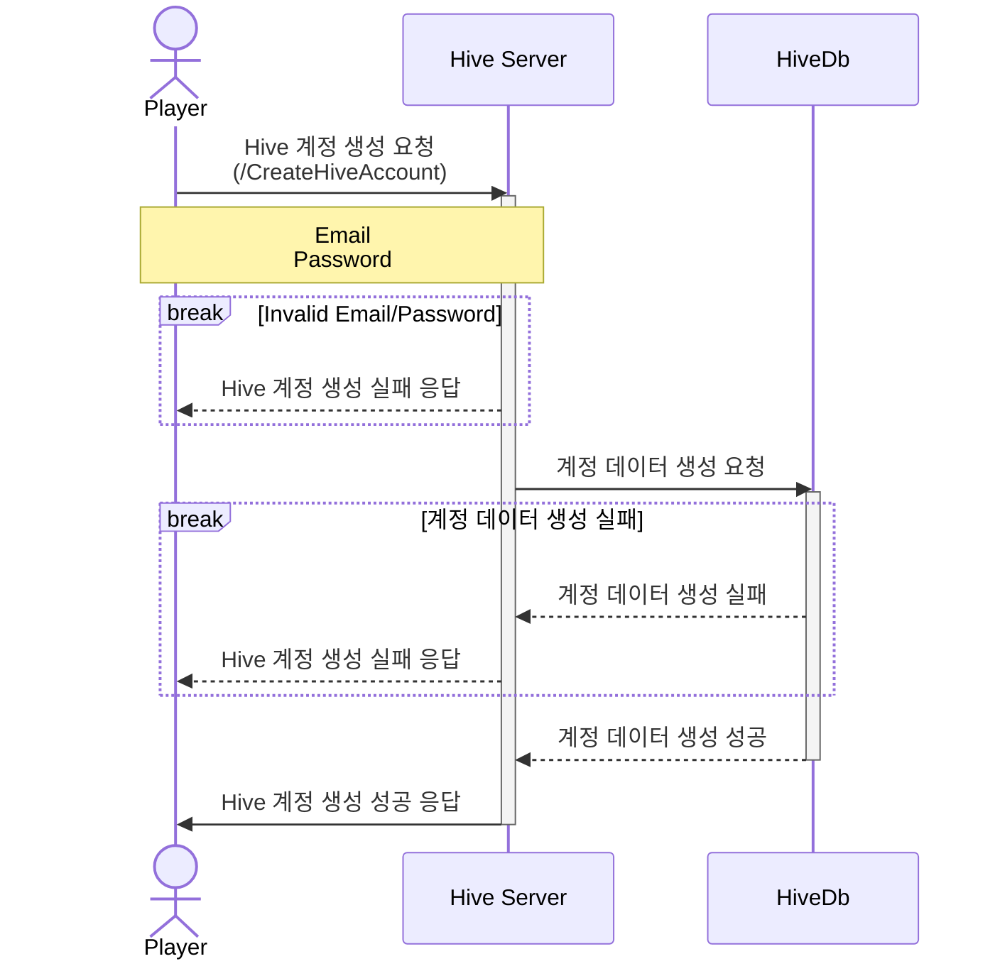
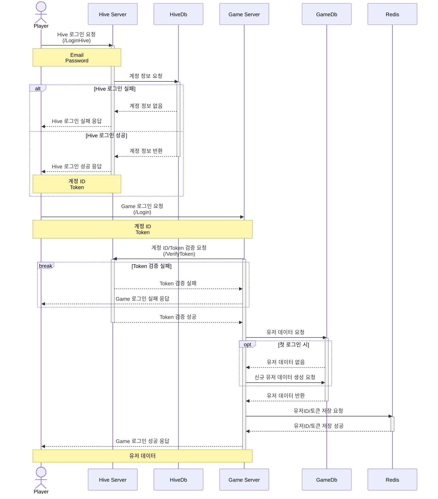

## Authentication Sequence Diagrams

### Create Hive Account

```mermaid
sequenceDiagram
actor Player
participant Hive Server
participant HiveDb

Player->>Hive Server:Hive 계정 생성 요청 <br/> (/CreateHiveAccount)
activate Hive Server
Note over Player,Hive Server: Email <br/> Password

break Invalid Email/Password
 Hive Server-->>Player:Hive 계정 생성 실패 응답
end

Hive Server->>HiveDb:계정 데이터 생성 요청 
activate HiveDb
break 계정 데이터 생성 실패
    HiveDb-->>Hive Server: 계정 데이터 생성 실패
    Hive Server-->>Player:Hive 계정 생성 실패 응답
end
HiveDb-->>Hive Server: 계정 데이터 생성 성공
deactivate HiveDb


Hive Server->>Player:Hive 계정 생성 성공 응답
deactivate Hive Server
```

### Login

```mermaid
sequenceDiagram
actor Player
participant Hive Server
participant HiveDb
participant Game Server
participant GameDb
participant Redis

Player->>Hive Server:Hive 로그인 요청 <br/> (/LoginHive)
activate Hive Server
Note over Player,Hive Server: Email <br/> Password

Hive Server->>HiveDb:계정 정보 요청
activate HiveDb

alt Hive 로그인 실패
    HiveDb-->>Hive Server:계정 정보 없음
    Hive Server-->>Player:Hive 로그인 실패 응답
else Hive 로그인 성공

    HiveDb-->>Hive Server:계정 정보 반환
    deactivate HiveDb
    Hive Server-->>Player:Hive 로그인 성공 응답
Note over Player,Hive Server: 계정 ID <br/> Token
    deactivate Hive Server
end

    Player->>Game Server:Game 로그인 요청 <br/> (/Login)
    Note over Player,Game Server: 계정 ID <br/> Token

    Game Server->>Hive Server:계정 ID/Token 검증 요청 <br/> (/VerifyToken)
    activate Game Server

    activate Hive Server
        break Token 검증 실패

            Hive Server-->>Game Server:Token 검증 실패
            Game Server-->>Player:Game 로그인 실패 응답
        end

    Hive Server-->>Game Server:Token 검증 성공
    deactivate Hive Server

    Game Server->>GameDb: 유저 데이터 요청
    activate GameDb

        opt 첫 로그인 시
            GameDb-->>Game Server: 유저 데이터 없음
            Game Server->>GameDb:신규 유저 데이터 생성 요청

        end
            GameDb-->>Game Server:유저 데이터 반환

    deactivate GameDb

    Game Server->>Redis:유저ID/토큰 저장 요청
    activate Redis
    Redis-->>Game Server:유저ID/토큰 저장 성공
    deactivate Redis
    Game Server-->>Player:Game 로그인 성공 응답
    Note over Game Server, Player: 유저 데이터

deactivate Game Server

```
