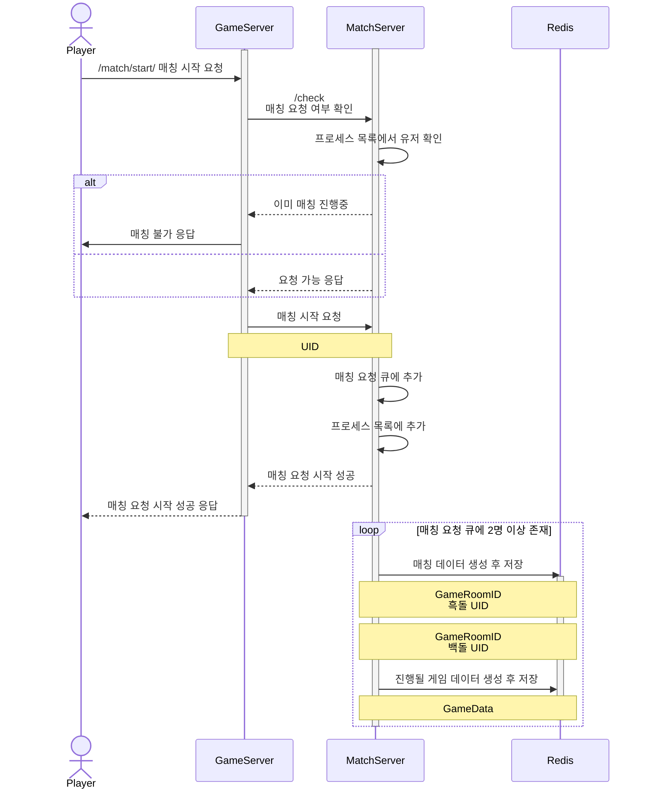
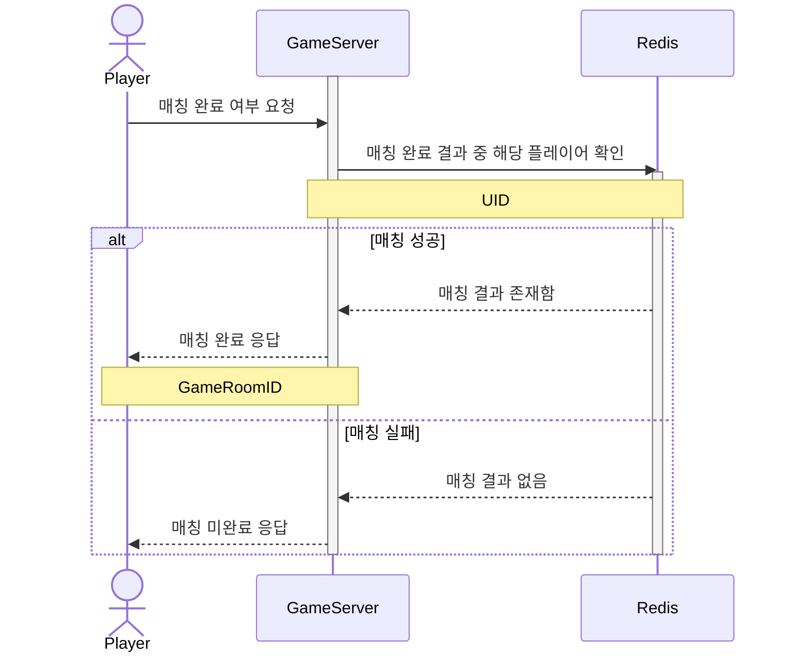

## Match Sequence Diagram

### Request Match

```mermaid
sequenceDiagram

    actor P as Player
    participant G as GameServer
    participant M as MatchServer
    participant R as Redis

activate M
activate G
P->>G: /match/start/ 매칭 시작 요청
G->>M: /check <br/> 매칭 요청 여부 확인
M->>M: 프로세스 목록에서 유저 확인
alt 
M-->>G: 이미 매칭 진행중
G->>P: 매칭 불가 응답
else
M-->>G: 요청 가능 응답
end
G->>M: 매칭 시작 요청
Note over G,M: UID
M->>M:매칭 요청 큐에 추가
M->>M:프로세스 목록에 추가
M-->>G: 매칭 요청 시작 성공
G-->>P: 매칭 요청 시작 성공 응답
deactivate G


loop 매칭 요청 큐에 2명 이상 존재
    M->>R: 매칭 데이터 생성 후 저장
    activate R
    Note over R,M: GameRoomID <br/> 흑돌 UID
        Note over R,M: GameRoomID <br/> 백돌 UID
    M->>R: 진행될 게임 데이터 생성 후 저장
    Note over M,R: GameData
    deactivate R
end

deactivate M
```

### Check Match

```mermaid
sequenceDiagram

    actor P as Player
    participant G as GameServer
    participant R as Redis

activate G

P->>G: 매칭 완료 여부 요청
G->>R: 매칭 완료 결과 중 해당 플레이어 확인
activate R

Note over G,R: UID

alt 매칭 성공
    R-->>G: 매칭 결과 존재함
    G-->>P: 매칭 완료 응답
    Note over G,P: GameRoomID

    else 매칭 실패
    R-->>G: 매칭 결과 없음
    G-->>P: 매칭 미완료 응답
end

deactivate G
deactivate R

```
