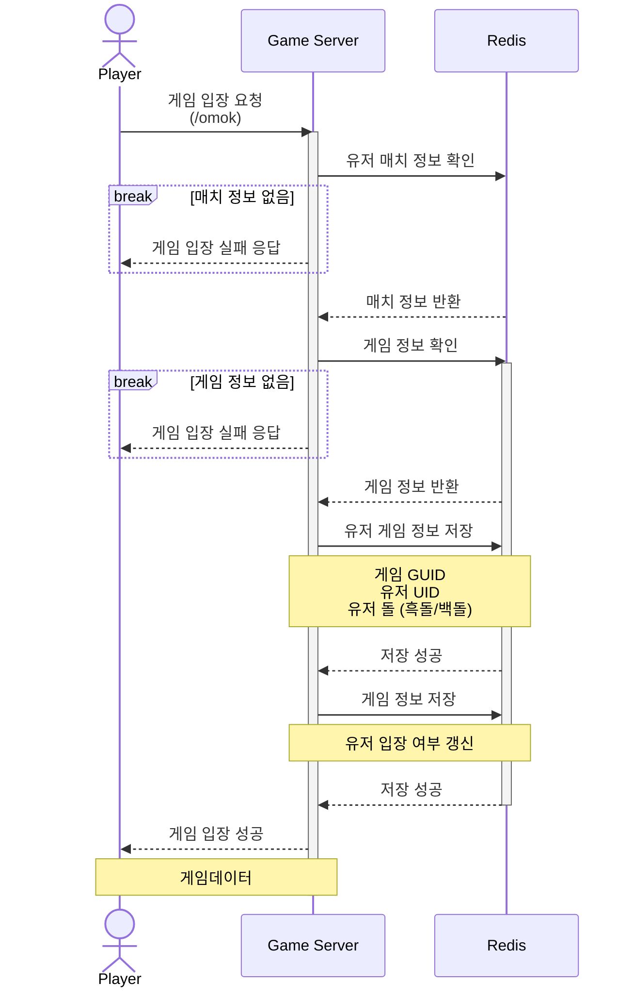
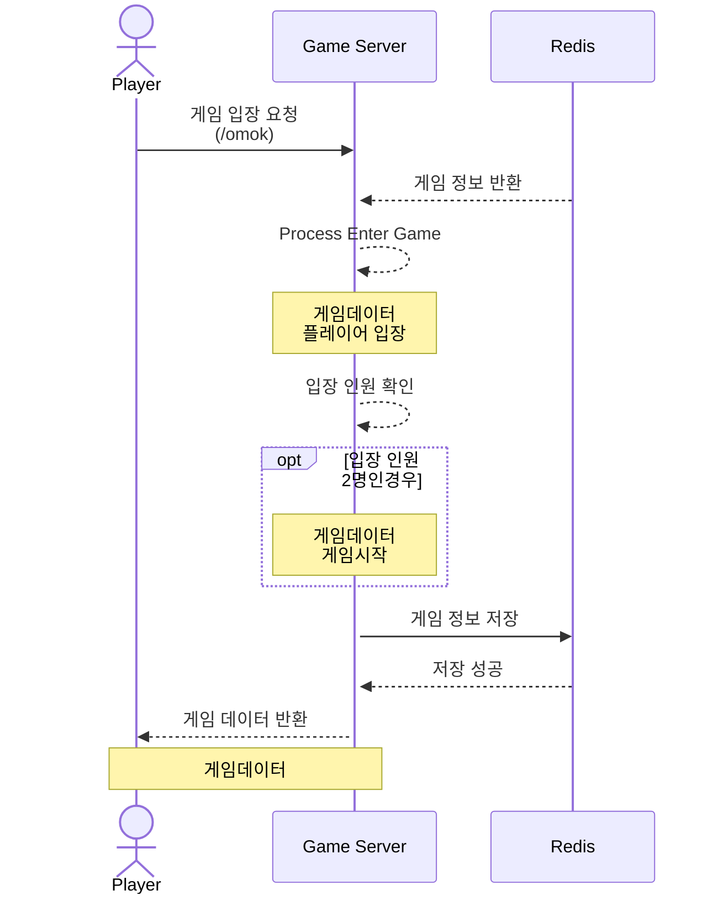
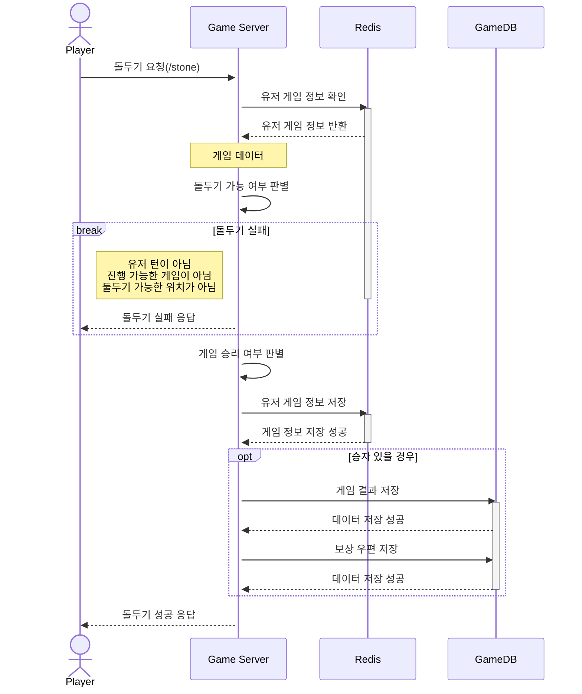
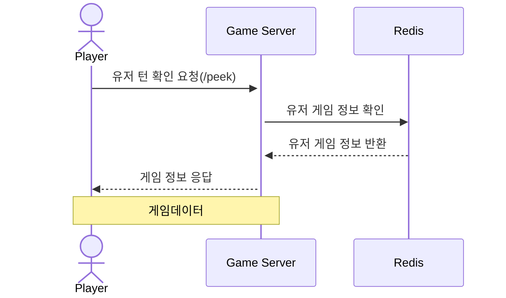
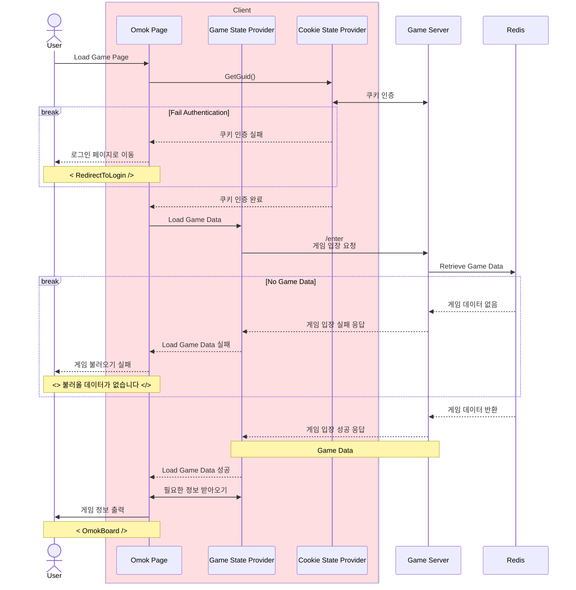

## Omok Sequence Diagrams

### Enter Game

```mermaid
sequenceDiagram
actor P as Player
participant G as Game Server
participant R as Redis


P->>G:게임 입장 요청 <br/> (/omok)
activate G
G->>R:유저 매치 정보 확인
break 매치 정보 없음
G-->>P:게임 입장 실패 응답
end
R-->>G: 매치 정보 반환
G->>R:게임 정보 확인
activate R
break 게임 정보 없음
G-->>P:게임 입장 실패 응답
end

R-->>G: 게임 정보 반환
G->>R: 유저 게임 정보 저장
Note over G,R: 게임 GUID <br/> 유저 UID <br/> 유저 돌 (흑돌/백돌)
R-->>G: 저장 성공
G->>R: 게임 정보 저장
Note over G,R: 유저 입장 여부 갱신
R-->>G: 저장 성공
deactivate R
G-->>P:게임 입장 성공
Note over G,P: 게임데이터


Deactivate G

```

### Start Game

```mermaid
sequenceDiagram
actor P as Player
participant G as Game Server
participant R as Redis


P->>G:게임 입장 요청 <br/> (/omok)
activate G
R-->>G: 게임 정보 반환
G-->>G: Process Enter Game
Note over G: 게임데이터 <br/> 플레이어 입장
G-->>G:입장 인원 확인
opt 입장 인원 2명인경우
Note over G: 게임데이터 <br/> 게임시작
end

G->>R: 게임 정보 저장
R-->>G: 저장 성공

G-->>P: 게임 데이터 반환
Note over G,P: 게임데이터

```

### Set Stone in Game

```mermaid
sequenceDiagram
actor P as Player
participant G as Game Server
participant R as Redis
participant GDB as GameDB

activate G
P->>G: 돌두기 요청(/stone)
G->>R: 유저 게임 정보 확인
activate R
R-->>G: 유저 게임 정보 반환
Note over G: 게임 데이터
G->>G: 돌두기 가능 여부 판별
break 돌두기 실패
Note left of G: 유저 턴이 아님 <br/> 진행 가능한 게임이 아님 <br/> 둘두기 가능한 위치가 아님
deactivate R
G-->>P: 돌두기 실패 응답
end

G->>G: 게임 승리 여부 판별
G->>R: 유저 게임 정보 저장
activate R
R-->>G: 게임 정보 저장 성공
deactivate R

opt 승자 있을 경우
G->>GDB: 게임 결과 저장
activate GDB
GDB-->>G: 데이터 저장 성공
G->>GDB: 보상 우편 저장
GDB-->>G: 데이터 저장 성공
deactivate GDB
end

G-->>P: 돌두기 성공 응답
```

### Check Game State

```mermaid
sequenceDiagram
actor P as Player
participant G as Game Server
participant R as Redis

activate G
P->>G: 유저 턴 확인 요청(/peek)
G->>R: 유저 게임 정보 확인
R-->>G: 유저 게임 정보 반환


G-->>P: 게임 정보 응답
Note over G,P: 게임데이터
```

### Game Process with Client

```mermaid
sequenceDiagram

actor U as User

box rgb(255, 222, 225) Client
participant P as Omok Page
participant GP as Game State Provider
participant CP as Cookie State Provider
end
participant S as Game Server
participant R as Redis

U->>P:Load Game Page
P->>CP: GetGuid()
CP<<->>S: 쿠키 인증

break Fail Authentication
CP-->>P:쿠키 인증 실패
P-->>U: 로그인 페이지로 이동
Note over P,U:  < RedirectToLogin />
end

CP-->>P:쿠키 인증 완료
P->>GP:Load Game Data
GP->>S:/enter <br/> 게임 입장 요청
S->>R:Retrieve Game Data

break No Game Data
R-->>S: 게임 데이터 없음
S-->>GP: 게임 입장 실패 응답
GP-->>P: Load Game Data 실패
P-->>U: 게임 불러오기 실패
Note over P,U: <> 불러올 데이터가 없습니다 </>
end 

R-->>S: 게임 데이터 반환
S-->>GP:게임 입장 성공 응답
Note over S,GP:Game Data
GP-->>P: Load Game Data 성공
GP<<->>P: 필요한 정보 받아오기
P->>U:게임 정보 출력
Note over P,U: < OmokBoard />
```
