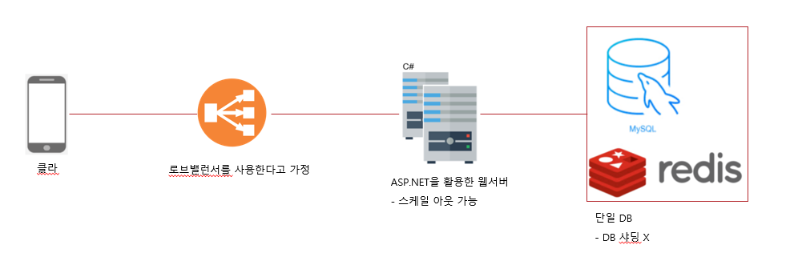

## 서버구조도 및 흐름
    
   

## 개발 환경
.NET core SDK 6.0.1  
Docker 20.10.12   

## Docker image version
MySQL 5.6.36  
Redis 6.2.6  
Fluentd 1.14.0  
rockylinux 8.5   

## NuGet List      
CloudStructures 3.2.0  
Dapper 2.0.123  
Microsoft.AspNetCore.Hosting 2.2.7  
MySqlConnector 2.1.2  
ZLogger 1.6.1  

## 클라우드 테스트 서버 환경
CentOS 8  

## 서버 설정
MyConfig.json  
appsettings.Development.json   
appsettings.Production.json   
위 파일에서 찾아볼 수 있다.  

MyConfig의 "Environment" 설정에 따라 appsettings.Production.json 또는 appsettings.Development.json이 실행될 수 있다.  

appsettings.Production.json 파일은 Redis, DB의 ip, port가 클라우드 환경에 알맞게 세팅되어 있음.   

## docker build  
rockylinux 8.5 -> richard0326/robotmon-go-apiserver  
ApiServer build할때 사용한 dockerfile  
(https://github.com/richard0326/RobotMon-Go/blob/main/Setting/apiserver/Dockerfile)  

fluentd 1.14.0 -> richard0326/fluentd  
Fluentd에 MySQL5.6.36 포함하여 build할때 사용한 dockerfile  
(https://github.com/richard0326/RobotMon-Go/blob/main/Setting/fluentdSettings/Dockerfile)  
