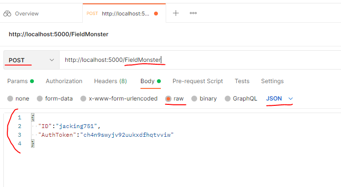

# RobotMon-Go
- 포켓몬고를 모방한 게임 개발
 
## 사용할 기술
- Linux
- MySQL
- Redis  
- C#
- ASP.NET Core WebAPI
- Git
  
  
  
## 문서
- 패킷(WebAPI에서는 요청과 응답) 시퀸스 다이얼 그램
    - PlantUML로 작성한다
- Database Table
- Server.md
- ppt 발표 자료
- 클라우드 테스트.md

## 세팅 정보
- apiserver 관련 정보
- fluentd 관련 정보
- mysql 관련 

## 서버 애플리케이션 실행
- 최종적으로 Rocky Linux에서 실행될 예정이다  
- 개발 머신의 OS가 Windows라면 VirtualBox를 설치한 후 Rocky Linux를 설치한다.
- 최대한 실제와 비슷하게 하기 위해 개발 머신에서 리눅스로 서버 애플리케이션 실행 파일과 리소스 파일을 배포한다.
    - Host OS와 VirtualBox 간의 공유 디렉토리나 클립보드 복사 방식은 사용하지 않는다.
	- SSH, SFTP, Git 등을 사용하여 배포한다.

## 개발일정
웹서버 개발(12/2~1/2)  
- 웹서버 개발일정, 기획서 작성 (12/2~3)  
- 로그인 (12/3~8)  
- 계정 생성 (12/4~8)  
- 게임 정보 받기 (12/8~9)  
- csv tool 개발 (12/9)
- 필드 정보 받기 (12/9)
- 잡기 기능(12/13)
- 출석 기능(12/14~16)
- 우편함(12/17~20)
    - 우편 리스트 보기. 한번에 10개까지씩 
	- 우편 받기	
- 서버 테스트
    - VirtualBox에 Rocky Linux 설치하기(12/20)
    - Rocky Linux 사용법 숙지하기(1/2)
    - 2대의 다른 머신에서 테스트(12/20)
- 랭킹(12/23~25)
- 연구실 보내기(12/27)
- 진화(12/27~29)  
- 강화(12/27~1/2)  

도커(1/3~1/11)
- 도커 사용법 익히기
- 로봇몬고 도커에서 실행
- 클라우드 환경에서 도커 파일 실행 후 연동하기(3개 리눅스 클라우드 활용(APIServer, mysql, redis), 1개 윈도우 클라)  

로그(fluentd)(1/11~1/18)  
- 웹서버에 남기는 로그 파일을 fluentd로 로그 서버 모으기
- fluentd forward로 원격 fluentd로 보내고, 여기서 DB 로그 저장
- docker에서 콘솔로 로그를 출력하게 하고,  이 로그를 fluentd를 통해서 DB에 저장  

마무리 작업(1/19~28)
- dotnet 6 버전으로 변경(1/20)  
- 코드 및 문서 정리(1/20~25)
- 발표 준비(1/24~25)
- 발표(1/26)  
- 교육 종료(1/28)  

시간 여유되면 구현할 것
- 배치Job 프로그램(기간 지난 우편 정리)  
- 교환기능  

## API 서버 실행 방법
1. dotnet ApiServer.dll
2. dotnet run --project C:\Users\ ... \RobotMon-Go\ApiServer\ApiServer.csproj

## URL 설명
사용 예시  :  
      
모든 요청은 POST로 진행  
body를 객체와 일치하여 Json 포맷으로 보내면 됨.  
구체적인 사용 예시 : https://github.com/richard0326/RobotMon-Go/blob/main/APIServer/httpTest.http

http://[IP]:[port]/Login   
요청 Req : https://github.com/richard0326/RobotMon-Go/blob/main/APIServer/Model/ReqRes/LoginRequest.cs   
응답 Res : https://github.com/richard0326/RobotMon-Go/blob/main/APIServer/Model/ReqRes/LoginResponse.cs   
  
http://[IP]:[port]/CreateAccount  
요청 Req : https://github.com/richard0326/RobotMon-Go/blob/main/APIServer/Model/ReqRes/CreateAccountRequest.cs   
응답 Res : https://github.com/richard0326/RobotMon-Go/blob/main/APIServer/Model/ReqRes/CreateAccountResponse.cs   
  
http://[IP]:[port]/UserGameInfo  
요청 Req : https://github.com/richard0326/RobotMon-Go/blob/main/APIServer/Model/ReqRes/UserGameInfoRequest.cs   
응답 Res : https://github.com/richard0326/RobotMon-Go/blob/main/APIServer/Model/ReqRes/UserGameInfoResponse.cs   
  
http://[IP]:[port]/FieldMonster  
요청 Req : https://github.com/richard0326/RobotMon-Go/blob/main/APIServer/Model/ReqRes/FieldMonsterRequest.cs   
응답 Res : https://github.com/richard0326/RobotMon-Go/blob/main/APIServer/Model/ReqRes/FieldMonsterResponse.cs   
  
http://[IP]:[port]/Catch  
요청 Req : https://github.com/richard0326/RobotMon-Go/blob/main/APIServer/Model/ReqRes/CatchRequest.cs   
응답 Res : https://github.com/richard0326/RobotMon-Go/blob/main/APIServer/Model/ReqRes/CatchResponse.cs   
  
http://[IP]:[port]/CatchList  
요청 Req : https://github.com/richard0326/RobotMon-Go/blob/main/APIServer/Model/ReqRes/CatchListRequest.cs   
응답 Res : https://github.com/richard0326/RobotMon-Go/blob/main/APIServer/Model/ReqRes/CatchListResponse.cs   

http://[IP]:[port]/RemoveCatch  
요청 Req : https://github.com/richard0326/RobotMon-Go/blob/main/APIServer/Model/ReqRes/RemoveCatchRequest.cs   
응답 Res : https://github.com/richard0326/RobotMon-Go/blob/main/APIServer/Model/ReqRes/RemoveCatchResponse.cs   

http://[IP]:[port]/DailyCheck  
요청 Req : https://github.com/richard0326/RobotMon-Go/blob/main/APIServer/Model/ReqRes/DailyCheckRequest.cs   
응답 Res : https://github.com/richard0326/RobotMon-Go/blob/main/APIServer/Model/ReqRes/DailyCheckResponse.cs   
  
http://[IP]:[port]/Evolve  
요청 Req : https://github.com/richard0326/RobotMon-Go/blob/main/APIServer/Model/ReqRes/EvolveRequest.cs   
응답 Res : https://github.com/richard0326/RobotMon-Go/blob/main/APIServer/Model/ReqRes/EvolveResponse.cs   
  
http://[IP]:[port]/Upgrade  
요청 Req : https://github.com/richard0326/RobotMon-Go/blob/main/APIServer/Model/ReqRes/UpgradeRequest.cs   
응답 Res : https://github.com/richard0326/RobotMon-Go/blob/main/APIServer/Model/ReqRes/UpgradeResponse.cs   

http://[IP]:[port]/MailList  
요청 Req : https://github.com/richard0326/RobotMon-Go/blob/main/APIServer/Model/ReqRes/MailListRequest.cs   
응답 Res : https://github.com/richard0326/RobotMon-Go/blob/main/APIServer/Model/ReqRes/MailListResponse.cs   

http://[IP]:[port]/RankingList  
요청 Req : https://github.com/richard0326/RobotMon-Go/blob/main/APIServer/Model/ReqRes/RankingListRequest.cs   
응답 Res : https://github.com/richard0326/RobotMon-Go/blob/main/APIServer/Model/ReqRes/RankingListResponse.cs   

http://[IP]:[port]/RecvMail  
요청 Req : https://github.com/richard0326/RobotMon-Go/blob/main/APIServer/Model/ReqRes/RecvMailRequest.cs   
응답 Res : https://github.com/richard0326/RobotMon-Go/blob/main/APIServer/Model/ReqRes/RecvMailResponse.cs   

http://[IP]:[port]/SendMail  
요청 Req : https://github.com/richard0326/RobotMon-Go/blob/main/APIServer/Model/ReqRes/SendMailRequest.cs   
응답 Res : https://github.com/richard0326/RobotMon-Go/blob/main/APIServer/Model/ReqRes/SendMailResponse.cs   
