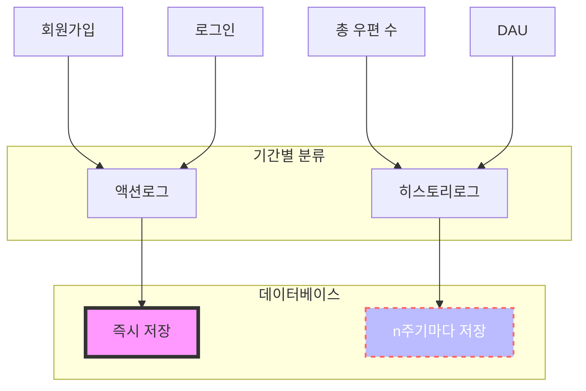
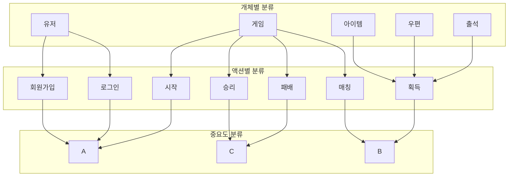
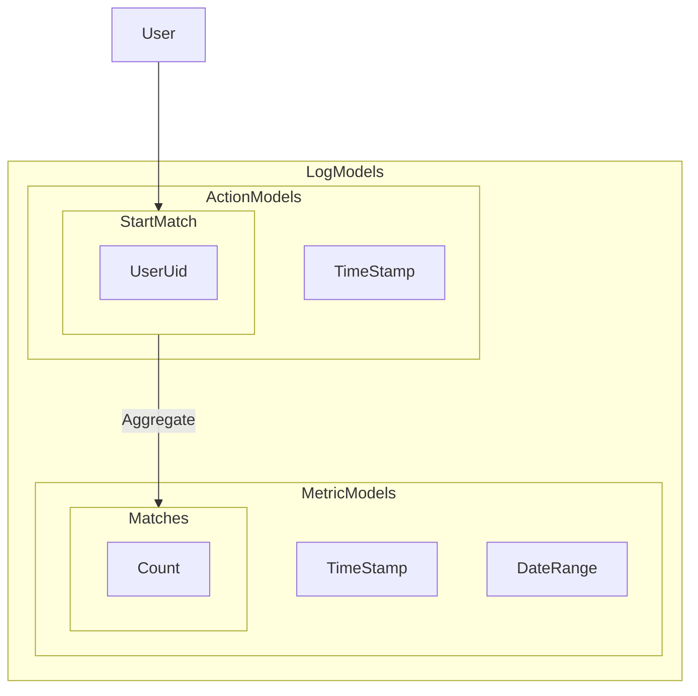
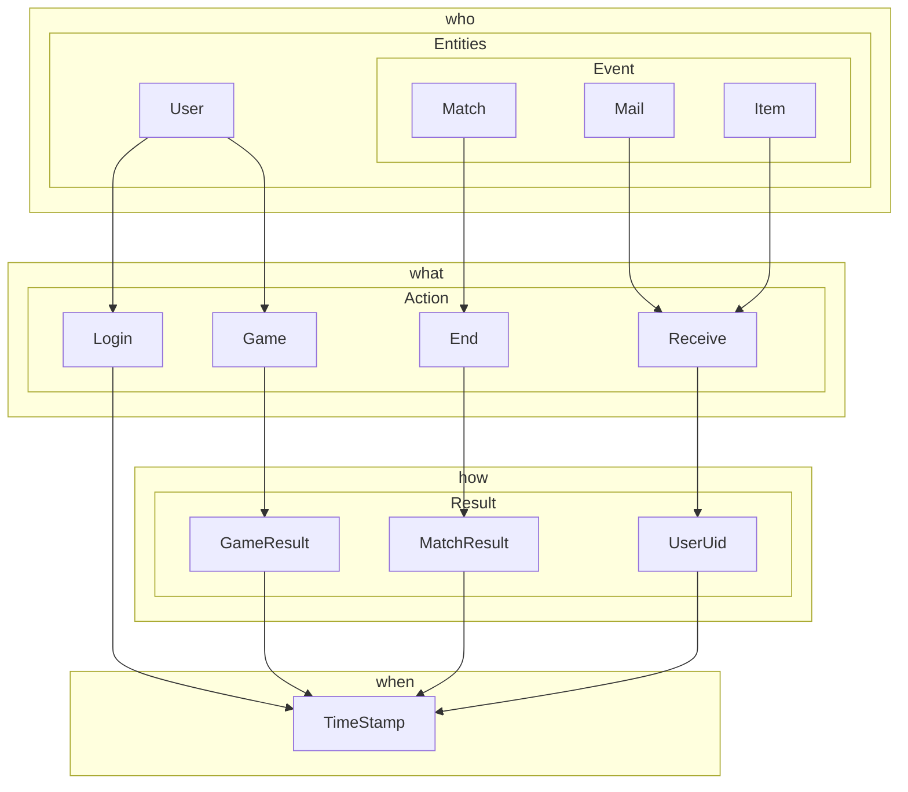

# 로그 설계

## User-Specific Logs

```sql
CREATE TABLE `user_login_logs` (
  `uid` bigint NOT NULL,
  `timestamp` datetime NOT NULL,
  PRIMARY KEY (`uid`,`timestamp`),
  KEY `idx_uid` (`uid`)
);
```

유저 로그인 로그
<br/><br/>

```sql
CREATE TABLE `user_match_start_logs` (
  `uid` BIGINT NOT NULL,
  `timestamp` DATETIME NOT NULL,
  PRIMARY KEY (`uid`, `timestamp`),
  KEY `idx_uid` (`uid`)
);

```

유저 매칭 시작 로그
<br/><br/>

```sql
CREATE TABLE `user_match_complete_logs` (
  `uid` BIGINT NOT NULL,
  `timestamp` DATETIME NOT NULL,
  PRIMARY KEY (`uid`, `timestamp`),
  KEY `idx_uid` (`uid`)
);
```

유저 매칭 완료 로그
<br/><br/>

```sql
CREATE TABLE `user_game_logs` (
  `uid` BIGINT NOT NULL,
  `timestamp` DATETIME NOT NULL,
  PRIMARY KEY (`uid`, `timestamp`),
  KEY `idx_uid` (`uid`)
);
```

유저 게임 기록 로그
<br/><br/>

## Metric Logs

```sql
CREATE TABLE `game_logs` (
  `guid` VARCHAR(36) NOT NULL,
  `timestamp` DATETIME NOT NULL,
  PRIMARY KEY (`guid`),
  KEY `idx_guid_timestamp` (`guid`, `timestamp`)
);
```

게임 생성 기록
<br/><br/>

```sql
CREATE TABLE `match_logs` (
  `guid` VARCHAR(36) NOT NULL,
  `timestamp` DATETIME NOT NULL,
  PRIMARY KEY (`guid`),
  KEY `idx_guid_timestamp` (`guid`, `timestamp`)
);
```

매칭 생성 기록
<br/><br/>

## 로그 시스템 개요

게임 로그는 DB에 저장되며, DB 서버의 성능에 따라 제약을 받을 수 있습니다. 특히 MMORPG와 같은 게임은 동시다발적으로 수많은 액션이 발생하므로, 테이블을 여러 개 연결하면 성능 저하가 발생할 수 있습니다. 이를 해결하기 위해 로그는 두 단계로 나누어 기록됩니다:

- 원본 로그: 게임 서버에서 즉시 수집한 단순한 정보.
- 표준화 로그: 사람이 판별하기 쉽도록 재가공된 로그로, 추가적인 부가 정보를 포함.

## 로그 유형



### Event-Based Logs

액션이 발생할 때 즉시 기록되는 로그입니다. 액션 로그는 다음과 같은 구성을 가집니다:

주체: 액션을 발생시킨 사용자 또는 시스템.

액션 정보: 수행된 동작 (예: 로그인, 레벨업).

부가 정보: 플랫폼, IP 등 추가 정보.

예시 로그 항목:

- server close: 서버 비정상 종료
- account login: 계정 로그인

### Metric Logs

특정 주기에 따라 상태 변화를 기록하는 로그입니다. 게임 상태의 변화를 빠르게 확인할 수 있도록 주기적으로 기록됩니다.

예시 로그 항목:

- server user: 동시 접속자 수
- item all: 아이템 총 수량

## 로그 구조 설계하기

### 로그 분류



개체, 액션, 시간별로 인덱싱이 가능하게 하고, 중요도에 따라 디테일의 양과 저장 시간을 줄입니다.



### 모델 세분화



### Action

| Property  | Description            |
| :-------- | :--------------------- |
| timestamp | 액션 발생 시간         |
| `context` | 추가 정보, 로그별 상이 |

#### OPTION 1 액션별 테이블 생성

```sql
CREATE TABLE user_login_logs (
    uid BIGINT NOT NULL,
    timestamp DATETIME NOT NULL,
    PRIMARY KEY (uid, timestamp),
    KEY `idx_uid` (`uid`)
);
```

```sql
CREATE TABLE user_match_start_logs (
    uid BIGINT NOT NULL,
    timestamp DATETIME NOT NULL,
    PRIMARY KEY (uid, timestamp),
    KEY `idx_uid` (`uid`)
);
```

```sql
CREATE TABLE user_match_complete_logs (
    uid BIGINT NOT NULL,
    timestamp DATETIME NOT NULL,
    PRIMARY KEY (uid, timestamp),
    KEY `idx_uid` (`uid`)
);
```

```sql
CREATE TABLE user_game_logs (
    uid BIGINT NOT NULL,
    timestamp DATETIME NOT NULL,
    PRIMARY KEY (uid, timestamp),
    KEY `idx_uid` (`uid`)
);
```

#### OPTION 2 하나의 테이블에 액션별 구분짓기

```sql
CREATE TABLE user_action_logs (
    uid BIGINT NOT NULL,
    action_code INT NOT NULL,
    timestamp DATETIME NOT NULL,
    PRIMARY KEY (uid, timestamp),
    KEY `idx_uid` (`uid`),
    KEY `idx_uid_action` (`uid`, `action`)
);
```

### Metrics

```sql
CREATE TABLE `daily_active_users` (
    `date` DATE NOT NULL,
    `uid` BIGINT NOT NULL,
    PRIMARY KEY (`date`, `uid`),
    KEY `idx_date` (`date`)
);
```
