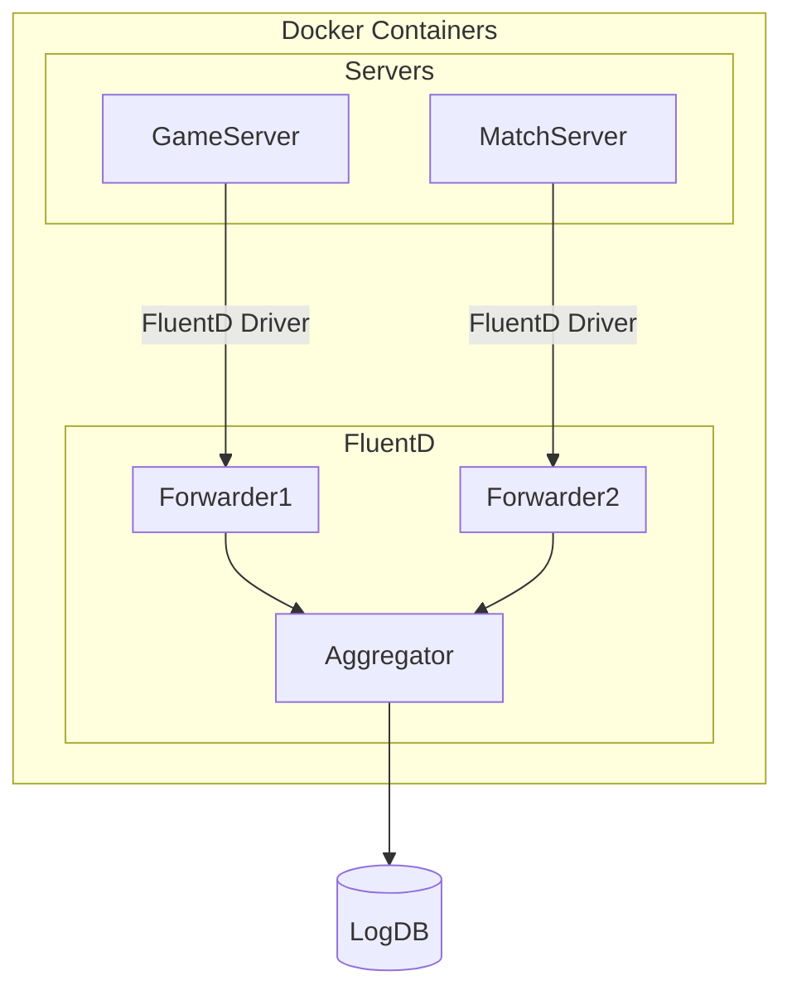

# Docker Compose

본 프로젝트는 Docker를 통해 각 서버를 컨테이너화 합니다.

함께 사용되지만 로그를 남기지 않는 Redis, HiverServer등의 설명은 생략 되었습니다.  

(최흥배) 실습을 할 때는 하나의 머신에서 게임서버, 매칭서버를 실행했지만 실제는 별개의 서버에서 실행될 테니 게임서버와 매칭서버는 서로 분리된 형태로 그림이 그려졌으면 좋겠습니다.  




(Docker 기본 설정) [json-file logging driver](https://docs.docker.com/engine/logging/drivers/json-file/) 대신에 [Fluentd logging driver](https://docs.docker.com/engine/logging/drivers/fluentd/)를 사용하여 출력물을 Fluentd 컨테이너로 전송 합니다.

```yaml
gameserver:
  #  ... 컨테이너 설정 생략
  logging:
    driver: fluentd
    options:
      fluentd-address: "localhost:24227"
      fluentd-async-connect: "true"
      tag: server.game
```

```yml
matchserver:
  #  ... 컨테이너 설정 생략
  logging:
    driver: fluentd
    options:
      fluentd-address: "localhost:24226"
      fluentd-async-connect: "true"
      tag: server.match
```

로그를 남기려는 컨테이너의 `logging` 파라미터에 `driver` 값을 `fluentd` 로 지정하여 줍니다.

해당 설정으로 컨테이너 출력물을 지정된 fluentd 주소(`fluentd-address`)로 전송합니다.

이후 `options` 파라미터로 상세옵션을 설정할 수 있습니다.

## Fluentd Logging Driver Options

| Parameter Name        | Description                                                                                                                                                                                                   |
| :-------------------- | :------------------------------------------------------------------------------------------------------------------------------------------------------------------------------------------------------------ |
| fluentd-address       | 로그를 전송할 fluentd 주소입니다. `localhost:24224`가 기본값입니다.                                                                                                                                           |
| fluentd-async-connect | Fluentd 비동기 연결 여부. `true`로 설정할 경우 fluentd 연결 시도시 컨테이너 프로세스를 차단하지 않습니다. `false`일 경우 로그를 전송하기 전 fluentd에 연결을 완료할때까지 대기합니다. `false`가 기본값입니다. |
| tag                   | 로그 구분을 위한 태그입니다. 따로 설정하지 않을 경우 컨테이너 ID의 첫 12글자가 임의로 부여됩니다.                                                                                                             |

### fluentd-address 의 사용

`options`구성을 통해

- `gameserver`는 `fluentd-forwarder-1`이 연결되어 있는 `localhost:24227`
- `matchserver`는 `fluentd-forwarder-2`가 연결되어 있는 `localhost:24226`

으로 설정 되어있는것을 확인할 수 있습니다.

### fluentd-async-connect 의 사용

```yaml
gameserver:
  #  ... 컨테이너 설정 생략
  depends_on:
    - db
    - redis
    - fluentd-forwarder-1
```

위와 같이 `depends_on` 설정으로 `fluentd-forwarder-1` 이 실행 완료 될때까지 `gameserver`의 시작을 늦출 수 있지만,

`fluentd-forwarder-1`가 실행 후 정상적으로 작동하기 까지는 시간이 더 소요될 수있습니다.

이때 `gameserver`가 중단되지 않고 실행을 계속 할 수 있도록 `fluentd-async-connect: "true"`옵션을 함께 사용합니다.

이 옵션은 높은 부하가 걸린 환경에서 로깅이 `gameserver`에 영향을 주지 않도록 해야하는 상황에도 유용합니다.

하지만 로그 손실이 허용 되지않고 모든 로그가 `fluentd-forwarder-1`에 전송되는것이 보장되어야 하면 값을 `false`로 유지하는게 좋습니다.

### tag 의 사용

서버별 태그를 통해 로그를 제공받은 `fluentd-aggregator`(Forwarder로 부터 로그를 전송받는 적재소 역할`)가 로그의 종류를 구분할 수 있도록 합니다.

`tag`의 포맷은 [Customize log driver output](https://docs.docker.com/engine/logging/log_tags/)을 참고하여 구성할 수 있습니다.

# Dockerfile

## Fluentd Dockerfile Common Properties

Fluentd Dockerfile 은 총 두가지 입니다.

- [Forwarder](/GameSolution/FluentD/Forwarder/Dockerfile)
- [Aggregator](/GameSolution/FluentD/Aggregator/Dockerfile)

아래는 공통 적용 사항 입니다.

```Dockerfile
FROM fluent/fluentd:edge-debian
```

[Fluentd 에서 제공하는 Docker Image](https://github.com/fluent/fluentd-docker-image)는 Debian/Alpine으로 나뉩니다.

공식 추천 버전은 `jemalloc` 서포트(increased memory performance)가 제공 되는 `Debian` 이며, 이미지 크기는 `Alpine`이 더 작습니다.

```Dockerfile
USER root
```

Fluentd 는 buffer, secondary 등의 파일 저장을 위해 설정 경로 접근이 필요합니다. ([Fluentd Out Forward Plugin](#out-forward) 참고)

저장 디렉토리 권한 확보를 위해서 위와 같이 User를 `root`로 설정 후 유지합니다.

해당 방법이 보안상 좋지 않으면 다른 방법으로는 다음을 고려할 수 있습니다:

- 해당 디렉토리에 `777` 권한을 부여
- 호스트 시스템에서 `fluent` 사용자를 추가한 후, `chown`을 이용하여 해당 디렉토리의 소유권을 변경
- 커스텀 이미지를 빌드

<br/>

```Dockerfile
COPY ./fluent.conf /fluentd/etc/fluent.conf

EXPOSE 24224
```

포트는 Fluentd 기본 포트인 `24224`를 노출합니다.

```yaml
fluentd-forwarder-1:
  image: sha2us/fluentd-forwarder
  container_name: fluentd-forwarder-1
  depends_on:
    - fluentd-aggregator
  networks:
    - backend
  ports:
    - "24227:24224"

fluentd-forwarder-2:
  image: sha2us/fluentd-forwarder
  container_name: fluentd-forwarder-2
  depends_on:
    - fluentd-aggregator
  networks:
    - backend
  ports:
    - "24226:24224"
```

다수의 fluentd 컨테이너는 위와같이 외부 port만 변경하여 mapping 합니다.

```Dockerfile
CMD ["fluentd", "-c", "/fluentd/etc/fluent.conf"]
```

복사된 `.fluent.conf` 구성을 활용하여 `fluentd` 를 실행하도록 설정합니다.

## Fluentd Dockerfile for Aggregator

Aggregator는 로그 가공 및 저장을 위하여 추가 플러그인을 사용합니다.

```Dockerfile
COPY ./db.conf /fluentd/etc/db.conf
```

[재사용 되는 db 설정](/GameSolution/FluentD/README.md#dbconf)을 [`db.conf`](/GameSolution/FluentD/Aggregator/db.conf) 파일에 추가하였기 때문에 함께 복사합니다.

```Dockerfile
RUN apt-get update -y && \
    apt-get install -y \
    ubuntu-dev-tools \
    gcc \
    default-libmysqlclient-dev && \
    gem install fluent-plugin-mysql && \
    fluent-gem install fluent-plugin-rewrite-tag-filter && \
    gem sources --clear-all && \
    rm -rf /var/lib/apt/lists/* && \
    rm -rf /tmp/* /var/tmp/* /usr/lib/ruby/gems/*/cache/*.gem
```

위 방법을 통해

- 로그 가공을 위한 `fluent-plugin-rewrite-tag-filter`,
- DB 저장을 위한 mysql 플러그인 `fluent-plugin-mysql`

를 설치 합니다.

## GameServer Dockerfile

Multi-stage build 를 사용합니다 (불필요한 용량을 사용하지 않기 위해)

```Dockerfile
FROM mcr.microsoft.com/dotnet/sdk:8.0-jammy AS build-env
```

먼저 빌드용 이미지를 불러옵니다.

```Dockerfile
COPY "GameServer/*.csproj" "GameServer/"
COPY "GameShared/*.csproj" "GameShared/"
COPY "ServerShared/*.csproj" "ServerShared/"

RUN dotnet restore "./GameServer/GameServer.csproj"
```

NuGet 패키지 복원 후 프로젝트에 필요한 파일들을 복사한 다음,

```Dockerfile
WORKDIR "/src/GameServer"
RUN dotnet publish -o /app
```

프로젝트를 빌드하고 최종 결과를 `/app` 디렉토리에 저장합니다.

```Dockerfile
FROM mcr.microsoft.com/dotnet/nightly/aspnet:8.0-jammy-chiseled-composite
```

런타임 환경을 위한 이미지를 가져옵니다.

ASP.NET Core 실행을 위한 경령화된 런타임 이미지입니다. ([.NET Chiseled Containers](https://devblogs.microsoft.com/dotnet/announcing-dotnet-chiseled-containers/) 참고)

```Dockerfile
COPY --from=build-env /app .
ENTRYPOINT ["./GameServer"]
```

이후 빌드단계에서 저장한 `/app`의 결과물을 현재 컨테이너의 `/app` 으로 복사한 후 시작 명령어를 지정합니다.
