# Table of Contents

- [Overview](#overview)
- [Getting Started](#getting-started)
  - [Prometheus](#prometheus)
  - [Grafana](#grafana)
- [Docker Configuration](#docker-configuration)
- [Prometheus 구성 방법](#prometheus-configuration)
- [시스템 모니터링](#machine-level-monitoring)
  - [Node Exporter (Linux 환경 모니터링)](#node-exporter)
- [애플리케이션 모니터링](#service-level-monitoring)
  - [환경 구성하기](#환경-구성-하기)
  - [통계 내보내기](#metric-통계-내보내기)
- [통계 가공 및 출력](#metric-visualization)
  - [.NET Runtime Metrics](#net-runtime-metrics)
  - [HTTP Metrics](#http-request-monitoring)
- [Grafana Dashboard 구성 방법](#grafana-configuration)
  - [Panels](#panels)
  - [Templating](#templating) 

# Overview

This directory contains information on integrating prometheus and grafana to current GameSolution project.

## Key Metrics to Monitor

- Machine Level
  - CPU Usage
  - Memory Usage
- Application Level
  - GC(Garbage Collection) 관련 정보 표시
    - Heap size
    - Allocation Rate
    - GC Collection Count
  - Http Request Metrics
    - Http 요청 지속시간
    - Http 요청 빈도

## Stacks Used

게임 서버 모니터링을 위해 아래를 사용합니다

- [Prometheus](https://prometheus.io/) (Data Collection)
  - Node Exporter (Linux 환경 모니터링)
  - prometheus-net (.NET Application 모니터링)
    - prometheus-net.AspNetCore (Http Metrics)
    - prometheus-net.DotNetRuntime (GC Metrics)
- [Grafana](https://grafana.com/) (Data Visualization)

# Getting Started

## Prometheus

```yml
prometheus:
  image: prom/prometheus
  container_name: prometheus
  ports:
    - "9090:9090"
  volumes:
    - ./Prometheus/prometheus.yml:/etc/prometheus/prometheus.yml
  command:
    - "--config.file=/etc/prometheus/prometheus.yml"
  networks:
    - backend
  restart: always
```

Prometheus의 기본 포트는 9090 입니다.

사전에 정의한 [prometheus.yml](/GameSolution/Prometheus/prometheus.yml) 을 파일을 복사하여 해당 구성이 적용 될 수 있도록 합니다.

구성방법은 [Prometheus Configuration](#prometheus-configuration)을 참고합니다.

## Grafana

### Docker Compose

```yml
grafana:
  image: grafana/grafana
  container_name: grafana
  ports:
    - "3030:3000"
  volumes:
    - ./Grafana/datasources:/etc/grafana/provisioning/datasources/
    - ./Grafana/dashboards:/var/lib/grafana/dashboards/
    - ./Grafana/provisioning:/etc/grafana/provisioning/dashboards/
  depends_on:
    - prometheus
  networks:
    - backend
  restart: always
```

Grafana의 기본 포트는 3000 입니다.

현 Docker 구성에서 포트 3000은 GameClient 에서 사용중이므로, Grafana의 외부포트는 3030으로 설정합니다.

Grafana가 Prometheus 데이터 소스를 기본적으로 불러올 수 있도록

아래와 같은 설정 파일을 작성하여 [datasource.yaml](../Grafana/datasources/datasource.yaml) 에 저장합니다.

그 다음, volume 구성을 통해

- [대시보드 설정 디렉토리](../Grafana/provisioning/)
- [DataSource 설정 디렉토리](../Grafana/datasources/)
- [대시보드 파일 (JSON) 디렉토리](../Grafana/dashboards/)

를 아래와 같이 볼륨 매핑 합니다.

```yml
volumes:
  - ./Grafana/datasources:/etc/grafana/provisioning/datasources/
  - ./Grafana/dashboards:/var/lib/grafana/dashboards/
  - ./Grafana/provisioning:/etc/grafana/provisioning/dashboards/
```

# Prometheus Configuration

## `global` : 글로벌 설정

```yml
global:
  scrape_interval: 3s
  evaluation_interval: 5s
```

프로세스에 기본적으로 적용하는 설정을 정의합니다.

메트릭 수집 빈도, 규칙 평가 간격등을 설정할 수 있습니다

| Parameter              | Description                                               |
| :--------------------- | :-------------------------------------------------------- |
| `scrape_interval`      | 메트릭 스크래핑 빈도. 기본값 = `1m` (1분)                 |
| `evaluation_interval ` | 규칙을 평가 / 알림을 생성 빈도. 기본값 = `1m` (1분)       |
| `scrape_timeout`       | 타겟에서 응답을 기다리는 최대 시간. 기본값 = `10s` (10초) |

## `alerting` : 알림 설정

```yml
alerting:
  alertmanagers:
    - static_configs:
        - targets: ["alertmanager:9093"] # Alertmanager 주소
```

| Parameter       | Description                         |
| :-------------- | :---------------------------------- |
| `alertmanagers` | 알림을 전송할 Alertmanager 인스턴스 |

## `rule_files` : 규칙 파일 설정

Prometheus가 로드하고 주기적으로 평가할 규칙 파일을 정의합니다.

```yml
rule_files:
  - "alert_rules.yml"
  - "recording_rules.yml"
```

아래와 같이 `promtool`을 사용해서 Prometheus 서버를 실행하지 않고도 규칙의 syntax 유효성을 확인할 수있습니다.

```
promtool check rules /path/to/example.rules.yml
```

`promtool`은 다운로드 가능한 [`prometheus`](https://prometheus.io/download/)에 내장되어있습니다.

### 알림 규칙

알림 규칙은 `PromQL` 기반으로 조건을 정의 하고 조건이 충족될 경우 외부 서비스로 알림을 전송하는 역할을 합니다.

Alert Rules 예시입니다.

```yml
groups:
  - name: example-alert
    rules:
      - alert: HighCPULoad
        expr: (sum by (instance) (avg by (mode, instance) (rate(node_cpu_seconds_total{mode!="idle"}[2m]))) > 0.8) * on(instance) group_left (nodename) node_uname_info{nodename=~".+"}
        for: 5m
        labels:
          severity: warning
        annotations:
          summary: High CPU load detected  (instance {{ $labels.instance }})
          description: "{{ $labels.instance }} has CPU load >0.8 for the last 5 minutes."
```

시스템 CPU 부하가 임계값을 초과하면 알림을 발생

### 레코딩 규칙

| Parameter | Description                                                                                                                                                                              |
| :-------- | :--------------------------------------------------------------------------------------------------------------------------------------------------------------------------------------- |
| `record`  | 계산된 결과를 저장할 [`times series`](#prometheus-time-series) 이름. 유효한 메트릭 이름 (Prometheus에서 쿼리할 수 있고, 라벨과 결합하여 특정 데이터를 구분할 수 있는 이름)이어야 합니다. |
| `expr `   | 평가할 PromQL 표현식                                                                                                                                                                     |
| `labels`  | 결과를 저장히기전에 추가하거나 덮어 쓸 라벨을 정의                                                                                                                                       |

레코딩 규칙을 사용하여 아래와 같이 자주 사용하는 쿼리를 미리 계산하고 새로운 타임 시리즈로 저장할때 사용될 수 있습니다.

```
groups:
  - name: http_requests_per_minute
    interval: 1m
    rules:
      - record: job:http_requests_per_minute:rate
        expr: sum(increase(http_requests_total[1m])) by (endpoint)
```

- 1분에 한번, 지난 1분간 온 HTTP 요청 횟수를 엔드포인트별로 저장합니다.

## `scrape_configs`: 스크랩 설정

메트릭을 수집할 대상과 방법에 대한 설정이 가능합니다.

| Parameter          | Description                                                       |
| :----------------- | :---------------------------------------------------------------- |
| `job_name`         | 스크랩 대상 이름.                                                 |
| `scrape_interval ` | 메트릭 수집 빈도                                                  |
| `metrics_path`     | 타겟에서 메트릭이 노출되는 HTTP 경로. 기본값은 `/metrics`입니다.  |
| `static_configs`   | 스크랩할 고정된 타겟 리스트. `<host>:<port>` 형식으로 지정합니다. |

본 프로젝트의 경우 `backend` 네트워크를 통해서 호스트이름을 컨테이너 이름으로 설정할 수 있습니다.

```yml
scrape_configs:
  - job_name: "prometheus"
    static_configs:
      - targets: ["localhost:9090"]

  - job_name: "gameserver"
    metrics_path: /metrics
    static_configs:
      - targets: ["gameserver:8001"]

  - job_name: "node"
    static_configs:
      - targets: ["node-exporter:9100"]
```

Docker 환경에서 host 환경에 접근해야 할 경우, `host.docker.internal`를 사용하면 됩니다.

## Prometheus Time Series

Prometheus에서 `time series`는 시간대별 기록된 데이터를 의미합니다.

- 특정 메트릭(metric)과
- 그 메트릭이 수집된 타임스탬프
- 해당 메트릭에 대한 **라벨(label)**

이 포함된 일련의 데이터 포인트입니다.

# Machine Level Monitoring (Linux)

## Node Exporter

Linux 환경의 Machine Level 모니터링을 위해 Prometheus와 함께 [Node Exporter](https://github.com/prometheus/node_exporter) 를 사용합니다.

Node Exporter 는 Prometheus가 Linux 하드웨어 및 운영체제 수준의 데이터를 수집할 수 있도록 해줍니다.

Node Exporter는 local 호스트 시스템에서 실행하거나, Docker를 이용하여 컨테이너화 후 볼륨 매핑을 통해 모니터링 할 수도 있습니다.

### Localhost 에서 실행

[Prometheus 다운로드 페이지](https://prometheus.io/download/#node_exporter)에서 Node Exporter 를 다운받습니다.

이후 아래의 커맨드를 실행합니다.

```bash
# 아래 URL의 <VERSION>, <OS>, <ARCH>는 placeholder이며 다운로드 환경에 따라 대체하여야 합니다.
wget https://github.com/prometheus/node_exporter/releases/download/v<VERSION>/node_exporter-<VERSION>.<OS>-<ARCH>.tar.gz
tar xvfz node_exporter-*.*-amd64.tar.gz
cd node_exporter-*.*-amd64
./node_exporter
```

Node Exporter가 정상적으로 설치되고 실행되면,

기본 포트 `9100`의 `/metrics` 엔드포인트를 cURL로 확인하여 메트릭이 제대로 노출되고 있는지 확인할 수 있습니다:

```
curl http://localhost:9100/metrics
```

이후 해당 인스턴스의 메트릭을 수집하기 위하여 [prometheus.yml](prometheus.yml)에 `job_name`과 함께 경로를 등록합니다

```yaml
scrape_configs:
  # ...다른 인스턴스들 생략
  - job_name: "node"
    static_configs:
      - targets: ["localhost:9100"]
```

### Docker로 실행

아래와 같이 `docker-compose.yml`을 구성합니다.

```yml
node-exporter:
  image: prom/node-exporter
  container_name: node-exporter
  volumes:
    - /proc:/host/proc:ro
    - /sys:/host/sys:ro
    - /:/rootfs:ro
  command:
    - "--path.procfs=/host/proc"
    - "--path.rootfs=/rootfs"
    - "--path.sysfs=/host/sys"
    - "--collector.filesystem.mount-points-exclude=^/(sys|proc|dev|host|etc)($$|/)"
  networks:
    - backend
  ports:
    - "9100:9100"
```

`volume` 파리미터 구성을 통해 read only mode로 시스템 정보를 수집합니다.

Prometheus 컨테이너와 `backend` 네트워크를 공유 하기 때문에,

[prometheus.yml](prometheus.yml)에서 아래와 같이 컨테이너 이름으로 접근할 수 있습니다.

```yaml
scrape_configs:
  # ...다른 인스턴스들 생략
  - job_name: "node"
    static_configs:
      - targets: ["node-exporter:9100"]
```

Node Exporter 를 통하여 집계한 메트릭은 [Node Exporter Metrics](#node-exporter-metrics)에서 확인할 수 있습니다.

# Service Level Monitoring

## 환경 구성 하기

게임 서버 GC 및 서비스 레벨 모니터링을 위해 [prometheus-net](https://github.com/prometheus-net/prometheus-net?tab=readme-ov-file#quick-start) 라이브러리를 사용합니다.

```
dotnet add package prometheus-net
```

Visual Studio 에서 NuGet 패키지 매니저를 사용하거나, 위 커맨드를 통하여 `prometheus-net` 설치 할 수 있습니다.

추가로 아래의 확장 라이브러리를 설치합니다.

### prometheus-net.AspNetCore

[prometheus-net.AspNetCore](https://github.com/prometheus-net/prometheus-net?tab=readme-ov-file#aspnet-core-http-request-metrics)는 ASP.NET Core에 특화된 확장 라이브러리 입니다.

### prometheus-net.DotNetRuntime

[prometheus-net.DotNetRuntime](https://github.com/djluck/prometheus-net.DotNetRuntime)는 .NET 런타임 메트릭(GC 정보, 스레드 풀 사용량, 예외 처리 등)에 특화된 확장 라이브러리 입니다

## Metric 통계 내보내기

ASP .NET Core 서버에서 수집되는 통계를 내보내는 방법은 아래를 포함하여 여러가지가 있습니다.

## ASP .NET Core Exporter Middleware

`prometheus-net.AspNetCore`에서 제공되는 미들웨어 플러그인을 통해 메트릭을 노출할 수 있습니다.

이 경우 서버와 동일한 포트에서 특정 엔드포인트를 통해 노출됩니다.

```cshrap
app.UseEndpoints(endpoints =>
{
    // 다른 엔드포인트들...
    endpoints.MapMetrics();
});
```

또는

```csharp
app.UseMetricServer();
```

기본 엔드포인트는 `/metrics` 입니다.

## Kestrel stand-alone server

Kestrel 독립 실행형 메트릭 서버로 메트릭 수집을 분리하여 모니터링이 서버부하에 영향을 받지 않도록 할 수 있습니다.

```
services.AddMetricServer(options =>
{
  options.Port = 1234;
});
```

보안등의 이유로 다른 네트워크 인터페이스로 노출해야하는 경우에도 사용될 수 있습니다.

## Prometheus 연결 확인

서버에서 Metrics를 노출한 후,

브라우저를 통해 설정한 경로로 접속하면 아래와 같은 결과를 확인할 수 있습니다.

```
# HELP http_request_duration_seconds The duration of HTTP requests processed by an ASP.NET Core application.
# TYPE http_request_duration_seconds histogram
http_request_duration_seconds_sum{code="200",method="POST",controller="Login",action="Login",endpoint="Login"} 0.18566449999999998
http_request_duration_seconds_count{code="200",method="POST",controller="Login",action="Login",endpoint="Login"} 2
```

이후 해당 경로를 `job_name`과 함께 prometheus.yml에 등록합니다.

본 프로젝트는 포트 `8001`에서 stand-alone Kestrel 서버를 사용하여 노출 시켰으므로 아래와 같이 추가합니다.

```yml
- job_name: "gameserver"
  metrics_path: /metrics
  static_configs:
    - targets: ["gameserver:8001"]
```

설정한 Prometheus의 주소로 접속하여 정상적으로 해당 서버에서 Metrics를 읽어들이는지 확인합니다.

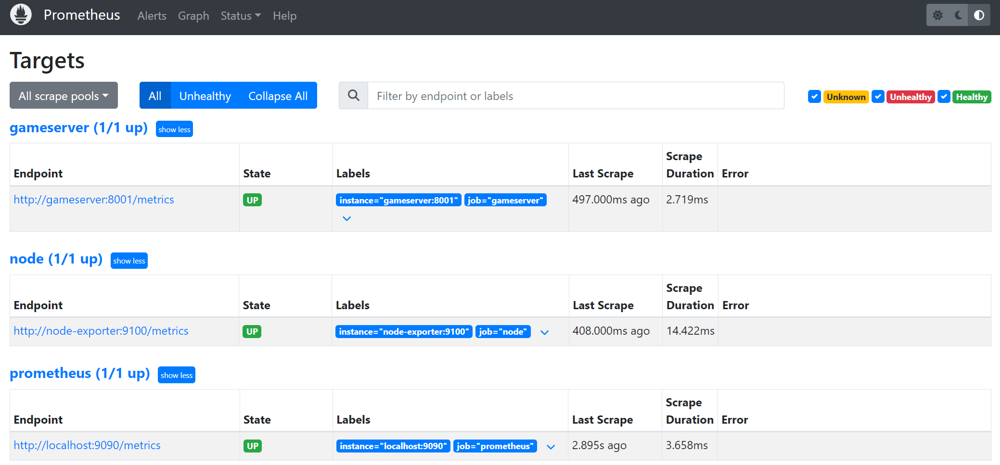

# Metric Visualization

## Node Exporter Metrics

### % CPU Load

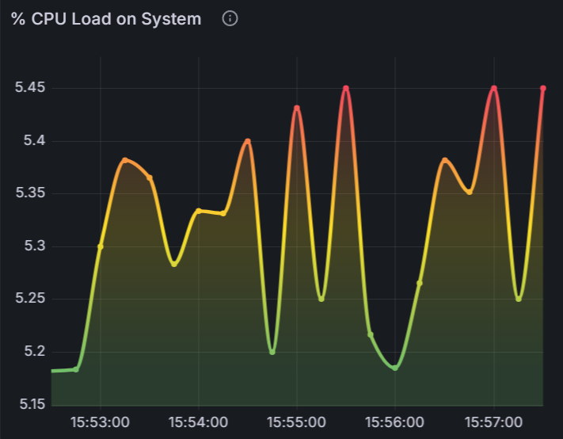

```
100 - (avg(irate(node_cpu_seconds_total{mode="idle"}[30m])) * 100)
```

- `irate` (instantaneous rate of change) 최근 두개의 데이터 포인트의 변화율을 계산합니다.

  `rate`은 시간범위내의 변화를 측정하기 떄문에, 자주 변화하는 치수를 측정할때는 `irate`이 유용합니다

- `[30m]`데이터 포인트 시간 범위는 30분 이내로 한정합니다
- `avg` 평균값을 계산합니다

## .NET runtime metrics

### Application Health


### % CPU Consumption per Instance

```
rate(process_cpu_seconds_total{instance="$instance"}[$__interval])
```

- `rate`: process_cpu_seconds_total 메트릭에 대한 시간당 평균 증가율
- `process_cpu_seconds_total`: 인스턴스가 CPU에서 실행된 총 시간
- `$__interval`: 대시보드에서 설정한 시간 주기

### % Memory consumption

```
process_working_set_bytes{instance="$instance"} / dotnet_gc_memory_total_available_bytes{instance="$instance"}
```

- `process_working_set_bytes`: 인스턴스가 물리적 메모리에서 사용하고 있는 총 바이트 수
- `dotnet_gc_memory_total_available_bytes`: 사용할 수 있는 총 메모리 양 (바이트 단위)
- `$instance`: 모니터링 중인 서버 인스턴스

### % Paused Time

```
dotnet_gc_pause_ratio{instance="$instance"}
```

- `dotnet_gc_pause_ratio`: GC(Garbage Collection) 작업으로 인해 애플리케이션이 일시 중지된 시간의 비율
- `$instance`: 모니터링 중인 서버 인스턴스

### Thread Pool Queue Length

```
sum(rate(dotnet_threadpool_queue_length_sum{instance="$instance"}[$__rate_interval]))  /
sum(rate(dotnet_threadpool_queue_length_count{instance="$instance"}[$__rate_interval]))
```

- `dotnet_threadpool_queue_length_sum` .NET Thread Pool 에서 대기중인 작업의 총 길이
- `dotnet_threadpool_queue_length_count` .NET Thread Pool 에서 대기중인 작업 개수
- `$__rate_interval` 대시보드에서 설정한 비율 계산 간격
- 전체 값을 `sum`으로 더하여 시간당 평균 증가율(`rate`)를 계산합니다.

  대기열의 길이가 길수록 처리되지 않은 작업이 많을 수 있습니다.

### Thread Pool Queue Length (Bucketed)

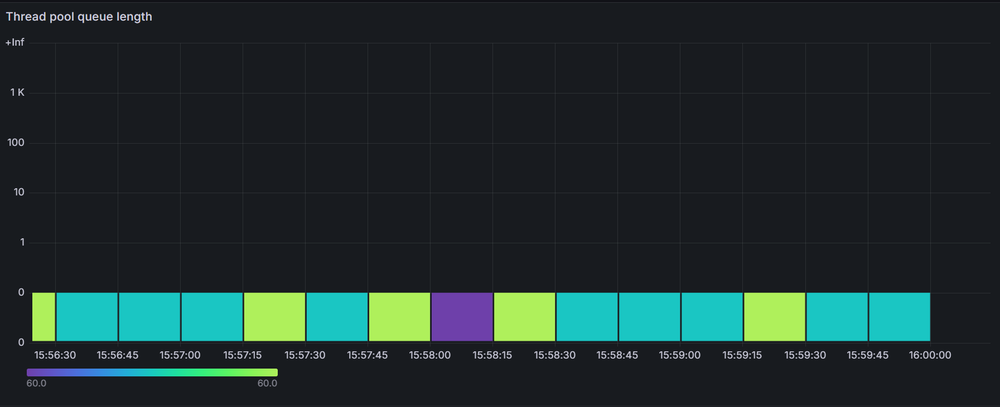

```
sum by (le) (increase(dotnet_threadpool_queue_length_bucket{instance="$instance"}[$__rate_interval]))
```

- `le`: less than or equal. Prometheus의 히스토그램 데이터에서 사용되며 버킷의 `상한값 이하`를 나타냅니다.
- `increase`: 지정된 시간동안의 카운터 증가량을 계산합니다
- `dotnet_threadpool_queue_length_bucket` 대기열 요청 수를 히스토그램 버킷으로 나눈 데이터입니다

각 시간범위내에서 스레드 풀 대기열의 요청수 증가량을 보여줍니다.

명시된 색을 통해 대기열의 크기 분포를 구분할 수 있습니다.

### Thread Pool Number of Threads

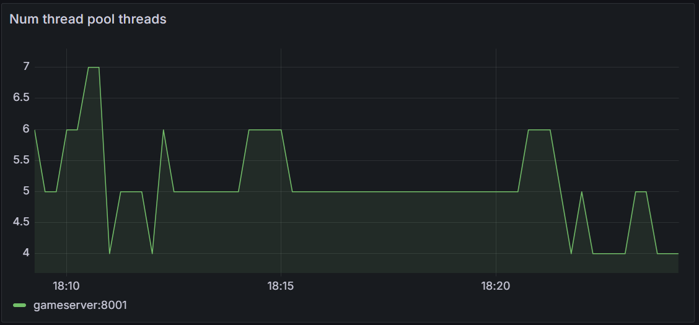

```
dotnet_threadpool_num_threads{instance="$instance"}
```

- `dotnet_threadpool_num_threads`: .NET Thread Pool에 할당된 총 Thread 수.

### Memory Use

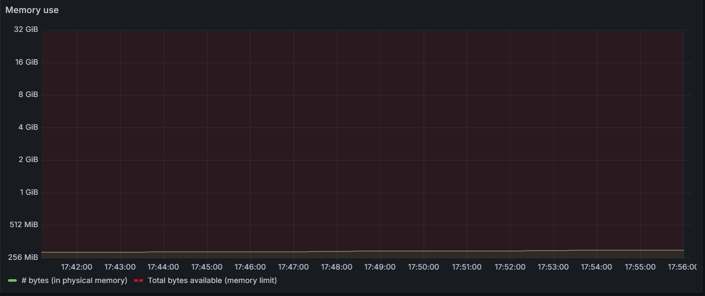

- `bytes` 사용중인 메모리를 나타냅니다

  ```
  process_working_set_bytes{instance="$instance"}
  ```

- `Total bytes available` 사용 가능한 메모리를 나타냅니다

  ```
  dotnet_gc_memory_total_available_bytes{instance="$instance"}
  ```

### Heap Size

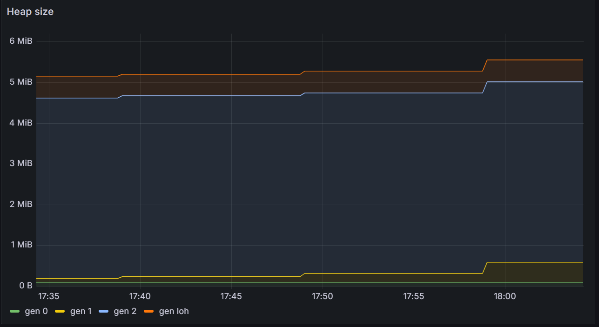

- `Heap Size` .NET 애플리케이션에서 세대별 할당된 힙 메모리의 크기를 나타냅니다.

  ```
  dotnet_gc_heap_size_bytes{instance="$instance"}
  ```

인스턴스에서 사용중인 힙 메모리 크기를 바이트 단위로 보여줍니다.

### Memory Allocation

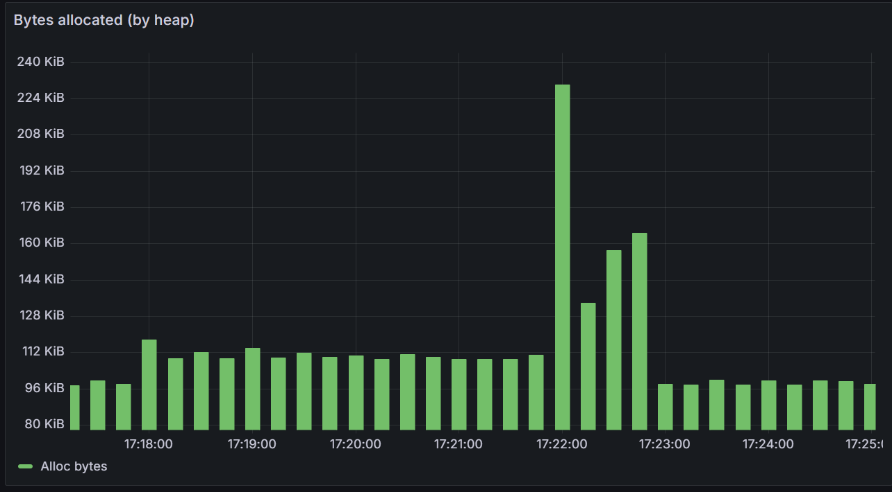

- `Alloc bytes` .NET 런타임에서 heap에 할당된 바이트 수를 시간대 별로 추적합니다.

  ```
  sum(rate(dotnet_gc_allocated_bytes_total{instance="$instance"}[$__interval])) by (gc_heap)
  ```

### Allocated Memory Per Server

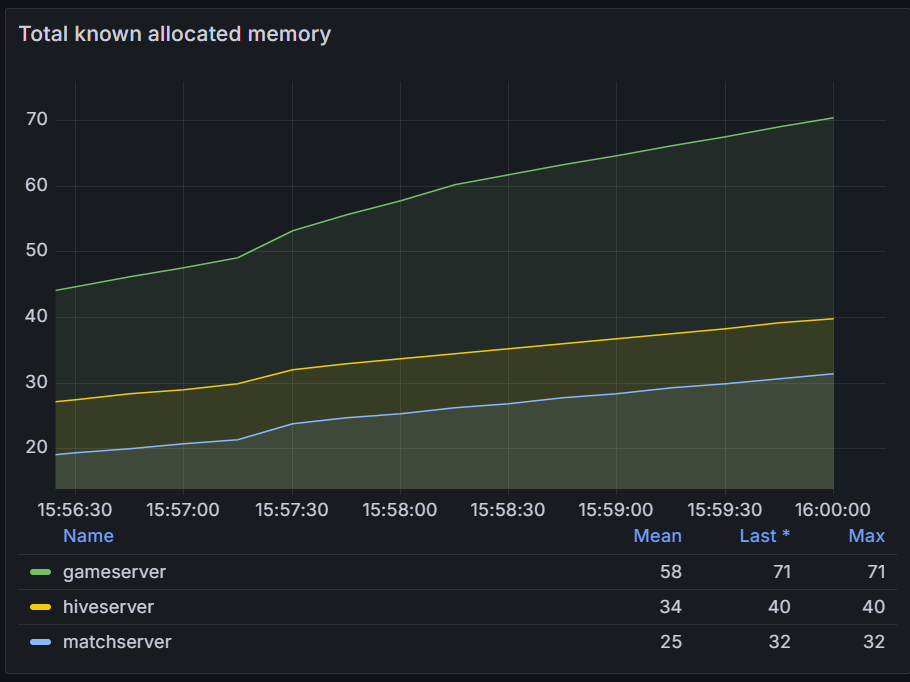

### GC Collection Count

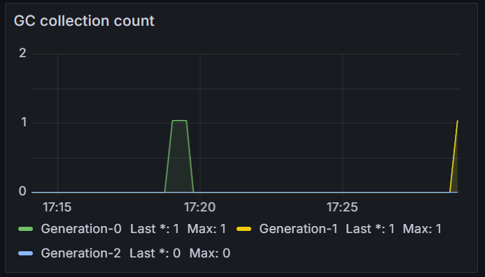

- 각 세대에서 발생하는 가비지 컬렉션 횟수를 나타냅니다.
- `$interval` 을 이용해 선택한 주기동안 발생하는 횟수를 모니터링 합니다.

  ```
  increase(dotnet_collection_count_total[$interval])
  ```

### % CPU Consumption Per Server

서버(`instance`)대상으로 런타임 어플리케이션별 통계를 정리할 수 있습니다.

아래는 서버별 CPU 사용량을 측정합니다.

```
system_runtime_cpu_usage{instance=~"gameserver:8001|hiveserver:8081|matchserver:9001"}
```

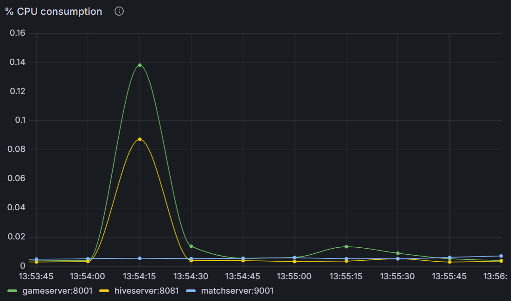

## Http Request Monitoring

Http 관련 metric 이 필요할 경우, 아래와 같은 설정을 통해 수집이 가능합니다 .

설정 예시:

```csharp
// program.cs
builder.Services.UseHttpClientMetrics();
```

모든 HttpClient로 부터 metric을 내보내도록 설정합니다.

```csharp
app.UseRouting();
app.UseHttpMetrics();
```

`UseRouting()` 다음 `UseHttpMetrics()` 를 사용하여

직접 메트릭을 정의할 필요 없이 HTTP 요청 수 와 요청 지속시간을 자동으로 추적합니다.

`UseHttpMetrics`는 아래 옵션 구성을 활용하여 통계를 세부적으로 커스터마이징 할 수 있습니다.

### `HttpMiddlewareExporterOptions` 옵션

| Key Name                       | Description                                                                                                                                  |
| :----------------------------- | :------------------------------------------------------------------------------------------------------------------------------------------- |
| `InProgress`                   | 진행 중인 요청 수 제공                                                                                                                       |
| `RequestCount `                | HTTP 요청 수 제공                                                                                                                            |
| `RequestDuration `             | HTTP 요청 처리 시간 제공                                                                                                                     |
| `CaptureMetricsUrl  `          | 엔드 포인트 캡쳐 여부                                                                                                                        |
| `SetMetricFactory  `           | 메트릭 팩토리를 설정하여, 생성된 메트릭에 대해 추가적인 동작을 설정. 특정 고정 라벨을 메트릭에 추가하거나, 메트릭의 동작 방식을 커스터마이징 |
| `ReduceStatusCodeCardinality ` | HTTP 상태 코드를 대략적인 범주(예: 2xx, 4xx)로 간소화 여부                                                                                   |

### `RequestCount` 사용하기

```csharp
app.UseHttpMetrics(options =>
{
    options.RequestCount.Counter = Metrics.CreateCounter(
        "http_requests_total",
        "총 HTTP 요청 수",
        new CounterConfiguration { LabelNames = new[] { "controller", "endpoint", "code" } });
});
```

LabelNames 옵션을 통해 출력하고 싶은 정보를 직접 추가 할 수 있습니다.

### `RequestDuration` 사용하기

```csharp
app.UseHttpMetrics(options =>
{
    options.RequestDuration.Histogram = Metrics.CreateHistogram(
        "http_request_duration_seconds",
        "HTTP 요청 처리 시간(초)",
        new HistogramConfiguration { LabelNames = new[] { "controller", "endpoint", "code" } });
});
```

유사한 방식으로, Http 요청별 지속시간 Histogram을 생성합니다

이렇게 등록된 정보는 추후 Grafana의 Metric 목록에서 아래와 같이 노출 되며 불러올 수 있습니다.

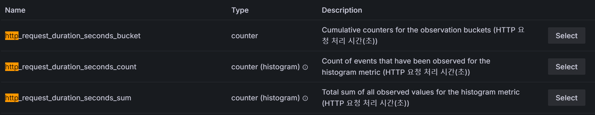

## HTTP 요청 지속 시간

```
sum(increase(http_request_duration_seconds_bucket[$interval])) by (le)
```

`http_request_duration_seconds` 히스토그램을 통해 요청 지속 시간 데이터를 출력합니다.

다음과 같은 형식으로 `le`는 요청이 처리된 시간을 기준으로 합니다.

- http_request_duration_seconds_bucket{le="0.1"}: 0.1초 이하로 처리된 요청의 수.
- http_request_duration_seconds_bucket{le="0.5"}: 0.5초 이하로 처리된 요청의 수.
- http_request_duration_seconds_bucket{le="1.0"}: 1.0초 이하로 처리된 요청의 수.

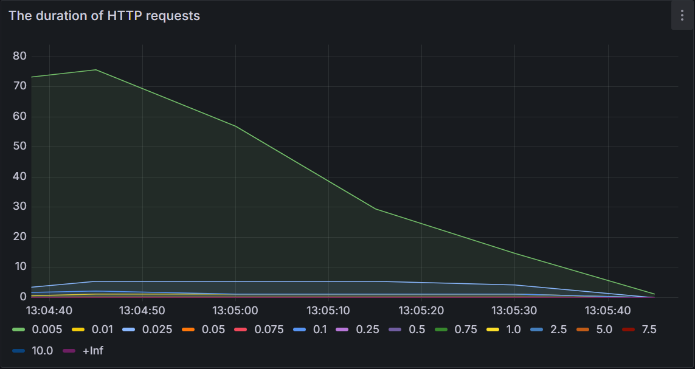

## HTTP 요청 빈도

```
rate(http_requests_total[1m])
```

받은 HTTP 요청 수(`http_requests_total`)와 `rate`을 활용하여 주기별 HTTP 요청(`endpoint`) 빈도를 측정합니다.

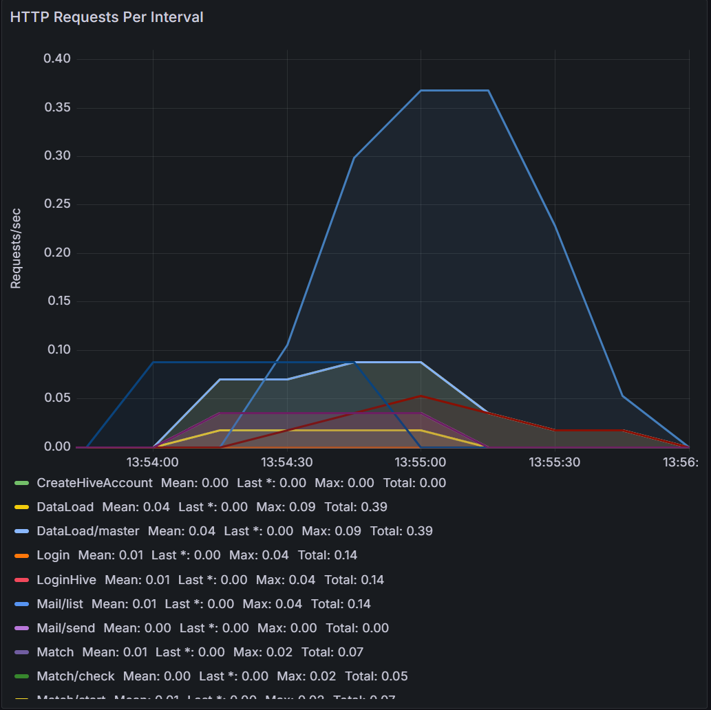

## 서버별 HTTP 요청 수

```
sum(rate(http_requests_total{instance=~"hiveserver:8081|gameserver:8001|matchserver:9001"}[$__rate_interval])) by (instance)
```

서버별 (`instance`) HTTP 요청수를 주기별(`$__rate_interval`)로 추적할수 있게 합니다

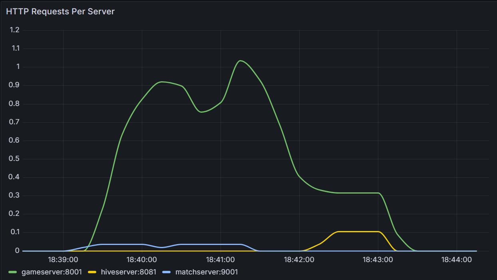

# Grafana Configuration

수집하는 데이터는 직접 대시보드에서 출력용 그래프를 추가하거나,

완성된 대시보드를 JSON 파일 구성을 통해

불러올 수 도 있습니다.

아래는 Grafana에서 제공하는 대시보드 예시 입니다.

[제공 되는 대시 보드 리스트](https://grafana.com/grafana/dashboards/)

## Panels

### Rows

각 쿼리를 시각할 수 있는 구성 요소입니다.

```json
{
  "collapsed": false,
  "gridPos": {
    "h": 1,
    "w": 24,
    "x": 0,
    "y": 0
  },
  "id": 60,
  "panels": [],
  "title": "System Health",
  "type": "row"
}
```

`row` 패널을 사용하여, 관련있는 패널들을 묶을 수 있습니다.

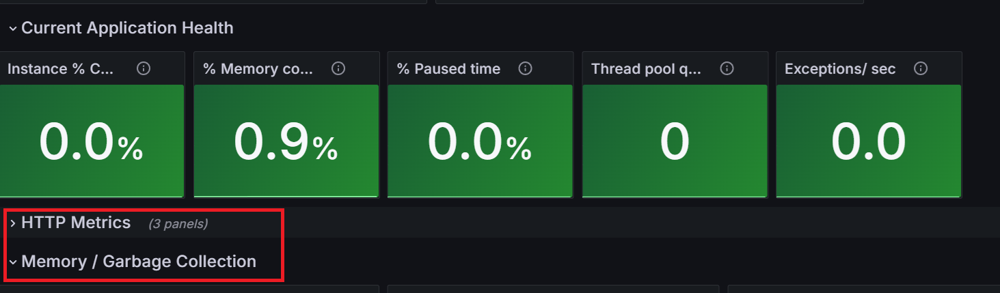

### 데이터 출력 패널

```json
{
  "datasource": {
    "default": true,
    "type": "prometheus",
    "uid": "PBFA97CFB590B2093"
  },
  "fieldConfig": {
    "defaults": {
      "decimals": 1,
      "thresholds": {
        "mode": "absolute",
        "steps": [
          {
            "color": "green",
            "value": null
          },
          {
            "color": "red",
            "value": 80
          }
        ]
      },
      "unit": "percentunit"
    }
  },
  "targets": [
    {
      "expr": "process_working_set_bytes{instance=\"$instance\"} / dotnet_gc_memory_total_available_bytes{instance=\"$instance\"}",
      "format": "time_series",
      "legendFormat": "{{instance}}",
      "refId": "A"
    }
  ],
  "title": "% Memory consumption",
  "type": "stat"
}
```

- `Datasource`: 참조하는 데이터 소스

  - `default`: true일 경우 기본 데이터 소스로 참조
  - `type`: 데이터 소스의 유형 (예: prometheus, mysql, influxdb 등)
  - `uid`: 데이터 소스의 고유 ID

- `targets`: 패널이 데이터를 시각화하기 위해 쿼리할 내용
  - `expr`: Prometheus 쿼리 표현식(PromQL). 데이터를 가져오고 시각화할 값을 정의
- `options`: 패널에 대한 세부 시각화 설정
  - `legend`: 레전드의 표시 여부, 위치, 계산 방식 설정
  - `tooltip`: 데이터 툴팁 설정
- `thresholds`: 값이 특정 임계값에 도달했을 때 색상 변화를 설정

## Templating

대시보드에서 선택할 수 있는 옵션과 Query 값을 미리 가공해 놓습니다.

예를 들어, 검색 주기 값을 아래처럼 설정합니다.

```json
 {
     "auto": false,
     "auto_count": 30,
     "auto_min": "10s",
     "current": {
       "selected": false,
       "text": "1m",
       "value": "1m"
     },
     "hide": 0,
     "name": "interval",
     "options": [
       {
         "selected": true,
         "text": "1m",
         "value": "1m"
       },
       {
         "selected": false,
         "text": "5m",
         "value": "5m"
       },
       {
         "selected": false,
         "text": "10m",
         "value": "10m"
       },
       {
         "selected": false,
         "text": "30m",
         "value": "30m"
       },
       {
         "selected": false,
         "text": "1h",
         "value": "1h"
       },
       {
         "selected": false,
         "text": "6h",
         "value": "6h"
       }
     ],
     "query": "1m,5m,10m,30m,1h,6h",
     "queryValue": "",
     "refresh": 2,
     "skipUrlSync": false,
     "type": "interval"
},
```

해당 값을 이용하려면 패널별로 `$` syntax를 이용하여 value 이름을 설정하면 됩니다.

Http 요청 지속 시간의 경우 위` $interval`을 아래와 같이 사용합니다

```
sum(increase(http_request_duration_seconds_bucket[$interval])) by (le)
```

이후 대시보드 옵션에서 값을 변경하면, 버켓 시간대가 선택한 interval 옵션에 따라 변형 됩니다.

10분 간격으로 계산할 경우:

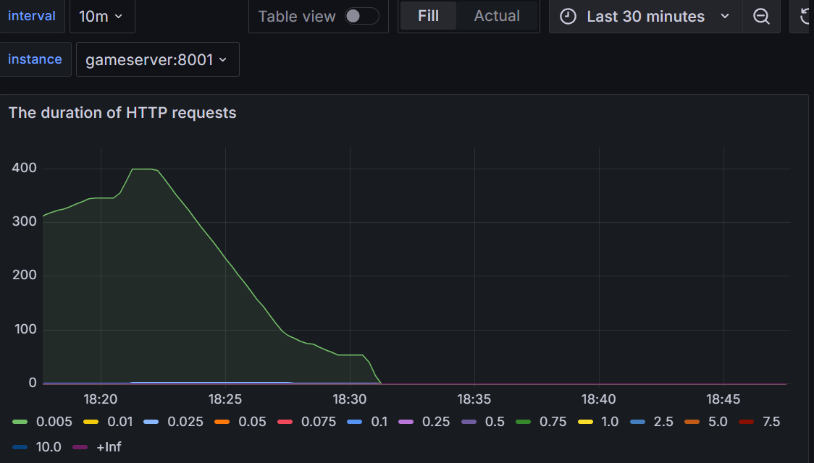

5분 간격으로 계산할 경우:

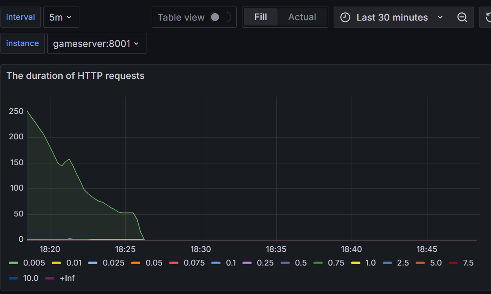

유사한 방법으로, 서버별로 출력 대상 데이터를 변경할 수 있습니다.

```json
{
  "current": {
    "selected": true,
    "text": "gameserver:8001",
    "value": "gameserver:8001"
  },
  "datasource": {
    "type": "prometheus",
    "uid": "PBFA97CFB590B2093"
  },
  "definition": "system_runtime_cpu_usage",
  "hide": 0,
  "includeAll": false,
  "label": "instance",
  "multi": false,
  "name": "instance",
  "options": [
    {
      "selected": false,
      "text": "gameserver:8001",
      "value": "gameserver:8001"
    },
    {
      "selected": false,
      "text": "hiveserver:8081",
      "value": "hiveserver:8081"
    },
    {
      "selected": false,
      "text": "matchserver:9001",
      "value": "matchserver:9001"
    }
  ],
  "query": "system_runtime_cpu_usage",
  "refresh": 1,
  "regex": "/instance=\"([^\"]+)\"/",
  "skipUrlSync": false,
  "sort": 0,
  "tagValuesQuery": "",
  "tagsQuery": "",
  "type": "query",
  "useTags": false
}
```

- `options`에 `system_runtime_cpu_usage` 쿼리가 가능한 인스턴스가 아래와 같이 목록에 추가됩니다.

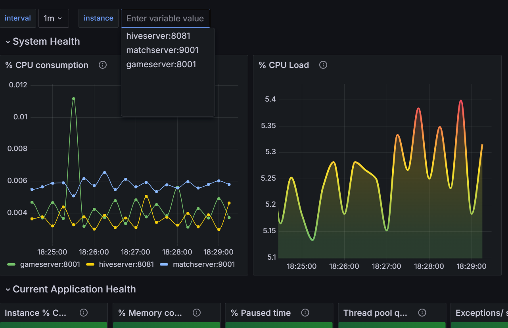

위처럼 instance 옵션에 따라서 지정 서버의 상태를 확인할 수 있습니다

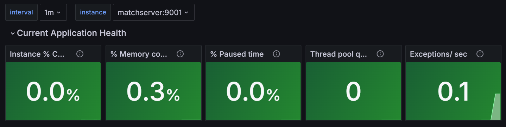


