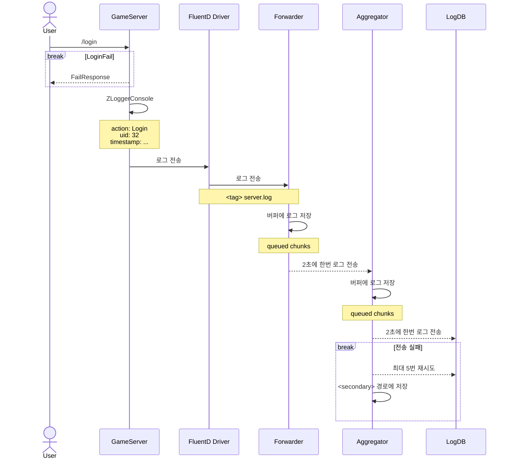
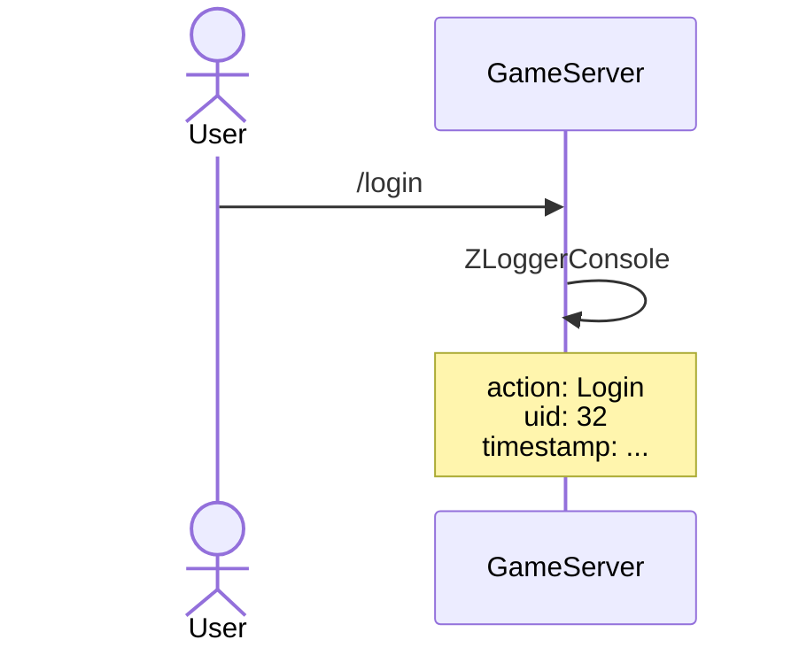
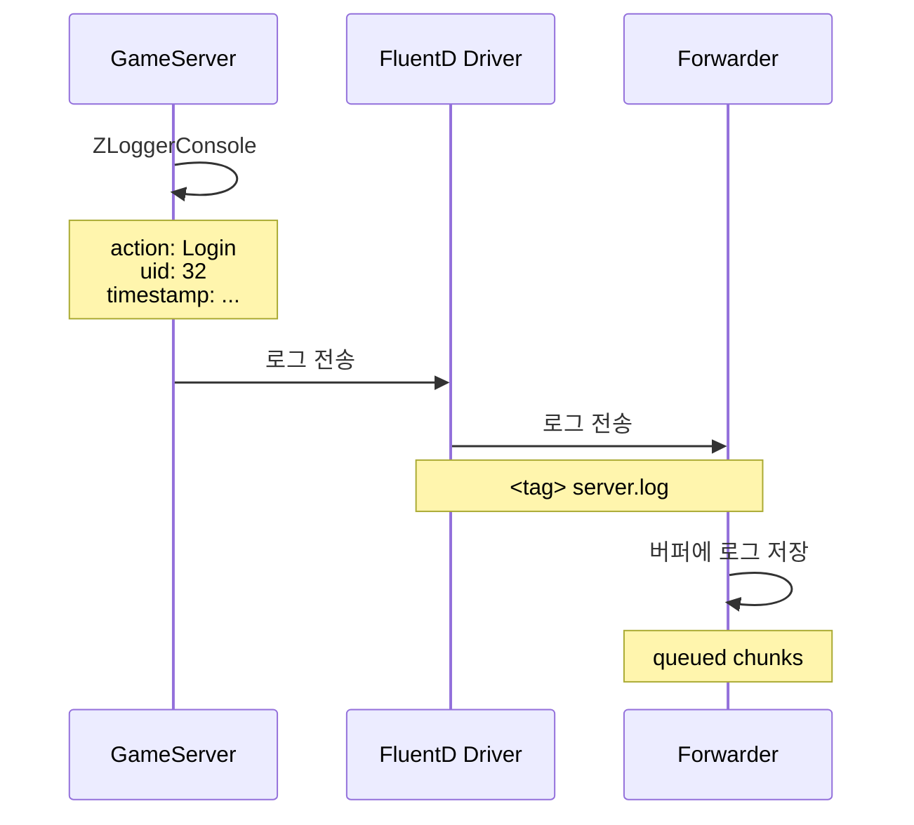
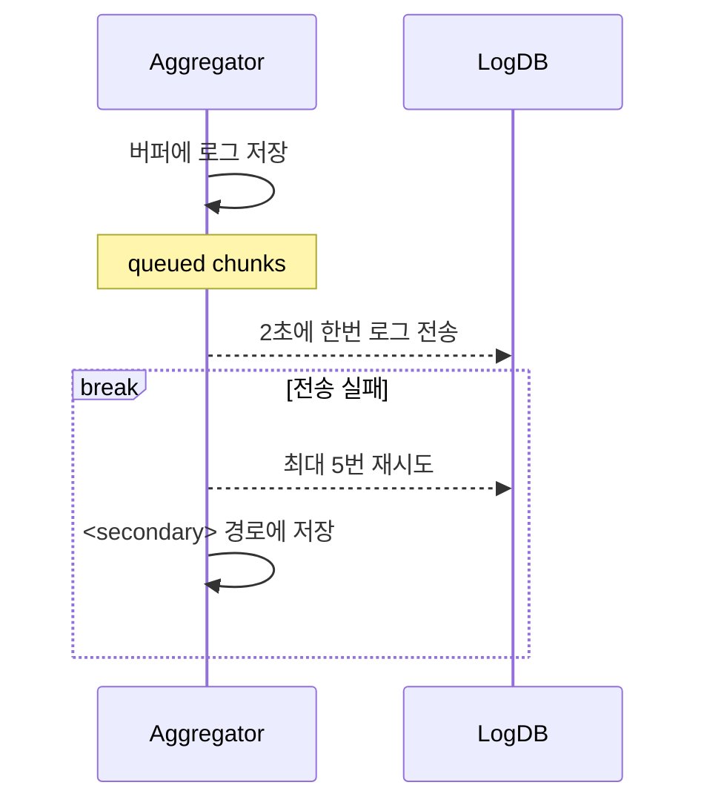

# Table of Contents

- [프로젝트 구조](#프로젝트-구조)
- [General Process](#general-process)
  - [서버에서 로그 출력](#콘솔-출력)
  - [Fluentd로 로그 전송](#출력된-로그-전송)
  - [로그 가공 후 DB 저장](#수신한-로그-가공-후-저장)
- [Querying Statistics](#querying-statistics)
- [Docker](/GameSolution/Docker.md)
  - [Docker Compose](/GameSolution/Docker.md/#docker-compose)
  - [Dockerfile](/GameSolution/Docker.md/#dockerfile)
    - [Fluentd Dockerfile](/GameSolution/Docker.md/#fluentd-dockerfile-common-properties)
    - [GameServer Dockerfile](/GameSolution/Docker.md/#gameserver-dockerfile)
- [Server Logging](/GameSolution/GameServer/README.md)
  - [ZLogger](/GameSolution/GameServer/README.md/#zlogger-configuration)
  - [Implementation](/GameSolution/GameServer/README.md/#implementation)
- [Fluentd](/GameSolution/FluentD/README.md)
  - [Fluentd Process](/GameSolution/FluentD/README.md/#logging-driver-process)
  - [Fluentd Input Plugin](/GameSolution/FluentD/README.md/#fluentd-input-plugin)
    - [In Forward](/GameSolution/FluentD/README.md/#fluentd-logging-driver로-수집)
    - [Tail](/GameSolution/FluentD/README.md/#호스트-시스템에서-수집)
  - [Fluentd Filter Plugin](/GameSolution/FluentD/README.md/#fluentd-filter-plugin)
    - [Parser](/GameSolution/FluentD/README.md/#parser)
    - [Record Transformer](/GameSolution/FluentD/README.md/#record-transformer)
  - [Fluentd Output Plugin](/GameSolution/FluentD/README.md/#fluentd-output-plugin)
    - [Rewrite Tag Filter](/GameSolution/FluentD/README.md/#rewrite-tag-filter)
    - [Out Forward](/GameSolution/FluentD/README.md/#out-forward)
    - [Stdout](/GameSolution/FluentD/README.md/#stdout)
    - [Forwarder 예시](/GameSolution/FluentD/README.md/#forwarder-implementation)
    - [Aggregator 예시](/GameSolution/FluentD/README.md/#aggregator-implementation)
  - [Log Database](/GameSolution/Database/LogDb.md)

# 프로젝트 구조

```
GameSolution
├── GameClient
│   └── GameClient.csproj
├── GameServer
│   ├── GameServer.csproj
│   └── Dockerfile
├── MatchServer
│   ├── MatchServer.csproj
│   └── Dockerfile
├── HiveAPIServer
│   ├── HiveAPIServer.csproj
│   └── Dockerfile
├── GameShared.Lib
│   ├── GameShared.Lib.csproj
│   └── other files...
├── ServerShared.Lib
│   ├── ServerShared.Lib.csproj
│   └── other files...
├── GameSolution.sln
├── docker-compose.yml
├── .gitignore
└── .dockerignore
```

# General Process
(최흥배) 로그 생성과 저장이 어떤 구성으로 되어 있는지 쉽게 알기 위해 서버 구성도가 필요합니다.  
  
단편화한 로깅 과정입니다. 로그인 로그를 예시로 제공합니다.


  
(최흥배) 시퀸스다이얼그램이 이해하기 어렵습니다. Fluent Driver는 Fluentd 에이전트 아닌가요? 그리고 이 에이전트가 docker의 로그 파일을 읽는 것 아닌가요? 다이얼그램으로 보면 게임서버에서 전송하는 같은데 맞나요? 그리고 Aggtrgator도 Fleuntd 에이전트 아닌가요? 이것은 복수의 서버머신에 있는 fleuntd 에이전트가 보낸 로그를 모아서 DB로 보내는 것 같은데.. 불필요하게 개체를 나누지 말고, 이름을 명확하게 하는 것이 좋습니다.  시퀸스 다이얼그램 변경이 필요합니다.  

## 콘솔 출력



서버에서 ZLoggerConsole provider를 통해 로그가 출력됩니다. ([ZLoggerConsole 설정 방법](/GameSolution/GameServer/README.md#zlogger-configuration) 참고)

아래는 로그인 성공시 로그 출력 메서드를 호출하는 부분입니다.

```csharp
public async Task<LoginResponse> Login([FromBody] LoginRequest request)
{
  //...
  if (response.Result == ErrorCode.None && token != null)
  {
    ActionLog(new { uid });
  }
  //...
}
```

`ActionLog`메서드를 통해 로그가 `JSON` 포맷으로 콘솔에 출력(`stdout`)되게 합니다. ([ActionLog on Controllers](/GameSolution/GameServer/README.md#actionlog-on-controllers) 참고)

```json
{
  "timestamp": "2024-10-10T08:29:50.7544882+00:00",
  "membername": "ActionLog",
  "action": "Login",
  "context": {
    "uid": 1
  }
}
```

해당 서버를 Docker 환경에서 실행하면 Docker에 내장된 logging driver 통해 해당 출력문을 호스트시스템 파일 경로에 저장합니다.

이는 Docker 에서 기본 logging driver의 설정이 `json-file`로 되어있기 때문입니다.

서버의 logging driver를 [Docker Compose 설정](/GameSolution/Docker.md#docker-compose)을 통하여 Fluentd logging driver로 변경하여 Fluentd forwarder 컨테이너에 전송할 수 있도록 변경합니다.

## 출력된 로그 전송

설정을 완료하면 로그는 Fluentd Driver를 통해 Forwarder 로 전송됩니다. ([Logging Driver Process](/GameSolution/FluentD/README.md#logging-driver-process) 참고)



(최흥배) 위에서 이야기 했던 것과 동일한 문제로 다이얼그램 수정이 필요합니다.      

```apacheconf
<source>
  @type forward
  port 24224
  bind 0.0.0.0
</source>
```

Fluentd 는 `in-forward` 플러그인을 사용하여 드라이버로부터 로그를 전송받습니다.

해당 드라이버를 통해 제공되는 로그의 정보는 아래와 같습니다.

```json
{
  "log": "{\"Timestamp\":\"2024-10-10T08:29:50.7544882+00:00\",\"action\":\"Login\",\"context\":{\"uid\":1}}",
  "container_id": "cacfce6511c76cd35f537b16477de90a60900a324e0249b01676f0b57bc8bd5c",
  "container_name": "/gameserver",
  "source": "stdout"
}
```

| Field            | Description                                      |
| :--------------- | :----------------------------------------------- |
| `container_id`   | 로그 제공 컨테이너 식별 ID                       |
| `container_name` | 실행될 당시 컨테이너 이름 (rename 반영되지 않음) |
| `source`         | `stdout` or `stderr`, 컨테이너 로그 출처 형식    |
| `log`            | 로그 데이터                                      |

```apacheconf
<filter server.**>
  @type parser
  key_name log
  <parse>
    @type json
  </parse>
</filter>
```

이를 Fluentd forwarder 내부에서 `parser`필터 플러그인을 이용해 log 부분만 추출 하고
`match`블록을 통해 Fluentd aggregator 로 전송합니다.

```apacheconf
<match server.**>
  # ... 설정 생략
  <server>
    host fluentd-aggregator
    port 24224
  </server>
</match>
```

자세한 과정 및 구성은 [Fluentd 문서](/GameSolution/FluentD/README.md)를 통해 확인할 수 있습니다.

```json
{
  "timestamp": "2024-10-10T08:29:50.7544882+00:00",
  "membername": "ActionLog",
  "action": "Login",
  "context": {
    "uid": 1
  }
}
```

해당 파싱을 통해, ZLogger로 출력된 정보들만 Aggregator에 보내집니다

## 수신한 로그 가공 후 저장

Aggregator 는 동일하게 `in-forward` 플러그인으로 forwarder로 부터 로그를 수신합니다.



받은 로그를 [가공 프로세스](/GameSolution/FluentD/README.md#aggregator-process)를 통해 가공한 후 [`@mysql_bulk`](https://github.com/toyama0919/fluent-plugin-mysql-bulk)플러그인을 활용하여 MySQL 데이터베이스로 보냅니다.

Fluentd 컨테이너 로그를 통해 데이터 전송에 성공한것을 확인할 수 있습니다.

```
2024-10-10 18:49:37 2024-10-10 09:49:37 +0000 [info]: #0 bulk insert values size (table: user_login_logs) => 1
2024-10-10 18:49:37 2024-10-10 09:49:37.473392081 +0000 fluent.info: {"message":"bulk insert values size (table: user_login_logs) => 1"}
```

아래 커맨드를 통해 직접 MySQL에 접속하여

```
docker exec -it <컨테이너이름> mysql -uroot -p
```

SELECT 커맨드를 통해서 데이터를 확인할 수 있습니다.

```
mysql> select * from user_login_logs;
+-----+---------------------+
| uid | timestamp           |
+-----+---------------------+
|   1 | 2024-10-10 09:49:26 |
+-----+---------------------+
1 row in set (0.00 sec)
```

# Querying Statistics

## Daily Active Users (DAU)

### 지정 날짜 DAU

```sql
SELECT COUNT(DISTINCT uid) AS daily_active_users
FROM user_login_logs
WHERE DATE(timestamp) = '2024-10-10';
```

### 지정 기간 DAU

```sql
SELECT DATE(timestamp) AS login_date, COUNT(DISTINCT uid) AS daily_active_users
FROM user_login_logs
WHERE timestamp BETWEEN '2024-10-01' AND '2024-10-10'
GROUP BY DATE(timestamp)
ORDER BY login_date;
```

## 유저 로그인 횟수

### 유저 별 로그인 횟수

```sql
SELECT uid, COUNT(*) AS login_count
FROM user_login_logs
GROUP BY uid;
```

### 기간 내 유저별 로그인 횟수

```sql
SELECT COUNT(*) AS login_count
FROM user_login_logs
WHERE uid = 1 AND timestamp BETWEEN '2024-10-01' AND '2024-10-10';
```

## 유저 게임 플레이 횟수

### 유저 별 게임 플레이 횟수

```sql
SELECT uid, COUNT(*) AS game_play_count
FROM user_game_logs
GROUP BY uid;
```

### 기간내 유저별 게임 플레이 횟수

```sql
SELECT COUNT(*) AS game_play_count
FROM user_game_logs
WHERE uid = 1 AND timestamp BETWEEN '2024-10-01' AND '2024-10-10';
```

## 기간 별 통계

### 기간 내 로그인 인구

```sql
SELECT COUNT(DISTINCT uid) AS login_count_total
FROM user_login_logs
WHERE timestamp BETWEEN '2024-10-01' AND '2024-10-10';
```

### 기간 내 매칭 요청 수

```sql
SELECT COUNT(*) AS requested_match_count
FROM user_match_start_logs
WHERE timestamp BETWEEN '2024-10-01' AND '2024-10-10';
```

### 기간 내 매칭 성사 수

```sql
SELECT COUNT(*) AS completed_match_total
FROM match_logs
WHERE timestamp BETWEEN '2024-10-01' AND '2024-10-10';
```

### 기간 내 게임 플레이 수

```sql
SELECT COUNT(*) AS game_play_count_total
FROM game_logs
WHERE timestamp BETWEEN '2024-10-01' AND '2024-10-10';
```
