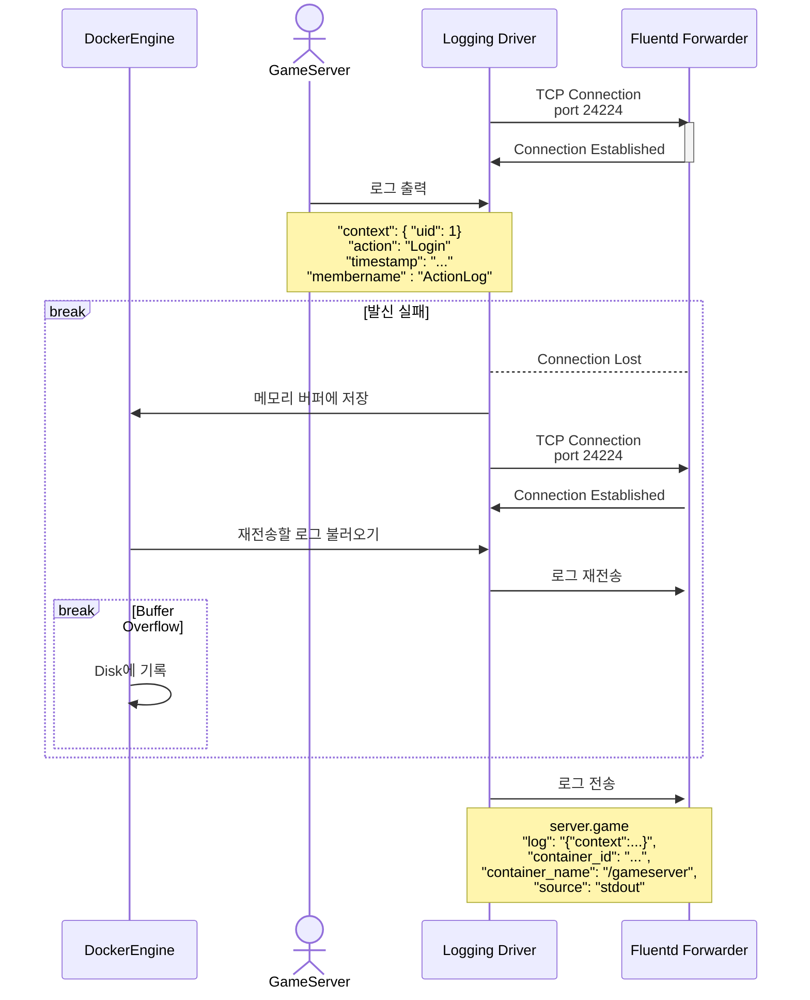
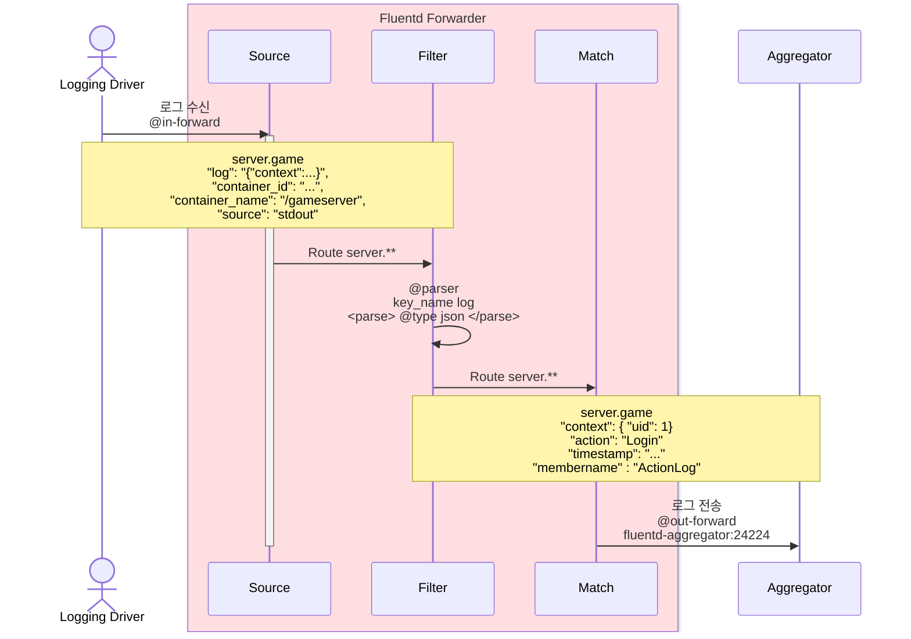
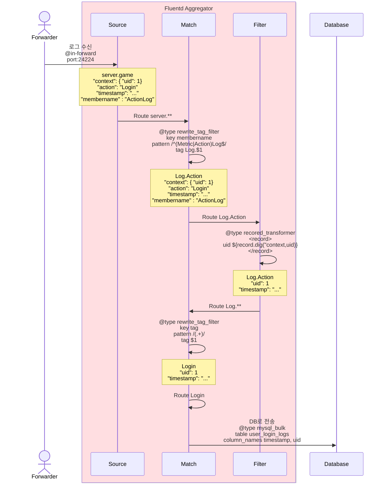

# Fluentd 구성

각 구성은 목적별 Plugin을 통해 설정 가능합니다

- Input Plugin:
  수집할 데이터 소싱
- Parser Plugin:
  로그 수준,메시지,날짜 등의 데이터 포맷 관리
- Filter Plugin:
  데이터를 필요한 방향으로 가공하는데 쓰입니다 (익명화등)
- Output Plugin:
  출력 플러그인으로, data visualization 이나 statistics를 위한 목적지로 데이터를 전송할 수 있습니다.

# Logging Driver Process

# Forwarder Process

Forwarder는 컨테이너에서 출력되는 로그를 수집하고 전송하는 역할을 합니다.

데이터를 처리하지 않고 전송하는 것이 핵심입니다.



# Aggregator Process

Aggregator는

- Forwarder에서 전송된 로그를 수신하고,
- 필요한 경우 필터링 및 가공 작업을 수행한 후,
- 최종적으로 MySQL과 같은 데이터 저장소로 전송하는 역할을 합니다.

로그 처리 중 발생할 수 있는 데이터 유실을 방지하기 위해 **Persistent Volume**(Kubernetes) 또는 **Volume Mapping**(Docker) 등의 구성과 함께 배포 될 수 있습니다.



# Fluentd Input Plugin

Fluentd 는 로그를 수집하는 방법에 따라서 사용되는 Input Plugin이 달라집니다.

- [fluentd logging driver](https://docs.docker.com/engine/logging/drivers/fluentd/)를 사용하면 컨테이너로 부터 로그를 전송 받습니다.
- 호스트 시스템 에서는 로그 파일을 tail하는 방식으로 수집할 수 있습니다.

## Fluentd Logging Driver로 수집

드라이버를 사용한 Docker 기반 환경에서는 각 컨네이너가 `fluentd-address` 옵션을 통해 지정된 Fluentd forwarder 로 로그를 전송홥니다.

```apacheconf
<source>
  @type forward
  port 24224
  bind 0.0.0.0
</source>
```

본 프로젝트에서 Fluentd는 [`in_forward`](https://docs.fluentd.org/input/forward) Input 플러그인을 사용하여 컨테이너에서 로는 로그를 수신합니다.

`forward` 플러그인은 TCP 소켓을 통해 이벤트 스트림을 송수신합니다. `in_forward` 플러그인은 사설 네트워크 내에서 사용하기 적합하며, 공공 네트워크에서 사용할 때는 `in_secure_forward` 플러그인을 사용하는 것이 권장됩니다.

- `port 24224` 수신 대기할 포트 번호입니다.
- `bind 0.0.0.0` 모든 네트워크 인터페이스에서 수신 대기할 수 있도록 설정합니다.

## 호스트 시스템에서 수집

```apacheconf
<source>
  @type tail
  path /var/log/app.log
  pos_file /var/log/fluentd/app.pos
  tag app.log
  <parse>
    @type json
  </parse>
</source>
```

[`in_tail`](https://docs.fluentd.org/0.12/input/tail) Input 플러그인은 Fluentd가 텍스트 파일의 끝부분에서 이벤트를 읽을 수 있게 해줍니다.

이 플러그인의 동작은 Linux의 `tail -F` 명령어와 유사합니다.

- `path /var/log/app.log` 모니터링할 로그 파일의 경로 입니다.

- `pos_file /var/log/fluentd/app.pos` Fluentd가 로그 파일에서 읽은 위치(바이트 오프셋)를 저장하는 파일을 지정합니다.

  - `pos_file`은 Fluentd가 재시작되었을 때 로그를 중복 처리하지 않고 중단된 지점부터 다시 읽을 수 있도록 합니다.

- `tag app.log` 받아오는 로그에 `app.log` 태그를 붙입니다.

  - `tag`는 로그를 필터링 하거나 특정 로그만 처리하는데 사용될 수 있습니다.

- ` <parse>
  @type json
</parse>` `parse` 블록은 Fluentd가 로그를 어떻게 해석할지 정의합니다. `@type` 에 선언되는 형식에 맞춰 로그를 파싱합니다. (`forward` 플러그인에서는 적용되지 않습니다.)

# Fluentd Filter Plugin

## Parser

앞서 언급된것처럼 `forward`플러그인은 `tail` 플러그인과 달리 `source` 블록에서 `parse`를 사용할 수 없습니다.

`forward`를 통해 수집한 데이터를 파싱하려면 filter 플러그인인 [`parser`](https://docs.fluentd.org/0.12/filter/parser) 플러그인을 아래와 같이 사용합니다.

```apacheconf
<filter foo.bar>
  @type parser
  format json
  key_name log
</filter>
```

- `filter foo.bar` foo.bar 태그가 있는 로그만 필터링 됩니다
  - `@type parser`플러그인을 사용합니다
    - `format json`으로 파싱할 로그의 형식을 JSON 으로 지정 합니다.
    - `key_name log` 파싱할 데이터의 키를 지정합니다. JSON 형식으로 처리할 항목을 찾아내는데 사용됩니다.

### Server Implementation

```json
{
  "log": "{\"timestamp\":\"2024-10-02T08:29:50.7544882+00:00\",\"action\":\"Login\",\"context\":{\"uid\":1}}",
  "container_id": "cacfce6511c76cd35f537b16477de90a60900a324e0249b01676f0b57bc8bd5c",
  "container_name": "/gameserver",
  "source": "stdout"
}
```

Fluentd logging driver를 통해 제공 받은 로그 예시입니다.

```apacheconf
<filter server.**>
  @type parser
  key_name log
  <parse>
    @type json
  </parse>
</filter>
```

데이터베이스에 저장되기 위해서 필요한 부분은 log 필드이기 때문에

Forwarder에서 `parser`플러그인을 사용하여, 수신한 로그중 log 키에 해당하는 데이터를 `JSON` 형식으로 파싱합니다.

```json
{
  "context": {
    "uid": 1
  },
  "action": "Login",
  "timestamp": "2024-10-02T08:29:50.7544882+00:00"
}
```

이후 가공된 로그는 위와 같습니다.

## Record Transformer

`record_transformer` 플러그인은 로그를 직접적으로 변형/수정하는데 사용됩니다.

로그에 필드를 추가,삭제, 또는 수정할 수 있습니다.

```json
{ "message": "hello world!" }
```

위와 같은 로그를 전달 받았다고 가정했을때

```apacheconf
<filter foo.bar>
  @type record_transformer
  <record>
    tag ${tag}
  </record>
</filter>
```

위와 같이 `${tag}`로 기존 태그 데이터를 불러와서 로그에새롭게 필드를 추가할 수있습니다.

```json
{
  "message": "hello world!",
  "tag": "foo.bar"
}
```

`tag`필드가 추가되어, 변형된 결과물입니다.

```json
{ "total": 100, "count": 10 }
```

`enable_ruby`를 `${}`와 함께 사용하여 Ruby 코드로 연산된 결과물을 추가할 수 도 있습니다.

```apacheconf
<filter foo.bar>
  @type record_transformer
  enable_ruby
  <record>
    avg ${record["total"] / record["count"]}
  </record>
</filter>
```

```json
{ "total": 100, "count": 10, "avg": "10" }
```

### Server Implementation

Aggregator 에서 `record_transformer`를 활용한 예시입니다.

```apacheconf
<filter Log.Action>
  @type record_transformer
  enable_ruby
  <record>
    uid ${record.dig("context", "uid")}
  </record>
</filter>

<filter Log.Metric>
  @type record_transformer
  enable_ruby
  <record>
    guid ${record.dig("context", "guid")}
  </record>
</filter>
```

- `<filter Log.**>`
  - `Log.Action` 태그는 유저 행동 기반 로그를 의미합니다.
  - `Log.Metric` 태그는 이벤트 기반 로그를 의미합니다.
- `enable_ruby`
  - `context`가 중첩된 JSON 이기 때문에 `enable_ruby` 옵션을 통해 내부 값을 추출합니다.

로그인 로그의 경우 아래와 같이 변경됩니다.

변경 전

```json
{
  "context": {
    "uid": 12345
  },
  "action": "Login",
  "timestamp": "2024-10-01T10:00:00Z"
}
```

변경 후

```json
{
  "context": {
    "uid": 12345
  },
  "uid": 12345,
  "action": "Login",
  "timestamp": "2024-10-01T10:00:00Z"
}
```

여기서 `remove_key`를 추가하면 필요없는 필드를 지울 수 있습니다.

```apacheconf
<filter Log.Action>
  @type record_transformer
  enable_ruby
  <record>
    uid ${record.dig("context", "uid")}
  </record>
  remove_keys context
</filter>
```

결과물

```json
{
  "uid": 12345,
  "action": "Login",
  "timestamp": "2024-10-01T10:00:00Z"
}
```

또는 아래처럼 `renew record`를 사용하여 가공된 데이터 외에 전부 지울 수 있습니다.

```apacheconf
<filter Log.Action>
  @type record_transformer
  renew_record true
  <record>
    uid ${record.dig("context", "uid")}
    timestamp ${record[timestamp]}
  </record>
</filter>
```

결과물

```json
{
  "uid": 12345,
  "timestamp": "2024-10-01T10:00:00Z"
}
```

# Fluentd Output Plugin

## Rewrite Tag Filter

메시지의 태그를 재정의하여 새로운 태그로 다시 발송 되게 합니다.

이 플러그인은 fluent-package(구 td-agent)에서는 기본적으로 제공되며,

Docker Image를 활용하는 경우에는 아래와 같은 추가 설치가 필요합니다.

```
    fluent-gem install fluent-plugin-rewrite-tag-filter
```

`rewrite_tag_filter`는 하나 이상의 `rule` 블록을 활용하여 태그를 재작성 하는 규칙을 사용합니다.

### Rule

`rule` 블록에서 사용할 수 있는 파라미터 구성입니다.

| Field      | Description                                        |
| :--------- | :------------------------------------------------- |
| `key     ` | 조건을 확인할 데이터 key name                      |
| `pattern ` | 매칭할 정규 표현식                                 |
| `tag`      | 매칭된 로그의 새로운 태그                          |
| `invert`   | 일치하지 않을 경우 태그 변경 여부 (기본값=`false`) |

```apacheconf
<match server.**>
    @type rewrite_tag_filter
    <rule>
        key membername
        pattern /^(Metric|Action)Log$/
        tag rewritten.${tag}.$1
    </rule>
</match>
```

[플레이스홀더](https://github.com/fluent/fluent-plugin-rewrite-tag-filter#tag-placeholder)를 사용하여 태그에 동적으로 값을 삽입할 수도 있습니다.

`${tag}`는 매칭된 로그의 태그를 의미합니다.

예를 들어, `membername` 필드의 값이 `ActionLog` 이고, 매칭된 태그 값이 `server.game` 이였다면,

새 태그 값은 `rewritten.server.game.Action` 이 됩니다.

### Server Implementation

```apacheconf
<match server.**>
  @type rewrite_tag_filter
  <rule>
    key membername
    pattern /^(Metric|Action)Log$/
    tag Log.$1
  </rule>
</match>
```

Aggregator는 `rewrite_tag_filter`를 활용해 로그별 가공할 데이터를 분리합니다.

```apacheconf
<filter Log.Action>
  @type record_transformer
  enable_ruby
  <record>
    uid ${record.dig("context", "uid")}
  </record>
</filter>

<filter Log.Metric>
  @type record_transformer
  enable_ruby
  <record>
    guid ${record.dig("context", "guid")}
  </record>
</filter>
```

이후 Action 로그에서는 uid, Metric 로그에서는 guid 를 추출하여 가공합니다.

```apacheconf
<match Log.**>
    @type rewrite_tag_filter
    <rule>
        key tag
        pattern /(.+)/
        tag $1
    </rule>
</match>
```

가공된 로그는 `rewrite_tag_filter`를 거쳐 매칭될 테이블별로 태그가 재정의됩니다.

```apacheconf
<match Login>
  @include db.conf

  table user_login_logs
  column_names timestamp, uid

  <buffer>
    @type file
    path /var/log/fluent/buf/login
    chunk_limit_size 2m
    retry_max_times 5
    flush_interval 10s
  </buffer>

  <secondary>
    @type file
    path /var/log/fluent/forward-failed
  </secondary>
</match>
```

예를 들어, 로그인 로그 같은 경우는 이전에 ActionLog에서 `tag:[CallerMemmberName]`을 전달받아 호출되었기 때문에 tag의 값이 `Login`입니다.

가공이 끝난 로그는 tag 값으로 이벤트 태그를 재정의하여 알맞은 `match` 블록으로 매칭되게 합니다.

## Out Forward

`out_forward` 플러그인을 이용하여 이벤트를 외부로 전송합니다.
최소 하나의 `server` 설정을 필요로 합니다.

```apacheconf
<match pattern>
  @type forward
  send_timeout 60s
  recover_wait 10s
  hard_timeout 60s

  <server>
    name myserver1
    host 192.168.1.3
    port 24224
    weight 60
  </server>
  <server>
    name myserver2
    host 192.168.1.4
    port 24224
    weight 60
  </server>
  ...

  <secondary>
    @type file
    path /var/log/fluent/forward-failed
  </secondary>
</match>
```

`pattern`에 맞는 이벤트를 기재된 2개의 `server`로 나누어 전송됩니다.

`server`에 부여되는 `weight`값을 통해 전송되는 비율이 정해지며, 기본 `weight` 값은 60입니다.

위 예시의 경우 두 서버가 기본 값을 사용하기 때문에 균등하게 분배됩니다.

만약 가중치가 다르게 설정되었다면 가중치가 더 높은 서버가 더 많은 이벤트를 수신하게 됩니다.

- `send_timeout` 로그를 걸리는데 걸리는 최대시간입니다. 시간이 초과되면 전송 실패입니다.
- `recover_wait` 전송 실패 발생시 다시 시도하기 까지 대기 시간입니다.
- 만약 `myserver1`과 같은 서버가 다운되면, Fluentd는 자동으로 그 서버로의 전송을 중단하고 나머지 서버(`myserver2`)로 로그를 전송하게 됩니다. 다운된 서버가 복구되면 Fluentd는 자동으로 로그를 두 서버로 다시 전송하며, 설정된 가중치에 따라 균등하게 분배합니다.
- `secondary` 블록은 전송 실패시 로그를 저장할 경로를 명시합니다.
  - 두 서버 모두 저장에 실패할 경우 실패 로그를 ` /var/log/fluent/forward-failed` 경로에 남깁니다.

## Stdout

`stdout` 출력 플러그인은 이벤트를 표준 출력(stdout)으로 출력합니다 (또는 데몬 모드로 실행된 경우 로그로 출력됩니다).

`log_level` 옵션 설정에 따라 원하는 로그 심각도를 출력할 수도 있습니다.

이 출력 플러그인은 디버깅 목적으로 유용합니다.

## Forwarder Implementation

```apacheconf
<match server.**>
  @type forward

  send_timeout 20s
  recover_wait 10s

  <buffer>
    @type memory
    flush_interval 2
    queued_chunks_limit_size 32
    chunk_limit_size 2m
  </buffer>

  <server>
    host fluentd-aggregator
    port 24224
  </server>

  <secondary>
    @type file
    path /var/log/fluent/forward-failed
  </secondary>
</match>

<match **>
  @type stdout
</match>
```

각 서버에 배정된 Forwarder 설정 예시입니다.

첫 output 플러그인은 host를 `host fluentd-aggregator` 로 설정하여 서버에서 오는 로그(`server.**`)를 `forward` 플러그인을 활용해 Aggregator로 전송합니다.

- `server.**` 는 tag의 패턴으로, `**`는 와일드 카드를 의미합니다.

  - `server.` 로 시작하는 모든 로그가 이 규칙에 해당됩니다.

추가로 `buffer` 블록을 사용하여 버퍼 크기와 전송 주기를 설정합니다.

- `@type memory` 버퍼 데이터를 메모리에 저장하도록 설정합니다. 메모리 버퍼는 빠르지만 서버 장애 시 데이터가 손실될 수 있습니다.
  - `flush_interval 2` 전송 주기를 설정합니다. 2초마다 버퍼에 있는 로그 데이터를 전송합니다.
  - `queued_chunks_limit_size 32` 한번에 대기할 수 있는 최대 청크 수를 32개로 설정합니다.
  - `chunk_limit_size 2m` 각 청크의 크기를 최대 2MB로 설정합니다.
    - 2MB를 초과하는 청크는 나뉘어 저장됩니다.

첫 output 플러그인에 해당되지 않는 로그는 `stdout` 플러그인을 통해 출력됩니다.

## Aggregator Implementation

다음은 Aggregator 에서 사용된 output 플러그인 예시입니다.

### db.conf

```apacheconf
@type mysql_bulk
host db
port 3306
database logdb
username shanabunny
password comsooyoung!1
```

재사용되는 설정은 분리하여 저장한 후 `@include` 구문을 통해 반복 사용 할 수 있습니다.

Aggregator는 에서 데이터 베이스 설정이 output마다 재사용 되기 떄문에,

`db.conf` 파일을 생성하여 데이터베이스 설정을 위와 같이 분리하였습니다.

### mysql_bulk

`mysql_bulk` 플러그인을 사용하여 데이터베이스로 로그를 전송합니다.

```apacheconf
<match MatchStart>
  @include db.conf

  table user_match_start_logs
  column_names timestamp, uid

  <buffer>
    @type file
    path /var/log/fluent/buf/matchstart
    chunk_limit_size 2m
    retry_max_times 5
    flush_interval 10s
  </buffer>

  <secondary>
    @type file
    path /var/log/fluent/forward-failed
  </secondary>
</match>
```

매치 시작 로그는 `MatchStart`으로 태그가 재정의 됩니다. ([Rewrite Tag Filter](#rewrite-tag-filter)참고 )

위 예시는 유저가 매칭 요청시 호출 되는 `MatchStart`에서 기록된 로그가

알맞은 output 플러그인으로 라우팅 될때 처리과정입니다.

- `table user_match_start_logs` user_match_start_logs 테이블에 저장이 되며,

- `column_names` 파라미터로 저장될 column 이름을 명시합니다.

Zlogger를 사용할때 [JsonPropertyNames](/GameSolution/GameServer/README.md#jsonpropertynames-사용하기)를 활용하여 로그의 키 값이 일치하도록 가공 했기 때문에 동일한 이름을 사용할 수 있습니다.

만약 키 값이 일치 하지 않는다면 `key_names`를 따로 명시해주는 방법도 있습니다

```apacheconf
<match MatchStart>
  @include db.conf

  table user_match_start_logs
  column_names timestamp, uid
  key_names time, user_id
  ...
</match>
```

이후 명시되는 `buffer` 블록은 버퍼 크기와 전송 주기를 설정합니다.

```apacheconf
  <buffer>
    @type file
    path /var/log/fluent/buf/matchstart
    chunk_limit_size 2m
    retry_max_times 5
    flush_interval 10s
  </buffer>
```

- `flush_interval 10` 전송 주기를 설정합니다. 10초마다 버퍼에 있는 로그 데이터를 전송합니다.
- `retry_max_times 5` 전송 실패할 경우 재전송 시도할 수 있는 최대 횟수 입니다.
- `chunk_limit_size 2m` 각 청크의 크기를 최대 2MB로 설정합니다.
  - 2MB를 초과하는 청크는 나뉘어 저장됩니다.
- Forwarder 와 세부 설정은 유사하지만, 메모리 버퍼 대신 파일에 저장합니다.
  - `/var/log/fluent/buf/matchstart` 경로에 저장합니다
  - 각 buffer 블록마다 중복되지 않는 경로가 설정 되어야 합니다.

5회 이후에도 전송의 실패할 경우, `secondary`블록에 지정된 경로로 실패한 로그를 저장합니다.

```apacheconf
  <secondary>
    @type file
    path /var/log/fluent/forward-failed
  </secondary>
```

### Fluentd 버퍼 설정 참고

Fluentd는 로그를 chunk로 나누어 버퍼에서 일정 단위로 분할하여 전송하며, chunk의 크기가 너무 크면 시스템 과부하를 초래할 수 있습니다. Aggregator와 같은 데이터 저장소가 큰 데이터를 처리하는 데 시간이 오래 걸리면, 추가적인 데이터가 처리되지 않고 쌓이게 되어 시스템 자원이 고갈될 위험이 있습니다. 따라서 Chunk 크기를 줄이면 한번에 전송되는 데이터량이 줄어들어 시스템의 안정성을 높일 수 있습니다.

아래와 같은 다양한 버퍼 설정을 통해 청크 크기와 전송 빈도를 조절하여 데이터를 효율적으로 분할 처리하는 것이 핵심입니다.

- flush_interval: 버퍼에서 데이터를 청크로 전송하는 주기를 설정합니다.
- chunk_limit_size: 각 청크의 최대 크기를 설정합니다
- total_limit_size: 버퍼에 저장할 수 있는 전체 데이터의 최대 크기를 설정합니다. 이 크기를 초과하면 새 로그는 버려지게 됩니다.
- queued_chunks_limit_size: 청크가 큐에 쌓일 수 있는 최대 수를 제한합니다. 너무 많은 청크가 쌓이는 것을 방지할 수 있습니다.

### BufferOverflowError 해결을 위한 Throughput 향상 방법

- flush_interval 을 짧게 하기.
- worker 추가하고 flush_thread_count 늘리기.
- buffer 를 memory 타입으로 바꾸기 (비추천)

([버퍼 파라미터 구성 참고](https://docs.fluentd.org/configuration/buffer-section#buffering-parameters))
