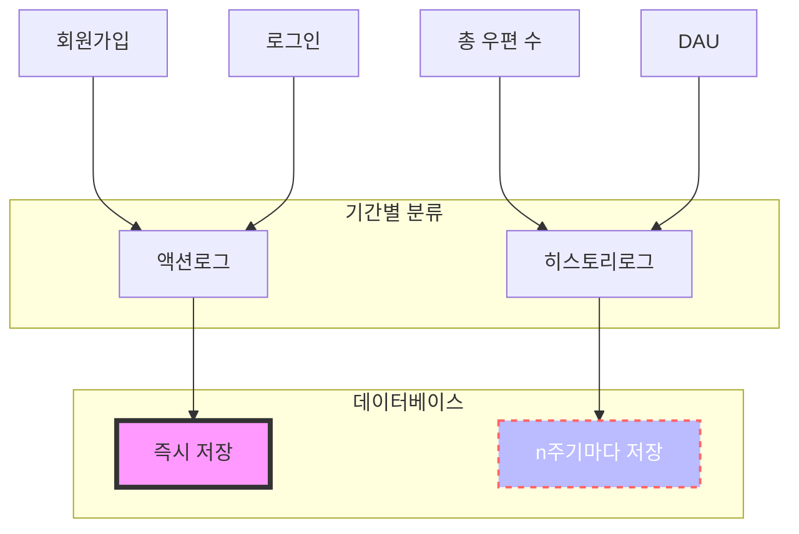
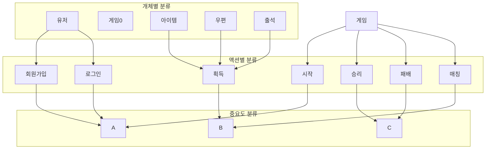
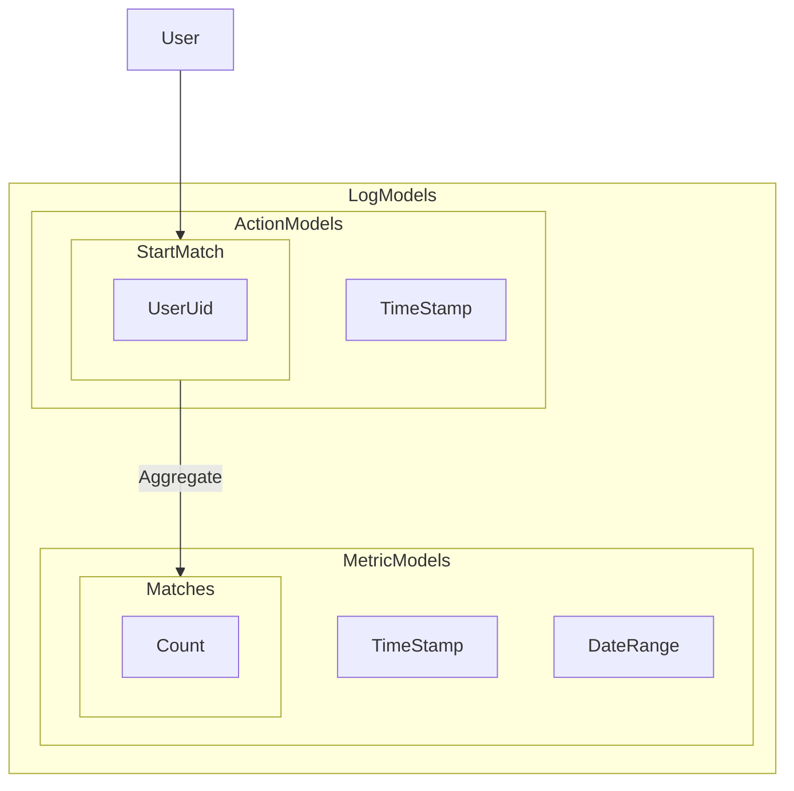
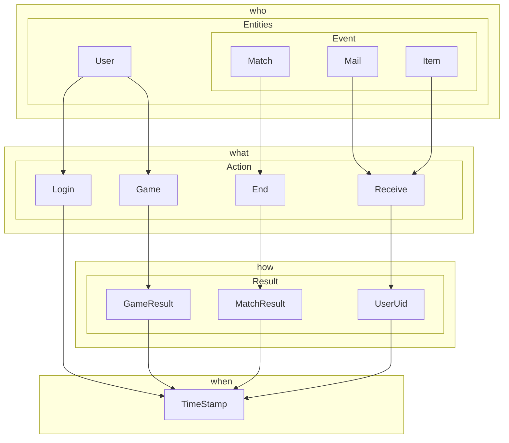
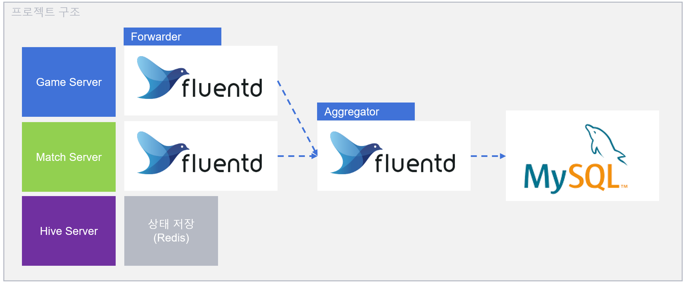
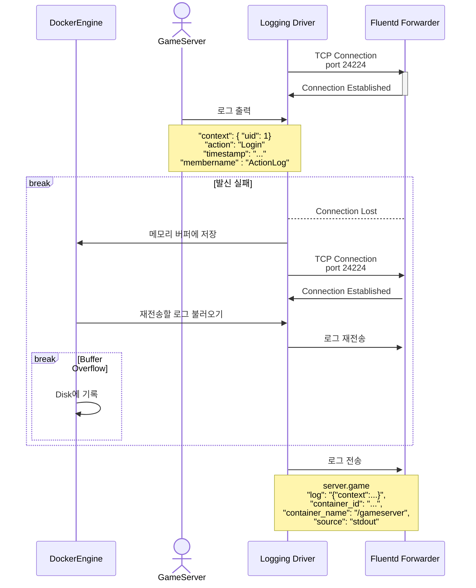
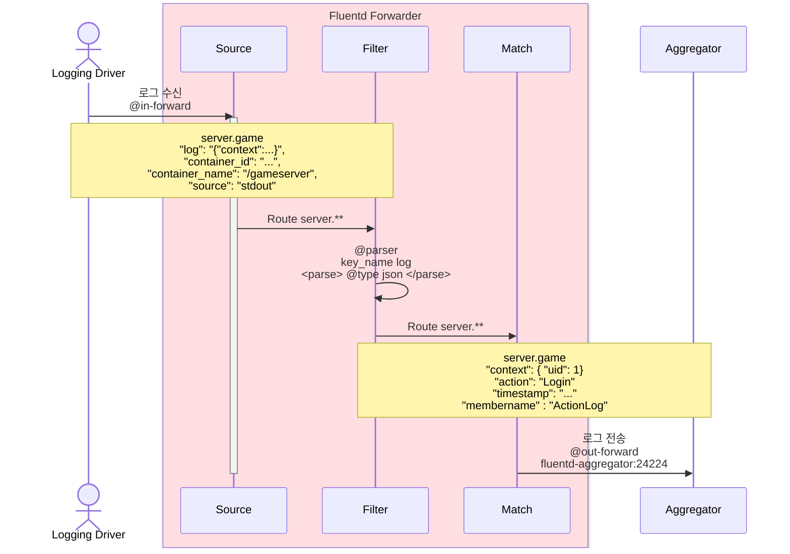
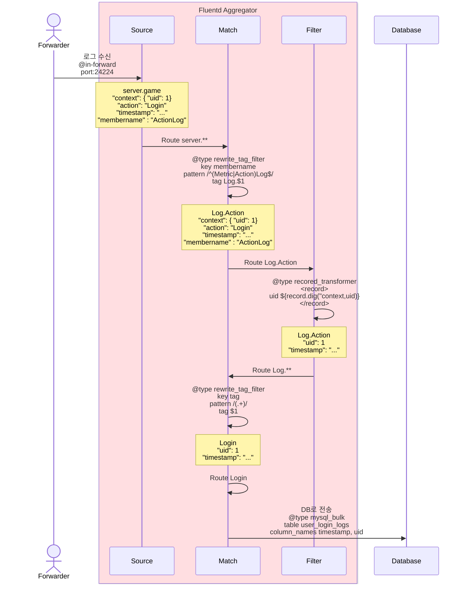

# Fluentd Study


## 개요

이 프로젝트의 목적은 사전에 작업한 오목게임의 서버 및 시스템 **상태를 실시간으로 모니터링** 하고 이를 기반으로 **통계가 가능한 로그데이터를 생성, 전송, 및 저장** 하는것입니다.

적합한 **ZLogger**와 **Fluentd**의 사용을 통해 로그 데이터를 효율적으로 수집하고 최소한의 프로세싱으로 생성된 로그를 데이터베이스에 저장하는것이 핵심입니다.

## 목표

- **로그 콘솔 출력**

  ZLogger 을 활용하여 저장할 로그를 JSON Format으로 출력하도록 합니다.

- **서버 콘솔 출력을 통한 데이터 수집**

  Docker Engine에서 제공하는 logging driver를 활용하여,

  서버 컨테이너에서 콘솔로 출력되는 내용을 로그 데이터로 저장합니다.

- **Fluentd를 활용하여 로그 데이터 전송**

  적절한 Fluentd 활용을 통해 생성되는 로그 데이터를 데이터베이스에 저장합니다.

- **필요한 통계가 가능한 로그 데이터**

  이전에 진행된 오목게임 API Server에서 발생하는 로그 데이터를 Fluentd를 통해 가공하고 데이터 베이스로 저장합니다.

  설계되는 로그 데이터는 아래의 통계가 가능해야 합니다.

> - Daily Active Users
> - User-Specific Statistics
> - 로그인 횟수
> - 게임 플레이 횟수
> - Time-Based Statistics
> - 기간 내 로그인 인구
> - 기간 내 매칭 요청 수
> - 기간 내 매칭 성사 수
> - 기간 내 게임 플레이 수

## 목차

- [로그 데이터 모델 설계](#로그-데이터-모델-설계)
  - [로그 유형](#로그의-유형)
  - [데이터 모델](#히스토리-로그)
- [프로젝트 설명](#프로젝트-설명)
- [서버 로그 출력](#서버에서-로그-출력하기)
  - [ZLogger 서버 적용 하기](#zlogger-서버에-적용하기)
    - [ZLogger Providers](#provider-types)
  - [ZLogger 사용 가이드](#zlogger-사용-가이드)
    - [로그의 기본 구성](#로그의-기본-구성)
    - [KeyNameMutator](#keynamemutator로-네이밍-규칙-변경)
    - [JsonPropertyNames](#jsonpropertynames로-키-값-변경)
    - [Include Properties](#includeproperties로-출력-정보-제한)
    - [로그 개별 사용자 정의](#json-형식-출력-세부-설정-systemtextjsonzloggerformatter)
  - [출력된 로그 구조화](#출력된-로그-구조화)
- [로그 수집 및 전송](#로그-수집-및-전송)
  - [Fluentd 설치](#fluentd-설치)
    - [로컬 환경](#로컬-환경에서-실행할-때)
    - [Docker](#docker-환경에서-실행할-때)
  - [로그 수집 방법](#로그-수집-방법)
    - [컨테이너 로그 직접 수집하기 (기본)](#호스트-시스템에서-수집)
    - [Fluentd Logging Driver 활용하기 (선택)](#fluentd-logging-driver로-수집)
  - [Fluentd 사용 가이드](#fluentd-사용-가이드)
    - [Filter Plugin](#fluentd-filter-plugin)
      - [Parser](#parser)
      - [Record Transformer](#record-transformer)
    - [Output Plugin](#fluentd-output-plugin)
      - [Rewrite Tag Filter](#rewrite-tag-filter)
      - [Out Forward](#out-forward)

# 로그 데이터 모델 설계

## 로그의 유형

게임 로그는 DB에 저장되며, DB 서버의 성능에 따라 제약을 받을 수 있습니다. 특히 MMORPG와 같은 게임은 동시다발적으로 수많은 액션이 발생하므로, 테이블을 여러 개 연결하면 성능 저하가 발생할 수 있습니다. 이를 해결하기 위해 로그는 두 단계로 나누어 기록됩니다:

- 원본 로그: 게임 서버에서 즉시 수집한 단순한 정보.
- 표준화 로그: 사람이 판별하기 쉽도록 재가공된 로그로, 추가적인 부가 정보를 포함.



### 액션 로그

액션이 발생할 때 즉시 기록되는 로그입니다. 액션 로그는 다음과 같은 구성을 가집니다:

주체: 액션을 발생시킨 사용자 또는 시스템.

액션 정보: 수행된 동작 (예: 로그인, 레벨업).

부가 정보: 플랫폼, IP 등 추가 정보.

예시 로그 항목:

> - server close: 서버 비정상 종료
> - account login: 계정 로그인

### 히스토리 로그

특정 주기에 따라 상태 변화를 기록하는 로그입니다. 게임 상태의 변화를 확인할 수 있도록 주기적으로 기록됩니다.

예시 로그 항목:

> - daily active user: 일일 접속자 수
> - item all: 아이템 총 수량

<details>
    <summary><b>[참고] 로그 설계를 위한 데이터 분류 가이드 </b></summary>

### 로그 분류 하기

기본적인 게임 구성요소를 로그화 할때 아래와 같이 구성해 볼 수 있습니다.



개체, 액션, 시간별로 인덱싱이 가능하게 하고, 중요도에 따라 디테일의 양과 저장 시간을 줄입니다.



### 모델 세분화

적합한 데이터 모델 구조 설계를 위하여 저장할 부분을 4가지 요소로 나눌 수 있습니다.

- Who (누가)
- What (어떤것을)
- How (어떻게)
- When (언제)



</details>

<details>
    <summary><b>사용된 로그 데이터 모델</b></summary>

<br/>

앞서 명시된 목표 통계를 위해 설계된 로그 모델은 아래와 같습니다.

### User-Specific Logs

```sql
CREATE TABLE `user_login_logs` (
  `uid` bigint NOT NULL,
  `timestamp` datetime NOT NULL,
  PRIMARY KEY (`uid`,`timestamp`),
  KEY `idx_uid` (`uid`)
);
```

유저 로그인 로그
<br/>

```sql
CREATE TABLE `user_match_start_logs` (
  `uid` BIGINT NOT NULL,
  `timestamp` DATETIME NOT NULL,
  PRIMARY KEY (`uid`, `timestamp`),
  KEY `idx_uid` (`uid`)
);

```

유저 매칭 시작 로그
<br/>

```sql
CREATE TABLE `user_match_complete_logs` (
  `uid` BIGINT NOT NULL,
  `timestamp` DATETIME NOT NULL,
  PRIMARY KEY (`uid`, `timestamp`),
  KEY `idx_uid` (`uid`)
);
```

유저 매칭 완료 로그
<br/>

```sql
CREATE TABLE `user_game_logs` (
  `uid` BIGINT NOT NULL,
  `timestamp` DATETIME NOT NULL,
  PRIMARY KEY (`uid`, `timestamp`),
  KEY `idx_uid` (`uid`)
);
```

유저 게임 기록 로그
<br/>

## Metric Logs

```sql
CREATE TABLE `game_logs` (
  `guid` VARCHAR(36) NOT NULL,
  `timestamp` DATETIME NOT NULL,
  PRIMARY KEY (`guid`),
  KEY `idx_guid_timestamp` (`guid`, `timestamp`)
);
```

게임 생성 기록
<br/>

```sql
CREATE TABLE `match_logs` (
  `guid` VARCHAR(36) NOT NULL,
  `timestamp` DATETIME NOT NULL,
  PRIMARY KEY (`guid`),
  KEY `idx_guid_timestamp` (`guid`, `timestamp`)
);
```

매칭 생성 기록
<br/>

</details>

# 프로젝트 설명

## 프로젝트 구조

작성된 프로젝트의 구조는 이렇습니다.

```
GameSolution
├── GameClient
│   └── GameClient.csproj
├── GameServer
│   ├── GameServer.csproj
│   └── Dockerfile
├── MatchServer
│   ├── MatchServer.csproj
│   └── Dockerfile
├── HiveAPIServer
│   ├── HiveAPIServer.csproj
│   └── Dockerfile
├── GameShared.Lib
│   ├── GameShared.Lib.csproj
│   └── other files...
├── ServerShared.Lib
│   ├── ServerShared.Lib.csproj
│   └── other files...
├── GameSolution.sln
├── docker-compose.yml
├── .gitignore
└── .dockerignore
```

### Fluentd 설계 하기

작성된 프로젝트에서, flunted 구성 방법입니다.


게임서버와 매치서버에서 전송용 fluentd 에이전트로 로그를 수집하여,

적재소 fluentd 에이전트로 모은 후, 알맞은 데이터베이스에 저장합니다.

# 서버에서 로그 출력하기

[ZLogger](https://github.com/Cysharp/ZLogger)를 사용하여 서버에서 로그를 출력합니다.

> [!TIP]
> ZLogger는 `Microsoft.Extensions.Logging` 위 구축된 고성능 로거로,
> C# 10.0의 향상된 String Interpolation을 활용하여 로깅 속도를 높이고 메모리 할당을 최소화합니다.
>
> `JSON`형식으로 출력할때에는 아래와 같이 `System.Text.Json.Utf8JsonWriter`를 접목하여 `UTF8`로 직접 기록합니다.
>
> ```csharp
> // 예시: {"name":"foo", "age":33} 형식의 JSON을 Utf8JsonWriter에 기록합니다.
> public void WriteJsonParameterKeyValues(Utf8JsonWriter writer, JsonSerializerOptions jsonSerializerOptions)
> {
>    writer.WriteString(_jsonParameter_name, this.name);
>    writer.WriteNumber(_jsonParameter_age, this.age);
> }
> ```

## ZLogger 서버에 적용하기

먼저 ZLogger를 설치하려면, .NET 프로젝트 경로에서 아래 명령어를 실행하거나 NuGet Package Manager를 통해 직접 설치하면 됩니다.

```bash
dotnet add package ZLogger
```

설치가 완료 되면, `Program.cs`에서 로그 콘솔 출력을 위해 **provider**에 `ZLoggerConsole`를 추가합니다.

```csharp
using ZLogger;

// ..

builder.Logging.ClearProviders();     // 이전 로깅 provider 설정 초기화
builder.Logging.AddZLoggerConsole();  // 로그 콘솔 출력 설정
```

### Provider Types

`Add[Provider Alias]()`형식의 builder extension 매서드를 통해 추가적인 provider를 지정할 수 있습니다.

| Provider Alias        | Description                                                                                                                                                                                                                                                                                                                                          |
| :-------------------- | :--------------------------------------------------------------------------------------------------------------------------------------------------------------------------------------------------------------------------------------------------------------------------------------------------------------------------------------------------- |
| `ZLoggerConsole`      | 로그를 콘솔에 출력하도록 합니다.                                                                                                                                                                                                                                                                                                                     |
| `ZLoggerFile`         | 로그를 파일에 기록합니다.                                                                                                                                                                                                                                                                                                                            |
| `ZLoggerRollingFile`  | 특정 간격에 따라 로그파일을 교체(rolling)하여 생성합니다.                                                                                                                                                                                                                                                                                            |
| `ZLoggerStream`       | 로그를 지정 stream으로 출력합니다.                                                                                                                                                                                                                                                                                                                   |
| `ZLoggerInMemory`     | 로그를 메모리에 저장하여 테스트나 지정 프로세스 내 구독 이벤트 처리에 활용할 수 있습니다.                                                                                                                                                                                                                                                            |
| `ZLoggerLogProcessor` | 커스텀 `IAsyncLogProcessor` 활용을 통해 로그 출력을 사용자 정의할 수 있게 합니다. `IZLoggerEntry` 인스턴스를 사용하여 로그를 개별 처리하거나, 로그 일괄 처리를 위한 `BatchingAsyncLogProcessor`를 활용하여 한 번의 HTTP 요청으로 여러 로그를 전송할 수 있습니다. 기본적으로 `IZLoggerEntry`는 풀링되므로 항상 `Return()`을 호출하여 반환해야 합니다. |

위와 같이 Provider를 적용할 때는, 아래의 `options` 파라미터를 활용하여 세부 설정을 변경할 수 있습니다.

### Provider Options

옵션은 공통적으로 사용할 수 있는 옵션과, provider별 특화 옵션으로 나뉩니다.

본 프로젝트에서는 아래와 같이 `UseJsonFormatter()` 옵션을 사용하여 로그가 JSON 형식으로 출력되도록 합니다.

```csharp
builder.Logging.AddZLoggerConsole(options =>
{
    options.UseJsonFormatter(); // JSON 형식으로 출력
});
```

#### 공통 옵션 `ZLoggerOptions`

\*`ZLoggerInMemoryProvider`는 공통 옵션에서 제외됩니다.

| Option Name                           | Description                                                                                                                                                                                     |
| :------------------------------------ | :---------------------------------------------------------------------------------------------------------------------------------------------------------------------------------------------- |
| `IncludeScopes`                       | `BeginScope` 메서드 활성화 여부를 선택합니다. `BeginScope`를 사용하면 여러 로그 항목에 걸쳐 동일한 컨텍스트 데이터를 포함할 수 있어, 로그 범위 설정과 맥락 파악에 유용합니다. (기본값: `false`) |
| `TimeProvider`                        | 로그 출력 시간대 소스를 직접 설정할 수 있습니다. (기본값: `DateTime.UtcNow`)                                                                                                                    |
| `FullMode`                            | 비동기 버퍼가 가득 찼을 때 처리 방식을 설정합니다. `Grow`, `Block`, `Drop` 중 선택 가능하며, 각각 대기, 큐 확장, 또는 초과 항목 삭제의 동작을 정의합니다. (기본값: `Grow`)                      |
| `BackgroundBufferCapacity`            | 비동기 처리에서 사용되는 버퍼의 최대 용량을 설정합니다. FullMode가 `Grow`인 경우 이 옵션은 무시됩니다. (기본값: `10000`)                                                                        |
| `IsFormatLogImmediatelyInStandardLog` | 로그 포맷을 즉시 적용 여부. 즉시 포맷팅을 선택하면 로그가 기록될 때마다 완전한 포맷으로 즉시 저장되지만, 성능에 부정적인 영향을 줄 수 있습니다. (기본값: `false`)                               |
| `CaptureThreadInfo`                   | 로그에 쓰레드 정보 포함 여부. (기본값: `false`)                                                                                                                                                 |
| `UseFormatter()`                      | 사용자 지정 형식을 정의하여 출력합니다.                                                                                                                                                         |
| `UsePlainTextFormatter()`             | 기본 텍스트 형식으로 출력합니다.                                                                                                                                                                |
| `UseJsonFormatter()`                  | `System.Text.Json`을 사용하여 JSON 형식으로 출력합니다.                                                                                                                                         |

#### 콘솔 출력 전용 옵션 `ZLoggerConsoleOptions`

콘솔 출력(`ZLoggerConsole`) 전용 옵션입니다.

| Provider Name                   | Description                                                                                                                                                           |
| :------------------------------ | :-------------------------------------------------------------------------------------------------------------------------------------------------------------------- |
| `OutputEncodingToUtf8`          | `Console.OutputEncoding = new UTF8Encoding(false)` 설정으로 provider를 생성하여, BOM(Byte Order Mark)이 없는 UTF-8 형식으로 로그를 출력합니다. (기본값: `true`)       |
| `ConfigureEnableAnsiEscapeCode` | 콘솔에서 가상 터미널 처리를 구성하여 ANSI 코드를 사용할 수 있게합니다. ANSI 코드를 활성화하면 텍스트 색상, 굵기등의 특수 텍스트 형식을 지원합니다. (기본값: `false​`) |
| `LogToStandardErrorThreshold`   | 설정된 로그 레벨 이상일 경우 표준 오류 출력(`stderr`)으로 로그를 보냅니다. (기본값: `LogLevel.None`)                                                                  |

#### JSON 형식 출력 세부 설정 `SystemTextJsonZLoggerFormatter`

앞서 언급한 `UseJsonFormatter()`의 세부 설정을 통해,

필요한 로그가 원하는 형식으로 출력되도록 합니다.

```csharp
builder.Logging.AddZLoggerConsole(options =>
{
	options.UseJsonFormatter(formatter =>
	{
		// 로그 기본 키네임 변경
		formatter.JsonPropertyNames = JsonPropertyNames.Default with
		{
			Timestamp = JsonEncodedText.Encode("timestamp"),
			MemberName = JsonEncodedText.Encode("membername"),
			Exception = JsonEncodedText.Encode("exception"),
		};
		// System.Text.Json 제공 옵션 변경 (JSON 직렬화시 적용되는 설정)
		formatter.JsonSerializerOptions = new JsonSerializerOptions
		{
			PropertyNamingPolicy = JsonNamingPolicy.SnakeCaseLower
		};
		// 로그 기본 키네임 컨벤션 변경
		formatter.KeyNameMutator = KeyNameMutator.LastMemberNameLowerFirstCharacter;
		// 로그 구성 선택
		formatter.IncludeProperties = IncludeProperties.Timestamp | IncludeProperties.ParameterKeyValues;
	});
});
```

설정 가능한 항목은 아래와 같습니다.

| Provider Name                 | Description                                                                     |
| :---------------------------- | :------------------------------------------------------------------------------ |
| `JsonPropertyNames`           | ([로그 기본 구성](#로그의-기본-구성)) 각 속성의 키 이름을 설정할 수 있습니다.   |
| `IncludeProperties`           | 수집할 속성을 추가하거나 제한합니다.                                            |
| `JsonSerializerOptions`       | `System.Text.Json`의 JSON 직렬화 옵션을 설정할 수 있습니다.                     |
| `AdditionalFormatter`         | 로그 기본 구성외의 추가적인 데이터의 포맷팅을 설정할 수 있습니다.               |
| `PropertyKeyValuesObjectName` | 전달되는 `ParameterKeyValues` 를 지정된 이름 아래에 중첩하여 출력하도록 합니다. |
| `KeyNameMutator`              | 각 속성의 키 네이밍 컨벤션을 지정합니다.                                        |
| `UseUtcTimestamp`             | 타임스탬프를 UTC 형식으로 출력합니다. (기본값: `false`)                         |

자세한 사용 방법과 예시는 아래의 [ZLogger 사용 가이드](#zlogger-사용-가이드)에서 확인 가능합니다.

## ZLogger 사용 가이드

### 로그의 기본 구성

Zlogger를 통해 제공받을 수 있는 로그의 구성은 다음과 같습니다.

| Key Name     | Description                                                                                                                                                                                                             |
| :----------- | :---------------------------------------------------------------------------------------------------------------------------------------------------------------------------------------------------------------------- |
| `Category `  | 생성된 Logger의 할당된 카테고리 이름, 주로 클래스나 모듈의 전체 이름을 나타냅니다. <br/>**ex:** ILogger<HomeController\> 를 통해 쓰인 로그의 Category는 `App.Controllers.HomeController`가 됩니다                       |
| `Timestamp ` | 로그가 기록된 시간을 나타냅니다.                                                                                                                                                                                        |
| `LogLevel`   | `Microsoft.Extensions.Logging`에서 제공되는 로그의 심각도를 나타냅니다.                                                                                                                                                 |
| `EventId `   | `Microsoft.Extensions.Logging`에서 제공되는 이벤트 ID입니다. 각 로그 항목에 대한 고유 식별자 역할을 합니다.                                                                                                             |
| `ScopeState` | `ILogger.BeginScope(...)`를 통해 설정된 추가 속성들을 포함합니다. 이는 로그 항목과 관련된 추가 정보를 저장합니다. (`ZLoggerOptions.IncludeScopes = true`일 경우에만 해당, [Providers Options](#provider-options) 참고). |
| `ThreadInfo` | 로그 항목이 생성될 당시의 쓰레드 ID 및 관련 쓰레드 컨텍스트를 저장합니다.                                                                                                                                               |
| `Context`    | 로그 기록 시 전달된 추가 객체입니다.                                                                                                                                                                                    |
| `MemberName` | 로그 호출 시의 멤버 이름을 나타냅니다. `CallerMemberName`을 통해 자동으로 설정되며, 호출된 메서드의 이름이 기록됩니다. <br/> **ex:** GameServer의 경우 `ActionLog`, `MetricLog`로 나뉘게 됩니다.                        |
| `FilePath`   | 로그 항목이 호출된 소스 파일의 전체 경로를 나타냅니다.                                                                                                                                                                  |
| `LineNumber` | 로그가 생성된 소스 파일의 줄 번호를 나타냅니다                                                                                                                                                                          |

이전 단계에서 서버에 ZLogger 적용을 완료 하였으면, 아래와 같이 `ZLogInformation` 메서드를 사용할 수 있습니다.

```csharp
var user = new User(1, "Alice");
logger.ZLogInformation($"Name: {user.Name}");
```

별도의 설정없이 `JSON` 형식으로만 출력할 경우, 위 코드는 아래와 같이 출력됩니다.

```json
{ "user.Name": "Alice" }
```

### `KeyNameMutator`로 네이밍 규칙 변경

기본설정으로 `JSON` 형식 출력 시, 입력 당시의 객체의 키값을 그대로 사용하기 때문에

`KeyNameMutator`옵션 사용을 통해 기본 네이밍 규칙을 변경할 수 있습니다.

예를 들어, `KeyNameMutator`을 `LastMemberName`으로 설정하면 해당 값의 키로 마지막 멤버 이름만을 가져오게 합니다.

```json
{ "Name": "Alice" }
```

여기서 `LastMemberNameLowerFirstCharacter` 옵션을 통해 소문자 형식을 추가로 지정할 수 있습니다.

```csharp
formatter.KeyNameMutator = KeyNameMutator.LastMemberNameLowerFirstCharacter;
```

해당 옵션을 적용할경우 동일한 로그가 아래와 같이 출력됩니다.

```json
{ "name": "Alice" }
```

### `JsonPropertyNames`로 키 값 변경

`JsonPropertyNames` 는 로그 속성 키네임 전체를 대체할 때 사용됩니다.

네이밍 규칙 변경만으로 원하는 키값을 출력하기 어려울때 사용하면 됩니다.

예를 들어, 아래와 같이 `TimeStamp` 와 `MemberName`을 변경합니다.

```csharp
formatter.JsonPropertyNames = JsonPropertyNames.Default with
{
    Timestamp = JsonEncodedText.Encode("timestamp"),
    MemberName = JsonEncodedText.Encode("membername"),
};
```

이렇게 설정한 속성들의 키 값은 아래와 같이 출력됩니다.

```json
{
  "timestamp": "2024-10-02T08:29:50.7544882+00:00",
  "membername": "ActionLog"
}
```

### `IncludeProperties`로 출력 정보 제한

`IncludeProperties`는 [로그 기본 구성](#로그의-기본-구성)키 값으로 이루어진 `enum`입니다.

> ZLogger.IncludeProperties

```csharp
[Flags]
public enum IncludeProperties
{
    None = 0,
    Timestamp = 1,
    LogLevel = 2,
    CategoryName = 4,
    EventIdValue = 8,
    EventIdName = 0x10,
    Message = 0x20,
    Exception = 0x40,
    ScopeKeyValues = 0x80,
    ParameterKeyValues = 0x100,
    MemberName = 0x200,
    FilePath = 0x400,
    LineNumber = 0x800,
    Default = 0x1E7,
    All = 0xFFF
}
```

옵션 값 지정을 통해 원하는 로그의 구성을 선택할 수 있습니다.

예를들어 이렇게 설정할 경우,

```csharp
formatter.IncludeProperties = IncludeProperties.Timestamp;
```

아래와 같이 로그는 `Timestamp` 속성만 출력되게 됩니다.

```json
{
  "Timestamp": "2024-10-02T08:29:50.7544882+00:00"
}
```

### 로그별 형식 사용자 지정하기

로그별로 메서드 호출시에 syntax 활용을 통해 로그 형식을 변경할 수 있습니다.

#### 사용자 정의 형식 `:`

`:` 구문은 변수에 사용자 정의 형식을 적용하여 로그 메시지에 표시할 때 사용됩니다.

예를 들어 아래 `ActionLog` 메서드에서 사용되는 context는 object 타입이지만, 아래처럼 `:json`을 활용해 객체를 JSON으로 직렬화합니다.

```csharp
protected void ActionLog(object context, [CallerMemberName] string? tag = null)
{
    _logger.ZLogInformation($"[{tag:json}] {context:json}");
}
```

#### 명시적 이름 변경 `:@`

`:@` 구문은 구조화된 데이터로 로깅할 때 변수의 이름을 명시적으로 변경할 수 있습니다.

기본적으로 ZLogger는 변수 이름을 구조화된 로그의 속성 키로 사용하지만, `:@newname`을 사용하면 해당 변수의 key name을 로그 출력에서 `newname`으로 지정할 수 있습니다.

#### 사용자 정의 형식과 명시적 이름 변경 조합

`:@`(명시적 이름 변경)과 `:`(사용자 정의 형식)을 함께 사용하여 변수의 이름을 지정하고, 동시에 형식을 적용할 수도 있습니다.

```csharp
logger.ZLogDebug($"Today is {DateTime.Now:@date:yyyy-MM-dd}.");
```

위 예시에서는 property 이름을 `date`로 변경하고, 날짜 형식을 `yyyy-MM-dd`로 지정합니다

## 출력된 로그 구조화

통일화된 로그 형태를 위해 ZLogger를 사용하는 서버의 메서드들을 추상화 합니다.

### ActionLog on Controllers

```csharp
public abstract class BaseController<T> : ControllerBase
{
    private readonly ILogger<T> _logger;

    ...

    protected void ActionLog(object context, [CallerMemberName] string? tag = null)
    {
        _logger.ZLogInformation($"[{tag:json}] {context:json}");
    }
}
```

유저 기반 이벤트가 발생할때에는 컨트롤러에서 `ActionLog`를 호출하여

`[CallerMemberName]`을 통해 실행된 메서드 이름과 함께 로그 상세정보(`context`)를 기록합니다.

```csharp

[Route("[controller]")]
[ApiController]
public class LoginController : BaseController<LoginController>
{
    ...

    [HttpPost]
    public async Task<LoginResponse> Login([FromBody] LoginRequest request)
    {
        var response = new LoginResponse();
        (response.Result, var (uid, token)) = await _service.LoginUser(request.PlayerId, request.Token);

        if (response.Result == ErrorCode.None)
        {

            ActionLog(new
            {
                uid
            });
        }

        ...
    }
}
```

예를 들어, 로그인에 성공했을 경우, 위와 같이 ActionLog가 실행됩니다.

해당 메서드는 아래와 같이 콘솔에 출력합니다.

```json
{
  "timestamp": "2024-10-02T08:29:50.7544882+00:00",
  "membername": "ActionLog",
  "tag": "Login",
  "context": {
    "uid": 1
  }
}
```

### Metric Log in Services

Metric Log는 유저 액션 기반이 아닌 시스템 이벤트 발생 시점으로 부터 기록합니다.

```csharp
public abstract class BaseLogger<T>
{
    private readonly ILogger<T> _logger;

    ...

    protected void MetricLog(string tag, object context)
    {
        _logger.ZLogInformation($"[{tag:json}] {context:json}");
    }
}
```

매칭 성사 통계의 경우, MatchServer 에서 매칭 데이터를 생성하고 저장하는 기점을 매칭 성사로 간주하고 MetricLog를 호출합니다

```csharp
// MatchWorker.cs
    private void MonitorMatchQueue()
    {
        while (true)
        {
            if (_userQueue.Count < 2)
            {
                System.Threading.Thread.Sleep(100);
            }

            // Queue 확인 후 저장 .. 생략

            MetricLog("Match", new
            {
                guid = gameGuid
            });
        }
    }
```

해당 메서드 실행을 통해 아래와 같은 로그가 출력됩니다.

```json
{
  "timestamp": "2024-10-02T08:29:50.7544882+00:00",
  "membername": "MetricLog",
  "tag": "Match",
  "context": {
    "guid": "..."
  }
}
```

### 출력용 메서드

디버깅 목적으로 출력되는 로그 메서드 입니다.

공통 항목

| Parameter    | Description                                                                                             |
| :----------- | :------------------------------------------------------------------------------------------------------ |
| `caller`     | 로깅 메서드를 호출한 함수 이름입니다. 자동으로 메서드명이 기록됩니다.                                   |
| `context`    | 로그와 관련된 추가적인 객체나 데이터를 포함할 수 있습니다.                                              |
| `membername` | ZLogger 메서드를 호출한 함수 이름입니다. 로깅 메서드 종류를 구분합니다. 자동으로 메서드명이 기록됩니다. |

#### InformationLog

```csharp
protected void InformationLog(string message, object? context = default, [CallerMemberName] string? caller =null)
{
	_logger.ZLogInformation($"[{caller}] {message} {context:json}");
}
```

정상적인 흐름이나 특정 동작이 수행되었음을 알리고자 할때 사용됩니다.

이전에 로그인 성공시 호출되던 ActionLog 와 함께 Information Log를 호출하여 보겠습니다.

```csharp

	public async Task<LoginResponse> Login([FromBody] LoginRequest request)
	{
        // .. 로그인.. 생략

		if (response.Result == ErrorCode.None && token != null)
		{
			response.AccessToken = token;
			response.Uid = uid;

            // context: 유저 UID
            ActionLog(new
			{
				uid
			});

            // context: 처리 결과 전체, 디버깅용
			InformationLog("User Logged in", response);
		}

    }
```

RESULT:

```json
{
  "timestamp": "2024-10-10T07:46:08.9486195+00:00",
  "membername": "InformationLog",
  "caller": "Login",
  "message": "User Logged in",
  "context": {
    "uid": 1,
    "access_token": "...",
    "result": 0
  }
}
```

`InformationLog`에 첨부된 `response`를 `context`에서 확인할 수 있습니다.

#### ExceptionLog

```csharp
protected void ExceptionLog(Exception ex, object? context = default, [CallerMemberName] string? caller = null)
{
	_logger.ZLogError(ex, $"[{caller}]", context);
}
```

시스템 오류 예외 처리 과정에서 사용됩니다.

Exception 객체(스택 추적 포함)를 통해 문제가 발생한 위치를 파악하고 진단하는 데 도움을 줍니다.

다음은 MemoryDb에서 Redis CloudStructures를 활용하여 RedisConnection으로부터 값을 가져오는 `GetAsync` 메서드입니다.

```csharp
public async Task<(ErrorCode, T?)> GetAsync<T>(string key)
{
    try
    {
        RedisString<T> redisData = new(_redisConnection, key, null);
        RedisResult<T> result = await redisData.GetAsync();
		return (ErrorCode.None, result.Value);
	}
    catch (Exception e)
    {
        ExceptionLog(e, $"{typeof(T).Name}:{key}");
        return (ErrorCode.RedisGetException, default(T));
    }
}
```

MemoryDb에서 존재하지 않는 값을 조회하려 할 때 발생하는 `InvalidOperationException`에 대한 출력 예시입니다.

```json
{
  "timestamp": "2024-10-10T08:15:24.8677434+00:00",
  "exception": {
    "Name": "System.InvalidOperationException",
    "Message": "has no value.",
    "StackTrace": "   at CloudStructures.RedisResult\u00601.get_Value()\n   at ServerShared.Repository.MemoryDb.GetAsync[T](String key)",
    "InnerException": null
  },
  "membername": "ExceptionLog",
  "caller": "GetAsync",
  "context": "RedisUserSession:US_1"
}
```

RedisKeyValue `US_1`를 이용하여 `RedisUserSession`을 조회하려 했을 때 발생한 것을 확인할 수 있습니다.

#### ErrorLog

```csharp
protected void ErrorLog(ErrorCode errorCode, object? context = default, [CallerMemberName] string? caller =null)
{
	_logger.ZLogError($"[{caller}] {errorCode}", context);
}
```

서비스 오류 처리 과정에서 사용됩니다.

오류가 발생 했을때 `ErrorCode`(오류 유형)과 관련 정보를 통해 디버깅을 돕습니다.

로그인 요청시 발생하는 오류를 예시로 살펴보겠습니다.

```csharp

	public async Task<LoginResponse> Login([FromBody] LoginRequest request)
	{
		var response = new LoginResponse();

		(response.Result, var (uid, token)) = await _service.LoginUser(request.PlayerId, request.Token);

		if (response.Result == ErrorCode.None && token != null)
		{
			response.AccessToken = token;
			response.Uid = uid;

            ActionLog(new
			{
				uid
			});

			InformationLog("User Logged in", response);
		}
        else
		{
			ErrorLog(ErrorCode.LoginFail, request);
		}

    }
```

이전에 명시되었던 로그인 요청 함수에, 실패시 `ErrorLog`를 남기는 부분이 추가되었습니다.

오목게임 `UserService`의 `LoginUser`함수는 `VerifyUser`를 통해 아래와 같이 유저정보를 불러오거나 생성합니다.

```csharp
private async Task<(ErrorCode, User?)> VerifyUser(Int64 playerId)
{
	try
	{
		var (errorCode, user) = await _gameDb.Get(playerId);
		if (errorCode == ErrorCode.DbUserGetFailUserNotFound)
		{
			errorCode = await _gameDb.Set(new User { HivePlayerId = playerId });
			if (errorCode != ErrorCode.None)
			{
				return (errorCode, null);
			}
			(errorCode, user) = await _gameDb.Get(playerId);
		}
        // ...
	}
   // ...생략
}
```

`VerifyUser`가 실패할 경우, `LoginUser`는 전달받은 오류코드와 함께 `ErrorLog`를 남깁니다.

```csharp
public async Task<(ErrorCode, (Int64, string))> LoginUser(Int64 playerId, string token)
{
	try
	{
        // ...
		(errorCode, var user) = await VerifyUser(playerId);
		if (errorCode != ErrorCode.None)
		{
			ErrorLog(errorCode);
			return (errorCode, (0, string.Empty));
		}
        // ..
	}
    // ...생략
}
```

해당 과정은 다음과 같이 출력됩니다.

중복된 유저 정보 생성 시도시 `_gameDb.Set`내부에서 호출 되는 `ExceptionLog` 출력물입니다.

```json
{
  "timestamp": "2024-10-10T08:21:58.0954021+00:00",
  "exception": {
    "Name": "MySqlConnector.MySqlException",
    "Message": "Duplicate entry \u00273\u0027 for key \u0027user.hive_player_id\u0027",
    "StackTrace": "...  at GameServer.Repositories.UserDb.Set(User user) in /src/GameServer/Repositories/UserDb.cs:line 44",
    "InnerException": null
  },
  "membername": "ExceptionLog",
  "caller": "Set",
  "context": null
}
```

중복된 `hive_player_id`로 인해 `MySqlException` 이 발생한 것을 확인할 수 있습니다.

이후 `LoginUser`는 아래와 같은 `ErrorLog`를 남깁니다.

```json
{
  "timestamp": "2024-10-10T08:21:58.0954751+00:00",
  "membername": "ErrorLog",
  "caller": "LoginUser",
  "errorCode": 10003,
  "context": null
}
```

```csharp
public enum ErrorCode
{
	DbUserInsertException = 10003
}
```

DB 예외처리가 발생하였을 알려주는 에러코드와 함께 호출 위치(`caller`)를 알려주고 있습니다.

이렇게 로그인 요청에 실패하면, `LoginUser`를 요청했던 `LoginController` 에서 요청 실패에 대한 정보를 다음과 같이 남깁니다.

```json
{
  "timestamp": "2024-10-10T08:21:58.0954838+00:00",
  "membername": "ErrorLog",
  "caller": "Login",
  "errorCode": 1300,
  "context": {
    "player_id": 3,
    "token": "..."
  }
}
```

```csharp
public enum ErrorCode
{
	LoginFail = 1300,
}
```

실패한 요청 정보와 함께 요청 실패 오류코드가 출력된것을 확인할 수 있습니다.

# 로그 수집 및 전송

이제 본격적으로 Fluentd를 활용하여 수집한 로그를 가공 및 데이터베이스에 저장합니다.

일반적으로 로그가 수집되는 서버와 데이터베이스가 서로 다른 위치에 있으므로,

적절한 부하 분산이 가능하도록 주로 아래와 같이 Fluentd를 두가지 종류로 나누어 구성합니다.


위 구조에서

- `Forwarder`는 연결된 서버에서 로그를 수집하여 `Aggregator`(적재소)로 전송하고,
- `Aggregator`는 로그를 필요에 맞게 가공한 후 최종 목적지에 전송하는 역할을 합니다.

> - [Forwarder 예시](#forwarder-예시)
> - [Aggregator 예시](#Aggregator-예시)

## Fluentd 설치

### 로컬 환경에서 실행할 때

> 기존에서 제공되던 `td-agent`는 버전업이 되면서`fluent-package`로 이름이 바뀌었습니다. ([td-agent v4에서 fluent-package v5 로 업그레이드](https://www.fluentd.org/blog/upgrade-td-agent-v4-to-v5) 참고)

`fluent-package`는 Fluentd 커뮤니티에서 관리하는 안정적인 배포 패키지 입니다.

#### 사전 준비

- 최대 File Descriptors 증가
  - `/etc/security/limits.conf` 를 수정 하거나, `fluent-package` 사용시 자동으로 증가됨
- 커널 파라미터 최적화 시키기
  - `/etc/sysctl.conf` 수정 후 `sysctl -p` 로 재시작

#### Linux 로컬 환경 설치

- `lsb_release -a` 커맨드를 통해 OS 버전을 확인합니다.

- [공식 설치 가이드](https://docs.fluentd.org/installation/install-by-deb)에서 해당하는 OS에 알맞은 fluent-package 5 installation shell script 를 제공 받습니다.

스크립트는 `/etc/apt/sources.list.d/fluent.sources` 또는 `/etc/apt/sources.list.d/fluent-lts.sources` 에 새로운 apt repository를 생성하여 `fluent-package` 설치를 시작합니다.

#### 데몬 실행 시키기

```bash
sudo systemctl start fluentd.service
sudo systemctl status fluentd.service
```

위 커멘드를 통해 Fluentd 서비스를 시작하고 상태를 확인할 수 있습니다.

정상적으로 실행이 완료 되면, 아래와 유사한 상태 메시지가 출력됩니다.

```bash
● fluentd.service - fluentd: All in one package of Fluentd
     Loaded: loaded (/lib/systemd/system/fluentd.service; enabled; vendor preset: enabled)
     Active: active (running) since Fri 2024-11-01 11:40:50 KST; 24s ago
       Docs: https://docs.fluentd.org/
    Process: 238 ExecStart=/opt/fluent/bin/fluentd --log $FLUENT_PACKAGE_LOG_FILE --daemon /var/run/fluent/fluentd.pid >
   Main PID: 326 (fluentd)
      Tasks: 4 (limit: 38409)
     Memory: 95.6M
     CGroup: /system.slice/fluentd.service
             ├─326 /opt/fluent/bin/ruby /opt/fluent/bin/fluentd --log /var/log/fluent/fluentd.log --daemon /var/run/flu>
             └─776 /opt/fluent/bin/ruby -Eascii-8bit:ascii-8bit /opt/fluent/bin/fluentd --log /var/log/fluent/fluentd.l>
Nov 01 11:40:49 shanabunny systemd[1]: Starting fluentd: All in one package of Fluentd...
Nov 01 11:40:50 shanabunny systemd[1]: Started fluentd: All in one package of Fluentd.
```

설치후에 기본적으로 설정되는 Fluentd 구성은 http endpoint으로 부터 로그를 제공 받아 stdout 방식으로 로그를 남기는 방식입니다.

이렇게 엔드포인트에 HTTP 요청을 보낼 경우

```bash
curl -X POST -d 'json={"json":"message"}' http://localhost:8888/debug.test
```

다음과 같이 로그가 저장된 `/var/log/fluent/fluentd.log` 경로에서 확인이 가능합니다

```bash
tail -n 1 /var/log/fluent/fluentd.log
2018-01-01 17:51:47 -0700 debug.test: {"json":"message"}
```

### Docker 환경에서 실행할 때

#### Dockerfile

[Fluentd에서 제공하는 Docker Image](https://github.com/fluent/fluentd-docker-image)는 Debian/Alpine으로 나뉩니다.

```Dockerfile
FROM fluent/fluentd:edge-debian
```

공식 추천 버전은 `jemalloc` 서포트(increased memory performance)가 제공 되는 `Debian` 이며, 이미지 크기는 `Alpine`이 더 작습니다.

```Dockerfile
USER root
```

Fluentd 는 buffer, secondary 등의 파일 저장을 위해 설정 경로 접근이 필요합니다. ([Fluentd Out Forward Plugin](#out-forward) 참고)

저장 디렉토리 권한 확보를 위해서 위와 같이 User를 `root`로 설정 후 유지합니다.

> 해당 방법이 보안상 좋지 않으면 다른 방법으로는 다음을 고려할 수 있습니다:
>
> - 해당 디렉토리에 `777` 권한을 부여
> - 호스트 시스템에서 `fluent` 사용자를 추가한 후, `chown`을 이용하여 해당 디렉토리의 소유권을 변경
> - 커스텀 이미지를 빌드

포트는 Fluentd 기본 포트인 `24224`를 노출합니다.

```Dockerfile
COPY ./fluent.conf /fluentd/etc/fluent.conf

EXPOSE 24224
```

이렇게 해서 기본적인 구성의 Fluentd 이미지가 완성됩니다.

```Dockerfile
FROM fluent/fluentd:edge-debian

USER root

COPY ./fluent.conf /fluentd/etc/fluent.conf

EXPOSE 24224

CMD ["fluentd", "-c", "/fluentd/etc/fluent.conf"]
```

#### Fluentd Dockerfile for Aggregator

완성된 `Dockerfile`에서 플러그인 설치를 통해 필요한 기능들을 추가할 수 있습니다.

앞서 명시한 `aggregator`(적재소)역할의 Fluentd는 로그 가공 및 저장을 위하여

- MySQL 플러그인 `fluent-plugin-mysql` 와
- 태그 변경 플러그인 `fluent-plugin-rewrite-tag-filter`

를 추가로 사용하게 됩니다.

이전에 작성한 Dockerfile 에서,

```Dockerfile
RUN apt-get update -y && \
    apt-get install -y \
    ubuntu-dev-tools \
    gcc \
    default-libmysqlclient-dev && \
    gem install fluent-plugin-mysql && \
    fluent-gem install fluent-plugin-rewrite-tag-filter && \
    gem sources --clear-all && \
    rm -rf /var/lib/apt/lists/* && \
    rm -rf /tmp/* /var/tmp/* /usr/lib/ruby/gems/*/cache/*.gem
```

를 추가하여 해당 플러그인을 설치합니다.

그리고, 해당 프로젝트의 경우 동일한 DB에서 반복되는 설정 사용이 있습니다.

이러한 경우에는 DB 설정파일을 따로 작성하고, `@include` 구문을 통해 불러올 수 있습니다.

(반복 작성 방지 및 가독성 완화)

컨테이너에서 접근할 수 있도록, 아래와 같이 해당 파일을 함께 복사하여 줍니다.

```Dockerfile
COPY ./db.conf /fluentd/etc/db.conf
```

<details>
    <summary><b>작성된 db.conf 파일 확인</b></summary>
</br>

[fluentd/Aggregator/db.conf](fluentd/Aggregator/db.conf)

```apacheconf
@type mysql_bulk
host db
port 3306
database logdb
username shanabunny
password comsooyoung!1
```

</details>

<details>
    <summary><b>@include 사용 예시 확인</b></summary>

[fluentd/Aggregator/fluent.conf](fluentd/Aggregator/fluent.conf)

```apacheconf
<match MatchStart>
  @include db.conf

  table user_match_start_logs
  column_names timestamp, uid

  <buffer>
    @type file
    path /var/log/fluent/buf/matchstart
    chunk_limit_size 2m
    retry_max_times 5
    flush_interval 10s
  </buffer>

  <secondary>
    @type file
    path /var/log/fluent/forward-failed
  </secondary>
</match>
```

</details>

<br/>

빌드가 완료된 이미지는 아래와 같이 Docker Compose로 구성할 수 있습니다.

```yaml
# 전송용 Fluentd
fluentd-forwarder:
  container_name: fluentd-forwarder
  depends_on:
    - fluentd-aggregator
  networks:
    - backend
  ports:
    - "24227:24224"

# DB 저장용 Fluentd
fluentd-aggregator:
  container_name: fluentd-aggregator
  depends_on:
    - db
  networks:
    - backend
  ports:
    - "24225:24224"
```

이렇게 설정하면 `backend` 네트워크 공유를 통해, 컨테이너간 접근이 가능합니다.

####

## 로그 수집 방법

Fluentd는 로그를 수집하는 방법에 따라서 구성이 달라집니다.

### 호스트 시스템에서 수집

기본적으로 컨테이너화 한 서버의 콘솔 출력물은 Docker 데몬의 기본 로깅 드라이버 설정(`json-file` logging driver)으로 인해 사용하고 있는 호스트 시스템 디스크에 로그 파일을 남기게 됩니다.

> `json-file` 로깅 드라이버는 로그 회전(log-rotation)이 수행되지 않기 떄문에,
> 출력이 많은 컨테이너에서 상당한 디스크 공간을 차지할수 있습니다.
> 이로 인해 Docker 에서는 `local` 드라이버 사용 설정을 권장하고 있습니다.
> 자세한 사항은 [Configure logging drivers 공식 문서](https://docs.docker.com/engine/logging/configure/)를 확인하세요.

이렇게 호스트 시스템에 저장된 로그 파일은

Fluentd에서 실시간으로 수집하도록 아래와 같이 설정할 수 있습니다.

#### fluentd.conf

```apacheconf
<source>
  @type tail
  path /var/log/app.log
  pos_file /var/log/fluentd/app.pos
  tag app.log
  <parse>
    @type json
  </parse>
</source>
```

여기서 `source`태그는, 로그 제공 출처를 의미합니다.

`@type`구분을 활용해 알맞은 수집용 플러그인을 선택할 수 있으며,

호스트 시스템의 경우 `in_tail` 플러그인을 사용합니다.

[`in_tail`](https://docs.fluentd.org/0.12/input/tail) Input 플러그인은 Fluentd가 텍스트 파일의 끝부분에서 이벤트를 읽을 수 있게 해줍니다.

이 플러그인의 동작은 Linux의 `tail -F` 명령어와 유사합니다.

- `path /var/log/app.log` 모니터링할 로그 파일의 경로 입니다.

- `pos_file /var/log/fluentd/app.pos` Fluentd가 로그 파일에서 읽은 위치(바이트 오프셋)를 저장하는 파일을 지정합니다.

  - `pos_file`은 Fluentd가 재시작되었을 때 로그를 중복 처리하지 않고 중단된 지점부터 다시 읽을 수 있도록 합니다.

- `tag app.log` 받아오는 로그에 `app.log` 태그를 붙입니다.

  - `tag`는 로그를 필터링 하거나 특정 로그만 처리하는데 사용될 수 있습니다.

- ` <parse>
  @type json
</parse>` `parse` 블록은 Fluentd가 로그를 어떻게 해석할지 정의합니다. `@type` 에 선언되는 형식에 맞춰 로그를 파싱합니다. (`forward` 플러그인에서는 적용되지 않습니다.)

### Fluentd Logging Driver로 수집

Docker에서 제공하는 `fluentd logging driver`를 사용할 경우,

Docker 데몬의 로깅 드라이버가 설정된 Fluentd의 주소로 로그를 전송합니다.

Fluentd Logging Driver는 아래와 같이 커맨드 옵션을 통해 설정 및 활성화 할 수 있습니다.

```bash
docker run --log-driver=fluentd --log-opt fluentd-address=fluentdhost:24224
```

연결 시도 당시에 Fluentd 데몬이 활성화 되어있지 않을 경우, 컨테이너는 바로 종료 됩니다.

이를 방지하기 위해, [`fluentd-async`](#fluentd-async-connect-의-사용) 옵션을 활용할 수 있습니다.

#### Docker Compose

해당 드라이버는 Docker Compose를 통해 아래와 같이 구성할 수 있습니다.

```yaml
# 게임서버의 로깅 드라이버를 fluentd로 설정
gameserver:
  # 컨테이너 설정 생략...
  logging:
    driver: fluentd
    options:
      fluentd-address: "localhost:24227" # 연결할 fluentd 위치
      fluentd-async-connect: "true" # 비동기 연결 설정
      tag: server.game # 로그 출력시 첨부 태그
```

이렇게 하여 서버에서 기본 로깅 드라이버가 아닌

`fluentd logging driver`를 사용하여 fluentd 로 전송하도록 합니다

<details>
    <summary><b>로깅 드라이버 원리 살펴보기</b></summary>



</details>

#### fluentd.conf

앞서 설정한 전송용 fluentd `fluentd-forwarder`의 외부 포트 24227은 아래와 같이 내부 포트 24224와 연결되어있습니다.

```yaml
# 전송용 Fluentd
fluentd-forwarder:
  container_name: fluentd-forwarder
  depends_on:
    - fluentd-aggregator
  networks:
    - backend
  ports:
    - "24227:24224"
```

따라서 로깅 드라이버를 통해 전송 받을 때는 내부 포트번호로 명시하여 줍니다.

```apacheconf
<source>
  @type forward
  port 24224
  bind 0.0.0.0
</source>
```

위 예시에서

- `port 24224` 수신 대기할 포트 번호입니다.
- `bind 0.0.0.0` 모든 네트워크 인터페이스에서 수신 대기할 수 있도록 설정합니다.

본 프로젝트에서는 이와 같이 [`in_forward`](https://docs.fluentd.org/input/forward) Input 플러그인을 사용하여 컨테이너에서 오는 로그를 수신합니다.

`forward` 플러그인은 TCP 소켓을 통해 이벤트 스트림을 송수신할때 사용되는 플러그인입니다. 이 중 `in_forward` 플러그인은 사설 네트워크 내에서 사용하기 적합하며, 공공 네트워크에서 사용할 때는 `in_secure_forward` 플러그인을 사용하는 것이 권장됩니다.

#### Fluentd Logging Driver Options

| Parameter Name        | Description                                                                                                                                                                                                   |
| :-------------------- | :------------------------------------------------------------------------------------------------------------------------------------------------------------------------------------------------------------ |
| fluentd-address       | 로그를 전송할 fluentd 주소입니다. `localhost:24224`가 기본값입니다.                                                                                                                                           |
| fluentd-async-connect | Fluentd 비동기 연결 여부. `true`로 설정할 경우 fluentd 연결 시도시 컨테이너 프로세스를 차단하지 않습니다. `false`일 경우 로그를 전송하기 전 fluentd에 연결을 완료할때까지 대기합니다. `false`가 기본값입니다. |
| tag                   | 로그 구분을 위한 태그입니다. 따로 설정하지 않을 경우 컨테이너 ID의 첫 12글자가 임의로 부여됩니다.                                                                                                             |

#### fluentd-address 의 사용

`options`구성을 통해

- `gameserver`는 `fluentd-forwarder-1`이 연결되어 있는 `localhost:24227`
- `matchserver`는 `fluentd-forwarder-2`가 연결되어 있는 `localhost:24226`

으로 설정 되어있는것을 확인할 수 있습니다.

#### fluentd-async-connect 의 사용

```yaml
gameserver:
  #  ... 컨테이너 설정 생략
  depends_on:
    - db
    - redis
    - fluentd-forwarder-1
```

위와 같이 `depends_on` 설정으로 **fluentd-forwarder-1**의 실행이 완료 될 때까지 gameserver의 시작을 늦출 수 있지만 **fluentd-forwarder-1**가 실행 후 정상적으로 작동하기 까지는 시간이 더 소요될 수있습니다. 이때 gameserver가 중단되지 않고 실행을 계속 할 수 있도록 `fluentd-async-connect: "true"`옵션을 함께 사용합니다.

이 옵션은 높은 부하가 걸린 환경에서 로깅이 gameserver에 영향을 주지 않도록 해야하는 상황에도 유용합니다.

하지만 로그 손실이 허용 되지않고 모든 로그가 **fluentd-forwarder-1**에 전송되는것이 보장되어야 하면 값을 `false`로 유지하는게 좋습니다.

### tag 의 사용

서버별 태그를 통해 로그를 제공받은 `fluentd-aggregator`(Forwarder로 부터 로그를 전송받는 적재소 역할`)가 로그의 종류를 구분할 수 있도록 합니다.

`tag`의 포맷은 [Customize log driver output](https://docs.docker.com/engine/logging/log_tags/)을 참고하여 구성할 수 있습니다.

# Fluentd 사용 가이드

이제 수집이 완료된 로그를 전송 및 데이터베이스에 저장하기 위하여 순차적으로 알맞은 플러그인을 사용합니다.

목적별 Plugin은 크게 아래와 같이 구분됩니다.

- **Input Plugin**:
  수집할 데이터 소싱
- **Parser Plugin**:
  로그 수준,메시지,날짜 등의 데이터 포맷 관리
- **Filter Plugin**:
  데이터를 필요한 방향으로 가공
- **Output Plugin**:
  출력 플러그인으로, `data visualization` 이나 `statistics`를 위한 목적지로 데이터를 전송

앞서 **Input Plugin**을 통해 수집을 완료 하였으므로 형식에 맞는 가공 및 데이터 베이스 전송이 남았습니다.

#### Forwarder 예시

먼저 구성한 `fluentd-forwarder` (전송용 역할의 fluentd)에서 아래와 같은 과정을 통해 서버에서 수집한 로그를 `fluentd-aggregatpr`(적재소 역할의 fluentd) 로 전송합니다.



아래는 위와 같은 구현을 위해 구성된 **fluentd.conf** 파일입니다.

[fluentd/Forwarder/fluentd.conf](fluentd/Forwarder/fluent.conf)

<details>
    <summary><b> 펼쳐 보기 </b></summary>

```apacheconf
<source>
  @type forward
  port 24224
  bind 0.0.0.0
</source>

<filter server.**>
  @type parser
  key_name log
  <parse>
    @type json
  </parse>
</filter>

<match server.**>
  @type forward

  send_timeout 20s
  recover_wait 10s

  <buffer>
    @type memory
    flush_interval 2
    queued_chunks_limit_size 32
    chunk_limit_size 2m
  </buffer>

  <server>
    host fluentd-aggregator
    port 24224
  </server>

  <secondary>
    @type file
    path /var/log/fluent/forward-failed
  </secondary>

</match>

<match **>
  @type stdout
</match>
```

</details>

<br/>

해당 구성은 데이터를 처리를 최소화하여, 빠르게 전송하는 것이 핵심입니다.

#### Aggregator 예시

Aggregator는

- Forwarder에서 전송된 로그를 수신하고,
- 필요한 경우 필터링 및 가공 작업을 수행한 후,
- 최종적으로 MySQL과 같은 데이터 저장소로 전송하는 역할을 합니다.

로그 처리 중 발생할 수 있는 데이터 유실을 방지하기 위해 **Persistent Volume**(Kubernetes) 또는 **Volume Mapping**(Docker) 등의 구성과 함께 배포 될 수 있습니다.



아래는 위와 같은 구현을 위해 구성된 **fluentd.conf** 파일입니다.

[fluentd/Aggregator/fluentd.conf](fluentd/Aggregator/fluent.conf)

<details>
    <summary><b> 펼쳐 보기 </b></summary>

```
<source>
  @type forward
  port 24224
  bind 0.0.0.0
</source>

<match server.**>
  @type rewrite_tag_filter
  <rule>
    key membername
    pattern /^(Metric|Action)Log$/
    tag Log.$1
  </rule>
</match>

<filter Log.Action>
  @type record_transformer
  enable_ruby
  <record>
    uid ${record.dig("context", "uid")}
  </record>
</filter>

<filter Log.Metric>
  @type record_transformer
  enable_ruby
  <record>
    guid ${record.dig("context", "guid")}
  </record>
</filter>

<match Log.**>
    @type rewrite_tag_filter
    <rule>
        key tag
        pattern /(.+)/
        tag $1
    </rule>
</match>

<match Login>
  @include db.conf

  table user_login_logs
  column_names timestamp, uid

  <buffer>
    @type file
    path /var/log/fluent/buf/login
    chunk_limit_size 2m
    retry_max_times 5
    flush_interval 10s
  </buffer>

  <secondary>
    @type file
    path /var/log/fluent/forward-failed
  </secondary>
</match>

<match MatchStart>
  @include db.conf

  table user_match_start_logs
  column_names timestamp, uid

  <buffer>
    @type file
    path /var/log/fluent/buf/matchstart
    chunk_limit_size 2m
    retry_max_times 5
    flush_interval 10s
  </buffer>

  <secondary>
    @type file
    path /var/log/fluent/forward-failed
  </secondary>
</match>

<match MatchComplete>
  @include db.conf

  table user_match_complete_logs
  column_names timestamp, uid

  <buffer>
    @type file
    path /var/log/fluent/buf/matchcomplete
    chunk_limit_size 2m
    retry_max_times 5
    flush_interval 10s
  </buffer>

  <secondary>
    @type file
    path /var/log/fluent/forward-failed
  </secondary>
</match>

<match StartOmok>
  @include db.conf

  table user_game_logs
  column_names timestamp, uid

  <buffer>
    @type file
    path /var/log/fluent/buf/game
    chunk_limit_size 2m
    retry_max_times 5
    flush_interval 10s
  </buffer>

  <secondary>
    @type file
    path /var/log/fluent/forward-failed
  </secondary>
</match>

<match Game>
  @include db.conf

  table game_logs
  column_names timestamp, guid

  <buffer>
    @type file
    path /var/log/fluent/buf/gametotal
    chunk_limit_size 2m
    retry_max_times 5
    flush_interval 10s
  </buffer>

  <secondary>
    @type file
    path /var/log/fluent/forward-failed
  </secondary>
</match>

<match Match>
  @include db.conf

  table match_logs
  column_names timestamp, guid

  <buffer>
    @type file
    path /var/log/fluent/buf/matchtotal
    chunk_limit_size 2m
    retry_max_times 5
    flush_interval 10s
  </buffer>

  <secondary>
    @type file
    path /var/log/fluent/forward-failed
  </secondary>
</match>

<match **>
  @type stdout
</match>
```

</details>

## Fluentd Filter Plugin

먼저 사용된 `Filter` 플러그인에 관해 알아보겠습니다.

### Parser

`forward`플러그인은 `tail` 플러그인과 달리 `source` 블록에서 `parse`를 사용할 수 없습니다.

`forward`를 통해 수집한 데이터를 파싱하려면 filter 플러그인인 [`parser`](https://docs.fluentd.org/0.12/filter/parser) 플러그인을 아래와 같이 사용합니다.

```apacheconf
<filter foo.bar>
  @type parser
  format json
  key_name log
</filter>
```

- `filter foo.bar` foo.bar 태그가 있는 로그만 필터링 됩니다
  - `@type parser`플러그인을 사용합니다
    - `format json`으로 파싱할 로그의 형식을 JSON 으로 지정 합니다.
    - `key_name log` 파싱할 데이터의 키를 지정합니다. JSON 형식으로 처리할 항목을 찾아내는데 사용됩니다.

### Server Implementation

```json
{
  "log": "{\"timestamp\":\"2024-10-02T08:29:50.7544882+00:00\",\"action\":\"Login\",\"context\":{\"uid\":1}}",
  "container_id": "cacfce6511c76cd35f537b16477de90a60900a324e0249b01676f0b57bc8bd5c",
  "container_name": "/gameserver",
  "source": "stdout"
}
```

Fluentd logging driver를 통해 제공 받은 로그 예시입니다.

```apacheconf
<filter server.**>
  @type parser
  key_name log
  <parse>
    @type json
  </parse>
</filter>
```

데이터베이스에 저장되기 위해서 필요한 부분은 log 필드이기 때문에

Forwarder에서 `parser`플러그인을 사용하여, 수신한 로그중 log 키에 해당하는 데이터를 `JSON` 형식으로 파싱합니다.

```json
{
  "context": {
    "uid": 1
  },
  "action": "Login",
  "timestamp": "2024-10-02T08:29:50.7544882+00:00"
}
```

이후 가공된 로그는 위와 같습니다.

- 이후 사용되는 `match` 아웃풋 플러그인을 통해 로그가 `fluentd-aggregator`로 전송 됩니다.
- 사용된 `match` 플러그인에 대한 상세 정보는 [여기서](#out-forward) 확인할 수 있습니다.

## Record Transformer

`record_transformer` 플러그인은 로그를 직접적으로 변형/수정하는데 사용됩니다.

로그에 필드를 추가,삭제, 또는 수정할 수 있습니다.

```json
{ "message": "hello world!" }
```

위와 같은 로그를 전달 받았다고 가정했을때

```apacheconf
<filter foo.bar>
  @type record_transformer
  <record>
    tag ${tag}
  </record>
</filter>
```

위와 같이 `${tag}`로 기존 태그 데이터를 불러와서 로그에새롭게 필드를 추가할 수있습니다.

```json
{
  "message": "hello world!",
  "tag": "foo.bar"
}
```

`tag`필드가 추가되어, 변형된 결과물입니다.

```json
{ "total": 100, "count": 10 }
```

`enable_ruby`를 `${}`와 함께 사용하여 Ruby 코드로 연산된 결과물을 추가할 수 도 있습니다.

```apacheconf
<filter foo.bar>
  @type record_transformer
  enable_ruby
  <record>
    avg ${record["total"] / record["count"]}
  </record>
</filter>
```

```json
{ "total": 100, "count": 10, "avg": "10" }
```

### Server Implementation

Aggregator 에서 `record_transformer`를 활용한 예시입니다.

```apacheconf
<filter Log.Action>
  @type record_transformer
  enable_ruby
  <record>
    uid ${record.dig("context", "uid")}
  </record>
</filter>

<filter Log.Metric>
  @type record_transformer
  enable_ruby
  <record>
    guid ${record.dig("context", "guid")}
  </record>
</filter>
```

- `<filter Log.**>`
  - `Log.Action` 태그는 유저 행동 기반 로그를 의미합니다.
  - `Log.Metric` 태그는 이벤트 기반 로그를 의미합니다.
- `enable_ruby`
  - `context`가 중첩된 JSON 이기 때문에 `enable_ruby` 옵션을 통해 내부 값을 추출합니다.

로그인 로그의 경우 아래와 같이 변경됩니다.

변경 전

```json
{
  "context": {
    "uid": 12345
  },
  "action": "Login",
  "timestamp": "2024-10-01T10:00:00Z"
}
```

변경 후

```json
{
  "context": {
    "uid": 12345
  },
  "uid": 12345,
  "action": "Login",
  "timestamp": "2024-10-01T10:00:00Z"
}
```

여기서 `remove_key`를 추가하면 필요없는 필드를 지울 수 있습니다.

```apacheconf
<filter Log.Action>
  @type record_transformer
  enable_ruby
  <record>
    uid ${record.dig("context", "uid")}
  </record>
  remove_keys context
</filter>
```

결과물

```json
{
  "uid": 12345,
  "action": "Login",
  "timestamp": "2024-10-01T10:00:00Z"
}
```

또는 아래처럼 `renew record`를 사용하여 가공된 데이터 외에 전부 지울 수 있습니다.

```apacheconf
<filter Log.Action>
  @type record_transformer
  renew_record true
  <record>
    uid ${record.dig("context", "uid")}
    timestamp ${record[timestamp]}
  </record>
</filter>
```

결과물

```json
{
  "uid": 12345,
  "timestamp": "2024-10-01T10:00:00Z"
}
```

## Fluentd Output Plugin

### Rewrite Tag Filter

메시지의 태그를 재정의하여 새로운 태그로 다시 발송 되게 합니다.

이 플러그인은 fluent-package(구 td-agent)에서는 기본적으로 제공되며,

Docker Image를 활용하는 경우에는 아래와 같은 추가 설치가 필요합니다.

```
    fluent-gem install fluent-plugin-rewrite-tag-filter
```

`rewrite_tag_filter`는 하나 이상의 `rule` 블록을 활용하여 태그를 재작성 하는 규칙을 사용합니다.

#### Rule

`rule` 블록에서 사용할 수 있는 파라미터 구성입니다.

| Field      | Description                                        |
| :--------- | :------------------------------------------------- |
| `key     ` | 조건을 확인할 데이터 key name                      |
| `pattern ` | 매칭할 정규 표현식                                 |
| `tag`      | 매칭된 로그의 새로운 태그                          |
| `invert`   | 일치하지 않을 경우 태그 변경 여부 (기본값=`false`) |

```apacheconf
<match server.**>
    @type rewrite_tag_filter
    <rule>
        key membername
        pattern /^(Metric|Action)Log$/
        tag rewritten.${tag}.$1
    </rule>
</match>
```

[플레이스홀더](https://github.com/fluent/fluent-plugin-rewrite-tag-filter#tag-placeholder)를 사용하여 태그에 동적으로 값을 삽입할 수도 있습니다.

`${tag}`는 매칭된 로그의 태그를 의미합니다.

예를 들어, `membername` 필드의 값이 `ActionLog` 이고, 매칭된 태그 값이 `server.game` 이였다면,

새 태그 값은 `rewritten.server.game.Action` 이 됩니다.

### Server Implementation

```apacheconf
<match server.**>
  @type rewrite_tag_filter
  <rule>
    key membername
    pattern /^(Metric|Action)Log$/
    tag Log.$1
  </rule>
</match>
```

Aggregator는 `rewrite_tag_filter`를 활용해 로그별 가공할 데이터를 분리합니다.

```apacheconf
<filter Log.Action>
  @type record_transformer
  enable_ruby
  <record>
    uid ${record.dig("context", "uid")}
  </record>
</filter>

<filter Log.Metric>
  @type record_transformer
  enable_ruby
  <record>
    guid ${record.dig("context", "guid")}
  </record>
</filter>
```

이후 Action 로그에서는 uid, Metric 로그에서는 guid 를 추출하여 가공합니다.

```apacheconf
<match Log.**>
    @type rewrite_tag_filter
    <rule>
        key tag
        pattern /(.+)/
        tag $1
    </rule>
</match>
```

가공된 로그는 `rewrite_tag_filter`를 거쳐 매칭될 테이블별로 태그가 재정의됩니다.

```apacheconf
<match Login>
  @include db.conf

  table user_login_logs
  column_names timestamp, uid

  <buffer>
    @type file
    path /var/log/fluent/buf/login
    chunk_limit_size 2m
    retry_max_times 5
    flush_interval 10s
  </buffer>

  <secondary>
    @type file
    path /var/log/fluent/forward-failed
  </secondary>
</match>
```

예를 들어, 로그인 로그 같은 경우는 이전에 ActionLog에서 `tag:[CallerMemmberName]`을 전달받아 호출되었기 때문에 tag의 값이 `Login`입니다.

가공이 끝난 로그는 tag 값으로 이벤트 태그를 재정의하여 알맞은 `match` 블록으로 매칭되게 합니다.

## Out Forward

`out_forward` 플러그인을 이용하여 이벤트를 외부로 전송합니다.
최소 하나의 `server` 설정을 필요로 합니다.

```apacheconf
<match pattern>
  @type forward
  send_timeout 60s
  recover_wait 10s
  hard_timeout 60s

  <server>
    name myserver1
    host 192.168.1.3
    port 24224
    weight 60
  </server>
  <server>
    name myserver2
    host 192.168.1.4
    port 24224
    weight 60
  </server>
  ...

  <secondary>
    @type file
    path /var/log/fluent/forward-failed
  </secondary>
</match>
```

`pattern`에 맞는 이벤트를 기재된 2개의 `server`로 나누어 전송됩니다.

`server`에 부여되는 `weight`값을 통해 전송되는 비율이 정해지며, 기본 `weight` 값은 60입니다.

위 예시의 경우 두 서버가 기본 값을 사용하기 때문에 균등하게 분배됩니다.

만약 가중치가 다르게 설정되었다면 가중치가 더 높은 서버가 더 많은 이벤트를 수신하게 됩니다.

- `send_timeout` 로그를 걸리는데 걸리는 최대시간입니다. 시간이 초과되면 전송 실패입니다.
- `recover_wait` 전송 실패 발생시 다시 시도하기 까지 대기 시간입니다.
- 만약 `myserver1`과 같은 서버가 다운되면, Fluentd는 자동으로 그 서버로의 전송을 중단하고 나머지 서버(`myserver2`)로 로그를 전송하게 됩니다. 다운된 서버가 복구되면 Fluentd는 자동으로 로그를 두 서버로 다시 전송하며, 설정된 가중치에 따라 균등하게 분배합니다.
- `secondary` 블록은 전송 실패시 로그를 저장할 경로를 명시합니다.
  - 두 서버 모두 저장에 실패할 경우 실패 로그를 ` /var/log/fluent/forward-failed` 경로에 남깁니다.

## Stdout

`stdout` 출력 플러그인은 이벤트를 표준 출력(stdout)으로 출력합니다 (또는 데몬 모드로 실행된 경우 로그로 출력됩니다).

`log_level` 옵션 설정에 따라 원하는 로그 심각도를 출력할 수도 있습니다.

이 출력 플러그인은 디버깅 목적으로 유용합니다.

## Forwarder Implementation

```apacheconf
<match server.**>
  @type forward

  send_timeout 20s
  recover_wait 10s

  <buffer>
    @type memory
    flush_interval 2
    queued_chunks_limit_size 32
    chunk_limit_size 2m
  </buffer>

  <server>
    host fluentd-aggregator
    port 24224
  </server>

  <secondary>
    @type file
    path /var/log/fluent/forward-failed
  </secondary>
</match>

<match **>
  @type stdout
</match>
```

각 서버에 배정된 Forwarder 설정 예시입니다.

첫 output 플러그인은 host를 `host fluentd-aggregator` 로 설정하여 서버에서 오는 로그(`server.**`)를 `forward` 플러그인을 활용해 Aggregator로 전송합니다.

- `server.**` 는 tag의 패턴으로, `**`는 와일드 카드를 의미합니다.

  - `server.` 로 시작하는 모든 로그가 이 규칙에 해당됩니다.

추가로 `buffer` 블록을 사용하여 버퍼 크기와 전송 주기를 설정합니다.

- `@type memory` 버퍼 데이터를 메모리에 저장하도록 설정합니다. 메모리 버퍼는 빠르지만 서버 장애 시 데이터가 손실될 수 있습니다.
  - `flush_interval 2` 전송 주기를 설정합니다. 2초마다 버퍼에 있는 로그 데이터를 전송합니다.
  - `queued_chunks_limit_size 32` 한번에 대기할 수 있는 최대 청크 수를 32개로 설정합니다.
  - `chunk_limit_size 2m` 각 청크의 크기를 최대 2MB로 설정합니다.
    - 2MB를 초과하는 청크는 나뉘어 저장됩니다.

첫 output 플러그인에 해당되지 않는 로그는 `stdout` 플러그인을 통해 출력됩니다.

## Aggregator Implementation

다음은 Aggregator 에서 사용된 output 플러그인 예시입니다.

### db.conf

```apacheconf
@type mysql_bulk
host db
port 3306
database logdb
username shanabunny
password comsooyoung!1
```

재사용되는 설정은 분리하여 저장한 후 `@include` 구문을 통해 반복 사용 할 수 있습니다.

Aggregator는 에서 데이터 베이스 설정이 output마다 재사용 되기 떄문에,

`db.conf` 파일을 생성하여 데이터베이스 설정을 위와 같이 분리하였습니다.

### mysql_bulk

`mysql_bulk` 플러그인을 사용하여 데이터베이스로 로그를 전송합니다.

```apacheconf
<match MatchStart>
  @include db.conf

  table user_match_start_logs
  column_names timestamp, uid

  <buffer>
    @type file
    path /var/log/fluent/buf/matchstart
    chunk_limit_size 2m
    retry_max_times 5
    flush_interval 10s
  </buffer>

  <secondary>
    @type file
    path /var/log/fluent/forward-failed
  </secondary>
</match>
```

매치 시작 로그는 `MatchStart`으로 태그가 재정의 됩니다. ([Rewrite Tag Filter](#rewrite-tag-filter)참고 )

위 예시는 유저가 매칭 요청시 호출 되는 `MatchStart`에서 기록된 로그가

알맞은 output 플러그인으로 라우팅 될때 처리과정입니다.

- `table user_match_start_logs` user_match_start_logs 테이블에 저장이 되며,

- `column_names` 파라미터로 저장될 column 이름을 명시합니다.

Zlogger를 사용할때 [JsonPropertyNames](/GameSolution/GameServer/README.md#jsonpropertynames-사용하기)를 활용하여 로그의 키 값이 일치하도록 가공 했기 때문에 동일한 이름을 사용할 수 있습니다.

만약 키 값이 일치 하지 않는다면 `key_names`를 따로 명시해주는 방법도 있습니다

```apacheconf
<match MatchStart>
  @include db.conf

  table user_match_start_logs
  column_names timestamp, uid
  key_names time, user_id
  ...
</match>
```

이후 명시되는 `buffer` 블록은 버퍼 크기와 전송 주기를 설정합니다.

```apacheconf
  <buffer>
    @type file
    path /var/log/fluent/buf/matchstart
    chunk_limit_size 2m
    retry_max_times 5
    flush_interval 10s
  </buffer>
```

- `flush_interval 10` 전송 주기를 설정합니다. 10초마다 버퍼에 있는 로그 데이터를 전송합니다.
- `retry_max_times 5` 전송 실패할 경우 재전송 시도할 수 있는 최대 횟수 입니다.
- `chunk_limit_size 2m` 각 청크의 크기를 최대 2MB로 설정합니다.
  - 2MB를 초과하는 청크는 나뉘어 저장됩니다.
- Forwarder 와 세부 설정은 유사하지만, 메모리 버퍼 대신 파일에 저장합니다.
  - `/var/log/fluent/buf/matchstart` 경로에 저장합니다
  - 각 buffer 블록마다 중복되지 않는 경로가 설정 되어야 합니다.

5회 이후에도 전송의 실패할 경우, `secondary`블록에 지정된 경로로 실패한 로그를 저장합니다.

```apacheconf
  <secondary>
    @type file
    path /var/log/fluent/forward-failed
  </secondary>
```

### Fluentd 버퍼 설정 참고

Fluentd는 로그를 chunk로 나누어 버퍼에서 일정 단위로 분할하여 전송하며, chunk의 크기가 너무 크면 시스템 과부하를 초래할 수 있습니다. Aggregator와 같은 데이터 저장소가 큰 데이터를 처리하는 데 시간이 오래 걸리면, 추가적인 데이터가 처리되지 않고 쌓이게 되어 시스템 자원이 고갈될 위험이 있습니다. 따라서 Chunk 크기를 줄이면 한번에 전송되는 데이터량이 줄어들어 시스템의 안정성을 높일 수 있습니다.

아래와 같은 다양한 버퍼 설정을 통해 청크 크기와 전송 빈도를 조절하여 데이터를 효율적으로 분할 처리하는 것이 핵심입니다.

- flush_interval: 버퍼에서 데이터를 청크로 전송하는 주기를 설정합니다.
- chunk_limit_size: 각 청크의 최대 크기를 설정합니다
- total_limit_size: 버퍼에 저장할 수 있는 전체 데이터의 최대 크기를 설정합니다. 이 크기를 초과하면 새 로그는 버려지게 됩니다.
- queued_chunks_limit_size: 청크가 큐에 쌓일 수 있는 최대 수를 제한합니다. 너무 많은 청크가 쌓이는 것을 방지할 수 있습니다.

### BufferOverflowError 해결을 위한 Throughput 향상 방법

- flush_interval 을 짧게 하기.
- worker 추가하고 flush_thread_count 늘리기.
- buffer 를 memory 타입으로 바꾸기 (비추천)

([버퍼 파라미터 구성 참고](https://docs.fluentd.org/configuration/buffer-section#buffering-parameters))
