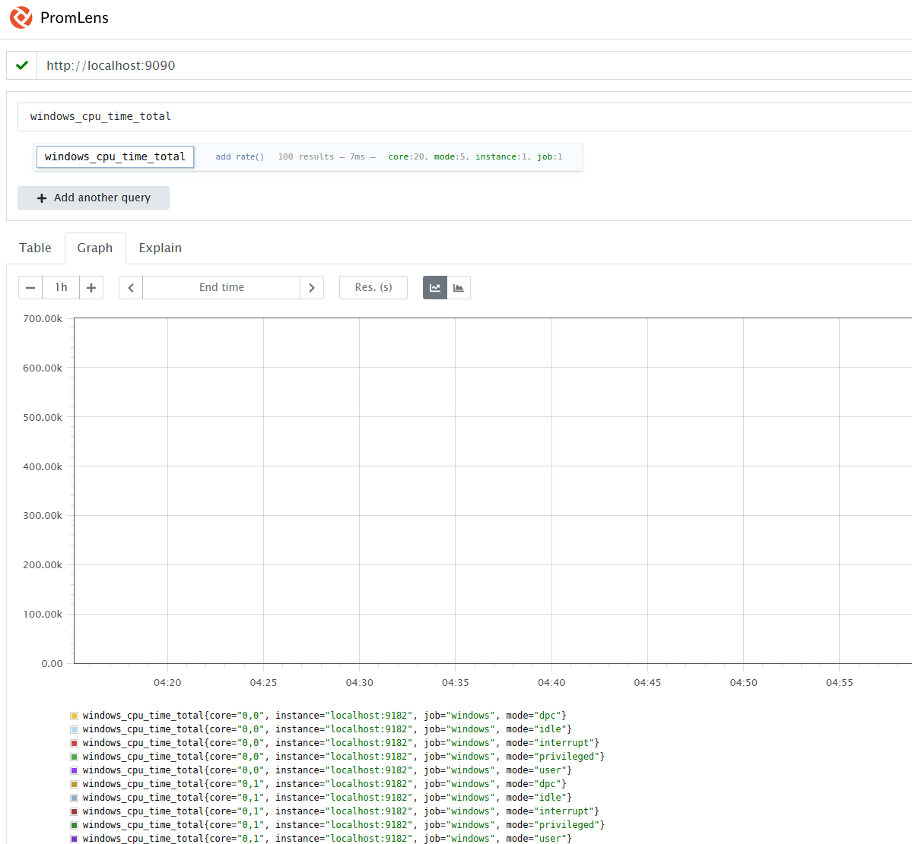

# Prometheus 학습

## Windows 버전 Prometheus 서버 설치
https://prometheus.io/download/  에서 다운로드 한다.
가장 최신 버전보다는 안정 버전을 설치하는 것이 좋다.  
  
프로메테우스의 설정들은 yaml 파일로 관리한다.  
  
default 포트는 9090이며 포트를 변경하려면 **--web.listen-address** flag를 추가하여 실행한다.  
`ex) ./prometheus --config.file=/tmp/prometheus.yml --web.listen-address=:8080`  
   

## windows_exporter
 
### 1) 개요 (무엇을 설치하나요?)
* **windows_exporter**: CPU/메모리/디스크/네트워크/서비스 상태 등 **Windows 10/11(21H2+)** 메트릭을 HTTP로 노출하는 에이전트. 기본 포트는 **9182**, 엔드포인트는 **/metrics**. MSI 설치 시 **Windows 서비스 등록**과 **방화벽 예외**까지 자동 설정된다.

### 2) 설치 (관리자 권한 PowerShell)
1. **MSI 다운로드** (최신 버전은 릴리스 페이지에서 확인)
  
```powershell
# 관리자 PowerShell 실행
$ver = '0.31.3'   # 날짜 기준 최신
$msiUrl = "https://github.com/prometheus-community/windows_exporter/releases/download/v$ver/windows_exporter-$ver-amd64.msi"
$msi = "$env:TEMP\windows_exporter-$ver-amd64.msi"
Invoke-WebRequest -Uri $msiUrl -OutFile $msi
```
 
(최신 버전은 [GitHub Releases](https://github.com/prometheus-community/windows_exporter/releases)에서 확인한다.) 
  
2. **설치 실행**  
가장 간단히는 다음처럼 기본값으로 설치하면 된다.
  
```powershell
msiexec /i $msi
```
  
> 위 설치로 서비스가 자동 등록되고, 기본 포트(9182)로 동작하며 방화벽 예외도 생성된다.  

#### (선택) 설치 시 옵션 주기
MSI는 여러 속성을 지원한다. 예: 수집할 컬렉터 지정, 포트/경로 변경, 방화벽 원격 허용 IP 제한 등. PowerShell에서는 `--%` 토큰 뒤에 MSI 속성을 넘긴다.  
  
```powershell
# 기본 컬렉터 + process 추가, 포트 9182 유지, 방화벽 예외 생성
msiexec /i $msi --% ENABLED_COLLECTORS="[defaults],process" LISTEN_PORT=9182 ADDLOCAL=FirewallException
```
  
사용 가능한 주요 속성:  

* `ENABLED_COLLECTORS` : `--collectors.enabled`와 동일 (예: `[defaults],process`)
* `LISTEN_ADDR` / `LISTEN_PORT` : 리슨 주소/포트 (기본 9182)
* `METRICS_PATH` : 메트릭 경로 (기본 `/metrics`)
* `TEXTFILE_DIRS` : textfile 컬렉터 디렉토리 지정
* `REMOTE_ADDR` : 방화벽 예외를 특정 IP(들)로 제한(쉼표 구분)
* `EXTRA_FLAGS` : 그 외 CLI 플래그 전달
* `ADDLOCAL=FirewallException` : 방화벽 예외 생성
* `APPLICATIONFOLDER` : 설치 경로 변경
  (설치자 속성이 설정 파일보다 **우선** 적용된다.) 

> PowerShell 7.3+에서 `--% EXTRA_FLAGS` 사용 시, `PSNativeCommandArgumentPassing`을 Legacy로 설정해야 한다.    

### .exe 실행
.msi로 설치하지 않고 바로 실행도 가능하다.   
```
windows_exporter-0.31.2-amd64.exe
```  
혹시 실행이 제대로 되지 않았다면 실행 파일이 있는 위치에 `textfile_inputs` 디렉토리를 만들어 놓는다.  
  
---
  
### 3) 실행/확인
  
```powershell
# 서비스 상태 확인
Get-Service windows_exporter

# 웹으로 메트릭 확인 (로컬)
Start-Process "http://localhost:9182/metrics"
```
  
정상이라면 텍스트 형태의 메트릭이 보인다. 실패 시 **Windows 이벤트 로그**(MSI가 기본적으로 eventlog에 기록)에서 에러를 확인한다. 

---
  
### 4) 보안/방화벽 팁 (중요)
* 서버 외부에서 스크랩할 경우, **방화벽을 Prometheus 서버 IP로 제한**하는 게 안전하다. 설치 시 `REMOTE_ADDR="1.2.3.4"` 처럼 지정하거나, 설치 후 방화벽 규칙에서 원격 주소를 제한한다.   
* TLS/Basic Auth가 필요하다면 `--web.config.file`로 **웹 설정 파일**을 지정할 수 있다.  
  
---  
  
### 5) Prometheus에 대상 추가 (prometheus.yml)
가장 기본적인 스크랩 설정은 아래와 같다(서버에서 편집).  
  
```yaml
scrape_configs:
  - job_name: 'windows'
    scrape_interval: 15s
    metrics_path: /metrics
    static_configs:
      - targets: ['YOUR_WINDOWS_HOST:9182']   # 예: '192.168.0.10:9182'
```
  
Prometheus 설정 파일 문법/개념은 공식 문서를 참고한다.  
  
#### (선택) 특정 컬렉터만 수집하고 싶다면
windows_exporter는 기본 컬렉터 세트를 활성화한다(예: cpu, logical\_disk, memory, net, os, physical_disk, service, system). Prometheus 쪽에서 **쿼리 파라미터**로 제한할 수도 있다:  
  
```yaml
scrape_configs:
  - job_name: 'windows'
    params:
      collect[]: ['cpu','memory','logical_disk','os']  # 필요한 컬렉터만
    static_configs:
      - targets: ['YOUR_WINDOWS_HOST:9182']
```
  
(collect[] 파라미터는 공식 README에 예시가 있습니다.)   
  
---  
  
### 6) 자주 쓰는 확장: textfile 컬렉터
커스텀 스크립트가 만든 메트릭 파일을 함께 노출하고 싶다면, 설치 시:  
  
```powershell
msiexec /i $msi --% TEXTFILE_DIRS="C:\metrics_text"
```
  
그 디렉터리에 `*.prom` 텍스트 파일(프로메테우스 포맷)을 두면 `/metrics`에서 함께 노출된다.  

---  
  
### 7) (선택) Grafana 대시보드 바로 붙이기
Grafana에서 **“Import” → Dashboard ID: 14694** (Windows Exporter Dashboard) 같은 공개 대시보드를 가져와서 빠르게 시각화할 수 있다.   
  
---  
  
### 8) 문제 해결 체크리스트
* **포트 충돌**: 9182를 다른 프로세스가 사용 중인지 확인 → 필요 시 `LISTEN_PORT` 변경 후 재설치/재시작.  
* **방화벽**: 외부에서 접속이 안 되면, Windows 인바운드 규칙과 서버/네트워크 방화벽 모두 9182 열려 있는지 확인. MSI로 예외가 생성되지만 환경에 따라 추가 설정이 필요할 수 있다.   
* **로그 위치**: MSI 기본값으로 **Windows 이벤트 로그**에 기록된다(응용 프로그램 및 서비스 로그에서 확인).  
* **지원 OS**: Windows 11(21H2+) 지원. 오래된 Windows Server 버전은 호환성 문제가 있을 수 있다.  

   

### 9) 실행 확인
  
#### 1) windows_exporter 프로세스 확인
* `.exe` 파일을 그냥 실행하면 **윈도우 서비스 등록** 없이 콘솔 프로세스로만 떠 있다.
  
  * PowerShell에서 확인:

    ```powershell
    Get-Process windows_exporter
    ```
* 실행이 안 되어 있다면 `windows_exporter.exe`를 다시 실행하거나, `--help` 옵션으로 기본 포트(9182)로 뜨는지 확인한다.  
  
---
  
#### 2) 웹 브라우저로 메트릭 노출 확인
1. 크롬/엣지에서 `http://localhost:9182/metrics` 접속
   → 텍스트 형식의 메트릭이 쭉 보이면 정상이다.
2. 보이지 않거나 연결 오류라면:

   * 방화벽에서 9182 포트가 막혀 있는지 확인
   * 실행 시 포트 변경(`--telemetry.addr=:9183`)한 적 없는지 확인

---  
  
#### 3) Prometheus 설정 확인
Prometheus 서버가 같은 머신에 있다면, `prometheus.yml`에 다음이 있어야 한다:  
  
```yaml
scrape_configs:
  - job_name: 'windows'
    static_configs:
      - targets: ['localhost:9182']
```
  
* `targets`에 `localhost:9182`가 들어 있어야 한다.
* 설정을 고친 후에는 **Prometheus 재시작**이 필요하다.  
  
---  
  
#### 4) Prometheus 웹 UI에서 확인
Prometheus UI (`http://localhost:9090/targets`) → **Status → Targets** 메뉴에서:  
  
* `windows` job이 뜨는지
* `UP` 상태인지
  확인한다.
  만약 `DOWN`이라면 `Error` 메시지가 표시된다 (예: connection refused → 포트 문제, 404 → metrics path 문제).
  
---  
  
#### 5) 자주 하는 실수
* `.exe`는 설치형(MSI)과 달리 **서비스 등록/방화벽 예외**가 자동으로 안 된다.

  * 그냥 실행하면 현재 세션에서만 동작 → 로그아웃하면 꺼진다.
  * 항상 켜두려면 **서비스로 등록**해야 한다.  
  
    ```powershell
    sc.exe create windows_exporter binPath= "C:\경로\windows_exporter.exe"
    sc.exe start windows_exporter
    ```
* Prometheus 쪽에서 `metrics_path`를 기본값(`/metrics`) 말고 다른 걸로 잘못 적은 경우도 많다.  
  
  
### Prometheus 서버에서 메트릭을 확인하는 방법
  
#### 1) windows_exporter가 메트릭을 노출하는 위치
  
* 기본 주소:

  ```
  http://<Windows서버IP>:9182/metrics
  ```
* 같은 머신에서 실행 중이면:  

  ```
  http://localhost:9182/metrics
  ```
  
→ 여기서 보이는 텍스트 데이터가 Prometheus가 가져가는 원본이다.  
  
  
#### 2) Prometheus 설정 확인 (prometheus.yml)
Prometheus 서버에서 `prometheus.yml`에 다음과 같이 `scrape_configs` 항목을 추가해야 한다:  
  
```yaml
scrape_configs:
  - job_name: 'windows'
    static_configs:
      - targets: ['localhost:9182']   # Prometheus와 windows_exporter가 같은 PC일 때
      # - targets: ['192.168.0.10:9182']   # 다른 PC에서 수집할 경우
```  
  
* `targets`에는 exporter가 떠 있는 주소:포트를 적는다.  
* 수정 후 Prometheus를 재시작해야 적용된다.  
    
#### 3) Prometheus 웹 UI에서 확인
Prometheus는 기본적으로 `http://localhost:9090`에서 접속 가능하다.  
  
1. **Targets 상태 확인**

   * 메뉴 → `Status → Targets`
   * `windows` job이 있고, 상태가 **UP**이면 정상이다.
   * **DOWN**이면 `Error` 메시지를 보고 원인(방화벽, 포트, metrics_path 오타 등) 확인한다.

2. **메트릭 직접 조회**

   * 메뉴 → `Graph` (또는 `Explore`)에서
     `windows_`로 시작하는 메트릭을 검색한다.
     예:

     * `windows_cpu_time_total` (CPU 사용)
     * `windows_memory_available_bytes` (남은 메모리)
     * `windows_logical_disk_free_bytes` (디스크 여유 공간)

  
#### 4) 시각화 (Grafana 연동)
Prometheus 자체 UI는 기본 그래프만 보여주므로, 보통 **Grafana**를 붙여서 대시보드를 사용한다.
  
* Grafana → `Configuration → Data Sources`에서 Prometheus 연결
* `Dashboard → Import` → ID `14694` (공식 Windows Exporter 대시보드) 불러오기

→ 그러면 CPU, 메모리, 디스크, 네트워크, 서비스 상태까지 한눈에 확인 가능하다.
  
#### 5) 자주 확인하는 메트릭 예시
  
* **CPU**: `windows_cpu_time_total`
* **메모리 사용률**:

  ```promql
  1 - (windows_memory_available_bytes / windows_memory_physical_total_bytes)
  ```
* **디스크 여유율**:

  ```promql
  windows_logical_disk_free_bytes{volume="C:"} / windows_logical_disk_size_bytes{volume="C:"}
  ```
* **네트워크 수신/송신 바이트**: `windows_net_bytes_total`

---

👉 정리하면,

1. Prometheus 설정 파일에 `windows_exporter` 타깃 추가
2. Prometheus UI에서 `Status → Targets`로 `UP` 확인
3. `Graph`/`Explore`에서 `windows_` 메트릭 검색
4. 필요하면 Grafana에서 대시보드로 시각화
  
---------     

</br>  
</br>  
</br>  


# Grafana 학습
  
## Windows에 설치 및 사용하기
  
### 1. Grafana 다운로드 및 설치
1. **공식 사이트 접속**
   [Grafana Downloads](https://grafana.com/grafana/download) 페이지에서 **Windows** 버전을 선택한다.
2. **Installer 다운로드**
   `.msi` 설치 파일을 다운로드한다.
3. **설치 실행**
   설치 마법사에 따라 `Next → Install → Finish` 순으로 진행한다.

   * 기본적으로 `C:\Program Files\GrafanaLabs\grafana` 에 설치됨.
4. **Grafana 실행 확인**
   설치가 완료되면 Windows 서비스로 등록되어 자동 실행된다.
   서비스 이름은 `Grafana` 이다.
   (서비스 확인: `Win + R → services.msc` 실행)

.msi 이외에 포터블 실행 버전도 제공하고 있다.
  
### 2. Grafana 실행 및 접속
1. 브라우저에서 [http://localhost:3000](http://localhost:3000) 접속한다.
2. 기본 계정으로 로그인한다:

   * **아이디:** `admin`
   * **비밀번호:** `admin`
3. 최초 로그인 시 비밀번호 변경을 요청받으므로 새로운 비밀번호로 변경한다.
  
  
### 3. 데이터 소스 연결
Grafana는 데이터를 직접 저장하지 않고 **외부 데이터 소스**를 연결해 시각화한다.
대표적인 데이터 소스:  
* **Prometheus**
* **MySQL / PostgreSQL**
* **ElasticSearch**
* **Loki (로그 관리)**
  
연결 방법:  
1. 왼쪽 메뉴에서 **Connections → Data sources** 선택.
2. 원하는 데이터 소스 클릭 후 접속 정보 입력.
3. **Save & test** 버튼으로 연결 확인.


### 4. 대시보드 생성
1. 좌측 메뉴 → **Dashboards → New Dashboard** 클릭.
2. **Add a new panel** 선택.
3. 쿼리(Query) 작성:  
   * 데이터 소스에서 원하는 메트릭이나 SQL 입력.
4. **시각화 선택**:  
   * Graph, Table, Gauge, Heatmap 등 다양한 시각화 옵션 선택 가능.
5. **저장**:  
   * 패널 저장 후 대시보드에 추가.

  
### 5. Windows 서비스 관리
* Grafana 서비스는 자동 시작되도록 설정되어 있음.
* 수동 제어:

  * 시작: `net start grafana`
  * 중지: `net stop grafana`
  
### 6. 추가 팁
* **플러그인 설치**: `grafana-cli plugins install <plugin-name>` 명령어 사용.
* **설정 파일 수정**: `C:\Program Files\GrafanaLabs\grafana\conf\defaults.ini`
  (포트 변경, 보안 설정 등 가능)
* **로그 확인**: `C:\Program Files\GrafanaLabs\grafana\data\log` 경로 확인.


## Grafana에서 Prometheus 연결하기
Grafana가 Prometheus에서 데이터를 가져오도록 설정한다.

1. **Grafana 접속**
   브라우저에서 [http://localhost:3000](http://localhost:3000) 접속 → 로그인(`admin / admin`).

2. **데이터 소스 추가**  

   * 왼쪽 메뉴에서 **Connections → Data sources** 클릭.
   * **Add data source** 버튼 클릭.
   * 목록에서 **Prometheus** 선택.

3. **Prometheus 주소 입력**

   * URL: `http://localhost:9090`
   * 나머지는 기본값 그대로 두면 된다.

4. **연결 테스트**
   `Save & test` 버튼 클릭 → "Data source is working" 메시지가 나오면 성공.


### 대시보드 만들기
  
1. **새 대시보드 생성**

   * 왼쪽 메뉴 → **Dashboards → New → New Dashboard** 클릭.
   * **Add a new panel** 선택.

2. **쿼리 작성하기**

   * Data source: **Prometheus** 선택.
   * 예제 쿼리 입력:

     * `up` : Prometheus가 모니터링 중인 타겟의 상태 확인 (1=정상, 0=비정상).
     * `node_cpu_seconds_total` : CPU 사용량 (노드 익스포터 설치 시).
   * 실행하면 그래프가 바로 그려진다.

3. **시각화 선택**
   * Line, Gauge, Table 등 원하는 형태로 변경 가능.

4. **저장하기**
   대시보드 이름 입력 후 저장.

### 전체 흐름 요약 
1. Prometheus 설치 및 실행 (`localhost:9090` 에서 동작 확인)
2. Grafana 접속 (`localhost:3000`)
3. 데이터 소스 → Prometheus 추가 (URL: `http://localhost:9090`)
4. 쿼리(`up`, `node_cpu_seconds_total` 등)로 대시보드 생성
5. Exporter 추가해서 더 많은 메트릭 수집 가능

  
  
## WSL의 Docker에 Grafana를 띄우고, 같은 Windows 머신에서 실행 중인 Prometheus(네이티브 Windows 실행)와 연동하는 방법
  
### 1. 네트워크 구조 이해하기
* **Prometheus**: Windows에서 실행됨 → `localhost:9090`
* **Grafana**: WSL 내부 Docker 컨테이너에서 실행됨

문제는 **WSL 컨테이너에서 보이는 `localhost`**는 컨테이너 자기 자신을 의미한다는 점이다.
따라서, Grafana 컨테이너가 Windows 호스트의 Prometheus(`localhost:9090`)를 인식하려면 **호스트 IP**를 사용해야 한다.

  
### 2. Windows 호스트 IP 확인하기
WSL 안에서 다음 명령어로 Windows 호스트 IP를 확인할 수 있다.

```bash
cat /etc/resolv.conf | grep nameserver
```

보통 `192.168.65.1` 같은 IP가 나온다.
이 IP가 **WSL에서 바라보는 Windows 호스트 IP**다.

  
### 3. Grafana 컨테이너 실행하기
WSL 터미널에서 Grafana를 Docker로 실행한다.

```bash
docker run -d \
  -p 3000:3000 \
  --name=grafana \
  grafana/grafana
```

* `-p 3000:3000`: 호스트(WSL)와 매핑, 브라우저에서 `http://localhost:3000` 접속 가능
* `--name=grafana`: 컨테이너 이름 지정

  
### 4. Grafana에서 Prometheus 연결 설정

1. 브라우저에서 [http://localhost:3000](http://localhost:3000) 접속

   * 기본 계정: `admin / admin`
2. 왼쪽 메뉴 → **Connections → Data sources** → **Add data source** → **Prometheus** 선택
3. **URL 입력**

   * 만약 Windows Prometheus가 `localhost:9090`에 뜨고 있다면,
     Grafana 컨테이너에서는 `http://<Windows 호스트 IP>:9090` 으로 접근해야 한다.
   * 예:

     ```
     http://192.168.65.1:9090
     ```
4. **Save & test** 버튼 클릭 → `Data source is working` 메시지 나오면 성공.


### 5. 대시보드 만들기

1. **Dashboards → New → New dashboard** → **Add a new panel**
2. Data source: Prometheus 선택
3. 쿼리 입력 (예시)  
   * `up` → Prometheus에서 모니터링 중인 타겟 상태 확인
4. 그래프 시각화 후 저장

  
### 6. 추가 팁

* **IP 고정 문제**
  WSL이 재부팅될 때마다 호스트 IP(`192.168.x.x`)가 달라질 수 있다.
  이럴 때는 WSL에서 항상 `host.docker.internal`을 쓰면 편하다.
  (Docker Desktop 최신 버전은 Linux 컨테이너에서도 지원)

  즉, Prometheus 주소를 다음처럼 써도 된다:

  ```
  http://host.docker.internal:9090
  ```

* **Windows 방화벽**
  Prometheus가 Windows에서 `0.0.0.0:9090`이 아닌 `localhost:9090`에만 바인딩되어 있으면,
  WSL에서 접근할 때 막힐 수 있다.
  → `prometheus.yml` 실행 시 `--web.listen-address="0.0.0.0:9090"` 옵션을 주면 외부에서도 접속 가능하다.

  
### ✅ 요약
1. WSL의 Docker로 Grafana 실행
2. Prometheus는 Windows에서 실행 (`localhost:9090`)
3. Grafana Data Source에서 Prometheus URL을 `http://host.docker.internal:9090` 또는 Windows 호스트 IP(`192.168.65.1:9090`)로 입력
4. 연결 후 대시보드 생성

--------    

</br>  
</br>  
</br>  
  

# PromLens
[PromLens](https://promlens.com/ )는 Prometheus의 **PromQL 쿼리를 작성·이해·디버깅**하기 쉽게 도와주는 시각화 도구다. 그라파나처럼 거대한 대시보드를 만드는 용도보다는, 엔지니어가 쿼리를 직접 다루면서 “내가 짠 PromQL이 어떤 의미인지, 어떤 결과를 내는지”를 직관적으로 파악하는 데 초점을 맞춘다.

## 주요 특징

### 1. 쿼리 작성 지원
* PromQL을 입력하면 구문을 자동으로 **구조화된 트리 형태**로 보여준다.
* 쿼리 안에서 어떤 함수가 적용되고, 어떤 메트릭에 필터가 걸리는지 한눈에 확인할 수 있다.
* 복잡한 쿼리일수록 “이 값이 어떻게 계산됐는지”를 단계별로 추적하기 좋다.

### 2. 결과 시각화
* 쿼리 결과를 **시계열 그래프**와 **표**로 바로 보여준다.
* 그라파나보다 훨씬 단순하지만, “지금 이 지표가 어떻게 변하고 있는지” 확인하기엔 충분하다.

### 3. 실시간 쿼리 분석
* PromQL의 연산자, 레이블 필터, 집계 함수 등을 단계별로 분석해서 설명을 붙여준다.
* 쿼리 디버깅 시 잘못된 구문이나 의도치 않은 결과를 쉽게 발견할 수 있다.

### 4. Prometheus 연동
* PromLens는 **독립 실행형 웹앱**이지만, Prometheus 서버와 연결하면 실데이터를 바로 가져올 수 있다.
* 로컬 환경이나 개발 환경에서 띄워서 Prometheus API 엔드포인트만 지정하면 된다.

---

## 사용 방법
1. PromLens 설치

   * 공식 Docker 이미지 사용:

     ```bash
     docker run -p 8080:8080 prom/promlens
     ```
   * 이후 브라우저에서 `http://localhost:8080` 접속.

2. Prometheus 서버 연결

   * PromLens 설정 화면에서 Prometheus 서버 URL (`http://localhost:9090`) 입력.

3. PromQL 입력 및 실행

   * 쿼리 입력 후 실행하면 구조 분석 + 결과 시각화가 동시에 나온다.


---

## 활용 시나리오
* 새로운 메트릭이나 Exporter를 붙였을 때 **PromQL 테스트**용으로 사용.
* 복잡한 alert 규칙이나 recording rule을 만들기 전에 **쿼리 검증**.
* 운영자가 아니라 **엔지니어 전용 툴**로 두고 빠르게 메트릭 확인.


  
