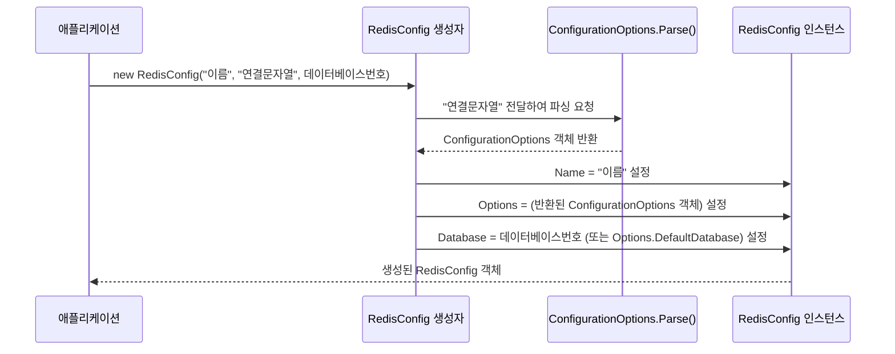

# Chapter 1: 레디스 접속 설정


CloudStructures를 사용하여 Redis와 통신하는 여정을 시작하신 것을 환영합니다! 이 장에서는 가장 기본적이면서도 중요한 첫 단계인 **레디스 접속 설정**에 대해 알아보겠습니다. 우리가 어떤 일을 시작하기 전에 계획을 세우듯이, 애플리케이션이 레디스 서버와 대화하려면 먼저 어디로, 어떻게 접속해야 하는지 알려줘야 합니다.

## 왜 레디스 접속 설정이 필요한가요?

애플리케이션이 레디스 서버를 사용하려고 할 때, 마치 우리가 새로운 친구 집에 처음 방문하는 것과 같습니다. 친구 집 주소를 알아야 하고, 초인종을 눌러야 문이 열리겠죠?

**중심 사용 사례:** 여러분의 컴퓨터(로컬 환경)에서 실행 중인 레디스 서버에 간단한 데이터를 저장하고 싶다고 가정해 봅시다.

이 경우, 우리 애플리케이션은 다음과 같은 정보를 알아야 합니다:
1.  레디스 서버가 어디에서 실행되고 있는가? (예: 내 컴퓨터, 특정 IP 주소)
2.  레디스 서버는 어떤 포트 번호를 사용하고 있는가? (기본값은 보통 6379입니다)
3.  혹시 비밀번호가 설정되어 있는가?
4.  여러 데이터베이스 중 어떤 데이터베이스를 사용할 것인가? (레디스는 기본적으로 0번부터 시작하는 여러 데이터베이스를 가질 수 있습니다)

이 모든 정보를 하나로 묶어 관리하는 것이 바로 `RedisConfig` 객체의 역할입니다. 마치 여행 가기 전에 목적지 주소, 교통편, 숙소 정보 등을 꼼꼼히 적어둔 '여행 계획서'와 같아요. 이 계획서(`RedisConfig`)가 있어야 `RedisConnection`이라는 실제 연결 담당자가 레디스 서버와 성공적으로 통신 채널을 열 수 있습니다.

## `RedisConfig`란 무엇인가요?

`RedisConfig`는 레디스 서버에 연결하기 위해 필요한 모든 구성 정보를 담고 있는 객체입니다. 이 객체는 다음과 같은 주요 정보를 가집니다:

*   **`Name` (이름)**: 이 설정에 대한 고유한 별명입니다. 예를 들어 "내 로컬 레디스", "운영 환경 캐시"처럼 이름을 붙여 여러 설정을 구분할 수 있습니다.
*   **`Options` (옵션)**: 실제 레디스 서버 접속에 필요한 핵심 정보들을 담고 있습니다. `StackExchange.Redis` 라이브러리의 `ConfigurationOptions` 객체를 사용하며, 여기에는 서버 주소, 포트, 암호, 연결 타임아웃 등의 상세 설정이 포함됩니다.
*   **`Database` (데이터베이스 인덱스)**: 연결 후 사용할 레디스의 논리적 데이터베이스 번호입니다. 지정하지 않으면 `Options`에 설정된 기본 데이터베이스를 사용합니다 (보통 0번).

여행 계획서에 비유해 볼까요?
*   `Name`: "제주도 여름 휴가 계획"
*   `Options`: "제주공항행 항공편 (대한항공 KE123)", "제주 시내 호텔 (롯데호텔)", "렌터카 (현대 소나타)" 등 실제 여행에 필요한 정보
*   `Database`: "첫날 방문할 관광지 (성산일출봉)"

## `RedisConfig` 사용 방법

`RedisConfig` 객체를 만드는 방법은 몇 가지가 있습니다. 가장 일반적인 방법은 연결 문자열(connection string)을 사용하는 것입니다.

### 1. 가장 기본적인 연결 (이름과 연결 문자열 사용)

로컬 컴퓨터(localhost)의 기본 포트(6379)에서 실행 중인 레디스 서버에 연결한다고 가정해 봅시다.

```csharp
// "local-redis"라는 이름으로 로컬호스트 6379 포트에 연결하는 설정
var config = new CloudStructures.RedisConfig("local-redis", "localhost:6379");
```

위 코드에서:
*   `"local-redis"`는 이 설정의 `Name`입니다. 나중에 여러 설정을 구분할 때 사용됩니다.
*   `"localhost:6379"`는 연결 문자열입니다. `호스트이름:포트번호` 형식입니다.

이 `config` 객체는 이제 `localhost:6379`에 있는 레디스 서버에 접속하기 위한 준비가 된 것입니다.

### 2. 암호 및 기본 데이터베이스를 포함한 연결 문자열 사용

만약 레디스 서버에 암호가 설정되어 있고, 특정 데이터베이스(예: 1번)를 기본으로 사용하고 싶다면 연결 문자열에 추가 정보를 포함할 수 있습니다.

```csharp
// "secured-redis"라는 이름으로, 암호가 "mysecretpassword"이고
// 기본 데이터베이스로 1번을 사용하는 로컬 레디스에 연결
var config = new CloudStructures.RedisConfig(
    "secured-redis",
    "localhost:6379,password=mysecretpassword,defaultDatabase=1"
);
```

연결 문자열 안에서 쉼표(`,`)로 구분하여 다양한 옵션을 설정할 수 있습니다. `password`와 `defaultDatabase`가 그 예입니다. `StackExchange.Redis` 라이브러리가 이 문자열을 해석하여 `ConfigurationOptions` 객체를 내부적으로 생성합니다.

### 3. `ConfigurationOptions` 객체를 직접 사용

더 세밀한 제어가 필요하거나, 이미 `StackExchange.Redis.ConfigurationOptions` 객체를 가지고 있다면 이를 직접 `RedisConfig` 생성자에 전달할 수 있습니다.

```csharp
// StackExchange.Redis의 ConfigurationOptions 객체를 먼저 설정
var options = new StackExchange.Redis.ConfigurationOptions
{
    EndPoints = { "127.0.0.1:6380" }, // 접속할 서버 주소 및 포트
    Password = "anotherpassword",     // 암호
    DefaultDatabase = 2               // 기본 데이터베이스
};

// "custom-options-redis"라는 이름으로 위에서 만든 options 객체를 사용하여 설정
var config = new CloudStructures.RedisConfig("custom-options-redis", options);
```

이 방법은 연결 문자열로 표현하기 어려운 복잡한 설정을 할 때 유용합니다.

### 4. `RedisConfig`에서 논리적 데이터베이스 지정하기

`CloudStructures`를 사용할 때, `RedisConfig` 생성자의 `database` 매개변수를 통해 이 설정이 사용할 특정 논리적 데이터베이스 번호를 지정할 수 있습니다. 이는 연결 문자열이나 `ConfigurationOptions`의 `DefaultDatabase` 설정보다 우선 적용됩니다.

```csharp
// "db5-redis"라는 이름으로, 로컬 레디스에 연결하되,
// CloudStructures에서는 5번 데이터베이스를 사용하도록 명시
var config = new CloudStructures.RedisConfig(
    "db5-redis",
    "localhost:6379,defaultDatabase=0", // 연결 문자열에는 기본 DB 0으로 되어 있지만
    database: 5                         // RedisConfig에서는 5번을 사용
);
```

이 경우, 실제 레디스 서버와의 연결은 `defaultDatabase=0`으로 초기화될 수 있지만, `CloudStructures`를 통해 이 `config`를 사용하는 모든 작업은 레디스의 5번 데이터베이스를 대상으로 수행됩니다. 만약 `database` 매개변수가 `null` (기본값)이면, `ConfigurationOptions`의 `DefaultDatabase` 값을 따릅니다.

## 내부 동작 살짝 엿보기

`RedisConfig` 객체를 생성할 때 내부적으로 어떤 일이 일어나는지 간단히 살펴보겠습니다.

예를 들어, `new RedisConfig("my-config", "redis.example.com:6379,password=1234", 0)` 코드가 실행되면:

1.  애플리케이션은 `RedisConfig`의 생성자를 호출하며 이름("my-config"), 연결 문자열("redis.example.com:6379,password=1234"), 그리고 데이터베이스 인덱스(0)를 전달합니다.
2.  `RedisConfig` 생성자는 먼저 전달받은 연결 문자열(`"redis.example.com:6379,password=1234"`)을 `StackExchange.Redis.ConfigurationOptions.Parse()` 메서드에 넘겨 `ConfigurationOptions` 객체로 변환합니다. 이 객체에는 서버 주소, 포트, 암호 등의 정보가 구조화되어 담깁니다.
3.  그 다음, 전달받은 이름("my-config"), 변환된 `ConfigurationOptions` 객체, 그리고 데이터베이스 인덱스(0)를 `RedisConfig` 인스턴스의 각 속성(`Name`, `Options`, `Database`)에 저장합니다.
4.  만약 생성자에 `database` 인덱스가 명시적으로 제공되지 않았다면 (`null`이라면), `ConfigurationOptions` 객체에 설정된 `DefaultDatabase` 값을 사용합니다.

다음은 이 과정을 보여주는 간단한 순서도입니다:



### 코드 살펴보기 (`RedisConfig.cs`)

실제 `CloudStructures`의 `RedisConfig.cs` 파일의 일부를 보면 이 과정을 더 명확히 이해할 수 있습니다.

두 개의 생성자가 있습니다. 첫 번째 생성자는 연결 문자열을 받습니다:

```csharp
// CloudStructures/RedisConfig.cs

// ... (다른 코드 생략) ...

public RedisConfig(string name, string connectionString, int? database = default)
    : this(name, ConfigurationOptions.Parse(connectionString), database)
{ } // 이 생성자는 다른 생성자를 호출합니다.
```

이 생성자는 `ConfigurationOptions.Parse(connectionString)`를 호출하여 연결 문자열을 `ConfigurationOptions` 객체로 변환한 후, 다른 생성자에게 이 객체를 전달합니다. `this(...)` 구문이 바로 그것입니다.

핵심 로직은 `ConfigurationOptions` 객체를 받는 두 번째 생성자에 있습니다:

```csharp
// CloudStructures/RedisConfig.cs

// ... (다른 코드 생략) ...

public RedisConfig(string name, ConfigurationOptions options, int? database = default)
{
    this.Name = name;       // 전달받은 이름 저장
    this.Options = options; // 전달받은 ConfigurationOptions 객체 저장

    // database 매개변수가 제공되면 그 값을 사용하고,
    // 그렇지 않으면 options에 설정된 DefaultDatabase 값을 사용
    this.Database = database ?? options.DefaultDatabase;
}
```

여기서 `this.Name = name;`과 `this.Options = options;`는 전달받은 값들을 각각 `Name`과 `Options` 속성에 할당합니다.

`this.Database = database ?? options.DefaultDatabase;` 부분은 중요합니다.
*   `??` 연산자(null 병합 연산자)는 `database` 매개변수가 `null`이 아니면 그 값을 사용하고, `null`이면 `options.DefaultDatabase` 값을 `this.Database`에 할당합니다.
*   이를 통해 `RedisConfig`를 생성할 때 명시적으로 데이터베이스 인덱스를 지정할 수도 있고, 지정하지 않으면 `ConfigurationOptions`에 설정된 기본값을 따르도록 유연성을 제공합니다.

이 `RedisConfig` 객체는 이후 레디스 서버와의 실제 연결을 수립하는 [레디스 연결 관리자](02_레디스_연결_관리자_.md)에게 전달되어 사용됩니다.

## 정리하며

이번 장에서는 `CloudStructures`를 사용하여 레디스에 연결하기 위한 첫걸음인 `RedisConfig` 객체에 대해 배웠습니다. `RedisConfig`는 레디스 서버의 주소, 포트, 암호, 사용할 데이터베이스 등 접속에 필요한 모든 정보를 담는 '여행 계획서'와 같다는 것을 기억해주세요. 이 계획서를 통해 우리는 애플리케이션이 어떤 레디스 서버와 통신해야 하는지 명확하게 지정할 수 있습니다.

이제 레디스 서버에 접속하기 위한 '여행 계획서'를 작성하는 방법을 배웠습니다. 다음 장에서는 이 계획서를 가지고 실제로 레디스와의 연결을 관리하는 [레디스 연결 관리자](02_레디스_연결_관리자_.md)에 대해 알아보겠습니다. 이 관리자는 `RedisConfig`를 사용하여 실제 연결을 만들고, 필요할 때 이 연결을 제공하는 중요한 역할을 합니다.

---

Generated by [AI Codebase Knowledge Builder](https://github.com/The-Pocket/Tutorial-Codebase-Knowledge)